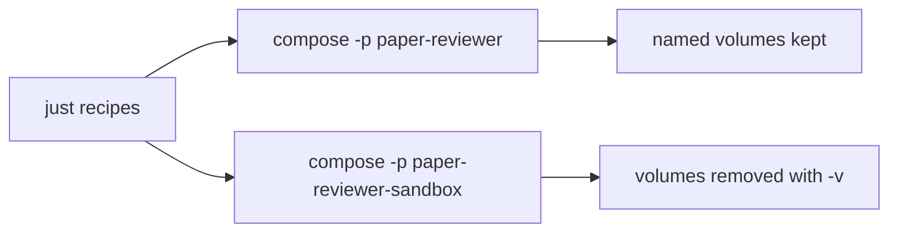

# Local development

All local workflows run through `just` recipes that wrap Docker Compose. Install host tools first: [host-requirements.md](host-requirements.md).

Do **not** run `docker compose`, language runtimes, or package managers on the host. Use the recipes below.

## Current stack

Compose currently defines a single **`workspace`** service: a Python 3.12 + uv image with the repository bind-mounted at `/workspace`. There is no Postgres or application (`app`) service yet.

Use `just shell` / `just sandbox-shell` to run commands that create or modify the project (for example `uv init`, installing packages, or configuring dlt). Changes under `/workspace` persist on the host.

Postgres, Streamlit/Prefect app services, seeding, `just test`, and `just reset` will be added later.

## Two environments

| Environment | Compose project | Data | When to use |
| --- | --- | --- | --- |
| **Persistent app** | `paper-reviewer` | Named volumes survive `just down` (when volumes exist) | End-user local use; keep data between sessions |
| **Ephemeral sandbox** | `paper-reviewer-sandbox` | Volumes removed on teardown | Agents, CI, bug reproduction, disposable experiments |

Both share the same [compose.yml](../compose.yml). Isolation comes from the Compose **project name** (`-p`), so wiping the sandbox never deletes app data.



## Recipes

List everything:

```bash
just
```

### Persistent app

| Recipe | Effect |
| --- | --- |
| `just up` | Build/start the `workspace` service; wait until healthy. |
| `just down` | Stop containers; **volumes are preserved**. |
| `just logs` | Follow logs (`just logs workspace` is the default). |
| `just status` | Show container status. |
| `just shell` | Auto-start if needed, then open an interactive bash in `workspace`. |

### Ephemeral sandbox

| Recipe | Effect |
| --- | --- |
| `just sandbox` | Build/start a clean sandbox `workspace`; wait until healthy. |
| `just sandbox-down` | Tear down the sandbox and **delete its volumes**. |
| `just sandbox-shell` | Auto-start if needed, then open an interactive bash in the sandbox `workspace`. |

Agents should prefer `just sandbox` / `just sandbox-shell` for disposable work so the persistent app project stays untouched when both stacks run on the same machine. For when and how to write tests before implementing app behavior, see [tdd.md](tdd.md).
