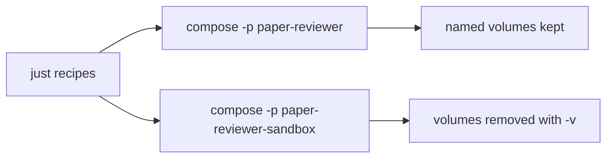

# Local development

All local workflows run through `just` recipes that wrap Docker Compose. Install host tools first: [host-requirements.md](host-requirements.md).

Do **not** run `docker compose`, language runtimes, or package managers on the host. Use the recipes below.

## Two environments

| Environment | Compose project | Data | When to use |
| --- | --- | --- | --- |
| **Persistent app** | `paper-reviewer` | Named volumes survive `just down` | End-user local use; keep data between sessions |
| **Ephemeral sandbox** | `paper-reviewer-sandbox` | Volumes removed on teardown | Agents, CI, bug reproduction, disposable experiments |

Both share the same [compose.yml](../compose.yml). Isolation comes from the Compose **project name** (`-p`), so wiping the sandbox never deletes app data.



## Recipes

List everything:

```bash
just
```

### Persistent app

| Recipe | Effect |
| --- | --- |
| `just up` | Build/start the app stack; wait until healthy. Volumes are kept. |
| `just down` | Stop containers; **volumes are preserved**. |
| `just logs` | Follow logs (`just logs app`, `just logs db` optional). |
| `just status` | Show container status. |
| `just reset CONFIRM=yes` | **Destructive:** `down -v`, recreate, then seed. |

### Ephemeral sandbox

| Recipe | Effect |
| --- | --- |
| `just sandbox` | Create a clean sandbox project, wait until healthy, then seed. |
| `just sandbox-down` | Tear down the sandbox and **delete its volumes**. |
| `just test` | `sandbox` → run tests in the sandbox → `sandbox-down`. |

Agents should prefer `just sandbox` / `just test`, not `just up` / `just reset`, so user data stays safe when both stacks run on the same machine. For when and how to write tests before implementing app behavior, see [tdd.md](tdd.md).
