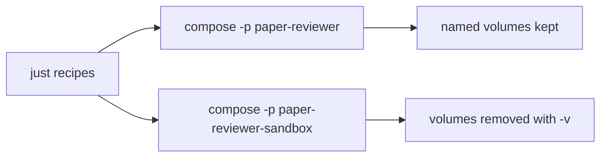

# Local development

Two supported ways to develop:

| Path | Host needs | How you work |
| --- | --- | --- |
| **Host / `just` (default)** | Docker Desktop + `just` | `just up`, `just run`, `just test`; IDE stays on the host |
| **Dev Container (optional)** | Docker Desktop + Cursor/VS Code Dev Containers | **Reopen in Container**; IDE and terminals attach to Compose `workspace` |

Both paths use the same Compose project (`paper-reviewer`), image, volumes, and app services. Pick one path per session — do not run `just up` and **Reopen in Container** as two separate stacks. Install host tools first: [host-requirements.md](host-requirements.md). Agent CLI policy: [AGENTS.md](../AGENTS.md). List recipes with `just`; definitions live in [justfile](../justfile).

## Line endings

This repository stores **LF** (`\n`) for all text files. The Linux workspace image, shell scripts, `just`, and Docker need LF. Do **not** switch the project to CRLF.

| Mechanism | Role |
| --- | --- |
| [`.gitattributes`](../.gitattributes) | `* text=auto eol=lf` — Git normalizes text to LF on commit and checkout |
| [`.editorconfig`](../.editorconfig) | Asks editors to save with LF |

On a **Windows host** Git install, set `core.autocrlf` to `input` or `false`. Do **not** use `true` (that rewrites working-tree files to CRLF). Prefer editing inside the Dev Container, or set the editor **Files: Eol** to `\n` when editing from Windows against the bind mount.

If `git status` shows many modified files with no visible content change, run `git diff --ignore-cr-at-eol`. An empty result means CRLF-only noise; restore with `git restore -- <paths>` (or convert those files back to LF). Files that already have `eol=lf` may still contain CRLF on disk while Git stays clean — convert them to LF before running shell or `just` in Linux.

## Dev Containers

Optional IDE path. Config lives under [`.devcontainer/`](../.devcontainer/). Workspace helpers for Cursor and VS Code live under [`.vscode/`](../.vscode/).

1. Copy [`.env.example`](../.env.example) to `.env` (same as the host path).
2. Start Docker Desktop.
3. Open this repo in Cursor (or VS Code with the Dev Containers extension).
4. On folder open, the IDE detects [`.devcontainer/devcontainer.json`](../.devcontainer/devcontainer.json) and shows **Would you like to reopen it inside a container?** — choose **Reopen in Container**. ([`.vscode/extensions.json`](../.vscode/extensions.json) recommends the Dev Containers extension; [`.vscode/settings.json`](../.vscode/settings.json) keeps that prompt enabled.)
5. Wait until the IDE attaches to `/workspace`. `postCreateCommand` runs `uv sync`.
6. Open the UI at `http://localhost:${UI_PORT}` (default [8501](http://localhost:8501)) and Prefect at `http://localhost:${PREFECT_PORT}` (default [4200](http://localhost:4200)).

Neither Cursor nor VS Code supports a committed repo setting that **silently** forces Reopen in Container on every open (by design). After the first attach, reopen the same entry from **File → Open Recent** (remote/dev-container URI) to reattach without the prompt. You can also run **Dev Containers: Reopen in Container** from the Command Palette anytime.

What starts: Compose services listed in [`.devcontainer/devcontainer.json`](../.devcontainer/devcontainer.json) `runServices` — `workspace`, `db`, `ui`, `prefect-server`, `prefect-worker`, `ollama`, `ollama-pull`. The devcontainer intentionally does not auto-start a one-shot migration step because Alembic is a manual apply step, not a normal long-lived process. [`.devcontainer/compose.override.yml`](../.devcontainer/compose.override.yml) clears the `app` profile and sets Compose project name `paper-reviewer` so volumes match `just up`.

Inside the Dev Container:

- Run `uv run pytest`, `uv run dlthub …`, and other Python commands **directly** (no `just`).
- Run the schema migration once after attaching: `uv run alembic upgrade head`.
- Do **not** use `just` recipes that call `docker compose` (no Docker socket mount).
- `shutdownAction` is `none`: closing the IDE does not stop the Compose stack. Stop from the host with `just down` when you want teardown.
- Sandbox (`just sandbox` / `just test`) and Jupyter (`just notebooks`) stay on the **host / `just`** path.

MCP inside the Dev Container: [`.devcontainer/mcp.json`](../.devcontainer/mcp.json) is bind-mounted over `.cursor/mcp.json` and runs `uv run dlthub ai mcp --stdio`. Host Cursor still uses [`.cursor/mcp.json`](../.cursor/mcp.json) (`docker compose exec`). Enable MCP in Cursor Settings as in [Enable the dlt-workspace-mcp server](#enable-the-dlt-workspace-mcp-server-in-cursor-manual).

## Environment configuration

All initial local parametrization lives in a project-root **`.env`** file. Compose reads it automatically for `${VAR}` substitution in [compose.yml](../compose.yml).

1. Copy the template:

   ```bash
   # Linux/macOS
   cp .env.example .env
   # PowerShell
   Copy-Item .env.example .env
   ```

2. Edit `.env` before `just up` or **Reopen in Container** (ports, Postgres credentials, Prefect URLs, optional NCBI key).
3. Do not commit `.env` (gitignored). Commit only [`.env.example`](../.env.example).

| Variable | Default | Used by | Notes |
| --- | --- | --- | --- |
| `POSTGRES_USER` | `paper_reviewer` | `db` | Must match user in `DATABASE_URL` |
| `POSTGRES_PASSWORD` | `paper_reviewer` | `db` | Must match password in `DATABASE_URL` |
| `POSTGRES_DB` | `paper_reviewer` | `db` | Must match database in `DATABASE_URL` |
| `POSTGRES_PORT` | `5432` | `db` host publish | Host → container `5432` |
| `DATABASE_URL` | `postgresql://paper_reviewer:paper_reviewer@db:5432/paper_reviewer` | `workspace`, `migrate`, `ui`, `prefect-worker`, `notebooks` | In-compose hostname is `db`. From the host: `localhost:${POSTGRES_PORT}` |
| `UI_PORT` | `8501` | `ui` host publish | Host → container `8501` |
| `PREFECT_API_URL` | `http://prefect-server:4200/api` | `workspace`, `ui`, `prefect-worker`, `notebooks` | In-network Prefect API |
| `PREFECT_UI_API_URL` | `http://localhost:4200/api` | `prefect-server` | Browser → host API; keep in sync with `PREFECT_PORT` |
| `PREFECT_PORT` | `4200` | `prefect-server` host publish | Host → container `4200` |
| `NCBI_API_KEY` | (empty) | `ui`, `prefect-worker`, `notebooks` | Optional; higher PubMed rate limits when set |
| `OPENAI_API_KEY` | `ollama` | `prefect-worker`, `notebooks` | Default `ollama` works with local Ollama. Set to a real key and omit or clear `OPENAI_BASE_URL` / `OPENAI_MODEL` for the public OpenAI API. Leave the key empty to skip live drafts (job records Failed) |
| `OPENAI_BASE_URL` | `http://localhost:11434/v1` | `prefect-worker`, `notebooks` | Ollama OpenAI-compatible API. Empty or omitted uses the public OpenAI API (`https://api.openai.com/v1`; clients pass that URL explicitly so Compose `${VAR:-}` empty injection is safe). From Compose, `localhost` / `127.0.0.1` is rewritten to `host.docker.internal` so a host service is reachable. When set, the job sends `max_tokens` (see `OPENAI_GATEWAY_MAX_TOKENS`) and `reasoning_effort=none` (so thinking models write the answer into `content`), appends conciseness instructions, and clips extracted scientific sections to 8000 characters |
| `OPENAI_MODEL` | `gemma4:e4b` | `prefect-worker`, `notebooks` | Chat model id. Empty or omitted uses the public API default (`gpt-4o-mini`). Required when `OPENAI_BASE_URL` is set. Notebooks: [paper-brief-evaluation-offline.md](specs/paper-brief-evaluation-offline.md#runtime) |
| `OPENAI_GATEWAY_MAX_TOKENS` | `8192` | `prefect-worker`, `notebooks` | Gateway completion token budget. Only used when `OPENAI_BASE_URL` is set. Increase if briefs are still truncated with verbose models; decrease to fit smaller context windows |
| `JUPYTER_PORT` | `8888` | `notebooks` host publish | Host → container `8888`. Recipe `just notebooks`. Do **not** publish Jupyter on the sandbox. |

Compose supplies the same defaults when a variable is unset, so an empty or missing `.env` still boots with the values above. Prefer the standard `postgresql://` scheme in `DATABASE_URL`; `paper_reviewer.db` maps it to SQLAlchemy’s `postgresql+psycopg://` driver for psycopg 3.

## Current stack

Compose defines:

- **`workspace`** — Python 3.12 + uv image with the repository bind-mounted at `/workspace` (agents, MCP, `just shell` / `just run`). Unprofiled so it starts with both `just up` and `just sandbox`.
- **`db`** — PostgreSQL 16 on host port **`POSTGRES_PORT`** (default **5432**; Compose profile `app`; started by `just up`). Named volume `postgres_data` survives `just down`.
- **`ui`** — same image, Streamlit **Paper Reviewer** UI on host port **`UI_PORT`** (default **8501**; Compose profile `app`; started by `just up` after `db` is healthy).
- **`prefect-server`** — Prefect API/UI on host port **`PREFECT_PORT`** (default **4200**; Compose profile `app`; started by `just up`). Image `prefecthq/prefect:3.8-python3.12`. Persists server metadata in named volume `prefect_data` (SQLite under `/root/.prefect`). Browser UI talks to `PREFECT_UI_API_URL`.
- **`prefect-worker`** — Serves leaf deployments `inform_source_record/default` and `inform_full_text/default`, `create_paper_brief/default`, `evaluate_paper_brief/default`, `create_topic_brief/default`, and `ingest_paper/default` via `python -m paper_reviewer.flows.serve` (Compose profile `app`; started by `just up`). Same application image and bind-mount as `ui` / `workspace`. Sets `PREFECT_API_URL`, `DATABASE_URL`, optional `NCBI_API_KEY`, and optional `OPENAI_*` from shared Compose env anchors (`x-worker-env`). The Streamlit UI submits `ingest_paper` and `create_topic_brief` runs with `run_deployment` (fire-and-forget). `ingest_paper/default` has a deployment concurrency limit of **5**; extra runs wait (`AwaitingConcurrencySlot`). The UI still submits one run per selected paper. Other served deployments have no such cap. An `ingest_paper` run shows nested subflow runs for `inform_source_record`, `inform_full_text`, and (when full text succeeded) `create_paper_brief` then (when the brief succeeded) `evaluate_paper_brief`. Progress UIs still poll Postgres, not Prefect, for paper and brief status.
- **`ollama`** — Ollama inference runtime on host port **11434** (Compose profile `app`; started by `just up`). OpenAI-compatible API at `/v1`. Persists models in named volume `ollama_data`.
- **`ollama-pull`** — one-shot `ollama pull gemma4:e4b` after `ollama` is healthy (Compose profile `app`; started by `just up` before `prefect-worker`). Idempotent when the model is already present. First run downloads several GB and can take several minutes. Manual re-run: `just pull-model`.
- **`notebooks`** — Jupyter Lab for offline paper-brief evaluation (Compose profile `notebooks`; started by `just notebooks`, not by `just up` or `just sandbox`). Same image and bind-mount as `workspace`. Publishes host port **`JUPYTER_PORT`** (default **8888**). Sets `DATABASE_URL`, optional `NCBI_API_KEY`, and optional `OPENAI_*` from `.env`. Procedure: [paper-brief-evaluation-offline.md](specs/paper-brief-evaluation-offline.md).

### Schema migrations (Alembic)

Relational schema versions live under [`alembic/versions/`](../alembic/versions/) (`alembic.ini` + [`alembic/env.py`](../alembic/env.py)). The **app** stack starts `db` and the UI without treating Alembic as a required startup service. The sandbox has no `db` service. Apply schema updates explicitly when needed:

```bash
just migrate
just run "uv run alembic current"
```

Generate a new revision after model changes (review the file before applying; then `just up` or `just migrate`):

```bash
just run "uv run alembic revision --autogenerate -m 'describe change'"
```

Use `just shell` / `just sandbox-shell` for interactive work, or `just run` / `just sandbox-run` for non-interactive commands (for example `uv init`, installing packages, or configuring dlt). Changes under `/workspace` persist on the host.

### Local LLM (Ollama)

The default `.env.example` is preconfigured for local Ollama (`OPENAI_BASE_URL=http://localhost:11434/v1`, `OPENAI_MODEL=gemma4:e4b`). `just up` starts Ollama and pulls `gemma4:e4b` (first startup downloads several GB). Confirm the model is ready: `curl http://localhost:11434/v1/models`. Re-pull: `just pull-model`.

To switch to the **public OpenAI API**, set `OPENAI_API_KEY` to your key and leave `OPENAI_BASE_URL` and `OPENAI_MODEL` empty or omit them in `.env` (defaults to `gpt-4o-mini`). Recreate `prefect-worker` (and `notebooks` if running) after changing `.env`.

After `just up`, open the **Paper Reviewer** UI at `http://localhost:${UI_PORT}` (default [8501](http://localhost:8501)) and the Prefect UI at `http://localhost:${PREFECT_PORT}` (default [4200](http://localhost:4200)). Confirm `prefect-worker` is up (`just status` / `just logs prefect-worker`): it should serve `inform_source_record/default`, `inform_full_text/default`, `create_paper_brief/default`, `evaluate_paper_brief/default`, `create_topic_brief/default`, and `ingest_paper/default`. An `ingest_paper` run shows nested subflow runs for source record, full text, and (when full text succeeded) paper brief then (when the brief succeeded) evaluation. Follow logs with `just logs` (all services) or `just logs ui` / `just logs db` / `just logs prefect-server` / `just logs prefect-worker` / `just logs ollama` / `just logs notebooks` for one service.

Manual smoke for Paper archiving ingest: after search, open **Paper archiving**. Confirm create/reuse, then enqueue of `ingest_paper` for new papers. Watch **source record**, **full text**, and **brief** labels move while `just logs prefect-worker` shows nested subflow runs. Reused papers that already have terminal statuses do not enqueue. A reused paper whose source record is still `not_started` does enqueue. When the set is terminal, the page links to **Topic scope**. Progress truth is Postgres, not the Prefect UI.

Manual smoke for **Regenerate**: when both source-record and full-text statuses are terminal, each paper row on **Paper archiving** shows **Regenerate**. Click it on a paper with full text **Unavailable**. Statuses may change; if full text becomes **Succeeded**, the brief is rewritten. Auto-enqueue still does not submit `ingest_paper` for reused papers that already have a terminal source-record status.

## Agent shells

Follow [AGENTS.md](../AGENTS.md) for the full CLI policy (mandatory). Short form:

- **Host IDE / host agent terminal:** wrap every in-container command with `just`. Prefer `just sandbox-run` / `just test` for disposable agent work. Keep the persistent app (`just up`) for long-lived MCP and the Paper Reviewer UI so `just sandbox-down` does not tear them down. Host `uv` / `python` / `pytest` will fail — the Linux `.venv` exists only in the image.
- **Dev Container IDE / attached agent terminal:** run `uv` / `pytest` directly. Do not use `just` recipes that need Docker on the host.

If a host `just` recipe is missing or awkward, do **not** call `docker` / `docker compose` on the host: stop and propose a [justfile](../justfile) change — see **Awkward or missing recipes** in [AGENTS.md](../AGENTS.md). Do not add IDE-specific agent rule files for this; AGENTS.md is the single owner.

## Cursor Cloud Agents

Cursor Cloud Agents run on a remote Ubuntu VM. The committed [`.cursor/environment.json`](../.cursor/environment.json) is Cursor-only (VS Code does not read it). It is the highest-precedence Cloud Agent environment source.

| File | Role |
| --- | --- |
| [`.cursor/environment.json`](../.cursor/environment.json) | Names the VM image, `install`, and `start` commands |
| [`.cursor/Dockerfile`](../.cursor/Dockerfile) | Host image: Docker Engine, Compose plugin, `just` 1.58.0. Not the app [Dockerfile](../Dockerfile) |
| [`.cursor/cloud-agent-install.sh`](../.cursor/cloud-agent-install.sh) | Copies `.env.example` to `.env` when `.env` is missing |
| [`.cursor/cloud-agent-start.sh`](../.cursor/cloud-agent-start.sh) | Starts the Docker daemon and waits until it is ready |

The VM is the **host** in [AGENTS.md](../AGENTS.md). After boot, agents still call `just`; they do not call `docker compose` directly.

`install` / `start` do **not** run `just up`. That recipe pulls the default Ollama model (several GB) and starts the full app stack. Cloud Agents should use `just sandbox` / `just test` unless the task needs the UI, Postgres, Prefect, or Ollama.

Put optional API keys (`NCBI_API_KEY`, `OPENAI_API_KEY`) in the Cursor Secrets tab when a task needs live PubMed or the public OpenAI API. Do not commit them. The default `.env.example` values are enough for sandbox tests.

`.cursor/environment.json` is not a Dev Container file. Local Cursor desktop and VS Code keep using Docker Desktop + `just` on your machine.

### Running tests

Use the sandbox (not host `pytest` / `uv`). Recipes start the sandbox workspace if needed:

```bash
just test
just test tests/topic_scope/search_external_sources -q
just test tests/schemas/topic_scope/test_topic_intake.py -q
```

`just test` runs `uv run pytest` inside the sandbox `workspace` container. Pass optional path or pytest args after the recipe name. Equivalent ad-hoc form: `just sandbox-run "uv run pytest tests/topic_scope/search_external_sources -q"`. Spec workflow: [tdd.md](tdd.md).

The sandbox Compose project starts **`workspace` only** (no `app` profile), so it does not bind ports 8501 or 5432 and does not create an app Postgres volume. Prefect runs with the app profile (`just up`), not the sandbox. Seeding and `just reset` will be added later.

### Offline paper-brief evaluation notebooks

Do **not** run Jupyter or the eval notebooks on the host. Do **not** use `just sandbox` for this procedure (no app Postgres). Do **not** open the `.ipynb` files with a host kernel in Cursor (the editor will stay on **Detecting kernels**). Short how-to next to the files: [notebooks/README.md](../notebooks/README.md).

```bash
just notebooks
```

That starts the app stack if needed, then Jupyter Lab in the **`notebooks`** service (Compose profile `notebooks`). Open `http://localhost:${JUPYTER_PORT}` (default [8888](http://localhost:8888)). The process has `DATABASE_URL`, `NCBI_API_KEY`, and `OPENAI_*` from `.env`. Notebooks: [`01-build-corpus.ipynb`](../notebooks/paper_brief_evaluation/01-build-corpus.ipynb), [`02-generate-briefs.ipynb`](../notebooks/paper_brief_evaluation/02-generate-briefs.ipynb), [`03-evaluate-briefs.ipynb`](../notebooks/paper_brief_evaluation/03-evaluate-briefs.ipynb), [`04-compare-runs.ipynb`](../notebooks/paper_brief_evaluation/04-compare-runs.ipynb). Contract: [paper-brief-evaluation-offline.md](specs/paper-brief-evaluation-offline.md#runtime).

`just down` stops Jupyter with the rest of the app project. The sandbox never publishes `JUPYTER_PORT`.

## Two environments

| Environment | Compose project | Data | When to use |
| --- | --- | --- | --- |
| **Persistent app** | `paper-reviewer` | Named volumes survive `just down` (when volumes exist) | End-user local use; keep data between sessions |
| **Ephemeral sandbox** | `paper-reviewer-sandbox` | Volumes removed on teardown | Agents, CI, bug reproduction, disposable experiments |

Both share the same [compose.yml](../compose.yml). Isolation comes from the Compose **project name** (`-p`), so wiping the sandbox never deletes app data.



Agents should prefer the sandbox for disposable work so the persistent app project stays untouched when both stacks run on the same machine. For when and how to write tests before implementing app behavior, see [tdd.md](tdd.md). For the cross-tool CLI harness, see [AGENTS.md](../AGENTS.md).

## dltHub workspace and Cursor AI workbench

This repo is a **dltHub workspace** (marker: [`.dlt/.workspace`](../.dlt/.workspace)). App Python work still runs in Compose via `just`; do not install a second app toolchain on the host for day-to-day coding.

### Bootstrap (already applied for this project)

These were run inside the sandbox `workspace` container (repo bind-mounted at `/workspace`):

```bash
just sandbox
# then in the container (e.g. just sandbox-shell):
uvx dlthub-init@latest
uv add "dlt[hub]"
uv add fastmcp
uv run dlthub ai init --agent cursor
uv run dlthub ai toolkit install rest-api-pipeline
```

That creates/updates the workspace marker, `.dlt` config, Cursor skills/rules under [`.cursor/`](../.cursor/), MCP config [`.cursor/mcp.json`](../.cursor/mcp.json), and the **rest-api-pipeline** toolkit. The workspace image includes `git` because `dlthub ai init` clones the workbench repo.

Re-check status anytime:

```bash
just sandbox-run "uv run dlthub ai status"
```

Or with an interactive shell: `just sandbox-shell`, then `uv run dlthub ai status`.

### Enable the dlt-workspace-mcp server in Cursor (manual)

MCP always runs **inside** the Compose `workspace` container (no host `uv`). Which config file applies depends on the IDE path:

| IDE path | Config | How MCP starts |
| --- | --- | --- |
| Host Cursor | [`.cursor/mcp.json`](../.cursor/mcp.json) | `docker compose … exec workspace uv run dlthub ai mcp --stdio` |
| Dev Container | [`.devcontainer/mcp.json`](../.devcontainer/mcp.json) (mounted over `.cursor/mcp.json`) | `uv run dlthub ai mcp --stdio` |

1. Ensure the app `workspace` is running: `just up` (host path) or **Reopen in Container** (Dev Container path). Prefer the **paper-reviewer** project over the sandbox so host MCP is not torn down by `just sandbox-down`.
2. Open this project in **Cursor** (host or already attached).
3. Open **Cursor Settings → MCP**.
4. Find **`dlt-workspace-mcp`** and **Enable** / approve it if prompted.
5. Confirm status is connected (not error / needsAuth).
6. Start a **new Agent** chat in this project (Agent mode, not plain Chat) so skills, rules, and MCP tools load.
7. Smoke-check: ask the agent to use workspace MCP tools (e.g. list pipelines) once any pipeline exists.

If the server fails to start:

- Error `service "shell" is not running` / unknown service: the Compose service name is **`workspace`**, not `shell` (see `compose.yml`). Reload MCP after fixing `.cursor/mcp.json`.
- Error `service "workspace" is not running` (host path): run `just up`, wait until healthy (`just status`), then toggle the MCP server off/on or reload the Cursor window.
- Confirm `fastmcp` is installed in the project env (`uv add fastmcp` inside `just shell`, or `uv add fastmcp` in a Dev Container terminal).
- Re-run `uv run dlthub ai init --agent cursor` in the workspace container only if you need to regenerate skills/rules; keep the host Docker-based [`.cursor/mcp.json`](../.cursor/mcp.json) and the Dev Container [`.devcontainer/mcp.json`](../.devcontainer/mcp.json) (do not let init overwrite them back to host `uv` without re-applying the correct form).
- Run `uv run dlthub ai status` inside the container for diagnostics.

Official references: [REST API Source with dltHub AI Workbench](https://dlthub.com/docs/hub/ingestion/rest-api-source), [Installation](https://dlthub.com/docs/hub/getting-started/installation).
