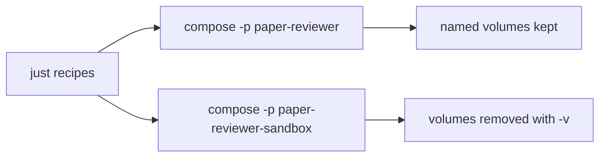

# Local development

All local workflows run through `just` recipes that wrap Docker Compose. Install host tools first: [host-requirements.md](host-requirements.md). Agent CLI policy: [AGENTS.md](../AGENTS.md). List recipes with `just`; definitions live in [justfile](../justfile).

## Environment configuration

All initial local parametrization lives in a project-root **`.env`** file. Compose reads it automatically for `${VAR}` substitution in [compose.yml](../compose.yml).

1. Copy the template:

   ```bash
   # Linux/macOS
   cp .env.example .env
   # PowerShell
   Copy-Item .env.example .env
   ```

2. Edit `.env` before `just up` (ports, Postgres credentials, Prefect URLs, optional NCBI key).
3. Do not commit `.env` (gitignored). Commit only [`.env.example`](../.env.example).

| Variable | Default | Used by | Notes |
| --- | --- | --- | --- |
| `POSTGRES_USER` | `paper_reviewer` | `db` | Must match user in `DATABASE_URL` |
| `POSTGRES_PASSWORD` | `paper_reviewer` | `db` | Must match password in `DATABASE_URL` |
| `POSTGRES_DB` | `paper_reviewer` | `db` | Must match database in `DATABASE_URL` |
| `POSTGRES_PORT` | `5432` | `db` host publish | Host → container `5432` |
| `DATABASE_URL` | `postgresql://paper_reviewer:paper_reviewer@db:5432/paper_reviewer` | `workspace`, `migrate`, `ui`, `prefect-worker` | In-compose hostname is `db`. From the host: `localhost:${POSTGRES_PORT}` |
| `UI_PORT` | `8501` | `ui` host publish | Host → container `8501` |
| `PREFECT_API_URL` | `http://prefect-server:4200/api` | `workspace`, `ui`, `prefect-worker` | In-network Prefect API |
| `PREFECT_UI_API_URL` | `http://localhost:4200/api` | `prefect-server` | Browser → host API; keep in sync with `PREFECT_PORT` |
| `PREFECT_PORT` | `4200` | `prefect-server` host publish | Host → container `4200` |
| `NCBI_API_KEY` | (empty) | `ui`, `prefect-worker` | Optional; higher PubMed rate limits when set |
| `OPENAI_API_KEY` | (empty) | `prefect-worker` | Required for the public OpenAI API. Optional when `OPENAI_BASE_URL` is set (local compatible gateway). Leave both empty in tests; the job records Failed if the public API is used with no key |
| `OPENAI_BASE_URL` | (empty) | `prefect-worker` | Optional OpenAI-compatible API base. Empty uses the public OpenAI API. From Compose, `localhost` / `127.0.0.1` is rewritten to `host.docker.internal` so a gateway on the host is reachable. Local gateways may ignore structured `json_schema`; the job still extracts and validates `PaperBriefContent`. When this URL is set, the job sends `max_tokens=4096` and clips extracted scientific sections to 8000 characters (public OpenAI uses the extracted sections with no character budget) |
| `OPENAI_MODEL` | (empty) | `prefect-worker` | Chat model id for `create_paper_brief`. Empty uses the public API default (`gpt-4o-mini`). Required when `OPENAI_BASE_URL` is set (local example in `.env.example`: `llama3.1-8b`) |

Compose supplies the same defaults when a variable is unset, so an empty or missing `.env` still boots with the values above. Prefer the standard `postgresql://` scheme in `DATABASE_URL`; `paper_reviewer.db` maps it to SQLAlchemy’s `postgresql+psycopg://` driver for psycopg 3.

## Current stack

Compose defines:

- **`workspace`** — Python 3.12 + uv image with the repository bind-mounted at `/workspace` (agents, MCP, `just shell` / `just run`). Unprofiled so it starts with both `just up` and `just sandbox`.
- **`db`** — PostgreSQL 16 on host port **`POSTGRES_PORT`** (default **5432**; Compose profile `app`; started by `just up`). Named volume `postgres_data` survives `just down`.
- **`migrate`** — one-shot Alembic `upgrade head` against `db` (Compose profile `app`). Runs on every `just up` before the UI starts; exits when done.
- **`ui`** — same image, Streamlit **Paper Reviewer** UI on host port **`UI_PORT`** (default **8501**; Compose profile `app`; started by `just up` after `migrate` succeeds).
- **`prefect-server`** — Prefect API/UI on host port **`PREFECT_PORT`** (default **4200**; Compose profile `app`; started by `just up`). Image `prefecthq/prefect:3.8-python3.12`. Persists server metadata in named volume `prefect_data` (SQLite under `/root/.prefect`). Browser UI talks to `PREFECT_UI_API_URL`.
- **`prefect-worker`** — Serves `fulfill_paper_metadata/default`, leaf deployments `inform_source_record/default` and `inform_full_text/default`, `create_paper_brief/default`, and `regenerate_paper/default` via `python -m paper_reviewer.flows.serve` (Compose profile `app`; started by `just up`). Same application image and bind-mount as `ui` / `workspace`. Sets `PREFECT_API_URL`, `DATABASE_URL`, optional `NCBI_API_KEY`, optional `OPENAI_API_KEY`, optional `OPENAI_BASE_URL`, and optional `OPENAI_MODEL` from `.env`. The Streamlit UI submits `fulfill_paper_metadata`, `create_paper_brief`, and `regenerate_paper` runs with `run_deployment` (fire-and-forget). Progress UIs still poll Postgres, not Prefect, for paper and brief status.

### Schema migrations (Alembic)

Relational schema versions live under [`alembic/versions/`](../alembic/versions/) (`alembic.ini` + [`alembic/env.py`](../alembic/env.py)). The **app** stack applies them automatically: `just up` starts `db`, runs the `migrate` service to `alembic upgrade head`, then starts `ui`. The sandbox has no `db` / `migrate` services.

Manual / one-off apply (idempotent):

```bash
just migrate
just run "uv run alembic current"
```

Generate a new revision after model changes (review the file before applying; then `just up` or `just migrate`):

```bash
just run "uv run alembic revision --autogenerate -m 'describe change'"
```

Use `just shell` / `just sandbox-shell` for interactive work, or `just run` / `just sandbox-run` for non-interactive commands (for example `uv init`, installing packages, or configuring dlt). Changes under `/workspace` persist on the host.

After `just up`, open the **Paper Reviewer** UI at `http://localhost:${UI_PORT}` (default [8501](http://localhost:8501)) and the Prefect UI at `http://localhost:${PREFECT_PORT}` (default [4200](http://localhost:4200)). Confirm `prefect-worker` is up (`just status` / `just logs prefect-worker`): it should serve `fulfill_paper_metadata/default` (leaf `inform_source_record/default` and `inform_full_text/default`), `create_paper_brief/default`, and `regenerate_paper/default`. Follow logs with `just logs` (all services) or `just logs ui` / `just logs db` / `just logs prefect-server` / `just logs prefect-worker` for one service.

Manual smoke for step 6: archive papers in the UI, open **Fulfill papers metadata**, confirm enqueue of `fulfill_paper_metadata` succeeds, then watch the **source record** and **full text** labels move to Succeeded, Unavailable, or Failed while `just logs prefect-worker` shows fulfill runs. Revisit a paper with source **Succeeded** and full text **Fulfilling**: only Cloud runs. When both aspects are terminal, a later visit does not enqueue a new run. Unsupported `source_id`: source record **Unavailable**; full text stays **not_started**. Progress truth is Postgres (`source_record_status` / `full_text_status`), not the Prefect UI.

Manual smoke for step 7: after fulfill is terminal, open **Generate paper brief**. Papers with full text **Unavailable** or **Failed** show **Blocked (no full text)** and do not enqueue a brief run. A paper with full text **Succeeded** and no brief moves to **Succeeded** (or **Failed** if the public API has no `OPENAI_API_KEY`, or the LLM errors). A later generation that archives the same paper with an existing succeeded brief shows **Skipped (already done)**. Progress truth is Postgres (`paper_briefs.status`), not the Prefect UI.

Manual smoke for regenerate: when both aspects are terminal, each paper row on **Fulfill papers metadata** and **Generate paper brief** shows **Regenerate**. Click it on a paper with full text **Unavailable**. Statuses may change; if full text becomes **Succeeded**, the brief is rewritten. Default page 6/7 auto-enqueue still skips `succeeded` / `failed` / `unavailable`.

## Agent shells

Coding-agent terminals (Cursor, Claude Code, Codex, and similar) run on the **host**, not inside the Compose container. The Linux `.venv` and `uv` binary exist only in the image, so host `uv` / `python` / `pytest` will fail.

Follow [AGENTS.md](../AGENTS.md) for the full CLI policy (mandatory). Wrap every in-container command with `just`. Prefer `just sandbox-run` / `just test` for disposable agent work. Keep the persistent app (`just up`) for long-lived MCP and the Paper Reviewer UI so `just sandbox-down` does not tear them down.

If a recipe is missing or awkward, do **not** call `docker` / `docker compose` on the host: stop and propose a [justfile](../justfile) change — see **Awkward or missing recipes** in [AGENTS.md](../AGENTS.md). Do not add IDE-specific agent rule files for this; AGENTS.md is the single owner.

### Running tests

Use the sandbox (not host `pytest` / `uv`). Recipes start the sandbox workspace if needed:

```bash
just test
just test tests/topic_brief_generation/search_external_sources -q
just test tests/schemas/topic_brief_generation/test_topic_intake.py -q
```

`just test` runs `uv run pytest` inside the sandbox `workspace` container. Pass optional path or pytest args after the recipe name. Equivalent ad-hoc form: `just sandbox-run "uv run pytest tests/topic_brief_generation/search_external_sources -q"`. Spec workflow: [tdd.md](tdd.md).

The sandbox Compose project starts **`workspace` only** (no `app` profile), so it does not bind ports 8501 or 5432 and does not create an app Postgres volume. Prefect runs with the app profile (`just up`), not the sandbox. Seeding and `just reset` will be added later.

## Two environments

| Environment | Compose project | Data | When to use |
| --- | --- | --- | --- |
| **Persistent app** | `paper-reviewer` | Named volumes survive `just down` (when volumes exist) | End-user local use; keep data between sessions |
| **Ephemeral sandbox** | `paper-reviewer-sandbox` | Volumes removed on teardown | Agents, CI, bug reproduction, disposable experiments |

Both share the same [compose.yml](../compose.yml). Isolation comes from the Compose **project name** (`-p`), so wiping the sandbox never deletes app data.



Agents should prefer the sandbox for disposable work so the persistent app project stays untouched when both stacks run on the same machine. For when and how to write tests before implementing app behavior, see [tdd.md](tdd.md). For the cross-tool CLI harness, see [AGENTS.md](../AGENTS.md).

## dltHub workspace and Cursor AI workbench

This repo is a **dltHub workspace** (marker: [`.dlt/.workspace`](../.dlt/.workspace)). App Python work still runs in Compose via `just`; do not install a second app toolchain on the host for day-to-day coding.

### Bootstrap (already applied for this project)

These were run inside the sandbox `workspace` container (repo bind-mounted at `/workspace`):

```bash
just sandbox
# then in the container (e.g. just sandbox-shell):
uvx dlthub-init@latest
uv add "dlt[hub]"
uv add fastmcp
uv run dlthub ai init --agent cursor
uv run dlthub ai toolkit install rest-api-pipeline
```

That creates/updates the workspace marker, `.dlt` config, Cursor skills/rules under [`.cursor/`](../.cursor/), MCP config [`.cursor/mcp.json`](../.cursor/mcp.json), and the **rest-api-pipeline** toolkit. The workspace image includes `git` because `dlthub ai init` clones the workbench repo.

Re-check status anytime:

```bash
just sandbox-run "uv run dlthub ai status"
```

Or with an interactive shell: `just sandbox-shell`, then `uv run dlthub ai status`.

### Enable the dlt-workspace-mcp server in Cursor (manual)

MCP is configured to run **inside the Compose `workspace` container** (no host `uv`). See [`.cursor/mcp.json`](../.cursor/mcp.json).

1. Start the persistent app workspace so the container is running:

   ```bash
   just up
   ```

   (`docker compose exec` only works against a running service. Prefer the **paper-reviewer** project over the sandbox so MCP is not torn down by `just sandbox-down`.)

2. Open this project in **Cursor**.
3. Open **Cursor Settings → MCP**.
4. Find **`dlt-workspace-mcp`** and **Enable** / approve it if prompted.
5. Confirm status is connected (not error / needsAuth).
6. Start a **new Agent** chat in this project (Agent mode, not plain Chat) so skills, rules, and MCP tools load.
7. Smoke-check: ask the agent to use workspace MCP tools (e.g. list pipelines) once any pipeline exists.

If the server fails to start:

- Error `service "shell" is not running` / unknown service: the Compose service name is **`workspace`**, not `shell` (see `compose.yml`). Reload MCP after fixing `.cursor/mcp.json`.
- Error `service "workspace" is not running`: run `just up`, wait until healthy (`just status`), then toggle the MCP server off/on or reload the Cursor window.
- Confirm `fastmcp` is installed in the project env (`uv add fastmcp` inside `just shell` if missing).
- Re-run `uv run dlthub ai init --agent cursor` in the workspace container only if you need to regenerate skills/rules; keep the Docker-based `mcp.json` (do not let init overwrite it back to host `uv` without re-applying the compose exec form).
- Run `uv run dlthub ai status` inside the container for diagnostics.

Official references: [REST API Source with dltHub AI Workbench](https://dlthub.com/docs/hub/ingestion/rest-api-source), [Installation](https://dlthub.com/docs/hub/getting-started/installation).
