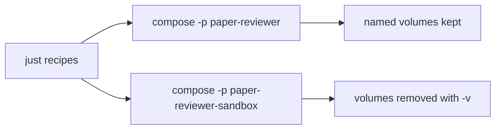

# Local development

All local workflows run through `just` recipes that wrap Docker Compose. Install host tools first: [host-requirements.md](host-requirements.md). Agent CLI policy: [AGENTS.md](../AGENTS.md). List recipes with `just`; definitions live in [justfile](../justfile).

## Environment configuration

All initial local parametrization lives in a project-root **`.env`** file. Compose reads it automatically for `${VAR}` substitution in [compose.yml](../compose.yml).

1. Copy the template:

   ```bash
   # Linux/macOS
   cp .env.example .env
   # PowerShell
   Copy-Item .env.example .env
   ```

2. Edit `.env` before `just up` (ports, Postgres credentials, Prefect URLs, optional NCBI key).
3. Do not commit `.env` (gitignored). Commit only [`.env.example`](../.env.example).

| Variable | Default | Used by | Notes |
| --- | --- | --- | --- |
| `POSTGRES_USER` | `paper_reviewer` | `db` | Must match user in `DATABASE_URL` |
| `POSTGRES_PASSWORD` | `paper_reviewer` | `db` | Must match password in `DATABASE_URL` |
| `POSTGRES_DB` | `paper_reviewer` | `db` | Must match database in `DATABASE_URL` |
| `POSTGRES_PORT` | `5432` | `db` host publish | Host → container `5432` |
| `DATABASE_URL` | `postgresql://paper_reviewer:paper_reviewer@db:5432/paper_reviewer` | `workspace`, `migrate`, `ui`, `prefect-worker`, `notebooks` | In-compose hostname is `db`. From the host: `localhost:${POSTGRES_PORT}` |
| `UI_PORT` | `8501` | `ui` host publish | Host → container `8501` |
| `PREFECT_API_URL` | `http://prefect-server:4200/api` | `workspace`, `ui`, `prefect-worker`, `notebooks` | In-network Prefect API |
| `PREFECT_UI_API_URL` | `http://localhost:4200/api` | `prefect-server` | Browser → host API; keep in sync with `PREFECT_PORT` |
| `PREFECT_PORT` | `4200` | `prefect-server` host publish | Host → container `4200` |
| `NCBI_API_KEY` | (empty) | `ui`, `prefect-worker`, `notebooks` | Optional; higher PubMed rate limits when set |
| `OPENAI_API_KEY` | `ollama` | `prefect-worker`, `notebooks` | Default `ollama` works with local Ollama. Set to a real key (and clear `OPENAI_BASE_URL` / `OPENAI_MODEL`) for the public OpenAI API. Leave all three empty to skip live drafts (job records Failed) |
| `OPENAI_BASE_URL` | `http://localhost:11434/v1` | `prefect-worker`, `notebooks` | Ollama OpenAI-compatible API. Empty uses the public OpenAI API. From Compose, `localhost` / `127.0.0.1` is rewritten to `host.docker.internal` so a host service is reachable. When set, the job sends `max_tokens=4096` and clips extracted scientific sections to 8000 characters |
| `OPENAI_MODEL` | `llama3.1:8b` | `prefect-worker`, `notebooks` | Chat model id. Empty uses the public API default (`gpt-4o-mini`). Required when `OPENAI_BASE_URL` is set. Notebooks: [paper-brief-evaluation-offline.md](specs/paper-brief-evaluation-offline.md#runtime) |
| `JUPYTER_PORT` | `8888` | `notebooks` host publish | Host → container `8888`. Recipe `just notebooks`. Do **not** publish Jupyter on the sandbox. |

Compose supplies the same defaults when a variable is unset, so an empty or missing `.env` still boots with the values above. Prefer the standard `postgresql://` scheme in `DATABASE_URL`; `paper_reviewer.db` maps it to SQLAlchemy’s `postgresql+psycopg://` driver for psycopg 3.

## Current stack

Compose defines:

- **`workspace`** — Python 3.12 + uv image with the repository bind-mounted at `/workspace` (agents, MCP, `just shell` / `just run`). Unprofiled so it starts with both `just up` and `just sandbox`.
- **`db`** — PostgreSQL 16 on host port **`POSTGRES_PORT`** (default **5432**; Compose profile `app`; started by `just up`). Named volume `postgres_data` survives `just down`.
- **`migrate`** — one-shot Alembic `upgrade head` against `db` (Compose profile `app`). Runs on every `just up` before the UI starts; exits when done.
- **`ui`** — same image, Streamlit **Paper Reviewer** UI on host port **`UI_PORT`** (default **8501**; Compose profile `app`; started by `just up` after `migrate` succeeds).
- **`prefect-server`** — Prefect API/UI on host port **`PREFECT_PORT`** (default **4200**; Compose profile `app`; started by `just up`). Image `prefecthq/prefect:3.8-python3.12`. Persists server metadata in named volume `prefect_data` (SQLite under `/root/.prefect`). Browser UI talks to `PREFECT_UI_API_URL`.
- **`prefect-worker`** — Serves leaf deployments `inform_source_record/default` and `inform_full_text/default`, `create_paper_brief/default`, `evaluate_paper_brief/default`, `create_topic_brief/default`, and `ingest_paper/default` via `python -m paper_reviewer.flows.serve` (Compose profile `app`; started by `just up`). Same application image and bind-mount as `ui` / `workspace`. Sets `PREFECT_API_URL`, `DATABASE_URL`, optional `NCBI_API_KEY`, optional `OPENAI_API_KEY`, optional `OPENAI_BASE_URL`, and optional `OPENAI_MODEL` from `.env`. The Streamlit UI submits `ingest_paper` and `create_topic_brief` runs with `run_deployment` (fire-and-forget). `ingest_paper/default` has a deployment concurrency limit of **5**; extra runs wait (`AwaitingConcurrencySlot`). The UI still submits one run per selected paper. Other served deployments have no such cap. An `ingest_paper` run shows nested subflow runs for `inform_source_record`, `inform_full_text`, and (when full text succeeded) `create_paper_brief` then (when the brief succeeded) `evaluate_paper_brief`. Progress UIs still poll Postgres, not Prefect, for paper and brief status.
- **`ollama`** — Ollama inference runtime on host port **11434** (Compose profile `app`; started by `just up`). OpenAI-compatible API at `/v1`. Persists models in named volume `ollama_data`.
- **`ollama-pull`** — one-shot `ollama pull llama3.1:8b` after `ollama` is healthy (Compose profile `app`; started by `just up` before `prefect-worker`). Idempotent when the model is already present. First run downloads several GB and can take several minutes. Manual re-run: `just pull-model`.
- **`notebooks`** — Jupyter Lab for offline paper-brief evaluation (Compose profile `notebooks`; started by `just notebooks`, not by `just up` or `just sandbox`). Same image and bind-mount as `workspace`. Publishes host port **`JUPYTER_PORT`** (default **8888**). Sets `DATABASE_URL`, optional `NCBI_API_KEY`, and optional `OPENAI_*` from `.env`. Procedure: [paper-brief-evaluation-offline.md](specs/paper-brief-evaluation-offline.md).

### Schema migrations (Alembic)

Relational schema versions live under [`alembic/versions/`](../alembic/versions/) (`alembic.ini` + [`alembic/env.py`](../alembic/env.py)). The **app** stack applies them automatically: `just up` starts `db`, runs the `migrate` service to `alembic upgrade head`, then starts `ui`. The sandbox has no `db` / `migrate` services.

Manual / one-off apply (idempotent):

```bash
just migrate
just run "uv run alembic current"
```

Generate a new revision after model changes (review the file before applying; then `just up` or `just migrate`):

```bash
just run "uv run alembic revision --autogenerate -m 'describe change'"
```

Use `just shell` / `just sandbox-shell` for interactive work, or `just run` / `just sandbox-run` for non-interactive commands (for example `uv init`, installing packages, or configuring dlt). Changes under `/workspace` persist on the host.

### Local LLM (Ollama)

The default `.env.example` is preconfigured for local Ollama (`OPENAI_BASE_URL=http://localhost:11434/v1`, `OPENAI_MODEL=llama3.1:8b`). `just up` starts Ollama and automatically pulls the default model (first startup downloads several GB). Confirm the model is ready: `curl http://localhost:11434/v1/models`. To pull a different model: `just pull-model`.

To switch to the **public OpenAI API**, set `OPENAI_API_KEY` to your key and leave `OPENAI_BASE_URL` and `OPENAI_MODEL` empty in `.env` (defaults to `gpt-4o-mini`).

After `just up`, open the **Paper Reviewer** UI at `http://localhost:${UI_PORT}` (default [8501](http://localhost:8501)) and the Prefect UI at `http://localhost:${PREFECT_PORT}` (default [4200](http://localhost:4200)). Confirm `prefect-worker` is up (`just status` / `just logs prefect-worker`): it should serve `inform_source_record/default`, `inform_full_text/default`, `create_paper_brief/default`, `evaluate_paper_brief/default`, `create_topic_brief/default`, and `ingest_paper/default`. An `ingest_paper` run shows nested subflow runs for source record, full text, and (when full text succeeded) paper brief then (when the brief succeeded) evaluation. Follow logs with `just logs` (all services) or `just logs ui` / `just logs db` / `just logs prefect-server` / `just logs prefect-worker` / `just logs ollama` / `just logs notebooks` for one service.

Manual smoke for Paper archiving ingest: after search, open **Paper archiving**. Confirm create/reuse, then enqueue of `ingest_paper` for new papers. Watch **source record**, **full text**, and **brief** labels move while `just logs prefect-worker` shows nested subflow runs. Reused papers that already have terminal statuses do not enqueue. A reused paper whose source record is still `not_started` does enqueue. When the set is terminal, the page links to **Topic scope**. Progress truth is Postgres, not the Prefect UI.

Manual smoke for **Regenerate**: when both source-record and full-text statuses are terminal, each paper row on **Paper archiving** shows **Regenerate**. Click it on a paper with full text **Unavailable**. Statuses may change; if full text becomes **Succeeded**, the brief is rewritten. Auto-enqueue still does not submit `ingest_paper` for reused papers that already have a terminal source-record status.

## Agent shells

Coding-agent terminals (Cursor, Claude Code, Codex, and similar) run on the **host**, not inside the Compose container. The Linux `.venv` and `uv` binary exist only in the image, so host `uv` / `python` / `pytest` will fail.

Follow [AGENTS.md](../AGENTS.md) for the full CLI policy (mandatory). Wrap every in-container command with `just`. Prefer `just sandbox-run` / `just test` for disposable agent work. Keep the persistent app (`just up`) for long-lived MCP and the Paper Reviewer UI so `just sandbox-down` does not tear them down.

If a recipe is missing or awkward, do **not** call `docker` / `docker compose` on the host: stop and propose a [justfile](../justfile) change — see **Awkward or missing recipes** in [AGENTS.md](../AGENTS.md). Do not add IDE-specific agent rule files for this; AGENTS.md is the single owner.

### Running tests

Use the sandbox (not host `pytest` / `uv`). Recipes start the sandbox workspace if needed:

```bash
just test
just test tests/topic_scope/search_external_sources -q
just test tests/schemas/topic_scope/test_topic_intake.py -q
```

`just test` runs `uv run pytest` inside the sandbox `workspace` container. Pass optional path or pytest args after the recipe name. Equivalent ad-hoc form: `just sandbox-run "uv run pytest tests/topic_scope/search_external_sources -q"`. Spec workflow: [tdd.md](tdd.md).

The sandbox Compose project starts **`workspace` only** (no `app` profile), so it does not bind ports 8501 or 5432 and does not create an app Postgres volume. Prefect runs with the app profile (`just up`), not the sandbox. Seeding and `just reset` will be added later.

### Offline paper-brief evaluation notebooks

Do **not** run Jupyter or the eval notebooks on the host. Do **not** use `just sandbox` for this procedure (no app Postgres). Do **not** open the `.ipynb` files with a host kernel in Cursor (the editor will stay on **Detecting kernels**). Short how-to next to the files: [notebooks/README.md](../notebooks/README.md).

```bash
just notebooks
```

That starts the app stack if needed, then Jupyter Lab in the **`notebooks`** service (Compose profile `notebooks`). Open `http://localhost:${JUPYTER_PORT}` (default [8888](http://localhost:8888)). The process has `DATABASE_URL`, `NCBI_API_KEY`, and `OPENAI_*` from `.env`. Notebooks: [`01-build-corpus.ipynb`](../notebooks/paper_brief_evaluation/01-build-corpus.ipynb), [`02-generate-briefs.ipynb`](../notebooks/paper_brief_evaluation/02-generate-briefs.ipynb), [`03-evaluate-briefs.ipynb`](../notebooks/paper_brief_evaluation/03-evaluate-briefs.ipynb). Contract: [paper-brief-evaluation-offline.md](specs/paper-brief-evaluation-offline.md#runtime).

`just down` stops Jupyter with the rest of the app project. The sandbox never publishes `JUPYTER_PORT`.

## Two environments

| Environment | Compose project | Data | When to use |
| --- | --- | --- | --- |
| **Persistent app** | `paper-reviewer` | Named volumes survive `just down` (when volumes exist) | End-user local use; keep data between sessions |
| **Ephemeral sandbox** | `paper-reviewer-sandbox` | Volumes removed on teardown | Agents, CI, bug reproduction, disposable experiments |

Both share the same [compose.yml](../compose.yml). Isolation comes from the Compose **project name** (`-p`), so wiping the sandbox never deletes app data.



Agents should prefer the sandbox for disposable work so the persistent app project stays untouched when both stacks run on the same machine. For when and how to write tests before implementing app behavior, see [tdd.md](tdd.md). For the cross-tool CLI harness, see [AGENTS.md](../AGENTS.md).

## dltHub workspace and Cursor AI workbench

This repo is a **dltHub workspace** (marker: [`.dlt/.workspace`](../.dlt/.workspace)). App Python work still runs in Compose via `just`; do not install a second app toolchain on the host for day-to-day coding.

### Bootstrap (already applied for this project)

These were run inside the sandbox `workspace` container (repo bind-mounted at `/workspace`):

```bash
just sandbox
# then in the container (e.g. just sandbox-shell):
uvx dlthub-init@latest
uv add "dlt[hub]"
uv add fastmcp
uv run dlthub ai init --agent cursor
uv run dlthub ai toolkit install rest-api-pipeline
```

That creates/updates the workspace marker, `.dlt` config, Cursor skills/rules under [`.cursor/`](../.cursor/), MCP config [`.cursor/mcp.json`](../.cursor/mcp.json), and the **rest-api-pipeline** toolkit. The workspace image includes `git` because `dlthub ai init` clones the workbench repo.

Re-check status anytime:

```bash
just sandbox-run "uv run dlthub ai status"
```

Or with an interactive shell: `just sandbox-shell`, then `uv run dlthub ai status`.

### Enable the dlt-workspace-mcp server in Cursor (manual)

MCP is configured to run **inside the Compose `workspace` container** (no host `uv`). See [`.cursor/mcp.json`](../.cursor/mcp.json).

1. Start the persistent app workspace so the container is running:

   ```bash
   just up
   ```

   (`docker compose exec` only works against a running service. Prefer the **paper-reviewer** project over the sandbox so MCP is not torn down by `just sandbox-down`.)

2. Open this project in **Cursor**.
3. Open **Cursor Settings → MCP**.
4. Find **`dlt-workspace-mcp`** and **Enable** / approve it if prompted.
5. Confirm status is connected (not error / needsAuth).
6. Start a **new Agent** chat in this project (Agent mode, not plain Chat) so skills, rules, and MCP tools load.
7. Smoke-check: ask the agent to use workspace MCP tools (e.g. list pipelines) once any pipeline exists.

If the server fails to start:

- Error `service "shell" is not running` / unknown service: the Compose service name is **`workspace`**, not `shell` (see `compose.yml`). Reload MCP after fixing `.cursor/mcp.json`.
- Error `service "workspace" is not running`: run `just up`, wait until healthy (`just status`), then toggle the MCP server off/on or reload the Cursor window.
- Confirm `fastmcp` is installed in the project env (`uv add fastmcp` inside `just shell` if missing).
- Re-run `uv run dlthub ai init --agent cursor` in the workspace container only if you need to regenerate skills/rules; keep the Docker-based `mcp.json` (do not let init overwrite it back to host `uv` without re-applying the compose exec form).
- Run `uv run dlthub ai status` inside the container for diagnostics.

Official references: [REST API Source with dltHub AI Workbench](https://dlthub.com/docs/hub/ingestion/rest-api-source), [Installation](https://dlthub.com/docs/hub/getting-started/installation).
