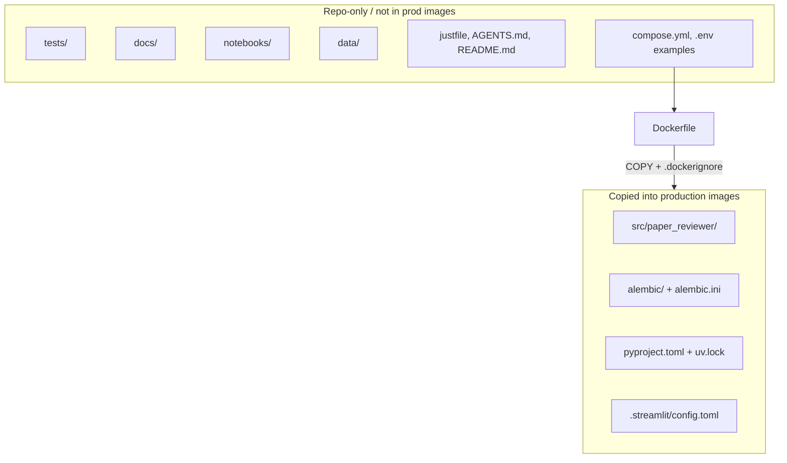

# Project structure

Agents use this document when adding packages, modules, or Docker build context. It is the single source of truth for **where code lives** and **what enters production images**.

Runtime libraries and layer boundaries: [technology-stack.md](technology-stack.md). Local Compose/`just` workflows: [local-development.md](local-development.md).

## Layout principles

- **src layout** — One installable package under `src/`. Tests and docs stay outside it so accidental imports from the working tree do not mask the installed package.
- **One package, several entrypoints** — Streamlit, Prefect workers, and migrations install the same package and differ by process command, not by separate Python projects.
- **Docker is the deploy gate** — Production images copy only runtime paths. Development files stay in the repo and are excluded via `.dockerignore`.

Package name: **`paper_reviewer`** (snake_case). Imports look like `from paper_reviewer.models import ...`.

## `pyproject.toml`

Use a **single** [`pyproject.toml`](../pyproject.toml) at the **repository root**, next to `Dockerfile`, `compose.yml`, and `uv.lock`.

| Placement | Rule |
| --- | --- |
| Repo root | **Required.** One dependency set, one `uv.lock`, one editable install of `paper_reviewer`. |
| Inside `src/` | **Forbidden.** `src/` holds importable packages only; tooling expects project metadata at the root. |
| Multiple files (workspace / multi-package) | **Not used.** Domain areas share schemas and ORM models; split only if a piece later becomes a separately versioned product. |

Domain boundaries are Python **subpackages** (`topic_scope`, `models`, `schemas`, `ingest`, `ui`, `flows`, `db`), not separate installable projects.

## Deploy boundary



| Category | Paths | Role |
| --- | --- | --- |
| **Runtime (deployed)** | `src/paper_reviewer/`, `alembic/`, `alembic.ini`, `pyproject.toml`, `uv.lock`, `.streamlit/config.toml` | What production containers need to run the UI, flows, ingest, and migrations. Streamlit theme: [ui-style.md](ui-style.md) |
| **Build / orchestration** | `Dockerfile`, `compose.yml`, `.dockerignore`, `justfile` | Image build and local workflows on the host; not application runtime code |
| **Development-only** | `tests/`, `docs/`, `notebooks/`, `data/`, `AGENTS.md`, `README.md`, seed/fixtures under `tests/` or non-copied `scripts/` | Docs, tests, agent guidance, and eval notebooks/output; exclude from production images. Notebooks import the installed `paper_reviewer` package (Compose bind-mount). `data/` holds the eval corpus and scores and may be committed ([specs/paper-brief-evaluation-offline.md](specs/paper-brief-evaluation-offline.md)); do not add an eval package under `src/`. |

Production Dockerfiles copy only the runtime set. `.dockerignore` excludes `tests/`, `docs/`, `notebooks/`, `data/`, `AGENTS.md`, `.git/`, and similar paths.

**Target:** one application image; multiple Compose services with different entrypoints (Streamlit, Prefect worker, Alembic migrate)—same tree, different `CMD`.

**Current Compose services** (names, profiles, ports, migrate-before-ui): owned by [local-development.md](local-development.md). Do not restate that inventory here.

## Target tree

```text
paper-reviewer/
├── src/
│   └── paper_reviewer/                 # installable package (deployed)
│       ├── __init__.py
│       ├── topic_scope/     # Topic scope workflow step behavior
│       │   ├── topic_intake/
│       │   ├── topic_analysis/
│       │   ├── search_external_sources/
│       │   ├── paper_archiving/        # Paper archiving (create-or-reuse Paper)
│       │   ├── fulfill_papers_metadata/   # Fulfill papers metadata (source record + full text)
│       │   ├── generate_paper_brief/   # Generate paper brief (PaperBrief)
│       │   ├── paper_brief_evaluation/ # Paper brief evaluation (G-Eval judge)
│       │   ├── paper_brief/            # Read succeeded PaperBrief by DOI
│       │   ├── show_references/        # List References for a Topic scope
│       │   ├── add_reference/          # Attach search hits as References
│       │   ├── papers_search/          # Local Papers search (shared; used by Add reference)
│       │   └── topic_brief_generation/ # Topic brief generation (create_topic_brief + template)
│       ├── schemas/
│       │   └── topic_scope/ # Pydantic contracts for that workflow
│       ├── models/
│       │   ├── base.py                 # DeclarativeBase (all workflows)
│       │   ├── paper.py                # Global Paper ORM (not owned by a Topic scope)
│       │   ├── paper_brief.py          # Global PaperBrief ORM (not owned by a Topic scope)
│       │   └── topic_scope/ # ORM for that workflow (TopicScope, topic_facets, topic_references, TopicBrief)
│       ├── ingest/                     # dlt external-source extract (shared)
│       ├── ui/                         # Streamlit
│       ├── flows/                      # Prefect flows (source record, full text, briefs, evaluation, orchestrators)
│       └── db/                         # engine, session, URL helpers
├── alembic/
│   └── versions/
├── alembic.ini
├── .streamlit/
│   └── config.toml                     # Streamlit theme (cwd; colour tokens in ui-style.md)
├── tests/                              # mirrors package layout (not deployed)
│   ├── topic_scope/
│   ├── schemas/
│   ├── models/
│   ├── ingest/
│   ├── ui/
│   └── flows/
├── notebooks/                          # local-only procedures (not deployed)
│   └── paper_brief_evaluation/         # 01–04 notebooks; spec: paper-brief-evaluation-offline.md
├── data/                               # eval corpus/results (tracked; not deployed)
│   └── paper_brief_evaluation/         # corpus/ + {run_id}/; not a src package
├── docs/
├── Dockerfile
├── .dockerignore
├── compose.yml
├── justfile
├── pyproject.toml
├── uv.lock
├── README.md
└── AGENTS.md
```

Tests live under `tests/` and mirror the package layout. Agents write those specs first when changing app behavior—see [tdd.md](tdd.md).

## Module map

Aligned with [technology-stack.md](technology-stack.md) boundaries:

| Stack piece | Package path | Owns |
| --- | --- | --- |
| Topic scope workflow steps | `paper_reviewer.topic_scope.<step>` | Step behavior for the README workflow (intake, analysis, search external sources, paper archiving, fulfill papers metadata, generate paper brief, paper brief evaluation, show references, add reference, papers search, paper brief reader, topic brief generation). Specs: [specs/1.1-topic-intake.md](specs/1.1-topic-intake.md), [specs/1.2-topic-analysis.md](specs/1.2-topic-analysis.md), [specs/topic-scope-hub.md](specs/topic-scope-hub.md), [specs/2-external-sources-ingestion.md](specs/2-external-sources-ingestion.md), [specs/3-references-selection.md](specs/3-references-selection.md), [specs/3.1-show-references.md](specs/3.1-show-references.md), [specs/3.2-add-reference.md](specs/3.2-add-reference.md), [specs/papers-search.md](specs/papers-search.md), [specs/paper-brief.md](specs/paper-brief.md), [specs/4-topic-brief-generation.md](specs/4-topic-brief-generation.md), [specs/2.1-search-external-sources.md](specs/2.1-search-external-sources.md), [specs/2.2-paper-ingestion.md](specs/2.2-paper-ingestion.md), [specs/2.2.1-paper-archiving.md](specs/2.2.1-paper-archiving.md), [specs/2.2.2-fulfill-papers-metadata.md](specs/2.2.2-fulfill-papers-metadata.md), [specs/2.2.3-generate-paper-brief.md](specs/2.2.3-generate-paper-brief.md), [specs/2.2.4-paper-brief-evaluation.md](specs/2.2.4-paper-brief-evaluation.md), [specs/2.2.5-paper-indexing.md](specs/2.2.5-paper-indexing.md). File-only offline paper-brief evaluation is **not** a `topic_scope` package; notebooks + spec: [specs/paper-brief-evaluation-offline.md](specs/paper-brief-evaluation-offline.md). |
| Pydantic | `paper_reviewer.schemas.<workflow>` | Domain contracts mirrored under the workflow name (e.g. `schemas.topic_scope.topic_analysis`). |
| SQLAlchemy ORM | `paper_reviewer.models.<workflow>` plus global `models.paper` / `models.paper_brief` | Workflow table mappings under the workflow name; global `Paper` / `PaperBrief` at top-level `models`. `models.base` is shared. Thin create/get only. |
| dlt | `paper_reviewer.ingest` | External-source dlt sources/resources (extract; Postgres load when adopted) |
| Streamlit | `paper_reviewer.ui` | Presentation and user interaction only. Phase 3 chrome lives in `ui.references_selection` (header/stepper); there is no registered References selection landing page (hub opens `show_references`). |
| Prefect | `paper_reviewer.flows` | `inform_source_record`, `inform_full_text`, `create_paper_brief`, `evaluate_paper_brief`, `create_topic_brief`, `ingest_paper` |
| DB plumbing | `paper_reviewer.db` | Engine/session helpers; not ORM entities |
| Alembic | repo-root `alembic/` | DDL versioning against `models` metadata |

### Workflow packages vs cross-cutting (agent rule)

1. **Each product workflow is a named top-level package** (today: `topic_scope`; later siblings)—not a generic `steps` bag.
2. **Step behavior** lives only under that workflow package (`topic_scope.<step>`).
3. **Cross-cutting stays top-level** — `schemas`, `models`, `ingest`, `ui`, `db`, `flows` (never nest these under a workflow behavior package).
4. **Mirror under** `schemas/<workflow>/` and `models/<workflow>/` — domain types vs ORM mappings; never put Pydantic or ORM inside the behavior package. **Exception:** global tables that a workflow does not own (`Paper`, `PaperBrief`) live at `models.paper` and `models.paper_brief`, not under `models/<workflow>/`.
5. **`models.base`** is shared across workflows. This workflow’s Topic scope root is `models.topic_scope.topic_scope` (`TopicScope`). Facet rows are `models.topic_scope.topic_analysis` (`topic_facets`). Reference links are `models.topic_scope.reference` (`topic_references`). Topic brief rows are `models.topic_scope.topic_brief` (`TopicBrief`, 1:1 with `TopicScope`).
6. **Stubs OK** for unimplemented steps; do not invent behavior without a spec + TDD ([tdd.md](tdd.md)).

### `models` vs `schemas` (agent rule)

- **`schemas`** — portable domain contracts (Pydantic). Workflow steps, tests, and dlt yields use these shapes. Prefer one schema source; do **not** add a parallel pure domain-entity layer.
- **`models`** — Postgres persistence (SQLAlchemy) plus thin create/get helpers. Map to/from `schemas` at the boundary; do **not** put analysis, search, or merge logic here.
- **Behavior** — named workflow step packages (and shared `ingest` / later `flows`), not fat ORM classes and not a separate `domain/` package.

## Naming conventions

- Repo directory: `paper-reviewer` (kebab-case)
- Import package: `paper_reviewer` (snake_case)
- Workflow packages: product term in snake_case (`topic_scope`)
- Cross-cutting subpackages: short plural nouns (`models`, `schemas`, `flows`)
- Do not use vague roots such as `src/app`, `src/code`, or nested `src/src`
- Entity identifiers (`id` vs minted `key` vs domain names such as `doi`): [dev-practices.md](dev-practices.md#identifier-naming-id-vs-key)
