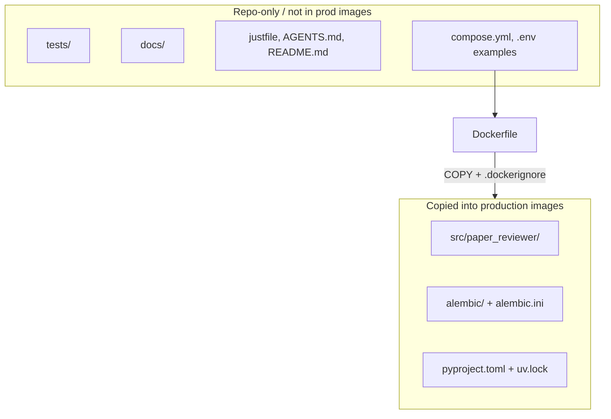

# Project structure

Agents use this document when adding packages, modules, or Docker build context. It is the single source of truth for **where code lives** and **what enters production images**.

Runtime libraries and layer boundaries: [technology-stack.md](technology-stack.md). Local Compose/`just` workflows: [local-development.md](local-development.md).

## Layout principles

- **src layout** — One installable package under `src/`. Tests and docs stay outside it so accidental imports from the working tree do not mask the installed package.
- **One package, several entrypoints** — Streamlit, Prefect workers, and migrations install the same package and differ by process command, not by separate Python projects.
- **Docker is the deploy gate** — Production images copy only runtime paths. Development files stay in the repo and are excluded via `.dockerignore`.

Package name: **`paper_reviewer`** (snake_case). Imports look like `from paper_reviewer.models import ...`.

## `pyproject.toml`

Use a **single** [`pyproject.toml`](../pyproject.toml) at the **repository root**, next to `Dockerfile`, `compose.yml`, and `uv.lock`.

| Placement | Rule |
| --- | --- |
| Repo root | **Required.** One dependency set, one `uv.lock`, one editable install of `paper_reviewer`. |
| Inside `src/` | **Forbidden.** `src/` holds importable packages only; tooling expects project metadata at the root. |
| Multiple files (workspace / multi-package) | **Not used.** Domain areas share schemas and ORM models; split only if a piece later becomes a separately versioned product. |

Domain boundaries are Python **subpackages** (`models`, `ingest`, `ui`, `flows`), not separate installable projects.

## Deploy boundary



| Category | Paths | Role |
| --- | --- | --- |
| **Runtime (deployed)** | `src/paper_reviewer/`, `alembic/`, `alembic.ini`, `pyproject.toml`, `uv.lock` | What production containers need to run the UI, flows, ingest, and migrations |
| **Build / orchestration** | `Dockerfile`, `compose.yml`, `.dockerignore`, `justfile` | Image build and local workflows on the host; not application runtime code |
| **Development-only** | `tests/`, `docs/`, `AGENTS.md`, `README.md`, seed/fixtures under `tests/` or non-copied `scripts/` | Docs, tests, and agent guidance; exclude from production images |

Production Dockerfiles copy only the runtime set. `.dockerignore` excludes `tests/`, `docs/`, `AGENTS.md`, `.git/`, and similar paths.

**Target:** one application image; multiple Compose services with different entrypoints (Streamlit, Prefect worker, Alembic migrate)—same tree, different `CMD`.

**Current Compose:** **`workspace`** (Python + uv, repo bind-mounted, unprofiled) for bootstrap/`just shell` / MCP; under Compose profile `app` (started by `just up`): **`db`** (PostgreSQL), **`migrate`** (one-shot `alembic upgrade head`), and **`ui`** (Streamlit **Paper Reviewer** UI, waits for migrate). Prefect is not defined yet—see [local-development.md](local-development.md).

## Target tree

```text
paper-reviewer/
├── src/
│   └── paper_reviewer/           # installable package (deployed)
│       ├── __init__.py
│       ├── models/               # SQLAlchemy ORM ↔ Postgres
│       │   ├── __init__.py
│       │   └── base.py           # DeclarativeBase, shared metadata
│       ├── schemas/              # shared Pydantic models
│       ├── ingest/               # dlt sources / pipelines
│       ├── ui/                   # Streamlit app entry + pages
│       ├── flows/                # Prefect flows and tasks
│       └── db/                   # engine, session, URL helpers
├── alembic/                      # migrations (deployed)
│   └── versions/
├── alembic.ini
├── tests/                        # mirrors package layout (not deployed)
│   ├── models/
│   ├── ingest/
│   ├── ui/
│   └── flows/
├── docs/
├── Dockerfile
├── .dockerignore
├── compose.yml
├── justfile
├── pyproject.toml
├── uv.lock
├── README.md
└── AGENTS.md
```

Tests live under `tests/` and mirror the package layout. Agents write those specs first when changing app behavior—see [tdd.md](tdd.md).

## Module map

Aligned with [technology-stack.md](technology-stack.md) boundaries:

| Stack piece | Package path | Owns |
| --- | --- | --- |
| SQLAlchemy ORM | `paper_reviewer.models` | Table-mapped classes only |
| Pydantic | `paper_reviewer.schemas` | Shared validated shapes (topic statement, paper, brief, dlt resources) |
| dlt | `paper_reviewer.ingest` | Source → Postgres loads |
| Streamlit | `paper_reviewer.ui` | Presentation and user interaction only |
| Prefect | `paper_reviewer.flows` | Search, ingest, and brief pipelines |
| DB plumbing | `paper_reviewer.db` | Engine/session helpers; not ORM entities |
| Alembic | repo-root `alembic/` | DDL versioning against `models` metadata |

## Naming conventions

- Repo directory: `paper-reviewer` (kebab-case)
- Import package: `paper_reviewer` (snake_case)
- Subpackages: short plural nouns for collections (`models`, `schemas`, `flows`)
- Do not use vague roots such as `src/app`, `src/code`, or nested `src/src`
