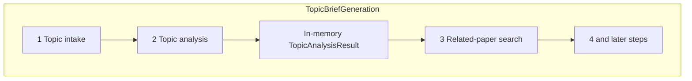

# Topic analysis

This document is the specification for step 2 of the Topic brief generation workflow in [README.md](../../README.md).

In this step, the system extracts key data from a **topic statement**. Later steps use that data to search papers and to write text.

## Glossary

| Term | Meaning |
| --- | --- |
| **`TopicFacet`** | One named slice distilled from the topic statement (`id`, `label`, `intent`, `concepts`, …). Product meaning: [README.md](../../README.md) Terminology. |
| **`TopicAnalysisResult`** | Pydantic wrapper with `facets: list[TopicFacet]` for one `TopicBriefGeneration`. |

## Topic brief generation

A **Topic brief generation** (`TopicBriefGeneration`) is one full workflow execution (product steps in [README.md](../../README.md)). This document specifies only step 2 (Topic analysis) for that `TopicBriefGeneration`.

`SearchCriteria` conversion and related-paper search orchestration are out of scope here — see [related-paper search](03-related-paper-search.md).

For the application runtime stack, see [technology-stack.md](../technology-stack.md). This step specifies scispaCy (`en_core_sci_sm`) for biomedical NER; the stack document lists that library and points here for behavior.

## Scope

### In scope (current v1)

- Analyze topic statement text (from Topic intake or an equivalent caller).
- Make a `TopicAnalysisResult` with one or more `TopicFacet` objects via scispaCy NER.
- Return that result in memory (and optionally hold it in UI session state). Do not write facet rows to the database in this slice.

### Deferred (later)

- Write each facet as a database row with a foreign key to that `TopicBriefGeneration`.
- If you analyze the same `TopicBriefGeneration` again, replace the facet rows for it.
- Domain helper `run_topic_analysis(session, TopicBriefGeneration)` that analyzes and persists.

### Out of scope

- Validation of Topic intake (step 1 of the same `TopicBriefGeneration` does that work).
- `SearchCriteria` / `source_overrides` (owned by [related-paper search](03-related-paper-search.md)).
- Other workflow steps (related-paper search, triage, paper archiving, paper briefs generation, topic brief).
- Analysis with an LLM.
- Analysis that uses a custom stopword or token heuristic as the **primary** method (fallback after empty NER may use non-stopword tokens — see Analyzer).
- Larger scispaCy models (`md`, `lg`, or specialty NER), unless a later change adopts them.
- A separate ORM table for `TopicAnalysisResult` (when persistence lands: in-memory/API aggregate of facet rows).

## Position in the workflow



1. **Topic intake** starts a `TopicBriefGeneration` and stores the `topic_statement`.
2. **Topic analysis** (this specification) reads the `topic_statement` text. It extracts concepts. It makes an in-memory `TopicAnalysisResult`. The UI may call the analyzer after intake and keep the result in session state. Facet DB rows are deferred.
3. **Related-paper search** and the later steps continue on the same `TopicBriefGeneration`. That step’s public input is a `TopicAnalysisResult` (from this step or a test fixture); see [related-paper search](03-related-paper-search.md).

## Input

| Input | Required | Description |
| --- | --- | --- |
| `topic_statement` | Yes | Free-form text that Topic intake already accepted (or equivalent non-empty text passed to the analyzer). |

The public analyzer API is `analyze_topic_statement(text, nlp=None) -> TopicAnalysisResult`. It does not take a database session. Callers that already have a `TopicBriefGeneration` pass its `topic_statement` text.

After you normalize the text, empty text or text that has only whitespace is not valid for analysis. Raise a `ValueError`.

Topic intake must reject empty statements. Topic analysis must also reject empty text after normalize.

## Analyzer: scispaCy

Use [scispaCy](https://allenai.github.io/scispacy/) with the **`en_core_sci_sm`** pipeline. That pipeline is the smallest full biomedical spaCy model.

| Rule | Behavior |
| --- | --- |
| Normalize | Remove leading and trailing whitespace. Collapse adjacent whitespace (including newlines) to a single space. Do this before NLP. |
| Model load | Load with `spacy.load("en_core_sci_sm")`. Keep the model in a process-level cache. For tests, inject an `nlp` object. |
| Primary concepts | Get unique entity surface forms from `doc.ents` in first-seen order (`ent.text`). |
| Dedupe | Compare with case-insensitive identity (for example case-fold). Keep the first surface form as written. Do not rewrite casing of the kept display string. |
| Fallback | If `doc.ents` is empty (or yields no concepts after dedupe), take non-stopword alphabetic tokens with `len >= 3`, first-seen, same case-insensitive dedupe. If that list is empty, use the whole normalized statement as the single concept. Short statements must still yield a facet with a non-empty `concepts` list. |
| Validation | Each facet must validate as a Pydantic `TopicFacet`. The collection must validate as `TopicAnalysisResult`. |

Do not use an LLM as the primary method. Do not use a custom stopword tokenizer as the primary method.

## Output: `TopicAnalysisResult`

The contract is `paper_reviewer.schemas.topic_brief_generation.topic_analysis.TopicAnalysisResult`, which holds `facets: list[TopicFacet]`. Related-paper search uses the same models.

This step makes a **`TopicAnalysisResult`**. Downstream search envelope types are owned by [related-paper search](03-related-paper-search.md).

### v1 emission rules

Always make **one or more** facets. In v1, make exactly one facet with these values:

| Field | v1 value |
| --- | --- |
| `id` | `core-concepts` |
| `label` | `Core concepts` |
| `intent` | `Narrow topical match from biomedical entities` |
| `concepts` | List that is not empty. Get the list from NER. Use the fallback if NER finds no entities. |
| `synonyms` | `[]` |
| `filters` | `{}` |
| `date_from` / `date_to` | `null` |
| `retmax` | `null` |

Do not add other facets (for example `broad-concepts`) until a later revision of this specification defines when they occur.

### Example

Topic statement: `glioblastoma immunotherapy outcomes`

This is one possible result. The entity strings can change with the model. In unit tests with an injected fake `nlp`, check for an exact `concepts` list:

```json
{
  "facets": [
    {
      "id": "core-concepts",
      "label": "Core concepts",
      "intent": "Narrow topical match from biomedical entities",
      "concepts": ["glioblastoma", "immunotherapy"],
      "synonyms": [],
      "date_from": null,
      "date_to": null,
      "filters": {},
      "retmax": null
    }
  ]
}
```

Make sure that the output validates as `TopicAnalysisResult`.

## Persistence (deferred)

Current v1 does **not** write facet rows. The analyzer returns an in-memory `TopicAnalysisResult`. The UI may store that object in session state for display and for later steps in the same browser session. Session state is not a durable source of truth.

When persistence is adopted later:

| Concern | Rule |
| --- | --- |
| Relationship | Each facet row has a foreign key to `topic_brief_generations.id`. |
| Columns | Map the Pydantic fields. Store the facet `id` as `facet_id` so it does not conflict with the primary key. Also store `label`, `intent`, `concepts`, `synonyms`, `date_from`, `date_to`, `filters`, `retmax`, row `id`, and `created_at`. |
| Round-trip | Convert between ORM and Pydantic `TopicFacet` with no loss of list or object fields. Reload rows for a `TopicBriefGeneration` into a `TopicAnalysisResult`. |
| Source of truth | After a successful analysis step, the database is the source of truth. The UI can show the data. The UI must not be the only copy. |

### Re-analysis (deferred)

When persistence is adopted: if you run Topic analysis again for the same `TopicBriefGeneration`, replace the facet rows for it. First remove the old rows. Then write the new rows. Do not add duplicate rows.

## Behavior

| Case | Expected result |
| --- | --- |
| Valid biomedical statement with entities | A `TopicAnalysisResult` with one or more facets. `concepts` is not empty. Concepts come from `ents`. |
| Valid statement with no NER hits | A `TopicAnalysisResult` with one or more facets. `concepts` come from the fallback rule. |
| Empty text or whitespace-only text | Raise a `ValueError`. Do not produce a result. |
| Second analysis of the same text (current v1) | Call the analyzer again; return a new in-memory result. No facet rows to replace. |

## Orchestration boundary

Package path for the analyzer: `paper_reviewer.topic_brief_generation.topic_analysis` — see [project-structure.md](../project-structure.md).

| Responsibility | Owner |
| --- | --- |
| Change text into a `TopicAnalysisResult` | Analyzer (`analyze_topic_statement`). Optional `nlp` injection for tests. |
| Analyze and write for a `TopicBriefGeneration` | Deferred (`run_topic_analysis` or equivalent with a database session). |
| When to start analysis | After a successful Topic intake. The UI may call the analyzer and hold the result in session state. Keep intake tests and analysis tests separate. |
| Related-paper search / `SearchCriteria` | [related-paper search](03-related-paper-search.md) |

## Testability

- Inject a fake spaCy `nlp` that returns controlled `ents` and tokens. Use this for unit tests that must be deterministic. Those tests do not need a model download.
- Do not require a real-model integration test in the normal suite for this slice.
- Persistence / reload / re-analysis tests are deferred until facet rows exist.
- Related-paper search tests inject a `TopicAnalysisResult` and do not need this step’s analyzer — see [related-paper search](03-related-paper-search.md).

## Non-goals (v1)

Do not do this work in v1:

- Persist facet rows or implement `run_topic_analysis`.
- Make PubMed `source_overrides` or MeSH-specific markup (see [paper-sources/pubmed.md](paper-sources/pubmed.md)).
- Orchestrate analysis with Prefect.
- Use specialty NER models (for example `en_ner_bc5cdr_md`).
- Use facet ids other than `core-concepts`.
