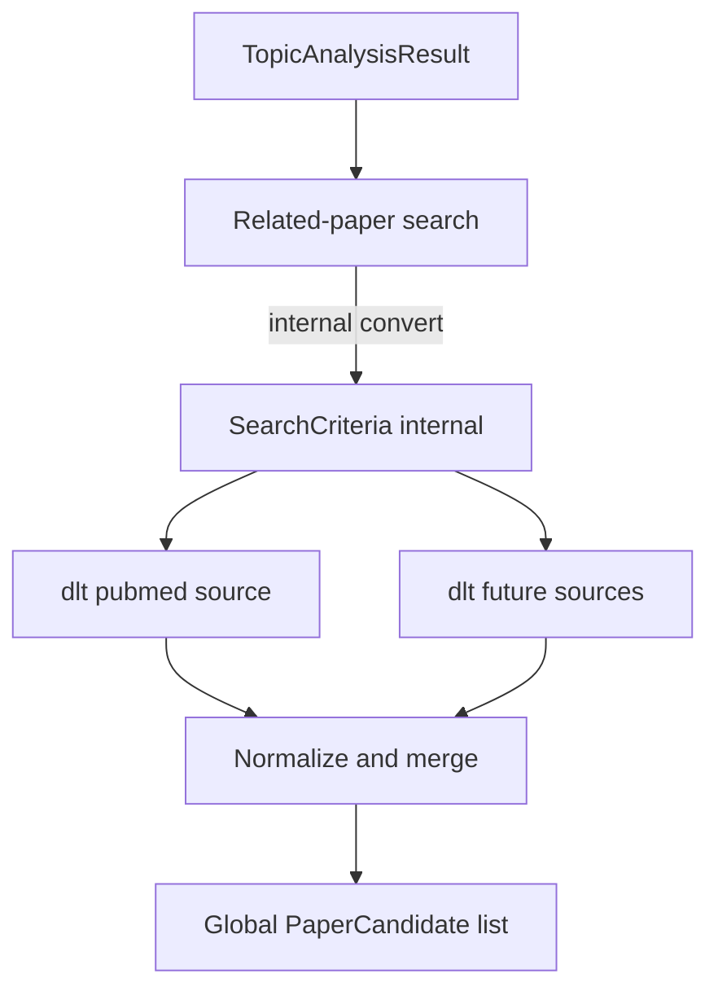

# Related-paper search

Ingest step from [README.md](../../README.md) **Paper ingestion**: search registered **paper sources** for related papers and produce a global list of **paper candidates** for [Retrieval triage](04-retrieval-triage.md) (and then [Paper archiving](05-paper-archiving.md)).

Entry is the [Paper ingestion](2-paper-ingestion.md) landing, not Topic analysis. Facets come from the current `TopicScope` (database) — [Topic analysis](1.2-topic-analysis.md).

Paper-source-specific search criteria and API mapping live under [paper-sources/](paper-sources/). This document owns orchestration and the Related-paper search Streamlit page.

Stack context: [technology-stack.md](../technology-stack.md) (dlt extract + Pydantic; Prefect runs source-record / full-text / brief jobs in Compose — not this search step). Package paths: `paper_reviewer.ingest` (sources), `paper_reviewer.topic_brief_generation.related_paper_search` (orchestration / merge) — see [project-structure.md](../project-structure.md).

## Scope


| In scope                                                                           | Out of scope                                                                |
| ---------------------------------------------------------------------------------- | --------------------------------------------------------------------------- |
| Accept `TopicAnalysisResult` from [Topic analysis](1.2-topic-analysis.md) (DB facet rows, or a test fixture) | Generating facets in Topic analysis (see that spec)          |
| Convert internally to `SearchCriteria` when needed (keep the type; optional `source_overrides`) | [Paper archiving](05-paper-archiving.md) and later ingest steps |
| Run extract via **dlt** for each registered paper source                           | [Fulfill papers metadata](06-fulfill-papers-metadata.md) (EFetch / PMC Cloud) or [Generate paper brief](07-generate-paper-brief.md) (creates **paper brief** results) |
| Map each source hit to `PaperCandidate` and merge into one global list             | Adding new paper sources beyond registering them here                       |
| Fail-soft when one source errors                                                   | Loading candidates into Postgres as `Paper` rows ([Paper archiving](05-paper-archiving.md) owns that) |


### `PaperCandidate` shape

Every paper source must map its API hit into a shared `PaperCandidate` with two concerns kept distinct. This document owns the candidate contract; each [paper-sources/](paper-sources/) doc only maps its API fields onto these names.

**Source fetch handle** (required for later steps)


| Field        | Description                                                                |
| ------------ | -------------------------------------------------------------------------- |
| `source_id`  | Paper source id (e.g. `pubmed`)                                            |
| `source_uid` | That source’s stable record id (e.g. PMID)                                                  |
| `doi`        | Required on every candidate that reaches triage / archiving. Preferred cross-source merge key. ISO 26324 case-insensitive: merge **drops** missing/blank DOIs, then stores and compares the kept value as strip + uppercase. Raw source maps may still emit a missing DOI. |


Each [paper-sources/](paper-sources/) doc must state how `(source_id, source_uid)` (and DOI if needed) are used to fetch fuller records later. This workflow does **not** perform that fetch.

**Summary** (for triage only)


| Field            | Description                                                                                              |
| ---------------- | -------------------------------------------------------------------------------------------------------- |
| `title`          | Title                                                                                                    |
| `authors`        | List of author names                                                                                     |
| `journal`        | Journal or venue                                                                                         |
| `published_year` | Publication year when available                                                                          |
| `url`            | Canonical link on the source (e.g. PubMed URL)                                                           |
| `snippet`        | Optional short text only if the search API already returns it — not a substitute for paper-brief content |


**Provenance**


| Field             | Description                                      |
| ----------------- | ------------------------------------------------ |
| `facet_id`        | Which topic facet produced the hit               |
| `raw_payload_ref` | Optional audit pointer to the raw source payload |


## Input: `TopicAnalysisResult`

Public input for this workflow step (and for `paper_reviewer.topic_brief_generation.related_paper_search` on the normal app path): a `TopicAnalysisResult` from [Topic analysis](1.2-topic-analysis.md) (facet rows reloaded for the current `TopicScope`, or a test fixture). Facet field rules and persistence stay in that spec.

Keep the `SearchCriteria` type. This workflow converts `TopicAnalysisResult` → `SearchCriteria` as an **internal step** when it needs the search envelope (facets plus optional `source_overrides`). Callers do not have to build `SearchCriteria` first.

| Public input | Required | Description |
| --- | --- | --- |
| `TopicAnalysisResult` | Yes | Facets from Topic analysis (or a test fixture). |
| `source_overrides` | No | Optional map `source_id` → opaque payload defined by that source’s spec. Folded into `SearchCriteria` during the internal convert (fixtures / power paths). v1 default when omitted: `{}`. |

Public input shape for the normal path: the `TopicAnalysisResult` emission owned by [Topic analysis](1.2-topic-analysis.md) (v1 sets `synonyms` to `[]`, dates/`retmax` to null, and empty `filters`). Do not copy that JSON here.

### Internal conversion (`TopicAnalysisResult` → `SearchCriteria`)

| Concern | Rule |
| --- | --- |
| Owner | This workflow (`paper_reviewer.topic_brief_generation.related_paper_search`). |
| When | Internally, before running registered paper-source adapters. |
| How | Build `SearchCriteria(topic_analysis=…, source_overrides=…)` (default empty overrides). |
| Keep | `SearchCriteria` remains the envelope used with source runners and for tests that need `source_overrides`. |
| Not owned here | Facet generation / persistence ([Topic analysis](1.2-topic-analysis.md)); Entrez compilation ([paper-sources/pubmed.md](paper-sources/pubmed.md)). |

After conversion, the workflow passes each facet (plus any matching override) into each registered source adapter. Compilation to a concrete API query is defined only in the source’s paper-sources doc.

Illustrative internal `SearchCriteria` after conversion with empty overrides (fixture-style facets, not Topic analysis v1 emission):

```json
{
  "topic_analysis": {
    "facets": [
      {
        "id": "fixture-narrow",
        "label": "Fixture narrow",
        "concepts": ["CRISPR", "base editing"],
        "retmax": 20
      }
    ]
  },
  "source_overrides": {}
}
```

For a PubMed `raw_term` override payload, see [paper-sources/pubmed.md](paper-sources/pubmed.md) (Hybrid override). Do not define Entrez strings in this file.
## Paper source registry


| `source_id` | Spec                                               | Status              |
| ----------- | -------------------------------------------------- | ------------------- |
| `pubmed`    | [paper-sources/pubmed.md](paper-sources/pubmed.md) | First / only source |


To add a source later: add `docs/specs/paper-sources/<source-id>.md`, register a row here, and implement a dlt source under `paper_reviewer.ingest` that yields `PaperCandidate`-shaped records. Do not put source-API details in this file.

## Extraction with dlt

Per [technology-stack.md](../technology-stack.md):

- Each paper source is a **dlt source/resource** under `paper_reviewer.ingest` (e.g. PubMed).
- Resources **yield** `PaperCandidate`-shaped records (Pydantic models in `paper_reviewer.schemas`). This step does **not** load candidates into Postgres.
- `paper_reviewer.topic_brief_generation.related_paper_search` accepts a `TopicAnalysisResult`, converts internally to `SearchCriteria` when needed, runs registered sources, and **merges** results into one global list (see merge rules below).
- Prefect may later schedule these extracts; orchestration ownership stays in this workflow. Prefect Compose services today own source-record / full-text / brief jobs ([06-fulfill-papers-metadata.md](06-fulfill-papers-metadata.md)), not related-paper search.
- The contract to [Retrieval triage](04-retrieval-triage.md) is the global `PaperCandidate` list (plus `source_runs` metadata). Triage v1 does not add filters; it retains every candidate after user confirm. Paper archiving consumes triage’s `retained` list.




## Merge and normalize

1. Map every source row to `PaperCandidate` (fields above).
2. **Drop** any candidate whose `doi` is missing or blank after strip. Triage and [Paper archiving](05-paper-archiving.md) never see no-DOI hits.
3. Dedupe within the remaining global list by **uppercase DOI** (strip then `.upper()`). Rewrite each kept candidate’s `doi` to that uppercase form. Do not fall back to `(source_id, source_uid)` for merge identity once DOI is required on kept rows.
4. When merging duplicates, keep one canonical candidate; retain provenance that multiple facets/sources hit the same paper when useful for triage metadata (implementation detail).
5. Tag each candidate with `facet_id` and `source_id`.


## Output


| Output          | Description                                                                 |
| --------------- | --------------------------------------------------------------------------- |
| `candidates`    | Global list of `PaperCandidate`                                             |
| `source_runs[]` | Per source: `source_id`, `status` (`ok` / `error` / `empty`), `hit_count`, `facet_ids`, `error` if any |


Primary deliverable for [Retrieval triage](04-retrieval-triage.md): `candidates`. `source_runs` supports debugging and UI status. Paper archiving receives the retained set from triage, not this list directly.

## Behavior


| Case                                       | Expected                                                                                         |
| ------------------------------------------ | ------------------------------------------------------------------------------------------------ |
| Empty `facets`                             | Allowed for injected/test analysis: empty `candidates` and a note that there are no facets. The normal path expects Topic analysis output (one or more facets). |
| Facet yields zero hits from a source       | That facet contributes nothing; other facets/sources continue                                    |
| Hit without DOI (missing/blank)            | Dropped during merge; not present in `candidates`                                              |
| Source failure (network, rate limit, auth) | **Fail-soft**: other sources still contribute; `source_runs` records the error                   |
| `retmax` truncates                         | Candidates limited accordingly                                                                   |
| All hits lack DOI                          | Empty `candidates` ([Retrieval triage](04-retrieval-triage.md) may confirm an empty retained set; Paper archiving is then skipped or gets empty success) |


## Streamlit UI (v1)

Dedicated page module: `paper_reviewer.ui.related_paper_search` with `render_related_paper_search()`.

Register in `paper_reviewer.ui.navigation`:

| Property | Value |
| --- | --- |
| `key` | `related_paper_search` |
| `title` | Related-paper search |
| `url_path` | `related-paper-search` |
| `in_sidebar` | false ([ui-style.md](../ui-style.md)) |

Entry: [Paper ingestion](2-paper-ingestion.md) page_link. Do **not** auto-run this page from Topic analysis.

Show the Paper ingestion phase header (intro + stepper) on this page: [Paper ingestion](2-paper-ingestion.md#phase-header-landing-and-ingest-steps).

### Page behavior

1. **Prerequisites** — Require `topic_scope_key` in the URL ([ui-style.md](../ui-style.md#topic-scope-key-in-the-url)). Load facet rows for that `TopicScope` as `TopicAnalysisResult` (database is the source of truth; do not require session analysis).
2. **Guard** — Missing key, missing scope, or no facet rows: message and page_links to **Topic analysis** and **Topic scope**. Do not run search.
3. **Auto-run** — When prerequisites exist and `related_paper_search_result` is **not** in session: call `search_related_papers` with a spinner; store the result in session. Fail-soft `source_runs` as in Behavior. Candidates stay **session-only** (no candidate table).
4. **Cached visit** — If `related_paper_search_result` is already in session, show it; do not search again.
5. **Display** — Per-source `source_runs` status; candidate count. Do not use this page as the full triage list.
6. **Exit** — After a result exists: `st.page_link` to **Retrieval triage** (pass `topic_scope_key`). Do not confirm triage here.

Invalidate the session search cache when Topic intake Submit wipes the session — [Fulfill papers metadata](06-fulfill-papers-metadata.md).

## Testability

- Inject a `TopicAnalysisResult` JSON fixture into related-paper search without running Topic analysis.
- UI slice: page registered with key `related_paper_search`, title **Related-paper search**, `url_path` `related-paper-search`, `in_sidebar` false.
- Assert the workflow converts that result to `SearchCriteria` internally (empty `source_overrides` by default) before source runners run.
- For deterministic PubMed tests, pass optional `source_overrides.pubmed` (see [paper-sources/pubmed.md](paper-sources/pubmed.md)) so conversion yields a known Entrez `term`.
- Assert on `PaperCandidate` fields and merge behavior with multi-source fixtures when additional sources exist.
- Assert merge drops missing/blank DOI hits, rewrites kept `doi` to uppercase, and dedupes by that form.


## Example fixture (manual injection)

Injected `TopicAnalysisResult` for tests — not produced by Topic analysis v1:

```json
{
  "facets": [
    {
      "id": "fixture-narrow",
      "label": "Fixture narrow",
      "concepts": ["CRISPR", "base editing"],
      "retmax": 20
    }
  ]
}
```

With only PubMed registered, the workflow converts this to `SearchCriteria` (empty overrides), runs the PubMed adapter’s structured compilation for `fixture-narrow`, and returns a global candidate list from that source alone.
