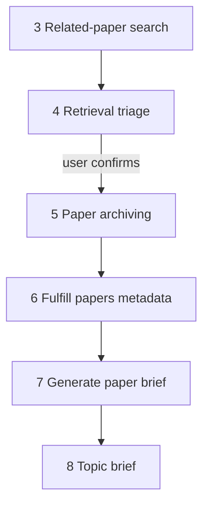

# Retrieval triage

This document is the specification for step 4 of the Topic brief generation workflow in [README.md](../../README.md).

In this step, the system presents **paper candidates** from [related-paper search](03-related-paper-search.md) for human review. The user confirms the set that continues to [Paper archiving](05-paper-archiving.md). In v1 every search candidate is retained; the step is a review gate with an explicit confirm action, not a filter.

## Glossary

| Term | Meaning |
| --- | --- |
| **`PaperCandidate`** | In-memory search hit from [related-paper search](03-related-paper-search.md). Shape owned by that spec. |
| **Retrieval triage** | Workflow step that reviews search candidates and produces a retained set for Paper archiving. |
| **Retained candidates** | The `list[PaperCandidate]` passed to Paper archiving after the user confirms triage. |

## Topic brief generation

A **Topic brief generation** is the four-phase workflow in [README.md](../../README.md), run on one `TopicScope`. This document specifies Retrieval triage on the **Paper ingestion** path for that scope. Local Paper search as a separate phase is a later landing — [Paper search](3-paper-search.md).

Paper archiving, **Fulfill papers metadata**, **Generate paper brief** (and its **paper brief** results), and topic brief drafting are out of scope here — see [Paper archiving](05-paper-archiving.md), [Fulfill papers metadata](06-fulfill-papers-metadata.md), [Generate paper brief](07-generate-paper-brief.md), and the later steps in the README.

For the application runtime stack, see [technology-stack.md](../technology-stack.md).

## Scope

### In scope (current v1)

- Accept the output of related-paper search for one `TopicScope`.
- Present candidates for human review (title, authors, journal, year, url, source handle, facet).
- Require an explicit user action (button) to confirm and produce the retained set.
- Return a structured result for the orchestrator / next step.
- Pass through every input candidate unchanged (order preserved).

### Out of scope (v1)

- Per-paper manual discard or inclusion toggles (deferred to a later revision).
- DOI validation or rejection (owned by [related-paper search merge](03-related-paper-search.md); Paper archiving also skips blank DOI as defense-in-depth).
- Running Paper archiving on this page (owned by the dedicated [Paper archiving](05-paper-archiving.md) page).
- Creating **paper briefs** ([Generate paper brief](07-generate-paper-brief.md)) or topic brief construction.
- Persisting triage decisions to Postgres.
- Re-running related-paper search from the triage page.

## Position in the workflow



1. **Related-paper search** produces a global `PaperCandidate` list (hits without DOI are already dropped; see that spec) plus `source_runs` metadata.
2. **Retrieval triage** (this specification) presents those candidates and waits for an explicit confirm. v1 retains every candidate.
3. **Paper archiving** receives `RetrievalTriageResult.retained` and creates or reuses `Paper` records.
4. **Fulfill papers metadata**, **Generate paper brief**, and **Topic brief** continue on archived papers — see [Fulfill papers metadata](06-fulfill-papers-metadata.md) and [Generate paper brief](07-generate-paper-brief.md).

Related-paper search runs on its own page (`paper_reviewer.ui.related_paper_search`), reached from [Paper ingestion](2-paper-ingestion.md). This step owns a **dedicated Streamlit page** for review and confirm. After search succeeds, that search page links to triage.

## Input

| Input | Required | Description |
| --- | --- | --- |
| `search_result` | Yes | `RelatedPaperSearchResult` from [related-paper search](03-related-paper-search.md): `candidates`, `source_runs`, optional `notes`. |
| `topic_scope_key` | Yes (UI) | Key of the current `TopicScope` from the **URL query** ([ui-style.md](../ui-style.md#topic-scope-key-in-the-url)). Not an argument of the pure confirm function. |

`PaperCandidate` shape is owned by [related-paper search](03-related-paper-search.md). This step does not redefine it.

An empty `candidates` list is valid input.

## Public API

Package path: `paper_reviewer.topic_brief_generation.retrieval_triage` — see [project-structure.md](../project-structure.md).

```text
confirm_retrieval_triage(search_result: RelatedPaperSearchResult) -> RetrievalTriageResult
```

| Rule | Behavior |
| --- | --- |
| Pure function | No database session. Caller owns later archiving commit. |
| Idempotent | Same input yields the same `retained` list. Safe to call again after confirm. |
| Empty candidates | Return `retained=[]`, `rejected=[]`. Do not raise. |
| Raise | Raise only on invalid input shape (Pydantic). |

Pydantic types live under `paper_reviewer.schemas.topic_brief_generation.retrieval_triage`.

### Output

```text
RetrievalTriageResult
  retained: list[PaperCandidate]
  rejected: list[TriageRejection]
  confirmed_at: datetime | None
```

| Field | Description |
| --- | --- |
| `retained` | Candidates that continue to Paper archiving. |
| `rejected` | Candidates the user discarded. Reserved for future manual discard. |
| `confirmed_at` | Set when the user confirms via the UI. Null for programmatic / test pass-through. |

| v1 rule | Behavior |
| --- | --- |
| `retained` | Copy of all input `candidates`, preserving order (pass-through; same papers as search). |
| `rejected` | Always `[]`. |
| Empty input | `retained=[]`; UI still allows confirm (Paper archiving becomes a no-op success). |

Paper archiving still reads only `retained`, not the raw search list.

`TriageRejection` shape (when implemented for a later revision): enough identity to debug (`source_id`, `source_uid`, `doi` when known) plus a reason. Not used in v1.

## Streamlit UI

Dedicated page module: `paper_reviewer.ui.retrieval_triage`.

Register in `paper_reviewer.ui.navigation`:

| Property | Value |
| --- | --- |
| `key` | `retrieval_triage` |
| `title` | Retrieval triage |
| `url_path` | `retrieval-triage` |
| `in_sidebar` | false ([ui-style.md](../ui-style.md)) |

### Page behavior (v1)

1. **Prerequisites** — Require:
   - `topic_scope_key` in the **URL query** ([ui-style.md](../ui-style.md#topic-scope-key-in-the-url))
   - `related_paper_search_result` in Streamlit session state from **Related-paper search**
   - If either is missing: show a message and page_links to **Topic intake**, **Topic scope**, and **Related-paper search**; do not render the confirm button. In-workflow links must preserve the query id when present.
2. **Context header** — Show the Topic scope reference id (from the URL) and an optional topic statement snippet from session.
3. **Source runs** — Show per-source status from `search_result.source_runs` (same pattern as Related-paper search). Implementation may later extract a shared display helper.
4. **Candidate list** — One block per `PaperCandidate`: title (linked via `url`), authors, journal, year, `source_uid`, `facet_id`, and DOI when present.
5. **Counts** — Show how many papers will continue (e.g. “N papers to archive”).
6. **Confirm button (primary)** — Mutating control per [ui-style.md](../ui-style.md). Label names the confirm action (e.g. **Confirm for paper archiving**), not the next page. Exact copy left to implementation.
   - On click: call `confirm_retrieval_triage(search_result)`; store `RetrievalTriageResult` in session (`retrieval_triage_result`); clear `paper_archiving_result` **and all later-step session caches** (fulfill enqueue, generate-brief enqueue when present, …) so Paper archiving and downstream steps re-run on the latest retained set — cascade rule in [Fulfill papers metadata](06-fulfill-papers-metadata.md) (re-run step N → clear steps N+1…). Show a short success message and a separate `st.page_link` to the **Paper archiving** page (navigate only; pass the Topic scope id in `query_params`). Do **not** call `archive_papers` on this page.
7. **Empty candidates** — Still show source-run diagnostics; keep the confirm button enabled (archiving is a no-op). Caption explains that search returned no retainable papers.

### Related-paper search handoff

After related-paper search succeeds on the **Related-paper search** page (`paper_reviewer.ui.related_paper_search`):

- Do not keep the full candidate list as the primary triage surface on the search page.
- Show a summary and an `st.page_link` to the **Retrieval triage** page as the required next step (pass the Topic scope id in `query_params`; see [ui-style.md](../ui-style.md#topic-scope-key-in-the-url)).

Persistence for v1 is Streamlit session state for search / triage caches, plus the Topic scope key in the URL. No triage DB tables.

## Orchestration boundary

| Responsibility | Owner |
| --- | --- |
| Search, merge, drop no-DOI hits at merge | [related-paper search](03-related-paper-search.md) |
| User review + confirm gate; produce `retained` | Retrieval triage (this specification) |
| Create or reuse `Paper` rows from `retained` | [Paper archiving](05-paper-archiving.md) |
| `PaperCandidate` field shape | [related-paper search](03-related-paper-search.md) |
| Pydantic `RetrievalTriageResult` / confirm API | `paper_reviewer.schemas` / `paper_reviewer.topic_brief_generation.retrieval_triage` |
| Streamlit page and navigation | `paper_reviewer.ui` |

Paper archiving input is **`RetrievalTriageResult.retained`**, not the raw search list.

## Behavior

| Case | Expected |
| --- | --- |
| Search returned N candidates | Triage retains all N; UI lists all N. |
| Search returned 0 candidates | `retained=[]`; confirm allowed; Paper archiving empty success. |
| User opens triage without prior search | Guard message; page_links to Topic intake, Topic scope, and Related-paper search; no confirm button. |
| User confirms twice | Replace session triage result; clear `paper_archiving_result` and all later-step session caches so Paper archiving and downstream steps re-run on the latest retained set. |
| Search had source errors (fail-soft) | Show `source_runs` errors; retain whatever candidates search produced. |

## Testability

- `confirm_retrieval_triage` with a fixture `RelatedPaperSearchResult` → `retained` equals input `candidates`, `rejected=[]`.
- Empty `candidates` → empty `retained`, no raise.
- Optional UI tests: page guard without session keys; confirm button stores triage result (mirror patterns under `tests/ui/` when present).

## Non-goals (v1)

Do not do this work in the Retrieval triage v1 slice:

- Manual per-paper discard UI.
- DOI rejection or re-validation in triage.
- DB persistence of triage outcomes.
- Calling `archive_papers` or showing full Paper archiving results (owned by [Paper archiving](05-paper-archiving.md)).
- Re-running related-paper search from the triage page.
