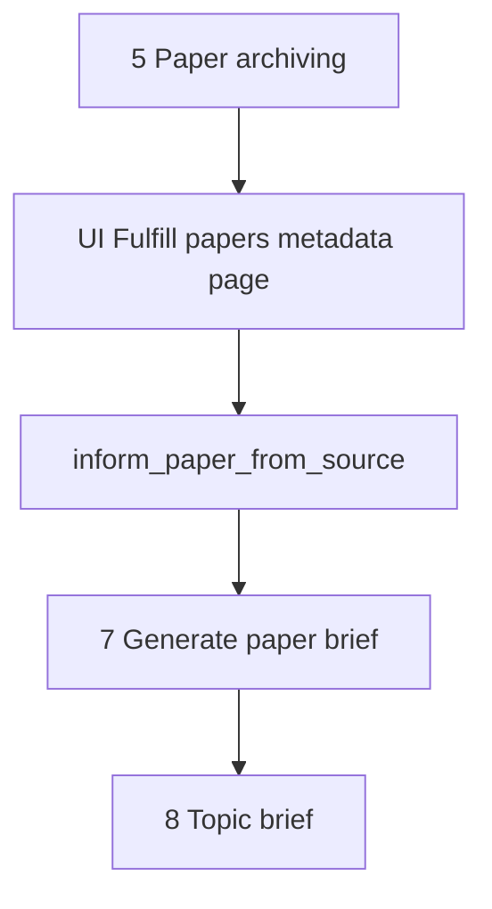

# Fulfill papers metadata

This document is the specification for **step 6** of the Topic brief generation workflow in [README.md](../../README.md).

In this step, the system fully informs each archived **`Paper`** from its paper source (for PubMed: EFetch). An idempotent Prefect job owns that work. A dedicated Streamlit page shows progress.

**Next step:** [Generate paper brief](07-generate-paper-brief.md) creates **paper brief** results from source-informed papers. Do not draft briefs in this step.

## Glossary

| Term | Meaning |
| --- | --- |
| **`Paper`** | Durable bibliographic record. Product meaning: [README.md](../../README.md) Terminology. Public id is the uppercase DOI. Created or reused in [Paper archiving](05-paper-archiving.md). |
| **Source-informed** | Durable state on a `Paper`: the row holds the fuller source record for that paper. Marker: `source_informed_at` (non-null). Global to the `Paper`, not per generation. |
| **`inform_paper_from_source`** | Prefect job that fetches the fuller source record and writes it onto `Paper`, then sets `source_informed_at`. |
| **Fulfill papers metadata** | Workflow **step** (this document) that enqueues and tracks inform jobs for archived papers that are not yet source-informed. |

## Topic brief generation

A **Topic brief generation** (`TopicBriefGeneration`) is one full workflow execution (product steps in [README.md](../../README.md)). This document specifies only step 6 (**Fulfill papers metadata**) for that run.

Paper archiving (create/reuse `Paper` without EFetch) is owned by [Paper archiving](05-paper-archiving.md). PubMed EFetch request parameters and XML field ownership for this step are summarized here and detailed for PubMed in [paper-sources/pubmed.md](paper-sources/pubmed.md).

For the application runtime stack (including Prefect as **planned** in Compose), see [technology-stack.md](../technology-stack.md). This specification is the orchestration **contract** even when Prefect is not yet running locally.

## Scope

### In scope (current v1)

- Take archived `Paper` records from [Paper archiving](05-paper-archiving.md) (`PaperArchivingResult.papers`) for the current generation.
- For each paper that is **not** yet source-informed (`source_informed_at` is null): enqueue `inform_paper_from_source`.
- Extend `Paper` with durable EFetch-derived fields (groups below) and `source_informed_at`.
- Optionally store a durable per-paper inform error message on `Paper` when inform fails (cleared on later success).
- Run the inform job as an **idempotent** Prefect flow/task by default (no-op success when already source-informed).
- Dedicated Streamlit page that enqueues inform work and shows progress.

### Out of scope (v1)

- [Paper archiving](05-paper-archiving.md) create/reuse rules or its UI.
- Creating **paper briefs** (`PaperBrief`) or running `create_paper_brief` — owned by [Generate paper brief](07-generate-paper-brief.md).
- Topic brief drafting (step 8).
- Rich author entities, affiliations, ORCID, or author↔paper graphs (future job; see [Future work](#future-work)).
- Storing EFetch article ID lists beyond the existing DOI + `(source_id, source_uid)` handle, CommentsCorrections, bibliography/references, or deferred “Other” XML elements (see below).
- Updating bibliographic identity fields that archiving already set (`doi`, `source_id`, `source_uid`, `url`) during inform, except where this spec says to refresh allowed bibliographic columns from the fuller record.
- Full-text PDF/HTML fetch.
- Non-idempotent “force refresh” of EFetch (none in v1).
- Adding Prefect services to Compose (infra; see [local-development.md](../local-development.md)).

## Position in the workflow



1. **Paper archiving** yields `PaperArchivingResult.papers` (create or reuse).
2. **Fulfill papers metadata** (this specification) ensures each archived paper is source-informed via `inform_paper_from_source`.
3. **Generate paper brief** drafts `PaperBrief` rows from source-informed papers — see [Generate paper brief](07-generate-paper-brief.md).
4. **Topic brief** consumes ready `PaperBrief` rows.

## Selection rules

| Input | Role |
| --- | --- |
| `paper_archiving_result.papers` | Candidate set for this generation’s inform work (session / UI). |

For each `Paper` in that set (first-seen order):

| Condition | Action |
| --- | --- |
| `source_informed_at` is set | Skip inform (idempotent). Show as done on the UI. |
| `source_informed_at` is null, durable inform error set | Do not auto-retry in v1 unless the implementation defines a safe re-enqueue; UI shows `failed`. |
| `source_informed_at` is null, no durable inform error | Enqueue `inform_paper_from_source`. |

Empty `papers` → no jobs; UI shows an empty success caption.

## Public API and Prefect entrypoints

Domain package (when implemented): `paper_reviewer.topic_brief_generation.fulfill_papers_metadata` — see [project-structure.md](../project-structure.md).

Prefect flows (when implemented): `paper_reviewer.flows` (names are the contract):

```text
inform_paper_from_source(paper_id) -> InformPaperFromSourceResult
enqueue_fulfill_papers_metadata(paper_ids) -> FulfillPapersMetadataEnqueueResult
```

| Entrypoint | Role |
| --- | --- |
| `inform_paper_from_source` | Load `Paper` by id; if already source-informed, return no-op success. Else fetch fuller source record, map fields, set `source_informed_at`, clear any inform error, commit (flow owns persistence for the job). |
| `enqueue_fulfill_papers_metadata` | UI/orchestrator helper: apply selection rules and submit Prefect runs for the paper id list. Idempotent with respect to already-informed papers. |

| Rule | Behavior |
| --- | --- |
| Idempotent by default | Same inputs after success do not re-fetch. No force-refresh flag in v1. |
| Fail-soft per paper | One paper failure must not cancel other papers’ runs. |
| Raise | Raise only for unusable infrastructure (DB down, Prefect submit impossible). Per-paper source errors become durable inform failure + error message. |

Pydantic types live under `paper_reviewer.schemas.topic_brief_generation.fulfill_papers_metadata` (when implemented).

## Durable `Paper` extensions (source-informed)

Archiving fields remain as in [Paper archiving](05-paper-archiving.md). This step **adds** durable columns (or JSONB groups) populated only by `inform_paper_from_source`.

### Marker and inform error

| Field | Required | Description |
| --- | --- | --- |
| `source_informed_at` | No until informed | Timezone-aware timestamp when inform succeeded. Null = not yet source-informed. |
| `source_inform_error_message` | No | Set when the latest inform attempt failed; cleared when inform succeeds. Null when not failed. |

Once `source_informed_at` is set, later `inform_paper_from_source` calls are no-op success and must **not** overwrite fields in v1.

### EFetch-derived groups (v1 store)

Implementation may use typed columns and/or JSONB; the **logical** contract is:

| Group | Store |
| --- | --- |
| **Abstract** | Abstract text parts (preserve section labels when present, e.g. BACKGROUND / METHODS); abstract copyright when present; `OtherAbstract` when present |
| **Dates** | Journal `PubDate` (year/month/day as available); `ArticleDate` (electronic); Medline `DateCompleted` / `DateRevised`; PubmedData `History` entries by `PubStatus` |
| **Journal detail** | ISSN; volume; issue; pagination / Medline page range; ISO abbreviation; MedlineTA; country; NlmUniqueID; ISSNLinking |
| **Types / language** | Publication types; language(s); Article `PubModel`; MedlineCitation `Status` / `Owner` |
| **Indexing** | MeSH headings (descriptor, qualifiers when present, major-topic flag); keywords; chemicals; SupplMesh; CitationSubset values |
| **Funding** | Grant list; databank list |
| **COI / notes** | Conflict-of-interest statement; general notes |

Allowed refresh of existing bibliographic display fields when informing (optional, same job, still only when `source_informed_at` was null): `title`, `authors` (flat `list[str]` only), `journal`, `published_year` from the fuller record when present. Do **not** change `doi`, `source_id`, `source_uid`, or `url` in v1 inform.

### Explicitly not stored on `Paper` in v1

| EFetch content | Reason |
| --- | --- |
| `ArticleIdList` / PMC / `OtherID` (beyond DOI + PMID handle) | Deferred; identity already on `Paper` |
| `CommentsCorrectionsList` | Deferred |
| Full bibliography / cited references | Not reliable in standard PubMed EFetch; deferred |
| Rich authors (structured names, affiliations, ORCID) | Future author-entity job |
| `VernacularTitle`, `InvestigatorList`, `GeneSymbolList`, `PersonalNameSubjectList`, `SpaceFlightMission` | Deferred “Other” elements (examples below) |

### Deferred “Other” elements (examples)

| Element | Example meaning |
| --- | --- |
| `VernacularTitle` | Non-English original title, e.g. `¿Cómo hablo con mi familia sobre Gaucher?` |
| `InvestigatorList` | Named collaborators under a collective author (e.g. Carlsson C, Cecchi F) |
| `GeneSymbolList` | Gene symbols on the citation (e.g. `pyrB`, `Ghox-lab`) |
| `PersonalNameSubjectList` | People who are the *subject* of the paper (e.g. Darwin, Hume) |
| `SpaceFlightMission` | Legacy NASA mission tags (e.g. `Project Gemini 11`); NLM stopped adding these in 2005 |

PubMed call shape for inform: see [paper-sources/pubmed.md](paper-sources/pubmed.md) (EFetch section).

## Prefect job behavior

### `inform_paper_from_source`

| Case | Expected |
| --- | --- |
| `source_informed_at` already set | No-op success; do not call EFetch; do not change fields. |
| Not informed, PubMed `source_id` | EFetch XML; map groups; set fields; set `source_informed_at`; clear `source_inform_error_message`. |
| Not informed, unsupported `source_id` | Fail that paper (`source_inform_error_message` + message); do not set `source_informed_at`. |
| EFetch / parse / DB error | Fail that paper; leave `source_informed_at` null; set `source_inform_error_message`. |

### Idempotency policy

The Prefect job in this step is **idempotent by default**. Any future non-idempotent override (force re-fetch) must be an explicit, documented exception. v1 has none.

## Streamlit UI (v1)

Dedicated page module (when implemented): `paper_reviewer.ui.fulfill_papers_metadata` with `render_fulfill_papers_metadata()`.

Register in `paper_reviewer.ui.navigation` (`build_app_pages()`):

| Property | Value |
| --- | --- |
| `key` | `fulfill_papers_metadata` |
| `title` | Fulfill papers metadata |
| `url_path` | `fulfill-papers-metadata` |

Streamlit is presentation only ([technology-stack.md](../technology-stack.md)). Heavy work runs in Prefect; the page enqueues, polls durable status, and displays progress.

### Session keys

| Key | Type | Role |
| --- | --- |
| `paper_archiving_result` | `PaperArchivingResult` | Required prerequisite. Papers = `papers`. |
| `topic_brief_generation_public_id` | `uuid.UUID` | Required generation reference for display / navigation. |
| `fulfill_papers_metadata_enqueue_result` | `FulfillPapersMetadataEnqueueResult` | Optional cache that enqueue was submitted for this session. |

**Invalidate on new intake:** Clear `fulfill_papers_metadata_enqueue_result` (and any page-local progress cache) when Topic intake starts a new generation.

**Invalidate when archiving re-runs:** When `paper_archiving_result` is cleared and later replaced, clear `fulfill_papers_metadata_enqueue_result` so this page can enqueue for the new archived set.

### Page behavior

1. If `paper_archiving_result` or `topic_brief_generation_public_id` is missing → empty state; links to **Paper archiving** and **New Topic brief**.
2. If `papers` is empty → caption that there are no archived papers; do not enqueue.
3. On first visit with prerequisites and no enqueue cache → call `enqueue_fulfill_papers_metadata` for the archived paper ids; store enqueue result in session.
4. While any paper is not terminal (source-informed or failed), refresh/poll durable signals (auto-refresh or explicit refresh control is an implementation detail; progress must be visible).
5. Primary surface: **progress table/list** — title (link via `url`), DOI, inform state, short error when failed.
6. When all papers are source-informed (or the set is empty), show success summary and link to **Generate paper brief**.

Do **not** run EFetch inside Streamlit callbacks.

### Progress display labels

| Durable signal | Display |
| --- | --- |
| Enqueued / in progress, `source_informed_at` null, no error | Fulfilling from source |
| `source_informed_at` set | Fulfilled |
| `source_inform_error_message` set, `source_informed_at` null | Failed |
| Already informed before enqueue | Skipped (already done) |

## Workflow navigation

- **Entry:** After Paper archiving shows a result, link to **Fulfill papers metadata** with `paper_archiving_result` and generation id in session.
- **Sidebar order:** … → Paper archiving → Fulfill papers metadata → Generate paper brief → (Topic brief when present).
- **Input:** Consume `PaperArchivingResult.papers` only (not raw triage candidates).
- **Exit:** When inform work is done for the set, link to [Generate paper brief](07-generate-paper-brief.md).

## Orchestration boundary

| Responsibility | Owner |
| --- | --- |
| Create/reuse bibliographic `Paper` | [Paper archiving](05-paper-archiving.md) |
| EFetch params + PubMed XML mapping details | [paper-sources/pubmed.md](paper-sources/pubmed.md) (owned for PubMed); this spec owns which groups land on `Paper` |
| Domain enqueue + status helpers | `paper_reviewer.topic_brief_generation.fulfill_papers_metadata` |
| Prefect flows/tasks | `paper_reviewer.flows` (`inform_paper_from_source`) |
| ORM `Paper` extensions (`source_informed_at`, EFetch groups, inform error) | `paper_reviewer.models` |
| Pydantic contracts | `paper_reviewer.schemas.topic_brief_generation` |
| Progress UI | `paper_reviewer.ui.fulfill_papers_metadata` |
| Paper brief drafting | [Generate paper brief](07-generate-paper-brief.md) |
| Topic brief drafting | Later step (not this document) |

This document is the **behavior contract** for domain logic, the inform Prefect job, and the Streamlit progress page. Implementation follows [tdd.md](../tdd.md).

## Testability

When implementation starts (TDD per [tdd.md](../tdd.md)):

**`inform_paper_from_source`:**

- Already informed → no EFetch; fields unchanged; success.
- Not informed → mapped fields set; `source_informed_at` set; inform error cleared.
- Unsupported source / fetch error → `source_informed_at` remains null; `source_inform_error_message` set.

**Enqueue / selection:**

- Already-informed papers skipped.
- Empty paper list → empty enqueue result.

**UI slice** (no Streamlit widget assertions per [tdd.md](../tdd.md)):

- `tests/ui/test_navigation.py`: page registered with key `fulfill_papers_metadata`, title **Fulfill papers metadata**, render callable `render_fulfill_papers_metadata`, `url_path` `fulfill-papers-metadata`.
- Pure helpers for status → display label unit-tested without Streamlit when extracted.

## Non-goals (v1)

Do not do this work in the Fulfill papers metadata v1 slice:

- Create or draft `PaperBrief` rows ([Generate paper brief](07-generate-paper-brief.md)).
- Rich author entity registration or related-paper author graphs ([Future work](#future-work)).
- Store deferred EFetch ID lists, CommentsCorrections, references, or “Other” elements listed above.
- Force re-inform.
- Run EFetch inside Streamlit.
- Draft the Topic brief (step 8).
- Add Prefect to Compose (document dependency only).

## Future work

**Rich authors (separate job after brief creation):** Register authors as full entities (structured names, affiliations, ORCID when present) and link related papers. Keep flat `authors: list[str]` on `Paper` until that spec exists. That job is an additional stage after [Generate paper brief](07-generate-paper-brief.md), not part of v1 `inform_paper_from_source`.
