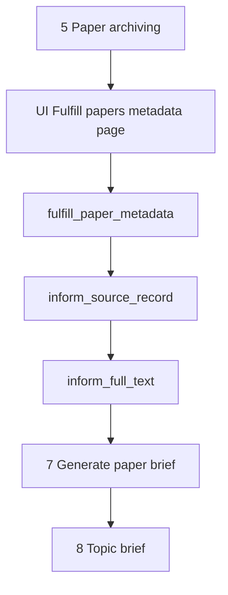

# Fulfill papers metadata

This document is the specification for **step 6** of the Topic brief generation workflow in [README.md](../../README.md).

In this step, the system fills two **global** aspects of each archived **`Paper`**: the **source record** (fuller publication details from the paper source) and **full text** (article body when a full-text source can supply it). Each aspect has its own Prefect flow and its own stored status. A page-6 orchestrator runs those two flows in order. A dedicated Streamlit page shows progress.

**Next step:** [Generate paper brief](07-generate-paper-brief.md) creates a global **paper brief** only when full text is `succeeded`. Do not draft briefs in this step.

This document owns `PaperAspectStatus` and the two `Paper` status columns. Brief status lives on `PaperBrief` ([Generate paper brief](07-generate-paper-brief.md)) and reuses the same enum.

## Glossary

| Term | Meaning |
| --- | --- |
| **`Paper`** | Durable bibliographic record. Product meaning: [README.md](../../README.md) Terminology. Public id is the uppercase DOI. Created or reused in [Paper archiving](05-paper-archiving.md). |
| **`PaperAspectStatus`** | Shared enum: `not_started` \| `succeeded` \| `failed` \| `unavailable`. Stored; not derived from payload columns. No `in_progress` member. |
| **Source record** | Fuller publication details from the paper source (for PubMed: EFetch). Includes `source_record` JSONB, typed promotes, and bibliographic refresh. Abstract may be empty. Marker: `source_record_status`. |
| **Full text** | Article body text stored as `full_text_plain` (for PubMed: PMC Cloud). Marker: `full_text_status`. |
| **`inform_source_record`** | Prefect flow that fills the source-record aspect for one paper. |
| **`inform_full_text`** | Prefect flow that fills the full-text aspect for one paper. |
| **`fulfill_paper_metadata`** | Page-6 orchestrator: runs source record then full text for one paper, with **default skip rules** (does not unfreeze). |
| **`regenerate_paper`** | Full orchestrator: may unfreeze `succeeded` and retry `failed` / `unavailable`, then rewrite the paper brief. Started from a per-paper **Regenerate** button on page 6 (and the same button on page 7). See [Full regenerate orchestrator](#full-regenerate-orchestrator). |
| **Fulfill papers metadata** | Workflow **step** (this document) that enqueues `fulfill_paper_metadata` for archived papers and shows progress. |
| **PMC Cloud enrichment** | PubMed full-text path after a succeeded source record: resolve PMCID, fetch the highest PMC Cloud article version (Open Access Subset **or** Author Manuscript), store `full_text_plain` and clickable URLs. |

## Topic brief generation

A **Topic brief generation** is the four-phase workflow in [README.md](../../README.md), run on one `TopicScope`. This document specifies **Fulfill papers metadata** on the Paper ingestion path for that scope.

Paper archiving (create/reuse `Paper` without EFetch) is owned by [Paper archiving](05-paper-archiving.md). PubMed EFetch request parameters, PMCID extraction, and PMC Cloud full-text details are summarized here and detailed for PubMed in [paper-sources/pubmed.md](paper-sources/pubmed.md).

`Paper` and `PaperBrief` are **global**. They do not belong to a Topic scope. A later Topic scope that archives the same paper reuses source record, full text, and brief as they stand.

For the application runtime stack (including Prefect as a Compose service), see [technology-stack.md](../technology-stack.md) and [local-development.md](../local-development.md). This specification is the orchestration contract; inform work runs in Prefect, not in Streamlit.

## Scope

### In scope (current v1)

- Take archived `Paper` records from [Paper archiving](05-paper-archiving.md) (`PaperArchivingResult.papers`) for the current Topic scope’s UI set.
- Store `PaperAspectStatus` on `Paper` as `source_record_status` and `full_text_status` (default `not_started`).
- For each paper, enqueue `fulfill_paper_metadata` (source record then full text) using **default skip rules**.
- On source-record success: write `source_record` (JSONB), typed promote columns (`pub_date`, `abstract_text`, bibliographic refresh), and `pmcid` when the source supplies it.
- On full-text success (PubMed): store usable `full_text_plain` from Cloud `.txt` (`strip()` of the body; `strip()` not empty), plus `pmcid_version`, `is_open_access`, `pmc_article_url`, and `open_access_pdf_url` when present.
- Set `failed` or `unavailable` per aspect (tables below). Optional per-aspect error message when `failed`.
- Dedicated Streamlit page that enqueues the page-6 orchestrator and shows progress for **both** aspects (polls DB enum columns only). A per-paper **Regenerate** button submits `regenerate_paper` when both aspects are terminal.

### Out of scope (v1)

- [Paper archiving](05-paper-archiving.md) create/reuse rules or its UI.
- Creating **paper briefs** (`PaperBrief`) or running `create_paper_brief` from this page — owned by [Generate paper brief](07-generate-paper-brief.md). Page 7 enqueues the brief flow only.
- A dedicated Streamlit **page** for `regenerate_paper` (the control is a per-paper button on page 6 and page 7, not a new sidebar page).
- Topic brief drafting (phase 4) — [Topic brief](4-topic-brief.md).
- Rich author entities, affiliations, ORCID, or author↔paper graphs (future job; see [Future work](#future-work)).
- Storing EFetch `ArticleIdList` / `OtherID` beyond PMCID (for Cloud) + existing DOI + `(source_id, source_uid)` handle; CommentsCorrections, bibliography/references, or deferred “Other” XML elements (see below).
- Updating bibliographic identity fields that archiving already set (`doi`, `source_id`, `source_uid`, `url`) during inform, except where this spec says to refresh allowed bibliographic columns from the fuller record.
- Storing PDF bytes, JATS XML, media, or supplementary files.
- Unpaywall / publisher scrape outside PMC Cloud (later: fold extra full-text sources into `inform_full_text`).
- Auto-retry of `failed` or `unavailable` on page 6 (none; only `regenerate_paper` may retry those).
- Overwrite of `succeeded` on page 6 (frozen; only `regenerate_paper` may unfreeze).
- Prefect Compose service topology details beyond “Prefect runs inform jobs” — owned by [local-development.md](../local-development.md) / [technology-stack.md](../technology-stack.md).

## Position in the workflow



1. **Paper archiving** yields `PaperArchivingResult.papers` (create or reuse).
2. **Fulfill papers metadata** (this specification) runs `fulfill_paper_metadata` so each paper gets a terminal `source_record_status` and then a terminal `full_text_status` (unless skipped).
3. **Generate paper brief** drafts a global `PaperBrief` only when `full_text_status` is `succeeded` — see [Generate paper brief](07-generate-paper-brief.md).
4. **Topic brief** consumes succeeded `PaperBrief` rows and cites papers in prose.

## `PaperAspectStatus`

One enum for every paper aspect (source record, full text, and later `PaperBrief.status`).

| Member | Meaning for jobs |
| --- | --- |
| `not_started` | No completed attempt. Run this aspect. While a flow runs, leave this value until the flow writes a terminal member. |
| `succeeded` | Required data for this aspect is stored. Default path: skip (frozen). |
| `failed` | Attempted; error that may be transient. Default path: skip (no auto-retry). |
| `unavailable` | This aspect cannot be obtained from the current source data (for example no PMCID, no Cloud `.txt`, unsupported `source_id` for source record). Default path: skip (do not auto-retry). |

Orchestration reads **only** these enums. Payload columns (`source_record`, `abstract_text`, `full_text_plain`, …) are data, not status.

### Default skip rules (page 6 and page 7)

| Current status | Action |
| --- | --- |
| `not_started` | Run the aspect. |
| `succeeded` | Skip. Do not overwrite. |
| `failed` | Skip. Do not auto-retry. |
| `unavailable` | Skip. Do not auto-retry. |

**Only** [`regenerate_paper`](#full-regenerate-orchestrator) may unfreeze `succeeded` and retry `failed` / `unavailable`.

## Selection rules (page 6)

| Input | Role |
| --- | --- |
| `paper_archiving_result.papers` | Candidate set for this Topic scope’s fulfill work (session / UI). |

For each `Paper` in that set (first-seen order), enqueue **one** `fulfill_paper_metadata` run when **any** aspect still needs work under default skip rules:

| Condition | Action |
| --- | --- |
| `source_record_status` is `not_started`, or (`source_record_status` is `succeeded` and `full_text_status` is `not_started`) | Submit `fulfill_paper_metadata`. The orchestrator skips aspects that are already terminal. |
| Both aspects are `succeeded`, `failed`, or `unavailable` | Do not enqueue. UI shows the stored statuses. |
| Empty `papers` | No jobs; UI shows an empty success caption. |

The orchestrator, not Streamlit, sequences source record before full text. Do not submit `inform_full_text` from the UI while source record is still `not_started`.

## Public API and Prefect entrypoints

Domain package: `paper_reviewer.topic_brief_generation.fulfill_papers_metadata` — see [project-structure.md](../project-structure.md).

Prefect flows (names are the contract): `paper_reviewer.flows`

```text
inform_source_record(paper_id, doi) -> InformSourceRecordResult
inform_full_text(paper_id, doi) -> InformFullTextResult
fulfill_paper_metadata(paper_id, doi) -> FulfillPaperMetadataResult
enqueue_fulfill_papers_metadata(paper_ids) -> FulfillPapersMetadataEnqueueResult
regenerate_paper(paper_id, doi) -> RegeneratePaperResult
```

DOI on flow parameters is for UI/search and the submit-time run name; durable work keys off `paper_id`.

| Entrypoint | Role |
| --- | --- |
| `inform_source_record` | Load `Paper` by id. Apply default skip unless the caller is `regenerate_paper`. Else fetch the fuller source record **for that one paper** (PubMed: one PMID per call via dlt EFetch resource), write payload columns, set `source_record_status`, commit (flow owns persistence). |
| `inform_full_text` | Require `source_record_status = succeeded` (else do not call Cloud; see job table). Apply default skip unless the caller is `regenerate_paper`. Else fetch full text (PubMed: PMC Cloud), write enrichment columns, set `full_text_status`. |
| `fulfill_paper_metadata` | Page-6 orchestrator: run `inform_source_record` then `inform_full_text` with **default skip rules**. One Prefect run per paper. |
| `enqueue_fulfill_papers_metadata` | UI helper: apply [selection rules](#selection-rules-page-6) and submit `fulfill_paper_metadata` for those paper ids. Does not unfreeze. Does not enqueue brief jobs. |
| `regenerate_paper` | Full orchestrator. Always forces. See [Full regenerate orchestrator](#full-regenerate-orchestrator). |

| Rule | Behavior |
| --- | --- |
| Independent aspect flows | Each aspect has its own flow. Orchestrators call them in sequence. |
| One paper per run | v1 submits one orchestrator run per paper. |
| Fail-soft per paper | One paper failure must not cancel other papers’ runs. |
| In-run extract retries | Inside one aspect flow, retry that extract up to 3 attempts with 0.5s delay; only then set `failed`. This is not re-enqueue of already-`failed` papers. |
| Raise | Raise only for unusable infrastructure (DB down, Prefect submit impossible). Per-paper source errors become `failed` on that aspect. |

Pydantic types live under `paper_reviewer.schemas.topic_brief_generation`.

### How the result types relate

```mermaid
sequenceDiagram
  participant UI as FulfillUI
  participant Enq as enqueue_fulfill_papers_metadata
  participant Pref as Prefect
  participant Orch as fulfill_paper_metadata
  participant Src as inform_source_record
  participant Ft as inform_full_text
  participant DB as PaperRow

  UI->>Enq: paper_ids from archiving result
  Enq->>Enq: selection rules
  Enq->>Pref: submit one fulfill_paper_metadata per submitted id
  Enq-->>UI: FulfillPapersMetadataEnqueueResult
  Note over UI: Cache enqueue result; do not EFetch here
  loop each submitted paper
    Pref->>Orch: paper_id, doi
    Orch->>Src: default skip
    Src->>DB: read / write source_record_status
    Orch->>Ft: default skip
    Ft->>DB: read / write full_text_status
  end
  UI->>DB: poll enum columns for progress table
```

| Type | Who returns it | When | What the caller does with it |
| --- | --- | --- | --- |
| `FulfillPapersMetadataEnqueueResult` | `enqueue_fulfill_papers_metadata` | Once per page auto-enqueue | UI stores it so it does not submit duplicate Prefect runs on every Streamlit rerun. It is **not** progress truth. |
| `FulfillPaperMetadataResult` / aspect results | Orchestrator / leaf flows | Once per Prefect run | Flow/tests assert outcome; durable state is already on `Paper`. UI polls enums. |

Example after enqueue of papers `[10, 11, 12]` where 11 already has both aspects terminal and 12 has source record `succeeded` but full text `not_started`:

```text
FulfillPapersMetadataEnqueueResult(
  submitted_paper_ids=[10, 12],
  skipped_already_terminal=[11],
)
```

Paper 12’s orchestrator skips source record (`succeeded`) and runs `inform_full_text` only.

### Result type fields (v1)

```text
InformSourceRecordResult
  paper_id: int
  status: PaperAspectStatus
  error_message: str | None

InformFullTextResult
  paper_id: int
  status: PaperAspectStatus
  error_message: str | None

FulfillPaperMetadataResult
  paper_id: int
  source_record: InformSourceRecordResult
  full_text: InformFullTextResult

FulfillPapersMetadataEnqueueResult
  submitted_paper_ids: list[int]
  skipped_already_terminal: list[int]

RegeneratePaperResult
  paper_id: int
  source_record: InformSourceRecordResult
  full_text: InformFullTextResult
  brief: CreatePaperBriefResult | None
```

`brief` is `None` when full text is not `succeeded` after the force full-text step. Do not store Prefect run ids on these types for UI progress.

## Durable `Paper` extensions

Archiving fields remain as in [Paper archiving](05-paper-archiving.md). This step **adds** status columns and payload columns populated only by the inform flows.

### Status and error columns

| Field | Required | Description |
| --- | --- | --- |
| `source_record_status` | Yes | `PaperAspectStatus`. Default `not_started`. |
| `source_record_error_message` | No | Set when source record is `failed`. Cleared on `succeeded`. Null for `unavailable` / `not_started`. |
| `full_text_status` | Yes | `PaperAspectStatus`. Default `not_started`. |
| `full_text_error_message` | No | Set when full text is `failed`. Cleared on `succeeded`. Null for `unavailable` / `not_started`. |

Do **not** use `source_informed_at` or `source_inform_error_message` (replaced by the enums).

### Source-record success contract

`source_record_status = succeeded` means the source extract finished with **no error**. Store the full mapped record. If abstract text was present, store it; if not, leave `abstract_text` empty. Empty abstract is still `succeeded`. MeSH, dates, and `source_record` JSON are part of that payload.

Empty abstract does **not** block full text. Full text is gated by a full-text handle (PubMed: **PMCID**), not by `abstract_text`.

### Full-text success contract

`full_text_status = succeeded` means `full_text_plain` holds **usable** article body text: `strip()` of the Cloud `.txt` body, and that stripped value is not empty. Author manuscript with `is_open_access=false` and usable body text is still `succeeded`.

Empty string, spaces-only, or newline-only body is **not** usable. Treat it as no `.txt`: `full_text_status = unavailable`; leave `full_text_plain` null. Do not store `''` or whitespace. When the body is usable, persist `strip()` of the body (remove leading and trailing whitespace).

### Storage layout (locked)

| Storage | Role |
| --- | --- |
| **`source_record` (JSONB)** | Full mapped source “photo” of the paper (all logical groups below as one object). Written by `inform_source_record`. |
| **Typed columns** | Promote values from that map into real schema columns for query. |
| **PMC Cloud enrichment columns** | Optional plain text + clickable URLs + OA provenance; never PDF/XML bytes. Written by `inform_full_text`. |

On first successful source record (default path; `not_started` → `succeeded`):

1. Write the full mapped object into `source_record` (shape in [Illustrative mapped `source_record`](#illustrative-mapped-source_record)).
2. Refresh existing bibliographic columns when values are present on the fuller record: `title`, `authors`, `journal`, `published_year`.
3. Set typed promote columns when they can be parsed (see table). If a value is absent or not safely parseable, leave that typed column null / unchanged as noted.
4. Set `pmcid` when the source supplies it (PubMed EFetch). Do **not** call PMC Cloud here.
5. Set `source_record_status = succeeded`. Clear `source_record_error_message`.

Do **not** change `doi`, `source_id`, `source_uid`, or `url` in v1 inform.

| Typed column | Type | Source in `source_record` | Notes |
| --- | --- | --- | --- |
| `title` | Text (existing) | Bibliographic map / Article title | Overwrite when present. |
| `authors` | JSON list[str] (existing) | Author display names | Overwrite when present. |
| `journal` | Text (existing) | Journal title / MedlineTA fallback per mapper | Overwrite when present. |
| `published_year` | int (existing) | `dates.pub_date.year` (or article year) | Overwrite when present. |
| `pub_date` | `date` (new, nullable) | `dates.pub_date` year+month+day | Set only when year, month, and day are all present; otherwise leave null (year-only stays in `published_year`). |
| `abstract_text` | Text (new, nullable) | `abstract.parts` | Concatenate part texts in order (preserve labels in the JSONB only). Overwrite when any abstract part text is present. |
| `pmcid` | Text, nullable | PubMed article ids `pmc` | Set by source record when present; used by `inform_full_text`. |

[Generate paper brief](07-generate-paper-brief.md) requires `full_text_status = succeeded` and grounds the brief on `full_text_plain` only. Full source metadata remains on `Paper` in `source_record` for other tasks.

### PMC Cloud enrichment

After `source_record_status = succeeded` for PubMed, `inform_full_text` may enrich the same `Paper` from the [PMC Cloud Service on AWS](https://pmc.ncbi.nlm.nih.gov/tools/pmcaws/) (updated Cloud layout only; do not depend on legacy FTP / OA Web Service). Details: [paper-sources/pubmed.md](paper-sources/pubmed.md).

| Rule | Behavior |
| --- | --- |
| Eligibility | PMCID present on the paper **and** Cloud has an article version for that PMCID (Open Access Subset **or** Author Manuscript) **and** Cloud exposes a **usable** body `.txt` (`strip()` not empty). |
| Version | Always the **highest** numeric version for that PMCID. |
| No PMCID | Set `full_text_status = unavailable`. Do not call Cloud. |
| PMCID but no Cloud `.txt` | Set `full_text_status = unavailable`. Leave `full_text_plain` null. |
| PMCID, Cloud `.txt` present, body empty or whitespace-only | Same as no `.txt`: `full_text_status = unavailable`. Leave `full_text_plain` null. |
| Cloud HTTP/parse error | Set `full_text_status = failed` and `full_text_error_message`. Leave `full_text_plain` null. Do not convert this into `unavailable` or `succeeded`. |
| License | Store whatever Cloud returns; operators own compliance. |
| Bytes | Never store PDF, JATS XML, media, or supplements. |

| Field | Type | Meaning |
| --- | --- | --- |
| `pmcid` | Text, nullable | e.g. `PMC5334499` (set at source-record time; used for re-fetch). |
| `pmcid_version` | int, nullable | Highest Cloud version used for this enrichment. |
| `is_open_access` | bool, nullable | From Cloud `is_pmc_openaccess` when enrichment ran; null if no Cloud hit. Author manuscripts may have `is_open_access=false` and still receive `full_text_plain`. |
| `full_text_plain` | Text, nullable | `strip()` of the Cloud `.txt` body (plain text extracted from JATS XML). Required for `full_text_status = succeeded`. Must be usable (`strip()` not empty); never store blank or whitespace-only text. |
| `open_access_pdf_url` | Text, nullable | Browser-usable **HTTPS** URL of the Cloud PDF object when metadata exposes `pdf_url`. |
| `pmc_article_url` | Text, nullable | Canonical PMC landing page, e.g. `https://pmc.ncbi.nlm.nih.gov/articles/{pmcid}/`, set whenever Cloud enrichment runs with a PMCID (primary clickable “open the paper” link even when there is no PDF). |

Do **not** replace `Paper.url` (PubMed). DOI remains on `Paper.doi` for optional `https://doi.org/...` links in the UI later.

### Logical groups inside `source_record`

| Group | Store inside JSONB |
| --- | --- |
| **Abstract** | Abstract text parts (preserve section labels when present, e.g. BACKGROUND / METHODS); abstract copyright when present; `OtherAbstract` when present |
| **Dates** | Journal `PubDate` (year/month/day as available); `ArticleDate` (electronic); Medline `DateCompleted` / `DateRevised`; PubmedData `History` entries by `PubStatus` |
| **Journal detail** | ISSN; volume; issue; pagination / Medline page range; ISO abbreviation; MedlineTA; country; NlmUniqueID; ISSNLinking |
| **Types / language** | Publication types; language(s); Article `PubModel`; MedlineCitation `Status` / `Owner` |
| **Indexing** | MeSH headings (descriptor, qualifiers when present, major-topic flag); keywords; chemicals; SupplMesh; CitationSubset values |
| **Funding** | Grant list; databank list |
| **COI / notes** | Conflict-of-interest statement; general notes |

### Illustrative mapped `source_record`

After EFetch XML → map, `source_record` holds an object like:

```json
{
  "abstract": {
    "parts": [
      {"label": "BACKGROUND", "text": "Gaucher disease is a lysosomal storage disorder..."},
      {"label": "METHODS", "text": "We reviewed 42 consecutive patients..."},
      {"label": "RESULTS", "text": "Enzyme replacement reduced spleen volume..."},
      {"label": "CONCLUSIONS", "text": "Early treatment improved outcomes..."}
    ],
    "copyright": "Copyright © 2024 Example Press.",
    "other_abstracts": []
  },
  "dates": {
    "pub_date": {"year": 2024, "month": 3, "day": 15},
    "article_date_electronic": {"year": 2024, "month": 2, "day": 28},
    "date_completed": {"year": 2024, "month": 4, "day": 1},
    "date_revised": {"year": 2024, "month": 5, "day": 10},
    "history": [
      {"pub_status": "received", "year": 2023, "month": 11, "day": 2},
      {"pub_status": "accepted", "year": 2024, "month": 2, "day": 20},
      {"pub_status": "pubmed", "year": 2024, "month": 3, "day": 16}
    ]
  },
  "journal_detail": {
    "issn": "1234-5678",
    "volume": "18",
    "issue": "3",
    "medline_pgn": "210-218",
    "iso_abbreviation": "Orphanet J Rare Dis",
    "medline_ta": "Orphanet J Rare Dis",
    "country": "England",
    "nlm_unique_id": "101266600",
    "issn_linking": "1234-5678"
  },
  "types_language": {
    "publication_types": ["Journal Article", "Research Support, Non-U.S. Gov't"],
    "languages": ["eng"],
    "pub_model": "Print-Electronic",
    "medline_status": "MEDLINE",
    "medline_owner": "NLM"
  },
  "indexing": {
    "mesh_headings": [
      {
        "descriptor": "Gaucher Disease",
        "major_topic": true,
        "qualifiers": [{"name": "drug therapy", "major_topic": true}]
      },
      {
        "descriptor": "Enzyme Replacement Therapy",
        "major_topic": false,
        "qualifiers": []
      }
    ],
    "keywords": ["lysosomal storage", "imiglucerase"],
    "chemicals": [{"name": "Imiglucerase", "registry_number": "0"}],
    "suppl_mesh": [],
    "citation_subsets": ["IM"]
  },
  "funding": {
    "grants": [
      {"agency": "NIH", "country": "United States", "grant_id": "R01EX123456"}
    ],
    "databanks": []
  },
  "coi_notes": {
    "coi_statement": "The authors declare no competing interests.",
    "general_notes": []
  }
}
```

For that example, typed promotes would include `pub_date = 2024-03-15`, `published_year = 2024`, and `abstract_text` built from the four abstract part texts.

### Explicitly not stored on `Paper` in v1

| EFetch / Cloud content | Reason |
| --- | --- |
| `ArticleIdList` / `OtherID` beyond **PMCID** + existing DOI + PMID handle | Deferred; PMCID is stored as typed `pmcid` for Cloud enrichment |
| PDF bytes, JATS XML, media, supplementary files | URLs + `full_text_plain` only |
| `CommentsCorrectionsList` | Deferred |
| Full bibliography / cited references | Not reliable in standard PubMed EFetch; deferred |
| Rich authors (structured names, affiliations, ORCID) | Future author-entity job |
| `VernacularTitle`, `InvestigatorList`, `GeneSymbolList`, `PersonalNameSubjectList`, `SpaceFlightMission` | Deferred “Other” elements (examples below) |

### Deferred “Other” elements (examples)

| Element | Example meaning |
| --- | --- |
| `VernacularTitle` | Non-English original title, e.g. `¿Cómo hablo con mi familia sobre Gaucher?` |
| `InvestigatorList` | Named collaborators under a collective author (e.g. Carlsson C, Cecchi F) |
| `GeneSymbolList` | Gene symbols on the citation (e.g. `pyrB`, `Ghox-lab`) |
| `PersonalNameSubjectList` | People who are the *subject* of the paper (e.g. Darwin, Hume) |
| `SpaceFlightMission` | Legacy NASA mission tags (e.g. `Project Gemini 11`); NLM stopped adding these in 2005 |

PubMed call shape: see [paper-sources/pubmed.md](paper-sources/pubmed.md) (EFetch and PMC Cloud sections). EFetch extract is a **dlt resource** under `paper_reviewer.ingest.pubmed`. PMC Cloud enrichment is a separate ingest helper in the same package. Prefect jobs call those helpers; they do not parse XML or call Cloud inside Streamlit.

## Prefect job behavior

### `inform_source_record`

| Case | Expected |
| --- | --- |
| Default path, `source_record_status` is `succeeded`, `failed`, or `unavailable` | No-op; return current status; do not call EFetch; do not change fields. |
| `not_started`, PubMed `source_id` | EFetch XML for **that paper’s single PMID**; write `source_record`; promote typed columns; refresh bibliographic fields when present; set `pmcid` when present; set `source_record_status = succeeded`; clear error message. |
| `not_started`, unsupported `source_id` | Set `source_record_status = unavailable`. Do not set `failed`. |
| EFetch / parse / DB error | In-run extract retries (3 × 0.5s). After exhaustion: `source_record_status = failed`; set `source_record_error_message`; do not write a partial success. |

### `inform_full_text`

| Case | Expected |
| --- | --- |
| Default path, `full_text_status` is `succeeded`, `failed`, or `unavailable` | No-op; return current status; do not call Cloud. |
| `source_record_status` is not `succeeded` | Do not call Cloud. Leave `full_text_status` unchanged (`not_started` if never attempted). |
| `not_started`, source record `succeeded`, no PMCID | `full_text_status = unavailable`. Do not call Cloud. |
| `not_started`, PMCID present, Cloud highest version has usable `.txt` | Store stripped `full_text_plain` and enrichment columns; `full_text_status = succeeded`; clear error message. Author manuscript with `is_open_access=false` is still `succeeded`. |
| `not_started`, PMCID present, no Cloud object, no `.txt`, or `.txt` body empty / whitespace-only | `full_text_status = unavailable`. Leave `full_text_plain` null. |
| Cloud HTTP / parse error | In-run retries (3 × 0.5s). After exhaustion: `full_text_status = failed`; set `full_text_error_message`. Do not set `unavailable` or `succeeded`. |

### `fulfill_paper_metadata`

Run `inform_source_record` then `inform_full_text` with default skip rules. If source record does not end as `succeeded`, skip full text (full text stays `not_started` unless already terminal).

### Idempotency policy

Leaf flows and `fulfill_paper_metadata` are **idempotent by default** (skip rules above). The documented exception is `regenerate_paper`.

## Full regenerate orchestrator

`regenerate_paper` is the **only** path that may unfreeze `succeeded` and retry `failed` / `unavailable`.

The user starts one run with a per-paper **Regenerate** button on the Fulfill papers metadata page (and the same button on [Generate paper brief](07-generate-paper-brief.md)). The button submits `regenerate_paper` (fire-and-forget). Streamlit does not call EFetch, Cloud, or the LLM.

Show the button only when both `source_record_status` and `full_text_status` are terminal (`succeeded` / `failed` / `unavailable`). Do not show it while either aspect is `not_started` (avoids two writers on one paper). Auto-enqueue of `fulfill_paper_metadata` does not change.

Order:

1. `inform_source_record` with force (re-fetch; overwrite payload; set status from the new attempt).
2. `inform_full_text` with force (re-try Cloud even after previous `unavailable` / `failed` / `succeeded`).
3. If `full_text_status = succeeded`, call `create_paper_brief` with force rewrite — contract: [Generate paper brief](07-generate-paper-brief.md). If full text is not `succeeded`, do not draft or rewrite a brief.

Leaf Prefect flows stay `(paper_id, doi)` only. The orchestrator passes `force=True` into domain helpers in-process. Do not add `force` to served `inform_*` deployments.

## Streamlit UI (v1)

Dedicated page module: `paper_reviewer.ui.fulfill_papers_metadata` with `render_fulfill_papers_metadata()`.

Register in `paper_reviewer.ui.navigation` (`build_app_pages()`):

| Property | Value |
| --- | --- |
| `key` | `fulfill_papers_metadata` |
| `title` | Fulfill papers metadata |
| `url_path` | `fulfill-papers-metadata` |
| `in_sidebar` | false ([ui-style.md](../ui-style.md)) |

Streamlit is presentation only ([technology-stack.md](../technology-stack.md)). Heavy work runs in Prefect; the page enqueues `fulfill_paper_metadata` and polls **durable `Paper` enum columns** for progress (no Prefect run ids required for the UI contract).

### Session keys

| Key | Type | Role |
| --- | --- | --- |
| `paper_archiving_result` | `PaperArchivingResult` | Required prerequisite. Use `papers` as the **id list** only; always reload each `Paper` from the DB for status and display fields. |
| `fulfill_papers_metadata_enqueue_result` | `FulfillPapersMetadataEnqueueResult` | Optional cache that enqueue was submitted for this session (not progress truth). |

**URL query:** Require `topic_scope_public_id` for display / navigation ([ui-style.md](../ui-style.md#topic-scope-public-id-in-the-url)). In-workflow page links must pass that query param.

**Workflow session independence (cascade clear):** Each Topic scope workflow is independent in the browser session. Downstream step caches must not leak across Topic scopes or across a re-run of an earlier step.

| Event | Clear these session keys (and any later-step caches when added) |
| --- | --- |
| Topic intake Submit (new `TopicScope`) | Clear the **entire** UI session (`session_state.clear()`), then write the new `topic_statement` and set `topic_scope_public_id` in the **URL query**. Topic intake then **switches** to Topic analysis ([Topic intake](1.1-topic-intake.md)). Do not clear on validation or persist failure. |
| Re-run Topic analysis (Analyze again) | `related_paper_search_result`, `retrieval_triage_result`, `paper_archiving_result`, `fulfill_papers_metadata_enqueue_result`, `generate_paper_brief_enqueue_result`, and all later-step caches |
| Re-confirm Retrieval triage | `paper_archiving_result`, `fulfill_papers_metadata_enqueue_result`, and all later-step caches |
| Re-run Paper archiving (when/if a re-run clears or replaces `paper_archiving_result`) | `fulfill_papers_metadata_enqueue_result` and all later-step caches |

Rule: **re-running step N clears session data for steps N+1, N+2, …** so the user cannot continue with stale downstream results. Topic intake Submit is stronger: it wipes the whole session so no leftover key from a previous run can survive. Ordinary refresh of the fulfill page does **not** clear the enqueue cache.

This cascade applies to **session / UI workflow state**. It does **not** delete durable global `Paper` or `PaperBrief` rows.

**Progress reads:** For each archived paper id, load current `source_record_status`, `full_text_status`, error messages, and typed fields from Postgres. Do not trust stale bibliographic snapshots in `paper_archiving_result.papers`.

### Page behavior

1. If `paper_archiving_result` or the URL Topic scope id is missing → empty state; links to **Paper archiving**, **Topic intake**, and **Topic scope** (preserve the query id when present).
2. If `papers` is empty → caption that there are no archived papers; do not enqueue.
3. On first visit with prerequisites and no enqueue cache → call `enqueue_fulfill_papers_metadata` for the archived paper ids; store enqueue result in session.
4. While any paper has `source_record_status` or `full_text_status` equal to `not_started` after enqueue, refresh/poll durable columns. Do not use Prefect API state as progress truth.
5. Primary surface: **progress table/list** — title (link via `url`; when enrichment set `pmc_article_url` / `open_access_pdf_url`, those may be shown as extra links), DOI, **source-record status**, **full-text status**, short error when an aspect is `failed`.
6. When every paper has both aspects terminal (`succeeded` / `failed` / `unavailable`), show a summary and link to **Generate paper brief** (pass the Topic scope id in `query_params`). Papers with full text `failed` or `unavailable` remain visible; do not block the whole page from linking onward (step 7 will enqueue only papers with full text `succeeded`).
7. On each progress row, when both aspects are terminal, show a secondary **Regenerate** button ([ui-style.md](../ui-style.md)). Click submits `regenerate_paper` for that paper. Unique Streamlit key per `paper_id`.

Do **not** run EFetch or Cloud inside Streamlit callbacks. Default auto-enqueue still does not retry `failed` / `unavailable` or overwrite `succeeded`.

### Progress display labels

Map each aspect independently:

| Durable signal | Display |
| --- | --- |
| `not_started` after enqueue | Fulfilling |
| `succeeded` | Succeeded |
| `failed` | Failed |
| `unavailable` | Unavailable |
| Already `succeeded` before this enqueue (skipped) | Skipped (already done) |

## Workflow navigation

- **Entry:** After Paper archiving shows a result, link to **Fulfill papers metadata** with `paper_archiving_result` and Topic scope id in session.
- **Input:** Consume `PaperArchivingResult.papers` only (not raw triage candidates).
- **Exit:** When both aspects are terminal for the set, link to [Generate paper brief](07-generate-paper-brief.md).

## Orchestration boundary

| Responsibility | Owner |
| --- | --- |
| Create/reuse bibliographic `Paper` | [Paper archiving](05-paper-archiving.md) |
| `PaperAspectStatus` enum; `source_record_status` / `full_text_status`; page-6 orchestrator; `regenerate_paper` steps 1–2 | This document |
| EFetch params + PubMed XML mapping + PMC Cloud HTTP details | [paper-sources/pubmed.md](paper-sources/pubmed.md) (owned for PubMed); this spec owns which groups and enrichment columns land on `Paper` and which status they set |
| Domain enqueue + aspect inform helpers | `paper_reviewer.topic_brief_generation.fulfill_papers_metadata` |
| Prefect flows | `paper_reviewer.flows` (`inform_source_record`, `inform_full_text`, `fulfill_paper_metadata`, `regenerate_paper`) |
| ORM `Paper` extensions (enums, `source_record`, typed promotes, PMC enrichment columns) | `paper_reviewer.models` |
| Pydantic contracts | `paper_reviewer.schemas.topic_brief_generation` |
| Progress UI | `paper_reviewer.ui.fulfill_papers_metadata` |
| Paper brief drafting / `regenerate_paper` step 3 | [Generate paper brief](07-generate-paper-brief.md) |
| Topic brief drafting | Later step (not this document) |

This document is the **behavior contract** for domain logic, the inform Prefect jobs, and the Streamlit progress page. Implementation follows [tdd.md](../tdd.md).

## Testability

TDD per [tdd.md](../tdd.md):

**`inform_source_record`:**

- Default skip when status is `succeeded` / `failed` / `unavailable`.
- `not_started` → `source_record` set; typed promotes set when parseable; `succeeded`; error cleared; empty abstract still `succeeded`.
- Unsupported source → `unavailable`.
- Fetch / parse error → retry extract up to 3 attempts with 0.5s delay; then `failed`.

**`inform_full_text`:**

- Default skip when status is terminal.
- No PMCID → `unavailable`; no Cloud call.
- PMCID + Cloud highest version + usable `.txt` → `succeeded`; stripped `full_text_plain` and URLs as specified; author manuscript `is_open_access=false` still `succeeded`.
- PMCID but no `.txt`, or `.txt` body empty / whitespace-only → `unavailable`; `full_text_plain` remains null.
- Cloud HTTP error after retries → `failed` (not `unavailable`).

**`fulfill_paper_metadata` / enqueue:**

- Source already `succeeded`, full text `not_started` → skip source, run full text.
- Both terminal → not submitted.
- Empty paper list → empty enqueue result.

**`regenerate_paper`:**

- Default skip still no-ops `succeeded` / `failed` / `unavailable`.
- Force on succeeded source re-fetches and overwrites payload.
- Force on unavailable full text retries Cloud; hit → `succeeded` then brief rewrite.
- Force full text still `unavailable` → `brief` is `None`; existing brief row unchanged.

**UI slice** (no Streamlit widget assertions per [tdd.md](../tdd.md)):

- `tests/ui/test_navigation.py`: page registered with key `fulfill_papers_metadata`, title **Fulfill papers metadata**, render callable `render_fulfill_papers_metadata`, `url_path` `fulfill-papers-metadata`.
- Pure helpers for status → display label and `may_submit_regenerate_paper` unit-tested without Streamlit when extracted.

## Non-goals (v1)

Do not do this work in the Fulfill papers metadata v1 slice:

- Create or draft `PaperBrief` rows from page 6 auto-enqueue ([Generate paper brief](07-generate-paper-brief.md)). The **Regenerate** button submits `regenerate_paper`, which may rewrite a brief.
- A dedicated Streamlit **page** for `regenerate_paper` (the control is a per-paper button).
- Rich author entity registration or related-paper author graphs ([Future work](#future-work)).
- Store deferred EFetch ID lists (beyond PMCID), CommentsCorrections, references, or “Other” elements listed above.
- Store PDF bytes, JATS XML, media, or supplementary files.
- Unpaywall / non-PMC publisher scrape (later: same `full_text_status` group).
- Auto-retry `failed` / `unavailable` or unfreeze `succeeded` on page 6.
- Run EFetch or PMC Cloud calls inside Streamlit.
- Draft the Topic brief (phase 4).
- Store Prefect run ids for UI progress (DB columns only).

## Future work

**Rich authors (separate job after brief creation):** Register authors as full entities (structured names, affiliations, ORCID when present) and link related papers. Keep flat `authors: list[str]` on `Paper` until that spec exists. That job is an additional **aspect** (new enum + flow) after [Generate paper brief](07-generate-paper-brief.md), not part of v1 `inform_source_record`.

**Later groups:** Add a new `PaperAspectStatus` column and flow, **or** fold a new provider into an existing group (for example another full-text source inside `inform_full_text`). Do not invent a second status style.
