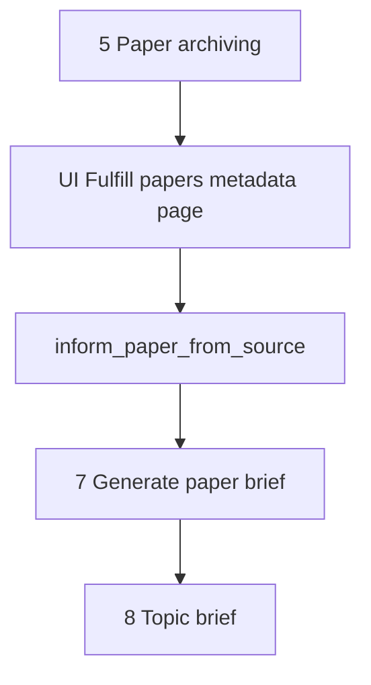

# Fulfill papers metadata

This document is the specification for **step 6** of the Topic brief generation workflow in [README.md](../../README.md).

In this step, the system fully informs each archived **`Paper`** from its paper source (for PubMed: EFetch). An idempotent Prefect job owns that work. A dedicated Streamlit page shows progress.

**Next step:** [Generate paper brief](07-generate-paper-brief.md) creates **paper brief** results from source-informed papers. Do not draft briefs in this step.

## Glossary

| Term | Meaning |
| --- | --- |
| **`Paper`** | Durable bibliographic record. Product meaning: [README.md](../../README.md) Terminology. Public id is the uppercase DOI. Created or reused in [Paper archiving](05-paper-archiving.md). |
| **Source-informed** | Durable state on a `Paper`: the row holds the fuller source record for that paper. Marker: `source_informed_at` (non-null). Global to the `Paper`, not per generation. |
| **`inform_paper_from_source`** | Prefect job that fetches the fuller source record and writes it onto `Paper`, then sets `source_informed_at`. |
| **Fulfill papers metadata** | Workflow **step** (this document) that enqueues and tracks inform jobs for archived papers that are not yet source-informed. |

## Topic brief generation

A **Topic brief generation** (`TopicBriefGeneration`) is one full workflow execution (product steps in [README.md](../../README.md)). This document specifies only step 6 (**Fulfill papers metadata**) for that run.

Paper archiving (create/reuse `Paper` without EFetch) is owned by [Paper archiving](05-paper-archiving.md). PubMed EFetch request parameters and XML field ownership for this step are summarized here and detailed for PubMed in [paper-sources/pubmed.md](paper-sources/pubmed.md).

For the application runtime stack (including Prefect as a Compose service), see [technology-stack.md](../technology-stack.md) and [local-development.md](../local-development.md). This specification is the orchestration contract; inform work runs in Prefect, not in Streamlit.

## Scope

### In scope (current v1)

- Take archived `Paper` records from [Paper archiving](05-paper-archiving.md) (`PaperArchivingResult.papers`) for the current generation.
- For each paper that is **not** yet source-informed (`source_informed_at` is null): enqueue `inform_paper_from_source`.
- Extend `Paper` with durable EFetch-derived fields (groups below) and `source_informed_at`.
- Optionally store a durable per-paper inform error message on `Paper` when inform fails (cleared on later success).
- Run the inform job as an **idempotent** Prefect flow/task by default (no-op success when already source-informed).
- Dedicated Streamlit page that enqueues inform work and shows progress.

### Out of scope (v1)

- [Paper archiving](05-paper-archiving.md) create/reuse rules or its UI.
- Creating **paper briefs** (`PaperBrief`) or running `create_paper_brief` — owned by [Generate paper brief](07-generate-paper-brief.md).
- Topic brief drafting (step 8).
- Rich author entities, affiliations, ORCID, or author↔paper graphs (future job; see [Future work](#future-work)).
- Storing EFetch article ID lists beyond the existing DOI + `(source_id, source_uid)` handle, CommentsCorrections, bibliography/references, or deferred “Other” XML elements (see below).
- Updating bibliographic identity fields that archiving already set (`doi`, `source_id`, `source_uid`, `url`) during inform, except where this spec says to refresh allowed bibliographic columns from the fuller record.
- Full-text PDF/HTML fetch.
- Non-idempotent “force refresh” of EFetch (none in v1).
- Auto-retry of papers that already failed fulfill metadata (none in v1; durable failed state is terminal until a future force-refresh).
- Prefect Compose service topology details beyond “Prefect runs inform jobs” — owned by [local-development.md](../local-development.md) / [technology-stack.md](../technology-stack.md) when the service is added.

## Position in the workflow



1. **Paper archiving** yields `PaperArchivingResult.papers` (create or reuse).
2. **Fulfill papers metadata** (this specification) ensures each archived paper is source-informed via `inform_paper_from_source`.
3. **Generate paper brief** drafts `PaperBrief` rows from source-informed papers — see [Generate paper brief](07-generate-paper-brief.md).
4. **Topic brief** consumes ready `PaperBrief` rows.

## Selection rules

| Input | Role |
| --- | --- |
| `paper_archiving_result.papers` | Candidate set for this generation’s inform work (session / UI). |

For each `Paper` in that set (first-seen order):

| Condition | Action |
| --- | --- |
| `source_informed_at` is set | Skip inform (idempotent). Show as done on the UI. |
| `source_informed_at` is null, durable fulfill-metadata failure set | **Do not enqueue** (no auto-retry in v1). Paper stays marked failed to fulfill metadata. UI shows Failed. |
| `source_informed_at` is null, no durable fulfill-metadata failure | Enqueue `inform_paper_from_source`. |

Empty `papers` → no jobs; UI shows an empty success caption.

## Public API and Prefect entrypoints

Domain package (when implemented): `paper_reviewer.topic_brief_generation.fulfill_papers_metadata` — see [project-structure.md](../project-structure.md).

Prefect flows (names are the contract): `paper_reviewer.flows`

```text
inform_paper_from_source(paper_id) -> InformPaperFromSourceResult
enqueue_fulfill_papers_metadata(paper_ids) -> FulfillPapersMetadataEnqueueResult
```

| Entrypoint | Role |
| --- | --- |
| `inform_paper_from_source` | Load `Paper` by id; if already source-informed, return no-op success. Else fetch fuller source record **for that one paper** (PubMed: one PMID per call), map fields, set `source_informed_at`, clear any fulfill-metadata failure, commit (flow owns persistence for the job). |
| `enqueue_fulfill_papers_metadata` | UI/orchestrator helper: apply selection rules and submit Prefect runs for the paper id list. Idempotent with respect to already-informed papers. Does not re-enqueue papers already marked failed to fulfill metadata. |

| Rule | Behavior |
| --- | --- |
| Idempotent by default | Same inputs after success do not re-fetch. No force-refresh flag in v1. |
| One paper per inform call | v1 submits one Prefect run per paper; PubMed EFetch uses a single PMID (no batch id lists). |
| Fail-soft per paper | One paper failure must not cancel other papers’ runs. |
| Raise | Raise only for unusable infrastructure (DB down, Prefect submit impossible). Per-paper source errors become durable **failed to fulfill metadata** on that `Paper`. |

Pydantic types live under `paper_reviewer.schemas.topic_brief_generation.fulfill_papers_metadata` (when implemented).

### How the two result types relate

```mermaid
sequenceDiagram
  participant UI as FulfillUI
  participant Enq as enqueue_fulfill_papers_metadata
  participant Pref as Prefect
  participant Inf as inform_paper_from_source
  participant DB as PaperRow

  UI->>Enq: paper_ids from archiving result
  Enq->>Enq: selection rules
  Enq->>Pref: submit one run per submitted id
  Enq-->>UI: FulfillPapersMetadataEnqueueResult
  Note over UI: Cache enqueue result in session; do not EFetch here
  loop each submitted paper
    Pref->>Inf: paper_id
    Inf->>DB: read / write Paper
    Inf-->>Pref: InformPaperFromSourceResult
  end
  UI->>DB: poll columns for progress table
```

| Type | Who returns it | When | What the caller does with it |
| --- | --- | --- | --- |
| `FulfillPapersMetadataEnqueueResult` | `enqueue_fulfill_papers_metadata` | Once per page auto-enqueue (or re-enqueue after cache clear) | UI stores it in `fulfill_papers_metadata_enqueue_result` so it does not submit duplicate Prefect runs on every Streamlit rerun. It is **not** progress truth. |
| `InformPaperFromSourceResult` | `inform_paper_from_source` | Once per Prefect run (one paper) | Flow/tests assert outcome; durable state is already on `Paper`. UI does **not** need this object for the progress table. |

Example after enqueue of papers `[10, 11, 12]` where 11 was already informed and 12 already failed:

```text
FulfillPapersMetadataEnqueueResult(
  submitted_paper_ids=[10],
  skipped_already_informed=[11],
  skipped_already_failed=[12],
)
```

Later, when Prefect finishes paper 10 successfully, the DB row has `source_informed_at` set; the UI poll shows Fulfilled for 10 without reading `InformPaperFromSourceResult`.

Example inform outcomes:

```text
InformPaperFromSourceResult(paper_id=11, outcome="skipped_already_informed", error_message=None)
InformPaperFromSourceResult(paper_id=10, outcome="fulfilled", error_message=None)
InformPaperFromSourceResult(paper_id=99, outcome="failed", error_message="HTTP 429 from NCBI EFetch")
```

### Result type fields (v1)

```text
InformPaperFromSourceResult
  paper_id: int
  outcome: skipped_already_informed | fulfilled | failed
  error_message: str | None

FulfillPapersMetadataEnqueueResult
  submitted_paper_ids: list[int]
  skipped_already_informed: list[int]
  skipped_already_failed: list[int]
```

Do not store Prefect run ids on these types for UI progress.

## Durable `Paper` extensions (source-informed)

Archiving fields remain as in [Paper archiving](05-paper-archiving.md). This step **adds** durable columns populated only by `inform_paper_from_source`.

### Marker and fulfill-metadata failure

Failed state uses **no separate status enum**. Derive UI/state from columns:

| Signal | Meaning |
| --- | --- |
| `source_informed_at` set | Fulfilled (source-informed) |
| `source_informed_at` null, `source_inform_error_message` set | **Failed to fulfill metadata** |
| both null | Not yet informed (may be queued / in progress after enqueue) |

| Field | Required | Description |
| --- | --- | --- |
| `source_informed_at` | No until informed | Timezone-aware timestamp when inform succeeded. Null = not yet source-informed. |
| `source_inform_error_message` | No | Human-readable detail when inform fails (e.g. HTTP/parse error). Non-null marks **failed to fulfill metadata**. Cleared when inform succeeds. |

Once `source_informed_at` is set, later `inform_paper_from_source` calls are no-op success and must **not** overwrite fields in v1.

A paper with `source_informed_at` null and `source_inform_error_message` set is **failed to fulfill metadata**. That state is terminal in v1 (no auto-retry, no force-refresh).

### Storage layout (locked)

| Storage | Role |
| --- | --- |
| **`source_record` (JSONB)** | Full mapped EFetch “photo” of the paper (all logical groups below as one object). |
| **Typed columns** | Promote values from that map into real schema columns for query and briefs. |

On first successful inform:

1. Write the full mapped object into `source_record` (shape in [Illustrative mapped payload](#illustrative-mapped-source_record)).
2. Refresh existing bibliographic columns when values are present on the fuller record: `title`, `authors`, `journal`, `published_year`.
3. Set typed promote columns when they can be parsed (see table). If a value is absent or not safely parseable, leave that typed column null / unchanged as noted.

Do **not** change `doi`, `source_id`, `source_uid`, or `url` in v1 inform.

| Typed column | Type | Source in `source_record` | Notes |
| --- | --- | --- | --- |
| `title` | Text (existing) | Bibliographic map / Article title | Overwrite when present. |
| `authors` | JSON list[str] (existing) | Author display names | Overwrite when present. |
| `journal` | Text (existing) | Journal title / MedlineTA fallback per mapper | Overwrite when present. |
| `published_year` | int (existing) | `dates.pub_date.year` (or article year) | Overwrite when present. |
| `pub_date` | `date` (new, nullable) | `dates.pub_date` year+month+day | Set only when year, month, and day are all present; otherwise leave null (year-only stays in `published_year`). |
| `abstract_text` | Text (new, nullable) | `abstract.parts` | Concatenate part texts in order (preserve labels in the JSONB only; flat text is for [Generate paper brief](07-generate-paper-brief.md) and other readers). Overwrite when any abstract part text is present. |

[Generate paper brief](07-generate-paper-brief.md) is **abstract-focused** (prefer `abstract_text` + bibliographic columns). Full metadata remains on `Paper` in `source_record` for other tasks.

### Logical groups inside `source_record`

| Group | Store inside JSONB |
| --- | --- |
| **Abstract** | Abstract text parts (preserve section labels when present, e.g. BACKGROUND / METHODS); abstract copyright when present; `OtherAbstract` when present |
| **Dates** | Journal `PubDate` (year/month/day as available); `ArticleDate` (electronic); Medline `DateCompleted` / `DateRevised`; PubmedData `History` entries by `PubStatus` |
| **Journal detail** | ISSN; volume; issue; pagination / Medline page range; ISO abbreviation; MedlineTA; country; NlmUniqueID; ISSNLinking |
| **Types / language** | Publication types; language(s); Article `PubModel`; MedlineCitation `Status` / `Owner` |
| **Indexing** | MeSH headings (descriptor, qualifiers when present, major-topic flag); keywords; chemicals; SupplMesh; CitationSubset values |
| **Funding** | Grant list; databank list |
| **COI / notes** | Conflict-of-interest statement; general notes |

### Illustrative mapped `source_record`

After EFetch XML → map, `source_record` holds an object like:

```json
{
  "abstract": {
    "parts": [
      {"label": "BACKGROUND", "text": "Gaucher disease is a lysosomal storage disorder..."},
      {"label": "METHODS", "text": "We reviewed 42 consecutive patients..."},
      {"label": "RESULTS", "text": "Enzyme replacement reduced spleen volume..."},
      {"label": "CONCLUSIONS", "text": "Early treatment improved outcomes..."}
    ],
    "copyright": "Copyright © 2024 Example Press.",
    "other_abstracts": []
  },
  "dates": {
    "pub_date": {"year": 2024, "month": 3, "day": 15},
    "article_date_electronic": {"year": 2024, "month": 2, "day": 28},
    "date_completed": {"year": 2024, "month": 4, "day": 1},
    "date_revised": {"year": 2024, "month": 5, "day": 10},
    "history": [
      {"pub_status": "received", "year": 2023, "month": 11, "day": 2},
      {"pub_status": "accepted", "year": 2024, "month": 2, "day": 20},
      {"pub_status": "pubmed", "year": 2024, "month": 3, "day": 16}
    ]
  },
  "journal_detail": {
    "issn": "1234-5678",
    "volume": "18",
    "issue": "3",
    "medline_pgn": "210-218",
    "iso_abbreviation": "Orphanet J Rare Dis",
    "medline_ta": "Orphanet J Rare Dis",
    "country": "England",
    "nlm_unique_id": "101266600",
    "issn_linking": "1234-5678"
  },
  "types_language": {
    "publication_types": ["Journal Article", "Research Support, Non-U.S. Gov't"],
    "languages": ["eng"],
    "pub_model": "Print-Electronic",
    "medline_status": "MEDLINE",
    "medline_owner": "NLM"
  },
  "indexing": {
    "mesh_headings": [
      {
        "descriptor": "Gaucher Disease",
        "major_topic": true,
        "qualifiers": [{"name": "drug therapy", "major_topic": true}]
      },
      {
        "descriptor": "Enzyme Replacement Therapy",
        "major_topic": false,
        "qualifiers": []
      }
    ],
    "keywords": ["lysosomal storage", "imiglucerase"],
    "chemicals": [{"name": "Imiglucerase", "registry_number": "0"}],
    "suppl_mesh": [],
    "citation_subsets": ["IM"]
  },
  "funding": {
    "grants": [
      {"agency": "NIH", "country": "United States", "grant_id": "R01EX123456"}
    ],
    "databanks": []
  },
  "coi_notes": {
    "coi_statement": "The authors declare no competing interests.",
    "general_notes": []
  }
}
```

For that example, typed promotes would include `pub_date = 2024-03-15`, `published_year = 2024`, and `abstract_text` built from the four abstract part texts.

### Explicitly not stored on `Paper` in v1

| EFetch content | Reason |
| --- | --- |
| `ArticleIdList` / PMC / `OtherID` (beyond DOI + PMID handle) | Deferred; identity already on `Paper` |
| `CommentsCorrectionsList` | Deferred |
| Full bibliography / cited references | Not reliable in standard PubMed EFetch; deferred |
| Rich authors (structured names, affiliations, ORCID) | Future author-entity job |
| `VernacularTitle`, `InvestigatorList`, `GeneSymbolList`, `PersonalNameSubjectList`, `SpaceFlightMission` | Deferred “Other” elements (examples below) |

### Deferred “Other” elements (examples)

| Element | Example meaning |
| --- | --- |
| `VernacularTitle` | Non-English original title, e.g. `¿Cómo hablo con mi familia sobre Gaucher?` |
| `InvestigatorList` | Named collaborators under a collective author (e.g. Carlsson C, Cecchi F) |
| `GeneSymbolList` | Gene symbols on the citation (e.g. `pyrB`, `Ghox-lab`) |
| `PersonalNameSubjectList` | People who are the *subject* of the paper (e.g. Darwin, Hume) |
| `SpaceFlightMission` | Legacy NASA mission tags (e.g. `Project Gemini 11`); NLM stopped adding these in 2005 |

PubMed call shape for inform: see [paper-sources/pubmed.md](paper-sources/pubmed.md) (EFetch section). EFetch extract is implemented as a **dlt resource** under `paper_reviewer.ingest.pubmed` (custom resource yielding mapped rows from EFetch XML; not the search ESearch/ESummary path). The Prefect job calls that ingest helper; it does not parse XML inside Streamlit.

## Prefect job behavior

### `inform_paper_from_source`

| Case | Expected |
| --- | --- |
| `source_informed_at` already set | No-op success; do not call EFetch; do not change fields. |
| Not informed, PubMed `source_id` | EFetch XML for **that paper’s single PMID**; write `source_record`; promote typed columns; refresh bibliographic fields when present; set `source_informed_at`; clear `source_inform_error_message`. |
| Not informed, unsupported `source_id` | Mark **failed to fulfill metadata** (`source_inform_error_message`); do not set `source_informed_at`. |
| EFetch / parse / DB error | Mark **failed to fulfill metadata**; leave `source_informed_at` null; set `source_inform_error_message`. |

### Idempotency policy

The Prefect job in this step is **idempotent by default**. Any future non-idempotent override (force re-fetch) must be an explicit, documented exception. v1 has none.

## Streamlit UI (v1)

Dedicated page module (when implemented): `paper_reviewer.ui.fulfill_papers_metadata` with `render_fulfill_papers_metadata()`.

Register in `paper_reviewer.ui.navigation` (`build_app_pages()`):

| Property | Value |
| --- | --- |
| `key` | `fulfill_papers_metadata` |
| `title` | Fulfill papers metadata |
| `url_path` | `fulfill-papers-metadata` |

Streamlit is presentation only ([technology-stack.md](../technology-stack.md)). Heavy work runs in Prefect; the page enqueues and polls **durable `Paper` DB columns only** for progress (no Prefect run ids required for the UI contract).

### Session keys

| Key | Type | Role |
| --- | --- |
| `paper_archiving_result` | `PaperArchivingResult` | Required prerequisite. Use `papers` as the **id list** only; always reload each `Paper` from the DB for progress fields. |
| `topic_brief_generation_public_id` | `uuid.UUID` | Required generation reference for display / navigation. |
| `fulfill_papers_metadata_enqueue_result` | `FulfillPapersMetadataEnqueueResult` | Optional cache that enqueue was submitted for this session (not progress truth). |

**Workflow session independence (cascade clear):** Each Topic brief generation workflow is independent in the browser session. Downstream step caches must not leak across generations or across a re-run of an earlier step.

| Event | Clear these session keys (and any later-step caches when added) |
| --- | --- |
| New Topic intake (new generation) | Analysis, search, triage, `paper_archiving_result`, `fulfill_papers_metadata_enqueue_result`, generate-brief enqueue (when present), … all later steps |
| Re-confirm Retrieval triage | `paper_archiving_result`, `fulfill_papers_metadata_enqueue_result`, and all later-step caches |
| Re-run Paper archiving (when/if a re-run clears or replaces `paper_archiving_result`) | `fulfill_papers_metadata_enqueue_result` and all later-step caches |

Rule: **re-running step N clears session data for steps N+1, N+2, …** so the user cannot continue with stale downstream results. Ordinary refresh of the fulfill page does **not** clear the enqueue cache.

This cascade applies to **session / UI workflow state**. It does **not** delete durable global `Paper` rows in Postgres (create-or-reuse and `source_informed_at` remain global to the paper). Per-generation artifacts (e.g. `PaperBrief` for a generation) follow their own step specs when those steps re-run.

**Progress reads:** For each archived paper id, load current `source_informed_at` / `source_inform_error_message` / typed fields from Postgres. Do not trust stale bibliographic snapshots in `paper_archiving_result.papers` after inform may have run.

### Page behavior

1. If `paper_archiving_result` or `topic_brief_generation_public_id` is missing → empty state; links to **Paper archiving** and **New Topic brief**.
2. If `papers` is empty → caption that there are no archived papers; do not enqueue.
3. On first visit with prerequisites and no enqueue cache → call `enqueue_fulfill_papers_metadata` for the archived paper ids; store enqueue result in session.
4. While any paper is not terminal (source-informed or failed to fulfill metadata), refresh/poll durable `Paper` columns (auto-refresh or explicit refresh control is an implementation detail; progress must be visible). Do not use Prefect API state as progress truth.
5. Primary surface: **progress table/list** — title (link via `url`), DOI, inform state, short error when failed.
6. When all papers are source-informed (or the set is empty), show success summary and link to **Generate paper brief**. Papers failed to fulfill metadata remain visible as Failed; do not block the whole page from linking onward only because some failed (step 7 will skip non-informed papers).

Do **not** run EFetch inside Streamlit callbacks.

### Progress display labels

| Durable signal | Display |
| --- | --- |
| Enqueued / in progress, `source_informed_at` null, no error | Fulfilling from source |
| `source_informed_at` set | Fulfilled |
| `source_inform_error_message` set, `source_informed_at` null | Failed |
| Already informed before enqueue | Skipped (already done) |

## Workflow navigation

- **Entry:** After Paper archiving shows a result, link to **Fulfill papers metadata** with `paper_archiving_result` and generation id in session.
- **Sidebar order:** … → Paper archiving → Fulfill papers metadata → Generate paper brief → (Topic brief when present).
- **Input:** Consume `PaperArchivingResult.papers` only (not raw triage candidates).
- **Exit:** When inform work is done for the set, link to [Generate paper brief](07-generate-paper-brief.md).

## Orchestration boundary

| Responsibility | Owner |
| --- | --- |
| Create/reuse bibliographic `Paper` | [Paper archiving](05-paper-archiving.md) |
| EFetch params + PubMed XML mapping details | [paper-sources/pubmed.md](paper-sources/pubmed.md) (owned for PubMed); this spec owns which groups land on `Paper` |
| Domain enqueue + status helpers | `paper_reviewer.topic_brief_generation.fulfill_papers_metadata` |
| Prefect flows/tasks | `paper_reviewer.flows` (`inform_paper_from_source`) |
| ORM `Paper` extensions (`source_informed_at`, `source_record`, typed promotes, inform error) | `paper_reviewer.models` |
| Pydantic contracts | `paper_reviewer.schemas.topic_brief_generation` |
| Progress UI | `paper_reviewer.ui.fulfill_papers_metadata` |
| Paper brief drafting | [Generate paper brief](07-generate-paper-brief.md) |
| Topic brief drafting | Later step (not this document) |

This document is the **behavior contract** for domain logic, the inform Prefect job, and the Streamlit progress page. Implementation follows [tdd.md](../tdd.md).

## Testability

When implementation starts (TDD per [tdd.md](../tdd.md)):

**`inform_paper_from_source`:**

- Already informed → no EFetch; fields unchanged; success.
- Not informed → `source_record` set; typed promotes set when parseable; `source_informed_at` set; inform error cleared.
- Unsupported source / fetch error → `source_informed_at` remains null; paper marked failed to fulfill metadata (`source_inform_error_message` set); later enqueue skips that paper.

**Enqueue / selection:**

- Already-informed papers skipped.
- Empty paper list → empty enqueue result.

**UI slice** (no Streamlit widget assertions per [tdd.md](../tdd.md)):

- `tests/ui/test_navigation.py`: page registered with key `fulfill_papers_metadata`, title **Fulfill papers metadata**, render callable `render_fulfill_papers_metadata`, `url_path` `fulfill-papers-metadata`.
- Pure helpers for status → display label unit-tested without Streamlit when extracted.

## Non-goals (v1)

Do not do this work in the Fulfill papers metadata v1 slice:

- Create or draft `PaperBrief` rows ([Generate paper brief](07-generate-paper-brief.md)).
- Rich author entity registration or related-paper author graphs ([Future work](#future-work)).
- Store deferred EFetch ID lists, CommentsCorrections, references, or “Other” elements listed above.
- Force re-inform or auto-retry after failed to fulfill metadata.
- Run EFetch inside Streamlit.
- Draft the Topic brief (step 8).
- Store Prefect run ids for UI progress (DB columns only).

## Future work

**Rich authors (separate job after brief creation):** Register authors as full entities (structured names, affiliations, ORCID when present) and link related papers. Keep flat `authors: list[str]` on `Paper` until that spec exists. That job is an additional stage after [Generate paper brief](07-generate-paper-brief.md), not part of v1 `inform_paper_from_source`.
