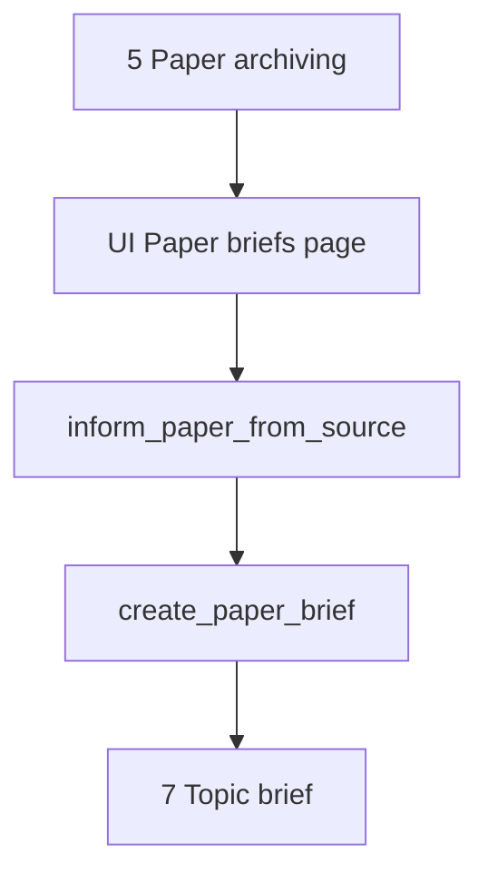

# Paper briefs

This document is the specification for step 6 of the Topic brief generation workflow in [README.md](../../README.md).

In this step, the system fully informs each archived **`Paper`** from its paper source (for PubMed: EFetch), then builds a **`PaperBrief`** for the current **Topic brief generation** with an LLM. Two idempotent Prefect jobs own that work. A dedicated Streamlit page shows progress.

## Glossary

| Term | Meaning |
| --- | --- |
| **`Paper`** | Durable bibliographic record. Product meaning: [README.md](../../README.md) Terminology. Public id is the uppercase DOI. Created or reused in [Paper archiving](paper-archiving.md). |
| **Source-informed** | Durable state on a `Paper`: the row holds the fuller source record for that paper. Marker: `source_informed_at` (non-null). Global to the `Paper`, not per generation. |
| **`PaperBrief`** | Structured LLM summary of one `Paper` for one `TopicBriefGeneration`. Product meaning: [README.md](../../README.md) Terminology. |
| **`inform_paper_from_source`** | Prefect job that fetches the fuller source record and writes it onto `Paper`, then sets `source_informed_at`. |
| **`create_paper_brief`** | Prefect job that drafts a `PaperBrief` after the paper is source-informed. |
| **Paper briefs (step)** | Workflow step that enqueues and tracks those jobs for archived papers that still need a brief for the current generation. |

## Topic brief generation

A **Topic brief generation** (`TopicBriefGeneration`) is one full workflow execution (product steps in [README.md](../../README.md)). This document specifies only step 6 (Paper briefs) for that run.

Paper archiving (create/reuse `Paper` without EFetch) is owned by [paper-archiving.md](paper-archiving.md). PubMed EFetch request parameters and XML field ownership for this step are summarized here and detailed for PubMed in [paper-sources/pubmed.md](paper-sources/pubmed.md).

For the application runtime stack (including Prefect as **planned** in Compose), see [technology-stack.md](../technology-stack.md). This specification is the orchestration **contract** even when Prefect is not yet running locally.

## Scope

### In scope (current v1)

- Take archived `Paper` records from [Paper archiving](paper-archiving.md) (`PaperArchivingResult.papers`) for the current generation.
- For each paper that does **not** yet have a `PaperBrief` for this generation:
  1. Ensure the `Paper` is source-informed (`inform_paper_from_source`).
  2. Create the brief (`create_paper_brief`).
- Extend `Paper` with durable EFetch-derived fields (groups below) and `source_informed_at`.
- Persist one `PaperBrief` per `(topic_brief_generation_id, paper_id)` with durable per-paper progress status for the UI.
- Run both jobs as **idempotent** Prefect flows/tasks by default (no-op success when work is already done).
- Dedicated Streamlit page that enqueues work and shows progress (not the full brief prose as the primary surface).

### Out of scope (v1)

- [Paper archiving](paper-archiving.md) create/reuse rules or its UI.
- Topic brief drafting (step 7).
- Rich author entities, affiliations, ORCID, or author↔paper graphs (future job; see [Future work](#future-work)).
- Storing EFetch article ID lists beyond the existing DOI + `(source_id, source_uid)` handle, CommentsCorrections, bibliography/references, or deferred “Other” XML elements (see below).
- Updating bibliographic identity fields that archiving already set (`doi`, `source_id`, `source_uid`, `url`) during inform, except where this spec says to refresh allowed bibliographic columns from the fuller record.
- Full-text PDF/HTML fetch.
- Non-idempotent “force refresh” of EFetch or brief rewrite (none in v1).
- Adding Prefect services to Compose (infra; see [local-development.md](../local-development.md)).

## Position in the workflow



1. **Paper archiving** yields `PaperArchivingResult.papers` (create or reuse).
2. **Paper briefs** (this specification) processes papers that lack a `PaperBrief` for the current generation. For each such paper, `inform_paper_from_source` runs first if `source_informed_at` is null; then `create_paper_brief` runs.
3. **Topic brief** consumes ready `PaperBrief` rows.

## Selection rules

| Input | Role |
| --- | --- |
| `paper_archiving_result.papers` | Candidate set for this generation’s brief work (session / UI). |
| `topic_brief_generation` id | Scopes `PaperBrief` uniqueness and LLM topic context. |

For each `Paper` in that set (first-seen order):

| Condition | Action |
| --- | --- |
| `PaperBrief` already exists for `(generation_id, paper_id)` and status is `ready` | Skip both jobs (idempotent). Show as done on the UI. |
| `PaperBrief` exists in a non-terminal failure state | Do not auto-retry in v1 unless the implementation defines a safe re-enqueue; UI shows `failed`. |
| No `PaperBrief` yet, `source_informed_at` is null | Enqueue `inform_paper_from_source`, then `create_paper_brief` (ordered). |
| No `PaperBrief` yet, `source_informed_at` is set | Skip inform (idempotent); enqueue `create_paper_brief` only. |

Empty `papers` → no jobs; UI shows an empty success caption.

## Public API and Prefect entrypoints

Domain package (when implemented): `paper_reviewer.topic_brief_generation.paper_briefs` — see [project-structure.md](../project-structure.md). Stub exists until implementation.

Prefect flows (when implemented): `paper_reviewer.flows` (names are the contract):

```text
inform_paper_from_source(paper_id) -> InformPaperFromSourceResult
create_paper_brief(generation_id, paper_id) -> CreatePaperBriefResult
enqueue_paper_briefs(generation_id, paper_ids) -> PaperBriefsEnqueueResult
```

| Entrypoint | Role |
| --- | --- |
| `inform_paper_from_source` | Load `Paper` by id; if already source-informed, return no-op success. Else fetch fuller source record, map fields, set `source_informed_at`, commit (flow owns persistence for the job). |
| `create_paper_brief` | Require source-informed `Paper`. If a ready brief exists for `(generation_id, paper_id)`, return no-op success. Else run LLM, upsert `PaperBrief` content and status. |
| `enqueue_paper_briefs` | UI/orchestrator helper: apply selection rules and submit Prefect runs for the paper id list. Idempotent with respect to already-ready briefs and already-informed papers. |

| Rule | Behavior |
| --- | --- |
| Idempotent by default | Same inputs after success do not re-fetch or re-draft. No force-refresh flag in v1. |
| Fail-soft per paper | One paper failure must not cancel other papers’ runs. |
| Raise | Raise only for unusable infrastructure (DB down, Prefect submit impossible). Per-paper source/LLM errors become `failed` status + error message. |

Pydantic types live under `paper_reviewer.schemas.topic_brief_generation.paper_briefs` (when implemented).

## Durable `Paper` extensions (source-informed)

Archiving fields remain as in [paper-archiving.md](paper-archiving.md). This step **adds** durable columns (or JSONB groups) populated only by `inform_paper_from_source`.

### Marker

| Field | Required | Description |
| --- | --- | --- |
| `source_informed_at` | No until informed | Timezone-aware timestamp when inform succeeded. Null = not yet source-informed. |

Once set, later `inform_paper_from_source` calls are no-op success and must **not** overwrite fields in v1.

### EFetch-derived groups (v1 store)

Implementation may use typed columns and/or JSONB; the **logical** contract is:

| Group | Store |
| --- | --- |
| **Abstract** | Abstract text parts (preserve section labels when present, e.g. BACKGROUND / METHODS); abstract copyright when present; `OtherAbstract` when present |
| **Dates** | Journal `PubDate` (year/month/day as available); `ArticleDate` (electronic); Medline `DateCompleted` / `DateRevised`; PubmedData `History` entries by `PubStatus` |
| **Journal detail** | ISSN; volume; issue; pagination / Medline page range; ISO abbreviation; MedlineTA; country; NlmUniqueID; ISSNLinking |
| **Types / language** | Publication types; language(s); Article `PubModel`; MedlineCitation `Status` / `Owner` |
| **Indexing** | MeSH headings (descriptor, qualifiers when present, major-topic flag); keywords; chemicals; SupplMesh; CitationSubset values |
| **Funding** | Grant list; databank list |
| **COI / notes** | Conflict-of-interest statement; general notes |

Allowed refresh of existing bibliographic display fields when informing (optional, same job, still only when `source_informed_at` was null): `title`, `authors` (flat `list[str]` only), `journal`, `published_year` from the fuller record when present. Do **not** change `doi`, `source_id`, `source_uid`, or `url` in v1 inform.

### Explicitly not stored on `Paper` in v1

| EFetch content | Reason |
| --- | --- |
| `ArticleIdList` / PMC / `OtherID` (beyond DOI + PMID handle) | Deferred; identity already on `Paper` |
| `CommentsCorrectionsList` | Deferred |
| Full bibliography / cited references | Not reliable in standard PubMed EFetch; deferred |
| Rich authors (structured names, affiliations, ORCID) | Future author-entity job |
| `VernacularTitle`, `InvestigatorList`, `GeneSymbolList`, `PersonalNameSubjectList`, `SpaceFlightMission` | Deferred “Other” elements (examples below) |

### Deferred “Other” elements (examples)

| Element | Example meaning |
| --- | --- |
| `VernacularTitle` | Non-English original title, e.g. `¿Cómo hablo con mi familia sobre Gaucher?` |
| `InvestigatorList` | Named collaborators under a collective author (e.g. Carlsson C, Cecchi F) |
| `GeneSymbolList` | Gene symbols on the citation (e.g. `pyrB`, `Ghox-lab`) |
| `PersonalNameSubjectList` | People who are the *subject* of the paper (e.g. Darwin, Hume) |
| `SpaceFlightMission` | Legacy NASA mission tags (e.g. `Project Gemini 11`); NLM stopped adding these in 2005 |

PubMed call shape for inform: see [paper-sources/pubmed.md](paper-sources/pubmed.md) (EFetch section).

## `PaperBrief` model (v1)

| Field | Required | Description |
| --- | --- | --- |
| `id` | Yes (DB) | Primary key. |
| `created_at` | Yes (DB) | Row creation time. |
| `updated_at` | Yes (DB) | Last status/content update. |
| `topic_brief_generation_id` | Yes | FK to the generation. |
| `paper_id` | Yes | FK to `Paper`. |
| `status` | Yes | Progress enum (below). |
| `error_message` | No | Set when `status=failed`. |
| `content` | No until ready | Structured brief payload (JSONB / typed sections). |

### Uniqueness

| Constraint | Rule |
| --- | --- |
| `(topic_brief_generation_id, paper_id)` | Unique. One brief per paper per generation. |

The same `Paper` may receive a **new** brief in a later generation. Source-informed state on `Paper` is shared across generations.

### Status (durable progress)

| Status | Meaning |
| --- | --- |
| `pending` | Work item recorded; jobs not started (or not yet observed). |
| `informing` | `inform_paper_from_source` in progress. |
| `drafting` | Paper is source-informed; `create_paper_brief` in progress. |
| `ready` | Brief content stored; safe for Topic brief. |
| `failed` | Terminal failure for this generation+paper until a later revision adds retry. |

Prefer this durable status on the `PaperBrief` (or an equivalent per-paper work row) so the UI can poll the database without Prefect as the only source of truth. Optional Prefect run ids may be stored for ops, but are not required for the progress UI contract.

### Structured content (LLM output)

`content` is a structured object (not a single free-form blob as the only field). v1 sections:

| Section | Required when ready | Description |
| --- | --- | --- |
| `summary` | Yes | Short overview of the paper relative to the topic. |
| `key_findings` | Yes | List of claim-like findings grounded in the abstract/metadata. |
| `methods` | No | Methods notes when the abstract supports them. |
| `limitations` | No | Limitations when stated or clearly implied by the abstract. |
| `relevance_to_topic` | Yes | Why this paper matters for the current topic statement / facets. |

Grounding: use the source-informed `Paper` fields (especially abstract and indexing) plus generation topic context (`TopicStatement` and available facets). Do not invent citations that are not supported by that material.

## Prefect job behavior

### `inform_paper_from_source`

| Case | Expected |
| --- | --- |
| `source_informed_at` already set | No-op success; do not call EFetch; do not change fields. |
| Not informed, PubMed `source_id` | EFetch XML; map groups; set fields; set `source_informed_at`; related brief status → `drafting` when a brief row exists. |
| Not informed, unsupported `source_id` | Fail that paper (`failed` + message); do not set `source_informed_at`. |
| EFetch / parse / DB error | Fail that paper; leave `source_informed_at` null. |

### `create_paper_brief`

| Case | Expected |
| --- | --- |
| Ready brief already exists for `(generation, paper)` | No-op success. |
| `source_informed_at` null | Do not draft; leave or set status so inform must complete first (orchestrator should not schedule draft before inform succeeds). |
| Source-informed, no ready brief | Set `drafting`; call LLM; store `content`; set `ready`. |
| LLM / validation / DB error | Set `failed` + `error_message`. |

### Idempotency policy

All Prefect jobs in this step are **idempotent by default**. Any future non-idempotent override (force re-fetch, force rewrite) must be an explicit, documented exception. v1 has none.

## Streamlit UI (v1)

Dedicated page module (when implemented): `paper_reviewer.ui.paper_briefs` with `render_paper_briefs()`.

Register in `paper_reviewer.ui.navigation` (`build_app_pages()`):

| Property | Value |
| --- | --- |
| `key` | `paper_briefs` |
| `title` | Paper briefs |
| `url_path` | `paper-briefs` |

Streamlit is presentation only ([technology-stack.md](../technology-stack.md)). Heavy work runs in Prefect; the page enqueues, polls durable status, and displays progress.

### Session keys

| Key | Type | Role |
| --- | --- | --- |
| `paper_archiving_result` | `PaperArchivingResult` | Required prerequisite. Papers = `papers`. |
| `topic_brief_generation_public_id` | `uuid.UUID` | Required generation reference for enqueue and display. |
| `paper_briefs_enqueue_result` | `PaperBriefsEnqueueResult` | Optional cache that enqueue was submitted for this session. |
| `topic_statement` | `TopicStatement` | Optional context for header / LLM context load. |

**Invalidate on new intake:** Clear `paper_briefs_enqueue_result` (and any page-local progress cache) when Topic intake starts a new generation.

**Invalidate when archiving re-runs:** When `paper_archiving_result` is cleared and later replaced, clear `paper_briefs_enqueue_result` so the briefs page can enqueue for the new archived set.

### Page behavior

1. If `paper_archiving_result` or `topic_brief_generation_public_id` is missing → empty state; links to **Paper archiving** and **New Topic brief**.
2. If `papers` is empty → caption that there are no archived papers; do not enqueue.
3. On first visit with prerequisites and no enqueue cache → call `enqueue_paper_briefs` for the archived paper ids; store enqueue result in session.
4. While any brief is not terminal (`ready` / `failed`), refresh/poll durable statuses (auto-refresh or explicit refresh control is an implementation detail; progress must be visible).
5. Primary surface: **progress table/list** — title (link via `url`), DOI, inform state (informed vs not), brief `status`, short error when failed.
6. Do **not** require showing full `content` sections on this page in v1 (optional expand later).
7. When all papers are `ready` (or the set is empty), show success summary and link toward Topic brief (page may not exist yet).

Do **not** run EFetch or LLM inside Streamlit callbacks.

### Progress display labels

| Durable signal | Display |
| --- | --- |
| No brief row yet / `pending` | Queued |
| `informing` | Informing from source |
| `source_informed_at` set, status `drafting` | Drafting brief |
| `ready` | Ready |
| `failed` | Failed |
| Already ready before enqueue | Skipped (already done) |

## Workflow navigation

- **Entry:** After Paper archiving shows a result, link to **Paper briefs** with `paper_archiving_result` and generation id in session.
- **Sidebar order:** … → Paper archiving → Paper briefs → (Topic brief when present).
- **Input:** Consume `PaperArchivingResult.papers` only (not raw triage candidates).

## Orchestration boundary

| Responsibility | Owner |
| --- | --- |
| Create/reuse bibliographic `Paper` | [paper-archiving.md](paper-archiving.md) |
| EFetch params + PubMed XML mapping details | [paper-sources/pubmed.md](paper-sources/pubmed.md) (owned for PubMed); this spec owns which groups land on `Paper` |
| Domain enqueue + status helpers | `paper_reviewer.topic_brief_generation.paper_briefs` |
| Prefect flows/tasks | `paper_reviewer.flows` (`inform_paper_from_source`, `create_paper_brief`) |
| ORM `Paper` extensions, `PaperBrief` | `paper_reviewer.models` |
| Pydantic contracts | `paper_reviewer.schemas.topic_brief_generation` |
| Progress UI | `paper_reviewer.ui.paper_briefs` |
| Topic brief drafting | Later step (not this document) |

This document is the **behavior contract** for domain logic, Prefect jobs, and the Streamlit progress page. Implementation follows [tdd.md](../tdd.md).

## Testability

When implementation starts (TDD per [tdd.md](../tdd.md)):

**`inform_paper_from_source`:**

- Already informed → no EFetch; fields unchanged; success.
- Not informed → mapped fields set; `source_informed_at` set.
- Unsupported source / fetch error → `source_informed_at` remains null; brief/work status `failed` when applicable.

**`create_paper_brief`:**

- Ready brief exists → no LLM; success.
- Not source-informed → does not write ready content.
- Happy path → `content` has required sections; status `ready`.
- LLM failure → status `failed` with message.

**Enqueue / selection:**

- Papers with ready briefs skipped.
- Informed papers skip inform and only enqueue draft.
- Empty paper list → empty enqueue result.

**UI slice** (no Streamlit widget assertions per [tdd.md](../tdd.md)):

- `tests/ui/test_navigation.py`: page registered with key `paper_briefs`, title **Paper briefs**, render callable `render_paper_briefs`, `url_path` `paper-briefs`.
- Pure helpers for status → display label unit-tested without Streamlit when extracted.

## Non-goals (v1)

Do not do this work in the Paper briefs v1 slice:

- Rich author entity registration or related-paper author graphs ([Future work](#future-work)).
- Store deferred EFetch ID lists, CommentsCorrections, references, or “Other” elements listed above.
- Force re-inform or force rewrite of briefs.
- Run EFetch/LLM inside Streamlit.
- Draft the Topic brief (step 7).
- Add Prefect to Compose (document dependency only).

## Future work

**Rich authors (separate job after brief creation):** Register authors as full entities (structured names, affiliations, ORCID when present) and link related papers. Keep flat `authors: list[str]` on `Paper` until that spec exists. That job is an additional stage of the brief pipeline, not part of v1 `inform_paper_from_source` or `create_paper_brief`.
