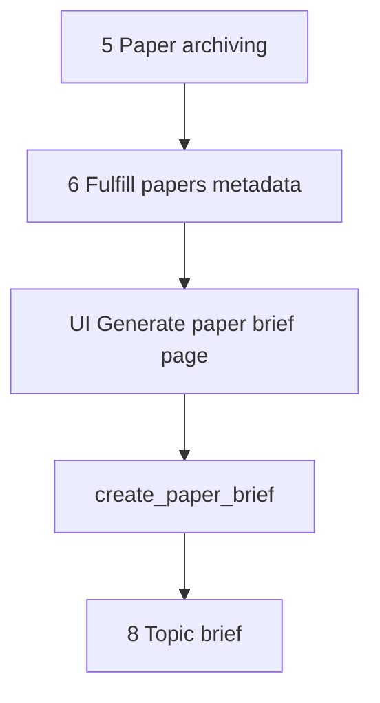

# Generate paper brief

This document is the specification for **step 7** of the Topic brief generation workflow in [README.md](../../README.md).

**Step vs result:** **Generate paper brief** is the workflow **step**. A **paper brief** (`PaperBrief`) is the **result** that step produces for one archived `Paper`. Do not use “paper briefs” alone to name this step.

In this step, the system builds a **global** **`PaperBrief`** with an LLM for each archived paper that has full text `succeeded` and still needs a brief. An idempotent Prefect job owns that work. A dedicated Streamlit page shows progress.

**Prerequisite:** [Fulfill papers metadata](06-fulfill-papers-metadata.md) must have set `full_text_status = succeeded` (PubMed: PMC Cloud `full_text_plain`). Do not call EFetch or PMC Cloud in this step. Papers with full text `failed` or `unavailable` do **not** get a brief.

`PaperAspectStatus` is owned by [Fulfill papers metadata](06-fulfill-papers-metadata.md). This step reuses it on `PaperBrief.status`.

## Glossary

| Term | Meaning |
| --- | --- |
| **`Paper`** | Durable bibliographic record. Product meaning: [README.md](../../README.md) Terminology. Public id is the uppercase DOI. Created or reused in [Paper archiving](05-paper-archiving.md). |
| **Source record / full text** | Global aspects on `Paper`. Markers: `source_record_status`, `full_text_status`. Owned by [Fulfill papers metadata](06-fulfill-papers-metadata.md). |
| **Paper brief** / **`PaperBrief`** | **Result** artifact: structured, **topic-agnostic** LLM summary of one `Paper`. One row per paper. Reused in every later Topic brief generation. Product meaning: [README.md](../../README.md) Terminology. |
| **`create_paper_brief`** | Prefect job that drafts or (when forced) rewrites a **paper brief**. |
| **Generate paper brief** | Workflow **step** (this document) that enqueues and tracks `create_paper_brief` for archived papers with full text `succeeded`. |

## Topic brief generation

A **Topic brief generation** (`TopicBriefGeneration`) is one full workflow execution (product steps in [README.md](../../README.md)). This document specifies only step 7 (**Generate paper brief**) for that run.

Source record and full text are owned by [Fulfill papers metadata](06-fulfill-papers-metadata.md). PubMed EFetch / Cloud details: [paper-sources/pubmed.md](paper-sources/pubmed.md).

`PaperBrief` is **not** scoped to a generation. If a later generation archives a paper that already has a succeeded brief, step 7 skips that paper and step 8 reuses the brief. Topic relevance is **not** stored on the brief; Topic brief (step 8) cites the paper in prose.

For the application runtime stack (including Prefect as a Compose service), see [technology-stack.md](../technology-stack.md) and [local-development.md](../local-development.md). This specification is the orchestration contract; brief work runs in Prefect, not in Streamlit.

## Scope

### In scope (current v1)

- Take archived `Paper` records from [Paper archiving](05-paper-archiving.md) (`PaperArchivingResult.papers`) for the current generation’s UI set.
- For each paper with `full_text_status = succeeded` and `PaperBrief.status` not `succeeded`: enqueue `create_paper_brief`.
- Persist one `PaperBrief` per `paper_id` with `PaperAspectStatus`.
- Run the brief job as an **idempotent** Prefect flow by default (no-op when brief is already `succeeded`).
- Dedicated Streamlit page that enqueues brief work and shows progress (not the full brief prose as the primary surface).
- Accept a **force rewrite** only when called from `regenerate_paper` ([Fulfill papers metadata](06-fulfill-papers-metadata.md#full-regenerate-orchestrator)).

### Out of scope (v1)

- [Paper archiving](05-paper-archiving.md) create/reuse rules or its UI.
- Source-record / full-text flows — owned by [Fulfill papers metadata](06-fulfill-papers-metadata.md).
- Topic brief drafting (step 8), including any per-topic relevance prose.
- `relevance_to_topic` or a topic-relative summary on `PaperBrief`.
- A dedicated Streamlit **page** for `regenerate_paper` (page 7 shows the same per-paper **Regenerate** button as page 6; behavior owned by [Fulfill papers metadata](06-fulfill-papers-metadata.md#full-regenerate-orchestrator)).
- Rich author entities, affiliations, ORCID, or author↔paper graphs (future job; see [Future work](#future-work)).
- Fetching full text or PDF URLs (consume stored `full_text_plain` / URLs from step 6).
- Auto-retry of `failed` briefs on page 7 (none; only `regenerate_paper` may retry).
- Prefect Compose service topology — owned by [local-development.md](../local-development.md) / [technology-stack.md](../technology-stack.md).

## Position in the workflow



1. **Paper archiving** yields `PaperArchivingResult.papers` (create or reuse).
2. **Fulfill papers metadata** sets `source_record_status` then `full_text_status` — see [Fulfill papers metadata](06-fulfill-papers-metadata.md).
3. **Generate paper brief** (this specification) creates or reuses a global `PaperBrief` for papers with full text `succeeded`.
4. **Topic brief** consumes succeeded `PaperBrief` rows and cites those papers in the topic prose.

## Selection rules

| Input | Role |
| --- | --- |
| `paper_archiving_result.papers` | Candidate set for this generation’s brief work (session / UI). |

For each `Paper` in that set (first-seen order):

| Condition | Action |
| --- | --- |
| `full_text_status` is `not_started` | Do not enqueue. Show that Fulfill papers metadata must finish first. |
| `full_text_status` is `failed` or `unavailable` | Do not enqueue. Show blocked (no full text). |
| `full_text_status` is `succeeded` and `PaperBrief.status` is `succeeded` | Skip (idempotent). Show as done. |
| `full_text_status` is `succeeded` and `PaperBrief.status` is `failed` | Do not auto-retry on page 7. Show Failed. |
| `full_text_status` is `succeeded` and no brief row or status is `not_started` | Enqueue `create_paper_brief`. |

Empty `papers` → no jobs; UI shows an empty success caption.

Default skip rules for `PaperBrief.status` match [Fulfill papers metadata](06-fulfill-papers-metadata.md#paperaspectstatus): skip `succeeded` / `failed` / `unavailable`; run only `not_started`.

## Public API and Prefect entrypoints

Domain package: `paper_reviewer.topic_brief_generation.generate_paper_brief` — see [project-structure.md](../project-structure.md).

Prefect flows (names are the contract): `paper_reviewer.flows`

```text
create_paper_brief(paper_id, doi, force=false) -> CreatePaperBriefResult
enqueue_generate_paper_briefs(paper_ids) -> GeneratePaperBriefsEnqueueResult
```

| Entrypoint | Role |
| --- | --- |
| `create_paper_brief` | Require `full_text_status = succeeded`. If a succeeded brief exists and `force` is false, return no-op success. Else run LLM, upsert `PaperBrief` content, set `succeeded`. `force=true` is allowed only from `regenerate_paper`. |
| `enqueue_generate_paper_briefs` | UI helper: apply selection rules and submit Prefect runs for eligible paper ids. Idempotent with respect to already-succeeded briefs. Does not enqueue source-record or full-text jobs. Does not pass `force`. |

| Rule | Behavior |
| --- | --- |
| Idempotent by default | Same inputs after success do not re-draft. |
| Fail-soft per paper | One paper failure must not cancel other papers’ runs. |
| Raise | Raise only for unusable infrastructure (DB down, Prefect submit impossible). Per-paper LLM errors become `failed` + error message. |

Pydantic types live under `paper_reviewer.schemas.topic_brief_generation`.

DOI on flow parameters is for UI/search and the submit-time run name; durable work keys off `paper_id`.

### Result type fields (v1)

```text
PaperBriefContent
  summary: str
  objective: str
  study_type: str | None
  timeline_geography: str | None
  population_sample: str | None
  key_methods: str | None
  key_findings: list[str]
  discussion: str | None
  limitations: str | None
  recommendations: str | None

CreatePaperBriefResult
  paper_id: int
  status: PaperAspectStatus
  error_message: str | None

GeneratePaperBriefsEnqueueResult
  submitted_paper_ids: list[int]
  skipped_already_terminal: list[int]
```

`skipped_already_terminal` is every paper id in the input list that exists and is **not** submitted (full text not `succeeded`, or brief already `succeeded` / `failed` / `unavailable`). Do not store Prefect run ids on these types for UI progress.

Example after enqueue of papers `[10, 11, 12]` where 11 already has a succeeded brief and 12 has full text `unavailable`:

```text
GeneratePaperBriefsEnqueueResult(
  submitted_paper_ids=[10],
  skipped_already_terminal=[11, 12],
)
```

## `PaperBrief` model (v1)

| Field | Required | Description |
| --- | --- | --- |
| `id` | Yes (DB) | Primary key. |
| `created_at` | Yes (DB) | Row creation time. |
| `updated_at` | Yes (DB) | Last status/content update. |
| `paper_id` | Yes | FK to `Paper`. Unique. |
| `status` | Yes | `PaperAspectStatus`. Default `not_started`. |
| `error_message` | No | Set when `status=failed`. Cleared on `succeeded`. |
| `content` | No until succeeded | Structured brief payload (JSONB / typed sections). |

`Paper` navigates to this row (1:1). Do **not** copy brief status onto `Paper`.

There is **no** `topic_brief_generation_id` on `PaperBrief`.

### Uniqueness

| Constraint | Rule |
| --- | --- |
| `paper_id` | Unique. One brief per paper, reused across generations. |

### Status

Use `PaperAspectStatus` ([Fulfill papers metadata](06-fulfill-papers-metadata.md#paperaspectstatus)):

| Status | Meaning on `PaperBrief` |
| --- | --- |
| `not_started` | No completed draft. |
| `succeeded` | Brief content stored; safe for Topic brief. Frozen on page 7. |
| `failed` | Terminal on page 7 until `regenerate_paper`. |
| `unavailable` | Not used on the normal path (brief is not attempted unless full text succeeded). |

There is **no** `informing`, `pending`, `drafting`, or `ready` member. Source-record and full-text progress belong to [Fulfill papers metadata](06-fulfill-papers-metadata.md). While `create_paper_brief` runs, leave `not_started` until the flow writes `succeeded` or `failed`.

Prefer this durable status so the UI can poll the database without Prefect as the only source of truth. Optional Prefect run ids may be stored for ops, but are not required for the progress UI contract.

### Structured content (LLM output)

`content` is a structured object (not a single free-form blob as the only field). v1 sections are **topic-agnostic**.

**Owner of section list and prompt text:** [`paper_brief_template.md`](../../src/paper_reviewer/topic_brief_generation/generate_paper_brief/paper_brief_template.md) in `paper_reviewer.topic_brief_generation.generate_paper_brief`. YAML front matter lists JSON field ids and required flags. The Markdown body is the LLM system prompt. Do not copy that outline into this spec, AGENTS.md, or a skill.

`create_paper_brief` loads that file as the system prompt. It sends `full_text_plain` plus archived title / journal / year from `Paper` in the user message (bibliographic facts, not a topic). Parse the model output into `PaperBriefContent` (field ids must match the template front matter). Title, journal, and year are **not** LLM content fields.

Do **not** store `relevance_to_topic` or a topic-relative summary. Step 8 reflects relevance as citations in the topic-brief prose.

Grounding: use `Paper.full_text_plain` only. Do not fall back to abstract-only prompting. Do not inject the current `TopicStatement` or facets into the brief prompt. Full EFetch metadata lives on `Paper.source_record` for other tasks; v1 brief prompting does not require MeSH/funding/COI. Do not invent citations that are not supported by the full text. Do not call EFetch or PMC Cloud from this step.

## Prefect job behavior

### `create_paper_brief`

| Case | Expected |
| --- | --- |
| `force` is false and `PaperBrief.status` is `succeeded` | No-op success. |
| `force` is false and status is `failed` | No-op; leave `failed`. |
| `full_text_status` is not `succeeded` | Do not draft; do not set `succeeded`. Page 7 must not schedule this case. |
| `full_text_status` is `succeeded`, brief `not_started` (or no row) | Call LLM; store `content`; set `succeeded`; clear error. |
| LLM / validation / DB error | Set `failed` + `error_message`. |
| `force` is true (from `regenerate_paper` only) and full text `succeeded` | Rewrite `content` even if brief was `succeeded` or `failed`; then `succeeded` or `failed` from this attempt. |

### Idempotency policy

The Prefect job on page 7 is **idempotent by default**. The documented exception is `force=true` from `regenerate_paper`.

When full text later changes (new Cloud version) or a brief must be rebuilt after a better source record, **only** `regenerate_paper` rewrites the brief. Page 7 does not.

## Streamlit UI (v1)

Dedicated page module: `paper_reviewer.ui.generate_paper_brief` with `render_generate_paper_brief()`.

Register in `paper_reviewer.ui.navigation` (`build_app_pages()`):

| Property | Value |
| --- | --- |
| `key` | `generate_paper_brief` |
| `title` | Generate paper brief |
| `url_path` | `generate-paper-brief` |

Streamlit is presentation only ([technology-stack.md](../technology-stack.md)). Heavy work runs in Prefect; the page enqueues and polls **durable DB status** on `PaperBrief` (and `Paper.full_text_status` for the gate). Do not use Prefect run ids as progress truth.

### Session keys

| Key | Type | Role |
| --- | --- |
| `paper_archiving_result` | `PaperArchivingResult` | Required prerequisite. Use `papers` as the **id list**; reload each `Paper` from the DB for `full_text_status` and display fields. |
| `topic_brief_generation_public_id` | `uuid.UUID` | Required generation reference for display / navigation. Not a brief identity key. |
| `generate_paper_brief_enqueue_result` | `GeneratePaperBriefsEnqueueResult` | Optional cache that enqueue was submitted for this session. |

**Invalidate on new intake:** Clear `generate_paper_brief_enqueue_result` (and any page-local progress cache) when Topic intake starts a new generation — same cascade as [Fulfill papers metadata](06-fulfill-papers-metadata.md) (new generation clears all later-step session state).

**Invalidate when an upstream step re-runs:** When triage re-confirms, archiving result is cleared/replaced, or fulfill enqueue is cleared for a new archived set, clear `generate_paper_brief_enqueue_result`. Rule: re-run step N → clear steps N+1….

Does **not** by itself delete durable global `Paper` or `PaperBrief` rows.

### Page behavior

1. If `paper_archiving_result` or `topic_brief_generation_public_id` is missing → empty state; links to **Paper archiving**, **Fulfill papers metadata**, and **New Topic brief**.
2. If `papers` is empty → caption that there are no archived papers; do not enqueue.
3. If any paper in the set has `full_text_status = not_started` → show incomplete prerequisite; link to **Fulfill papers metadata**; do not enqueue drafts for those papers.
4. On first visit with prerequisites (enqueue only for papers with full text `succeeded` needing briefs) and no enqueue cache → call `enqueue_generate_paper_briefs` for eligible paper ids; store enqueue result in session.
5. While any eligible brief is `not_started` after enqueue, refresh/poll durable statuses.
6. Primary surface: **progress table/list** — title (link via `url`), DOI, brief `status`, short error when failed. Show blocked rows for papers without full text `succeeded`.
7. Do **not** require showing full `content` sections on this page in v1 (optional expand later).
8. When all **eligible** papers (full text `succeeded`) are `succeeded` or `failed` (or the eligible set is empty), show a summary and link toward Topic brief (page may not exist yet).

Do **not** run LLM (or EFetch) inside Streamlit callbacks. On each progress row, when both source-record and full-text statuses are terminal, show a secondary **Regenerate** button. Click submits `regenerate_paper` (owned by [Fulfill papers metadata](06-fulfill-papers-metadata.md#full-regenerate-orchestrator)). Page 7 auto-enqueue still does not pass `force` to `create_paper_brief`.

### Progress display labels

| Durable signal | Display |
| --- | --- |
| `full_text_status` is `not_started` | Incomplete (fulfill papers metadata first) |
| `full_text_status` is `failed` or `unavailable` | Blocked (no full text) |
| No brief row / brief `not_started` after enqueue | Fulfilling |
| Brief `succeeded` | Succeeded |
| Brief `failed` | Failed |
| Already `succeeded` before enqueue | Skipped (already done) |

## Workflow navigation

- **Entry:** After **Fulfill papers metadata** has terminal aspect statuses for the archived set, link to **Generate paper brief** with `paper_archiving_result` and generation id in session.
- **Sidebar order:** … → Paper archiving → Fulfill papers metadata → Generate paper brief → (Topic brief when present).
- **Input:** Consume `PaperArchivingResult.papers` only. Enqueue drafts only when `full_text_status = succeeded`.

## Orchestration boundary

| Responsibility | Owner |
| --- | --- |
| Create/reuse bibliographic `Paper` | [Paper archiving](05-paper-archiving.md) |
| Source record / full text / `PaperAspectStatus` / `regenerate_paper` steps 1–2 | [Fulfill papers metadata](06-fulfill-papers-metadata.md); [paper-sources/pubmed.md](paper-sources/pubmed.md) for PubMed |
| Domain enqueue + `create_paper_brief` helper | `paper_reviewer.topic_brief_generation.generate_paper_brief` |
| Prefect flow | `paper_reviewer.flows` (`create_paper_brief`); `regenerate_paper` calls this flow with `force=true` |
| ORM `PaperBrief` | `paper_reviewer.models` |
| Pydantic contracts | `paper_reviewer.schemas.topic_brief_generation` |
| Progress UI | `paper_reviewer.ui.generate_paper_brief` |
| Topic brief drafting | Later step (not this document) |

This document is the **behavior contract** for domain logic, the brief Prefect job, and the Streamlit progress page. Implementation follows [tdd.md](../tdd.md).

## Testability

When implementation starts (TDD per [tdd.md](../tdd.md)):

The LLM is an **external** boundary: inject or stub the content generator. Do not call a live API in tests. Do not name a vendor in this spec; the production client lives in [technology-stack.md](../technology-stack.md). The optional API base URL and model name are owned by [local-development.md](../local-development.md).

**`create_paper_brief`:**

- Succeeded brief exists, `force` false → no LLM; success.
- Full text not `succeeded` → does not write succeeded content.
- Happy path with `full_text_plain` → prompt includes the template file and the plain full text; `content` has required template fields; status `succeeded`.
- `PaperBriefContent` field names match the template YAML front matter (fail if they drift).
- `force` true and full text `succeeded` → rewrites content even if a succeeded brief existed.
- LLM failure → status `failed` with message.

**Enqueue / selection:**

- Papers with succeeded briefs skipped.
- Papers with full text not `succeeded` are not enqueued.
- Empty paper list → empty enqueue result.

**UI slice** (no Streamlit widget assertions per [tdd.md](../tdd.md)):

- `tests/ui/test_navigation.py`: page registered with key `generate_paper_brief`, title **Generate paper brief**, render callable `render_generate_paper_brief`, `url_path` `generate-paper-brief`.
- Pure helpers for status → display label and `may_submit_regenerate_paper` unit-tested without Streamlit when extracted.

## Non-goals (v1)

Do not do this work in the Generate paper brief v1 slice:

- Source-record / full-text fetch ([Fulfill papers metadata](06-fulfill-papers-metadata.md)).
- Topic-conditioned brief fields.
- A dedicated Streamlit **page** for `regenerate_paper` (the per-paper button on this page submits the orchestrator owned by spec 06).
- Rich author entity registration or related-paper author graphs ([Future work](#future-work)).
- Auto-retry of `failed` briefs on page 7.
- Run LLM, EFetch, or PMC Cloud inside Streamlit.
- Draft the Topic brief (step 8).
- Re-define Prefect Compose topology (shared with fulfill; see [local-development.md](../local-development.md)).

## Future work

**Rich authors (separate job after brief creation):** Register authors as full entities (structured names, affiliations, ORCID when present) and link related papers. Keep flat `authors: list[str]` on `Paper` until that spec exists. That job is an additional aspect after this step, not part of v1 `create_paper_brief`.
