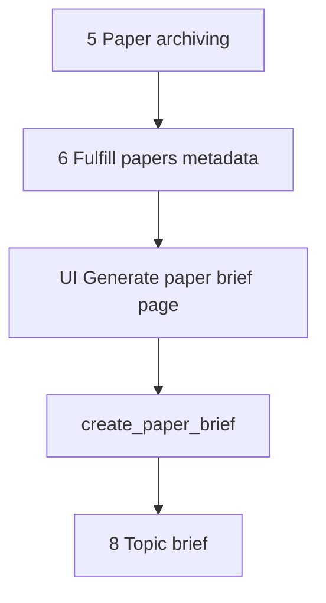

# Generate paper brief

This document is the specification for **step 7** of the Topic brief generation workflow in [README.md](../../README.md).

**Step vs result:** **Generate paper brief** is the workflow **step**. A **paper brief** (`PaperBrief`) is the **result** that step produces for one archived `Paper` in one `TopicBriefGeneration`. Do not use “paper briefs” alone to name this step.

In this step, the system builds a **`PaperBrief`** for the current **Topic brief generation** with an LLM, for each source-informed archived paper that still needs a brief. An idempotent Prefect job owns that work. A dedicated Streamlit page shows progress.

**Prerequisite:** [Fulfill papers metadata](06-fulfill-papers-metadata.md) source-informs each `Paper` (for PubMed: EFetch, optionally PMC Cloud `full_text_plain`). Do not call EFetch or PMC Cloud in this step.

## Glossary

| Term | Meaning |
| --- | --- |
| **`Paper`** | Durable bibliographic record. Product meaning: [README.md](../../README.md) Terminology. Public id is the uppercase DOI. Created or reused in [Paper archiving](05-paper-archiving.md). Must be **source-informed** before this step drafts a brief. |
| **Source-informed** | Durable state on a `Paper`: the row holds the fuller source record. Marker: `source_informed_at` (non-null). Owned by [Fulfill papers metadata](06-fulfill-papers-metadata.md). |
| **Paper brief** / **`PaperBrief`** | **Result** artifact: structured LLM summary of one `Paper` for one `TopicBriefGeneration`. Product meaning: [README.md](../../README.md) Terminology. |
| **`create_paper_brief`** | Prefect job that drafts a **paper brief** (`PaperBrief`) after the paper is source-informed. |
| **Generate paper brief** | Workflow **step** (this document) that enqueues and tracks brief jobs for archived papers that still need a **paper brief** for the current generation. |

## Topic brief generation

A **Topic brief generation** (`TopicBriefGeneration`) is one full workflow execution (product steps in [README.md](../../README.md)). This document specifies only step 7 (**Generate paper brief**) for that run.

Source-inform (EFetch, optional PMC Cloud enrichment, and `Paper` field groups) is owned by [Fulfill papers metadata](06-fulfill-papers-metadata.md). PubMed EFetch / Cloud details: [paper-sources/pubmed.md](paper-sources/pubmed.md).

For the application runtime stack (including Prefect as a Compose service), see [technology-stack.md](../technology-stack.md) and [local-development.md](../local-development.md). This specification is the orchestration contract; brief work runs in Prefect, not in Streamlit.

## Scope

### In scope (current v1)

- Take archived `Paper` records from [Paper archiving](05-paper-archiving.md) (`PaperArchivingResult.papers`) for the current generation.
- For each paper that does **not** yet have a ready `PaperBrief` for this generation and **is** source-informed: enqueue `create_paper_brief`.
- Persist one `PaperBrief` per `(topic_brief_generation_id, paper_id)` with durable per-paper progress status for the UI.
- Run the brief job as an **idempotent** Prefect flow/task by default (no-op success when a ready brief already exists).
- Dedicated Streamlit page that enqueues brief work and shows progress (not the full brief prose as the primary surface).

### Out of scope (v1)

- [Paper archiving](05-paper-archiving.md) create/reuse rules or its UI.
- Source-inform / EFetch / PMC Cloud enrichment / extending `Paper` with fuller source fields — owned by [Fulfill papers metadata](06-fulfill-papers-metadata.md).
- Topic brief drafting (step 8).
- Rich author entities, affiliations, ORCID, or author↔paper graphs (future job; see [Future work](#future-work)).
- Fetching full text or PDF URLs (consume stored `full_text_plain` / URLs from step 6; do not call Cloud here).
- Non-idempotent “force rewrite” of briefs (none in v1).
- Prefect Compose service topology — owned by [local-development.md](../local-development.md) / [technology-stack.md](../technology-stack.md) (added with fulfill / shared infra).

## Position in the workflow



1. **Paper archiving** yields `PaperArchivingResult.papers` (create or reuse).
2. **Fulfill papers metadata** ensures each paper is source-informed — see [Fulfill papers metadata](06-fulfill-papers-metadata.md).
3. **Generate paper brief** (this specification) creates `PaperBrief` rows for papers that lack a ready brief for the current generation.
4. **Topic brief** consumes ready `PaperBrief` rows.

## Selection rules

| Input | Role |
| --- | --- |
| `paper_archiving_result.papers` | Candidate set for this generation’s brief work (session / UI). |
| `topic_brief_generation` id | Scopes `PaperBrief` uniqueness and LLM topic context. |

For each `Paper` in that set (first-seen order):

| Condition | Action |
| --- | --- |
| `PaperBrief` already exists for `(generation_id, paper_id)` and status is `ready` | Skip (idempotent). Show as done on the UI. |
| `PaperBrief` exists in a non-terminal failure state | Do not auto-retry in v1 unless the implementation defines a safe re-enqueue; UI shows `failed`. |
| No ready `PaperBrief`, `source_informed_at` is null | Do not enqueue draft. Show blocked / incomplete; link back to **Fulfill papers metadata**. |
| No ready `PaperBrief`, `source_informed_at` is set | Enqueue `create_paper_brief`. |

Empty `papers` → no jobs; UI shows an empty success caption.

## Public API and Prefect entrypoints

Domain package (when implemented): `paper_reviewer.topic_brief_generation.generate_paper_brief` — see [project-structure.md](../project-structure.md).

Prefect flows (when implemented): `paper_reviewer.flows` (names are the contract):

```text
create_paper_brief(generation_id, paper_id) -> CreatePaperBriefResult
enqueue_generate_paper_briefs(generation_id, paper_ids) -> GeneratePaperBriefsEnqueueResult
```

| Entrypoint | Role |
| --- | --- |
| `create_paper_brief` | Require source-informed `Paper`. If a ready brief exists for `(generation_id, paper_id)`, return no-op success. Else run LLM, upsert `PaperBrief` content and status. |
| `enqueue_generate_paper_briefs` | UI/orchestrator helper: apply selection rules and submit Prefect runs for the paper id list. Idempotent with respect to already-ready briefs. Does not enqueue inform jobs. |

| Rule | Behavior |
| --- | --- |
| Idempotent by default | Same inputs after success do not re-draft. No force-rewrite flag in v1. |
| Fail-soft per paper | One paper failure must not cancel other papers’ runs. |
| Raise | Raise only for unusable infrastructure (DB down, Prefect submit impossible). Per-paper LLM errors become `failed` status + error message. |

Pydantic types live under `paper_reviewer.schemas.topic_brief_generation.generate_paper_brief` (when implemented).

## `PaperBrief` model (v1)

| Field | Required | Description |
| --- | --- | --- |
| `id` | Yes (DB) | Primary key. |
| `created_at` | Yes (DB) | Row creation time. |
| `updated_at` | Yes (DB) | Last status/content update. |
| `topic_brief_generation_id` | Yes | FK to the generation. |
| `paper_id` | Yes | FK to `Paper`. |
| `status` | Yes | Progress enum (below). |
| `error_message` | No | Set when `status=failed`. |
| `content` | No until ready | Structured brief payload (JSONB / typed sections). |

### Uniqueness

| Constraint | Rule |
| --- | --- |
| `(topic_brief_generation_id, paper_id)` | Unique. One brief per paper per generation. |

The same `Paper` may receive a **new** brief in a later generation. Source-informed state on `Paper` is shared across generations (owned by [Fulfill papers metadata](06-fulfill-papers-metadata.md)).

### Status (durable progress)

| Status | Meaning |
| --- | --- |
| `pending` | Work item recorded; draft job not started (or not yet observed). |
| `drafting` | `create_paper_brief` in progress. |
| `ready` | Brief content stored; safe for Topic brief. |
| `failed` | Terminal failure for this generation+paper until a later revision adds retry. |

There is **no** `informing` status on `PaperBrief`. Source-inform progress belongs to [Fulfill papers metadata](06-fulfill-papers-metadata.md).

Prefer this durable status on the `PaperBrief` (or an equivalent per-paper work row) so the UI can poll the database without Prefect as the only source of truth. Optional Prefect run ids may be stored for ops, but are not required for the progress UI contract.

### Structured content (LLM output)

`content` is a structured object (not a single free-form blob as the only field). v1 sections:

| Section | Required when ready | Description |
| --- | --- | --- |
| `summary` | Yes | Short overview of the paper relative to the topic. |
| `key_findings` | Yes | List of claim-like findings grounded in the available paper text (full text when present, else abstract/metadata). |
| `methods` | No | Methods notes when the available paper text supports them. |
| `limitations` | No | Limitations when stated or clearly implied by the available paper text. |
| `relevance_to_topic` | Yes | Why this paper matters for the current topic statement / facets. |

Grounding: prefer source-informed `Paper.full_text_plain` when non-null. Otherwise use **abstract-focused** fields (`abstract_text`, title/authors/journal/year). Always include generation topic context (`TopicStatement` and available facets). Full EFetch metadata lives on `Paper.source_record` for other tasks; v1 brief prompting does not require MeSH/funding/COI. Do not invent citations that are not supported by that material. Do not call EFetch or PMC Cloud from this step.

## Prefect job behavior

### `create_paper_brief`

| Case | Expected |
| --- | --- |
| Ready brief already exists for `(generation, paper)` | No-op success. |
| `source_informed_at` null | Do not draft; leave or set status so Fulfill papers metadata must finish first (orchestrator / UI must not schedule draft before inform succeeds). |
| Source-informed, no ready brief | Set `drafting`; call LLM; store `content`; set `ready`. |
| LLM / validation / DB error | Set `failed` + `error_message`. |

### Idempotency policy

The Prefect job in this step is **idempotent by default**. Any future non-idempotent override (force rewrite) must be an explicit, documented exception. v1 has none.

## Streamlit UI (v1)

Dedicated page module (when implemented): `paper_reviewer.ui.generate_paper_brief` with `render_generate_paper_brief()`.

Register in `paper_reviewer.ui.navigation` (`build_app_pages()`):

| Property | Value |
| --- | --- |
| `key` | `generate_paper_brief` |
| `title` | Generate paper brief |
| `url_path` | `generate-paper-brief` |

Streamlit is presentation only ([technology-stack.md](../technology-stack.md)). Heavy work runs in Prefect; the page enqueues and polls **durable DB status** on `PaperBrief` (and `Paper.source_informed_at` for prerequisites). Do not use Prefect run ids as progress truth.

### Session keys

| Key | Type | Role |
| --- | --- |
| `paper_archiving_result` | `PaperArchivingResult` | Required prerequisite. Use `papers` as the **id list**; reload each `Paper` from the DB for `source_informed_at` and display fields. |
| `topic_brief_generation_public_id` | `uuid.UUID` | Required generation reference for enqueue and display. |
| `generate_paper_brief_enqueue_result` | `GeneratePaperBriefsEnqueueResult` | Optional cache that enqueue was submitted for this session. |
| `topic_statement` | `TopicStatement` | Optional context for header / LLM context load. |

**Invalidate on new intake:** Clear `generate_paper_brief_enqueue_result` (and any page-local progress cache) when Topic intake starts a new generation — same cascade as [Fulfill papers metadata](06-fulfill-papers-metadata.md) (new generation clears all later-step session state).

**Invalidate when an upstream step re-runs:** When triage re-confirms, archiving result is cleared/replaced, or fulfill enqueue is cleared for a new archived set, clear `generate_paper_brief_enqueue_result` so this page cannot continue with a stale paper set. Rule: re-run step N → clear steps N+1….

Does **not** by itself delete durable global `Paper` rows; per-generation `PaperBrief` rows follow this step’s own idempotency when re-enqueued.

### Page behavior

1. If `paper_archiving_result` or `topic_brief_generation_public_id` is missing → empty state; links to **Paper archiving**, **Fulfill papers metadata**, and **New Topic brief**.
2. If `papers` is empty → caption that there are no archived papers; do not enqueue.
3. If any paper in the set is not source-informed → show incomplete prerequisite; link to **Fulfill papers metadata**; do not enqueue drafts for those papers (selection rules).
4. On first visit with prerequisites (papers present; enqueue only for source-informed papers needing briefs) and no enqueue cache → call `enqueue_generate_paper_briefs` for eligible paper ids; store enqueue result in session.
5. While any brief is not terminal (`ready` / `failed`), refresh/poll durable statuses (auto-refresh or explicit refresh control is an implementation detail; progress must be visible).
6. Primary surface: **progress table/list** — title (link via `url`), DOI, brief `status`, short error when failed.
7. Do **not** require showing full `content` sections on this page in v1 (optional expand later).
8. When all eligible papers are `ready` (or the set is empty), show success summary and link toward Topic brief (page may not exist yet).

Do **not** run LLM (or EFetch) inside Streamlit callbacks.

### Progress display labels

| Durable signal | Display |
| --- | --- |
| Not source-informed | Incomplete (fulfill papers metadata first) |
| No brief row yet / `pending` | Queued |
| `drafting` | Drafting brief |
| `ready` | Ready |
| `failed` | Failed |
| Already ready before enqueue | Skipped (already done) |

## Workflow navigation

- **Entry:** After **Fulfill papers metadata** succeeds for the archived set, link to **Generate paper brief** with `paper_archiving_result` and generation id in session.
- **Sidebar order:** … → Paper archiving → Fulfill papers metadata → Generate paper brief → (Topic brief when present).
- **Input:** Consume `PaperArchivingResult.papers` only (not raw triage candidates). Require source-informed papers for draft enqueue.

## Orchestration boundary

| Responsibility | Owner |
| --- | --- |
| Create/reuse bibliographic `Paper` | [Paper archiving](05-paper-archiving.md) |
| Source-inform / EFetch / PMC Cloud / `Paper` fuller fields | [Fulfill papers metadata](06-fulfill-papers-metadata.md); [paper-sources/pubmed.md](paper-sources/pubmed.md) for PubMed |
| Domain enqueue + status helpers | `paper_reviewer.topic_brief_generation.generate_paper_brief` |
| Prefect flows/tasks | `paper_reviewer.flows` (`create_paper_brief`) |
| ORM `PaperBrief` | `paper_reviewer.models` |
| Pydantic contracts | `paper_reviewer.schemas.topic_brief_generation` |
| Progress UI | `paper_reviewer.ui.generate_paper_brief` |
| Topic brief drafting | Later step (not this document) |

This document is the **behavior contract** for domain logic, the brief Prefect job, and the Streamlit progress page. Implementation follows [tdd.md](../tdd.md).

## Testability

When implementation starts (TDD per [tdd.md](../tdd.md)):

**`create_paper_brief`:**

- Ready brief exists → no LLM; success.
- Not source-informed → does not write ready content.
- Happy path with `full_text_plain` → prompt/grounding uses plain full text; `content` has required sections; status `ready`.
- Happy path without `full_text_plain` → grounding falls back to abstract + bibliographic columns; status `ready`.
- LLM failure → status `failed` with message.

**Enqueue / selection:**

- Papers with ready briefs skipped.
- Papers that are not source-informed are not enqueued for draft.
- Empty paper list → empty enqueue result.

**UI slice** (no Streamlit widget assertions per [tdd.md](../tdd.md)):

- `tests/ui/test_navigation.py`: page registered with key `generate_paper_brief`, title **Generate paper brief**, render callable `render_generate_paper_brief`, `url_path` `generate-paper-brief`.
- Pure helpers for status → display label unit-tested without Streamlit when extracted.

## Non-goals (v1)

Do not do this work in the Generate paper brief v1 slice:

- Source-inform / EFetch / PMC Cloud fetch ([Fulfill papers metadata](06-fulfill-papers-metadata.md)).
- Rich author entity registration or related-paper author graphs ([Future work](#future-work)).
- Force rewrite of briefs.
- Run LLM, EFetch, or PMC Cloud inside Streamlit.
- Draft the Topic brief (step 8).
- Re-define Prefect Compose topology (shared with fulfill; see [local-development.md](../local-development.md)).

## Future work

**Rich authors (separate job after brief creation):** Register authors as full entities (structured names, affiliations, ORCID when present) and link related papers. Keep flat `authors: list[str]` on `Paper` until that spec exists. That job is an additional stage after this step, not part of v1 `create_paper_brief`.
