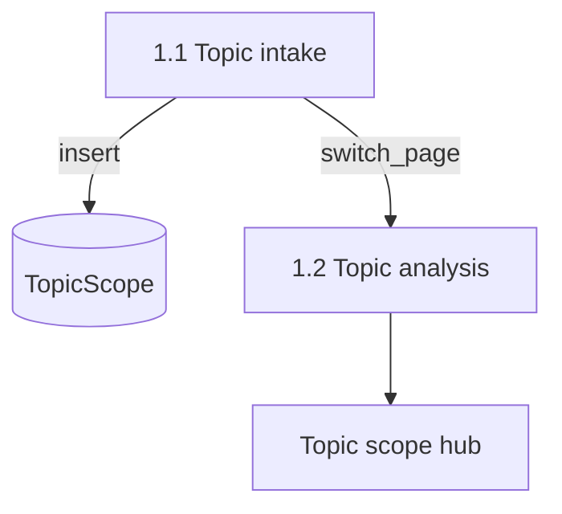

# Topic intake

This document is the specification for **phase 1, step 1** of the Topic scope workflow in [README.md](../../README.md).

In this step, the user declares a **topic statement**. The system creates a **`TopicScope`**. The UI then opens **Topic analysis**, which starts automatically — see [Topic analysis](1.2-topic-analysis.md).

## Glossary

| Term | Meaning |
| --- | --- |
| **`TopicStatement`** | Validated free-form text from Topic intake. Product meaning: [README.md](../../README.md) Terminology. |
| **`TopicScope`** | Durable record of one topic (`topic_scopes`). Created here with the topic statement. Product meaning: [README.md](../../README.md) Terminology. |
| **Topic intake** | Workflow step that validates the statement and inserts a new `TopicScope`. |

Renamed from `TopicBriefGeneration` / `topic_brief_generations`.

## Topic scope workflow

A **Topic scope workflow** is the four-phase workflow in [README.md](../../README.md), run on one `TopicScope`. This document specifies only phase 1 step 1 (Topic intake) for that scope.

Topic analysis, facet rows, the Topic scope hub, and later phases are out of scope here — see [Topic analysis](1.2-topic-analysis.md).

For the application runtime stack, see [technology-stack.md](../technology-stack.md).

## Scope

### In scope (current v1)

- Accept raw topic-statement text from the UI (or an equivalent caller).
- Validate it as a `TopicStatement` (strip; reject empty / whitespace-only).
- Insert a new `TopicScope` row. Every successful Submit creates a **new** row. There is no in-place edit of an existing statement.
- Dedicated Streamlit **Topic intake** page. After a successful persist, **switch** to Topic analysis with `topic_scope_key` in the URL.
- Replace the **New Topic brief** page (`new_topic_brief` / `new-topic-brief`) in the UI contract.

### Out of scope

- NER, `TopicFacet` rows, or `run_topic_analysis` ([Topic analysis](1.2-topic-analysis.md)).
- The Topic scope hub and phase landings ([Topic analysis](1.2-topic-analysis.md#topic-scope-hub)).
- Search external sources, paper archiving, fulfill papers metadata, generate paper brief, topic brief drafting.
- Prefect.
- Extra length, language, or biomedical-domain validation beyond non-empty text.

## Position in the workflow



1. **Topic intake** (this specification) validates the statement and inserts a `TopicScope`.
2. The UI **changes to Topic analysis**. Analysis starts automatically and persists facets — [Topic analysis](1.2-topic-analysis.md).
3. After analysis, the user opens the Topic scope hub and chooses a later phase. Phases are independent — [README.md](../../README.md).

## Input

| Input | Required | Description |
| --- | --- | --- |
| `raw_text` | Yes | Free-form topic statement from the form (or an equivalent caller). |

## Public API

Package path: `paper_reviewer.topic_scope.topic_intake` — see [project-structure.md](../project-structure.md).

```text
accept_topic_intake(raw_text: str) -> TopicStatement
start_topic_scope_from_topic_intake(session, raw_text: str) -> tuple[TopicStatement, TopicScope]
```

| Entrypoint | Role |
| --- | --- |
| `accept_topic_intake` | Strip; require non-empty text; return `TopicStatement`. Raise Pydantic `ValidationError` on empty / whitespace-only. |
| `start_topic_scope_from_topic_intake` | Call `accept_topic_intake`, then insert a `TopicScope` with that `topic_statement`. Always **insert**. Flush so `id` / `key` / `created_at` exist on the returned row. **Caller owns commit.** |

Pydantic types live under `paper_reviewer.schemas.topic_scope.topic_intake`.

### `TopicStatement`

| Field | Rule |
| --- | --- |
| `text` | After strip, length ≥ 1. Collapse is **not** required here (Topic analysis normalizes before NER). |

No other fields in v1.

## `TopicScope` model (v1)

Durable contract (Pydantic **read** model and ORM columns). The read model includes DB-assigned fields after a successful insert.

| Field | Required | Description |
| --- | --- | --- |
| `id` | Yes (DB) | Private primary key. Assigned on insert. Not used in URLs ([dev-practices.md](../dev-practices.md#identifier-naming-id-vs-key)). |
| `key` | Yes | UUID. Unique. User-facing identifier in the URL query `topic_scope_key` ([ui-style.md](../ui-style.md#topic-scope-key-in-the-url)). |
| `topic_statement` | Yes | The accepted `TopicStatement.text`. |
| `created_at` | Yes (DB) | Server timestamp when the row was created. |

Table name: `topic_scopes` (renamed from `topic_scopes`).

### Not specified here (later attachments)

The product `TopicScope` aggregates later phase results. Do **not** add these tables in this step:

- Topic facets — [Topic analysis](1.2-topic-analysis.md)
- Ingest activity for this topic
- References from References selection
- The cited topic brief

`Paper` and `PaperBrief` stay **global**. They are not owned by the Topic scope.

### Uniqueness

| Constraint | Rule |
| --- | --- |
| `key` | Unique. |
| `topic_statement` | Not unique. Two scopes may share the same statement text. |

## Streamlit UI (v1)

Dedicated page module: `paper_reviewer.ui.topic_intake` with `render_topic_intake()`.

Register in `paper_reviewer.ui.navigation` (`build_app_pages()`):

| Property | Value |
| --- | --- |
| `key` | `topic_intake` |
| `title` | Topic intake |
| `url_path` | `topic-intake` |
| `in_sidebar` | true ([ui-style.md](../ui-style.md)) |

**Replace** the **New Topic brief** page: do not register `new_topic_brief` / `new-topic-brief`. Home CTA targets `topic_intake`.

Streamlit is presentation only ([technology-stack.md](../technology-stack.md)). Domain work stays in `start_topic_scope_from_topic_intake`; the page owns the form, session wipe, URL id, and switch to analysis.

### Page behavior

1. Title **Topic intake**. Short caption: declare a topic statement to create a Topic scope.
2. `st.form` with a text area (placeholder may give a biomedical example) and a primary **Submit** (`st.form_submit_button`, `type="primary"`).
3. On Submit:
   - Validation failure → error (“Enter a non-empty topic statement.”). Do **not** clear session. Do **not** switch page.
   - Persist / session failure → error (“Could not start Topic intake. Try again.”). Do **not** clear session. Do **not** switch page.
   - Success → inside the same callback, in this order:
     1. Commit (UI is the caller that owns commit; `session_scope` commits on exit).
     2. Clear the **entire** UI session (`session_state.clear()`), then store `topic_statement`.
     3. Set `topic_scope_key` so the **Topic analysis** URL keeps it ([ui-style.md](../ui-style.md#topic-scope-key-in-the-url)).
     4. **`st.switch_page` to Topic analysis.** Do **not** leave the user on intake with only a `st.page_link`. Do **not** run analysis or search on this page.

This **switch_page after Submit** is a documented exception to the usual “mutating button, then a separate page_link” rule. Analysis must auto-run on the next page. See [ui-style.md](../ui-style.md#topic-intake-switch-to-analysis).

### Session keys after success

| Key | Type | Role |
| --- | --- | --- |
| `topic_statement` | `TopicStatement` | The accepted statement for captions on later pages. |

The `key` lives in the **URL**, not in session ([ui-style.md](../ui-style.md#topic-scope-key-in-the-url)).

Opening Topic intake from the sidebar may clear the query string. That is acceptable: the form always creates a **new** `TopicScope` on Submit.

## Behavior

| Case | Expected |
| --- | --- |
| Non-empty statement (leading/trailing space) | Persist stripped text; new `TopicScope`; switch to Topic analysis. |
| Empty or whitespace-only | Validation error; no row; no switch. |
| Submit again (sidebar or same page) | Always insert a **new** `TopicScope`. Never update a prior row. |
| Persist failure | Error message; session unchanged. |

## Orchestration boundary

| Responsibility | Owner |
| --- | --- |
| Validate statement; insert `TopicScope` | `paper_reviewer.topic_scope.topic_intake` |
| Pydantic `TopicStatement` | `paper_reviewer.schemas.topic_scope.topic_intake` |
| ORM `TopicScope` + thin create/get/list | `paper_reviewer.models.topic_scope` |
| Topic intake page, session wipe, switch_page | `paper_reviewer.ui.topic_intake` |
| Analyze and persist facets | [Topic analysis](1.2-topic-analysis.md) |

## Testability

TDD per [tdd.md](../tdd.md) when implementation starts:

- `accept_topic_intake` strips; rejects empty / whitespace-only.
- `start_topic_scope_from_topic_intake` inserts `TopicScope`; `key` is a UUID; `topic_statement` matches accepted text.
- Two successful calls → two rows.
- UI navigation tests: page registered with key `topic_intake`, title **Topic intake**, `url_path` `topic-intake`, `in_sidebar` true. Home CTA targets `topic_intake`. **New Topic brief** is not registered.

## Non-goals (v1)

Do not do this work in the Topic intake v1 slice:

- Update an existing `TopicScope.topic_statement`.
- Run Topic analysis or search external sources on this page.
- Show the Topic scope hub or phase links on this page.
- Orchestrate intake with Prefect.
