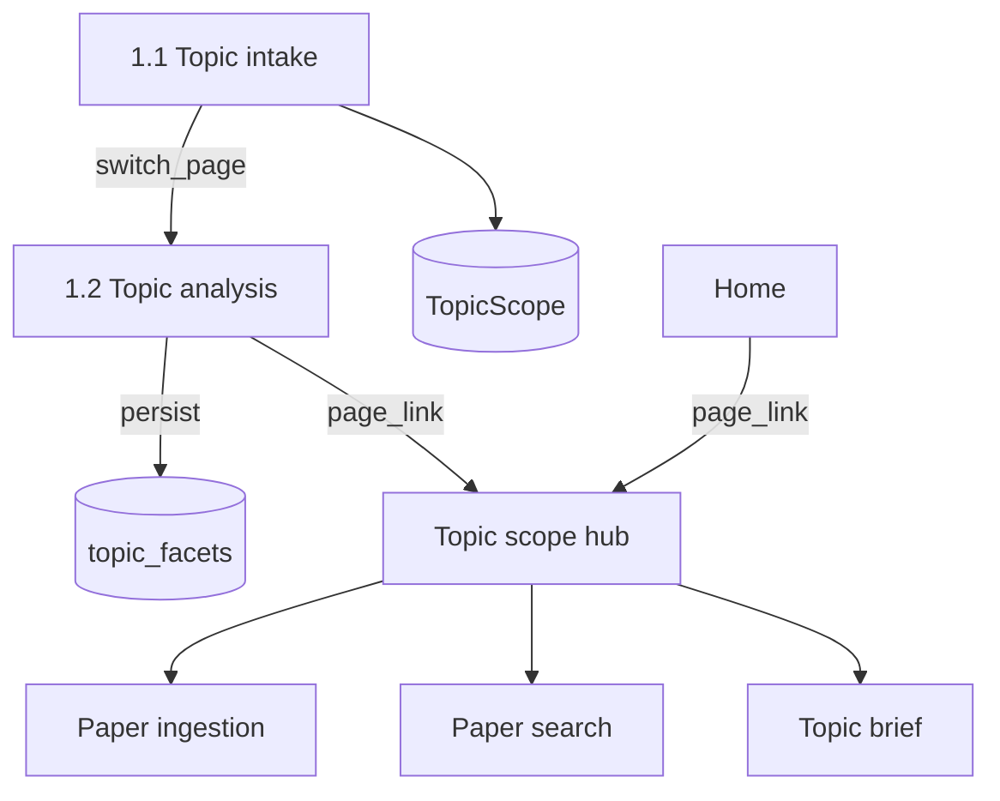

# Topic analysis

This document is the specification for **phase 1, step 2** of the Topic brief generation workflow in [README.md](../../README.md).

In this step, the system extracts key data from a **topic statement** as **topic facets**, writes those facets on the **`TopicScope`**, and then lets the user open the **Topic scope hub** to choose a later phase.

## Glossary

| Term | Meaning |
| --- | --- |
| **`TopicFacet`** | One named slice distilled from the topic statement (`id`, `label`, `intent`, `concepts`, …). Product meaning: [README.md](../../README.md) Terminology. |
| **`TopicAnalysisResult`** | Pydantic wrapper with `facets: list[TopicFacet]` for one `TopicScope`. |
| **Topic scope hub** | Streamlit page that shows the statement, the stored facets, and links to the three independent later phases. |

## Topic brief generation

A **Topic brief generation** is the four-phase workflow in [README.md](../../README.md), run on one `TopicScope`. This document specifies phase 1 step 2 (Topic analysis) and the **Topic scope hub** (phase 1 result UI) for that scope.

`SearchCriteria` conversion and related-paper search orchestration are out of scope here — see [related-paper search](03-related-paper-search.md). Topic intake (create `TopicScope`) is [Topic intake](1.1-topic-intake.md).

For the application runtime stack, see [technology-stack.md](../technology-stack.md). This step specifies scispaCy (`en_core_sci_sm`) for biomedical NER; the stack document lists that library and points here for behavior.

## Scope

### In scope (current v1)

- Analyze topic statement text from the current `TopicScope` (or equivalent non-empty text passed to the analyzer).
- Make a `TopicAnalysisResult` with one or more `TopicFacet` objects via scispaCy NER.
- Persist each facet as a database row with a foreign key to that `TopicScope`. After a successful analysis, the **database** is the source of truth.
- Domain helper `run_topic_analysis(session, topic_scope)` that analyzes and persists.
- Dedicated Streamlit **Topic analysis** page: auto-run when the scope has no facet rows; show stored facets otherwise. Do not offer a control to re-run analysis.
- After facets exist: `st.page_link` to the **Topic scope hub**. Do not run related-paper search here. Do not `switch_page` to the hub.
- Dedicated **Topic scope hub** page: statement + facets + links to Paper ingestion, Paper search, and Topic brief.
- Home Topic scope list: each existing scope is a page_link to this hub (pass `topic_scope_key`).

### Out of scope

- Validation of Topic intake ([Topic intake](1.1-topic-intake.md) does that work).
- `SearchCriteria` / `source_overrides` (owned by [related-paper search](03-related-paper-search.md)).
- Running related-paper search, triage, or other ingest steps on the analysis or hub pages.
- Analysis with an LLM.
- Analysis that uses a custom stopword or token heuristic as the **primary** method (fallback after empty NER may use non-stopword tokens — see Analyzer).
- Larger scispaCy models (`md`, `lg`, or specialty NER), unless a later change adopts them.
- A separate ORM table for `TopicAnalysisResult` (it is an in-memory/API aggregate of facet rows).
- Cross-phase gates (a phase landing must not require the other phases to have run).
- A control to re-run Topic analysis for an existing `TopicScope` (Analyze again). Facets are written once on first auto-run. To analyze a different statement, start a new Topic scope from Topic intake.

## Position in the workflow



1. **Topic intake** inserts a `TopicScope` and **switches** to Topic analysis — [Topic intake](1.1-topic-intake.md).
2. **Topic analysis** (this specification) reads `topic_statement`, extracts concepts, writes facet rows, and shows a page_link to the Topic scope hub.
3. The **hub** shows the statement and facets, then the user chooses a later phase. Related-paper search is the first ingest step when the user opens [Paper ingestion](2-paper-ingestion.md), not an automatic next step after analysis.
4. From **Home**, each listed Topic scope is a page_link to the hub (pass `topic_scope_key`).

## Input

| Input | Required | Description |
| --- | --- | --- |
| `topic_statement` | Yes | Free-form text that Topic intake already accepted (or equivalent non-empty text passed to the analyzer). |
| `topic_scope` | Yes (`run_topic_analysis`) | The `TopicScope` whose statement to analyze and whose facet rows to write. |

The pure analyzer API is `analyze_topic_statement(text, nlp=None) -> TopicAnalysisResult`. It does not take a database session.

After you normalize the text, empty text or text that has only whitespace is not valid for analysis. Raise a `ValueError`.

Topic intake must reject empty statements. Topic analysis must also reject empty text after normalize.

## Analyzer: scispaCy

Use [scispaCy](https://allenai.github.io/scispacy/) with the **`en_core_sci_sm`** pipeline. That pipeline is the smallest full biomedical spaCy model.

| Rule | Behavior |
| --- | --- |
| Normalize | Remove leading and trailing whitespace. Collapse adjacent whitespace (including newlines) to a single space. Do this before NLP. |
| Model load | Load with `spacy.load("en_core_sci_sm")`. Keep the model in a process-level cache. For tests, inject an `nlp` object. |
| Primary concepts | Get unique entity surface forms from `doc.ents` in first-seen order (`ent.text`). |
| Dedupe | Compare with case-insensitive identity (for example case-fold). Keep the first surface form as written. Do not rewrite casing of the kept display string. |
| Fallback | If `doc.ents` is empty (or yields no concepts after dedupe), take non-stopword alphabetic tokens with `len >= 3`, first-seen, same case-insensitive dedupe. If that list is empty, use the whole normalized statement as the single concept. Short statements must still yield a facet with a non-empty `concepts` list. |
| Validation | Each facet must validate as a Pydantic `TopicFacet`. The collection must validate as `TopicAnalysisResult`. |

Do not use an LLM as the primary method. Do not use a custom stopword tokenizer as the primary method.

## Output: `TopicAnalysisResult`

The contract is `paper_reviewer.schemas.topic_brief_generation.topic_analysis.TopicAnalysisResult`, which holds `facets: list[TopicFacet]`. Related-paper search uses the same models.

This step makes a **`TopicAnalysisResult`**. Downstream search envelope types are owned by [related-paper search](03-related-paper-search.md).

### v1 emission rules

Always make **one or more** facets. In v1, make exactly one facet with these values:

| Field | v1 value |
| --- | --- |
| `id` | `core-concepts` |
| `label` | `Core concepts` |
| `intent` | `Narrow topical match from biomedical entities` |
| `concepts` | List that is not empty. Get the list from NER. Use the fallback if NER finds no entities. |
| `synonyms` | `[]` |
| `filters` | `{}` |
| `date_from` / `date_to` | `null` |
| `retmax` | `null` |

Do not add other facets (for example `broad-concepts`) until a later revision of this specification defines when they occur.

### Example

Topic statement: `glioblastoma immunotherapy outcomes`

This is one possible result. The entity strings can change with the model. In unit tests with an injected fake `nlp`, check for an exact `concepts` list:

```json
{
  "facets": [
    {
      "id": "core-concepts",
      "label": "Core concepts",
      "intent": "Narrow topical match from biomedical entities",
      "concepts": ["glioblastoma", "immunotherapy"],
      "synonyms": [],
      "date_from": null,
      "date_to": null,
      "filters": {},
      "retmax": null
    }
  ]
}
```

Make sure that the output validates as `TopicAnalysisResult`.

## Persistence

After a successful analysis, **Postgres facet rows** are the source of truth. The UI can show the data. The UI must not be the only copy.

### `topic_facets` table

Foreign key: `topic_scope_id` → `topic_scopes.id`. Follow the stack rule: **no** `ON DELETE CASCADE` ([technology-stack.md](../technology-stack.md)).

| Column | Type | Description |
| --- | --- | --- |
| `id` | PK | Row id. |
| `created_at` | timestamptz | Row creation time. |
| `topic_scope_id` | FK | Owning `TopicScope`. |
| `facet_id` | text | Pydantic `TopicFacet.id` (for example `core-concepts`). Not the row PK. |
| `label` | text | Display label. |
| `intent` | text, nullable | Intent string. |
| `concepts` | JSONB | List of strings. |
| `synonyms` | JSONB | List of strings. |
| `date_from` | text, nullable | Optional date bound. |
| `date_to` | text, nullable | Optional date bound. |
| `filters` | JSONB | Object. |
| `retmax` | int, nullable | Optional hit cap. |
| `position` | int | List order when reloading into `TopicAnalysisResult` (0-based, first-seen). |

Unique: `(topic_scope_id, facet_id)`.

Round-trip ORM ↔ Pydantic `TopicFacet` with no loss of list or object fields. Reload rows for a `TopicScope` ordered by `position` into a `TopicAnalysisResult`.

### Public persist API

```text
run_topic_analysis(session, topic_scope) -> TopicAnalysisResult
```

| Rule | Behavior |
| --- | --- |
| Analyze | Call `analyze_topic_statement(topic_scope.topic_statement)`. |
| Write | Delete any existing facet rows for that `topic_scope_id`, then insert the new rows. Do not leave duplicates. The Topic analysis page does not call this helper when rows already exist. |
| Flush | Flush so row `id` / `created_at` exist. **Caller owns commit.** |
| Raise | Raise `ValueError` on empty text after normalize (same as the analyzer). Raise if the session is unusable. |

Package path: `paper_reviewer.topic_brief_generation.topic_analysis`.

## Streamlit UI: Topic analysis

Dedicated page module: `paper_reviewer.ui.topic_analysis` with `render_topic_analysis()`.

Register in `paper_reviewer.ui.navigation`:

| Property | Value |
| --- | --- |
| `key` | `topic_analysis` |
| `title` | Topic analysis |
| `url_path` | `topic-analysis` |
| `in_sidebar` | false ([ui-style.md](../ui-style.md)) |

### Page behavior (v1)

1. **Prerequisites** — Require `topic_scope_key` in the URL ([ui-style.md](../ui-style.md#topic-scope-key-in-the-url)). Load the `TopicScope` from the database. If the key or row is missing: empty state and a page_link to **Topic intake**. Do not run analysis.
2. **Auto-run** — If the scope has **no** facet rows: run `run_topic_analysis` inside `session_scope` with a spinner; commit on success. Show an error on failure; do not store a partial result as success.
3. **Display** — If facet rows exist: show each facet (`label`, optional `intent`, `concepts`). Do **not** show a control to re-run analysis.
4. **Exit** — After facets exist: `st.page_link` to **Topic scope** (pass `topic_scope_key`). Do **not** `st.switch_page` to the hub. Do **not** call `search_related_papers`. Do **not** link directly to a phase landing from this page.

Topic intake already switched the user here so this auto-run can start. A later visit with existing facets only displays them.

## Topic scope hub

Phase 1 result UI. This page does not start ingest, local Paper search, or topic-brief drafting.

Dedicated page module: `paper_reviewer.ui.topic_scope` with `render_topic_scope()`.

Register in `paper_reviewer.ui.navigation`:

| Property | Value |
| --- | --- |
| `key` | `topic_scope` |
| `title` | Topic scope |
| `url_path` | `topic-scope` |
| `in_sidebar` | false ([ui-style.md](../ui-style.md)) |

### Page behavior (v1)

1. Require `topic_scope_key`. Load `TopicScope` and its facet rows from the database.
2. Missing key/row → empty state + page_link to **Topic intake**.
3. Scope exists but **no facet rows** → incomplete state + page_link to **Topic analysis**. Do **not** show phase links.
4. When facets exist, render in this order:
   1. **Topic statement** (`TopicScope.topic_statement`).
   2. **Topic facets** (same display as the analysis page: label, intent, concepts).
   3. Three phase **page_links** (navigate only; pass `topic_scope_key`): **Paper ingestion**, **Paper search**, **Topic brief**.
5. The user may open any phase without completing the others. Do not add gates between those links.

Phase landing contracts: [Paper ingestion](2-paper-ingestion.md), [Paper search](3-paper-search.md), [Topic brief](4-topic-brief.md).

### Entry from Home

The Home landing lists existing Topic scopes. Each row is a `st.page_link` to **Topic scope** (`topic_scope`). The link label is the topic statement. Pass `topic_scope_key` ([ui-style.md](../ui-style.md#topic-scope-key-in-the-url)). Keep created-at and the reference-id caption on the row. An empty list has no hub links.

## Behavior

| Case | Expected result |
| --- | --- |
| Valid biomedical statement with entities | A `TopicAnalysisResult` with one or more facets. `concepts` is not empty. Concepts come from `ents`. Facet rows stored. |
| Valid statement with no NER hits | Facets from the fallback rule. Rows stored. |
| Empty text or whitespace-only text | Raise a `ValueError`. Do not write rows. |
| First visit, no facet rows | Auto-run persist; then show facets and hub link. |
| Visit with existing facet rows | Show stored facets. Do not auto-run. Do not re-analyze. |
| Hub with no facets | Incomplete; link to analysis; no phase links. |
| Home list with one or more Topic scopes | Each row is a page_link to the hub; label is the topic statement; query has `topic_scope_key`. |

## Orchestration boundary

Package path for the analyzer: `paper_reviewer.topic_brief_generation.topic_analysis` — see [project-structure.md](../project-structure.md).

| Responsibility | Owner |
| --- | --- |
| Change text into a `TopicAnalysisResult` | Analyzer (`analyze_topic_statement`). Optional `nlp` injection for tests. |
| Analyze and write for a `TopicScope` | `run_topic_analysis` with a database session. |
| When to start analysis | After Topic intake `switch_page`. The analysis page auto-runs when there are no facet rows. |
| Topic analysis page and Topic scope hub | `paper_reviewer.ui.topic_analysis`, `paper_reviewer.ui.topic_scope` |
| Home list links to the hub | `paper_reviewer.ui.landing` |
| Related-paper search / `SearchCriteria` | [related-paper search](03-related-paper-search.md) |

## Testability

- Inject a fake spaCy `nlp` that returns controlled `ents` and tokens. Use this for unit tests that must be deterministic. Those tests do not need a model download.
- Do not require a real-model integration test in the normal suite.
- Persist / reload: insert rows; reload `TopicAnalysisResult`. A second `run_topic_analysis` call must not leave duplicate rows.
- Related-paper search tests inject a `TopicAnalysisResult` and do not need this step’s analyzer — see [related-paper search](03-related-paper-search.md).
- UI slice (no Streamlit widget assertions per [tdd.md](../tdd.md)): pages registered with keys `topic_analysis` and `topic_scope`, titles **Topic analysis** / **Topic scope**, url paths `topic-analysis` / `topic-scope`, `in_sidebar` false. Home list hub link: page key `topic_scope`; label is the topic statement; query has `topic_scope_key`.

## Non-goals (v1)

Do not do this work in the Topic analysis v1 slice:

- Make PubMed `source_overrides` or MeSH-specific markup (see [paper-sources/pubmed.md](paper-sources/pubmed.md)).
- Orchestrate analysis with Prefect.
- Use specialty NER models (for example `en_ner_bc5cdr_md`).
- Use facet ids other than `core-concepts`.
- Run related-paper search or `switch_page` to the hub from the analysis page.
- Add an Analyze again control or any other way to re-run Topic analysis for an existing Topic scope.
- Implement Paper search or Topic brief drafting on the hub (those landings are shells — [Paper search](3-paper-search.md), [Topic brief](4-topic-brief.md)).
