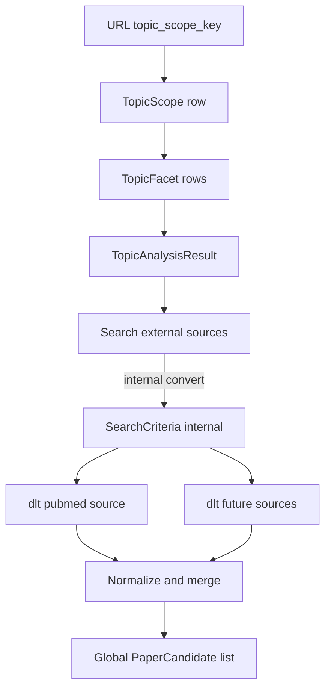

# Search external sources

This document is the specification for **phase 2, step 1** of the Topic brief generation workflow in [README.md](../../README.md).

In this step, the system searches registered **external sources** for related papers and produces a global list of **paper candidates** for [Paper archiving](2.2.1-paper-archiving.md).

Entry is the [External sources ingestion](2-external-sources-ingestion.md) landing, not Topic analysis. Facets come from the current `TopicScope` in the database — [Topic analysis](1.2-topic-analysis.md). Do **not** auto-run this page from Topic analysis.

External-source-specific search criteria and API mapping live under [external-sources/](external-sources/). This document owns orchestration and the Search external sources Streamlit page.

Stack context: [technology-stack.md](../technology-stack.md) (dlt extract + Pydantic; Prefect runs source-record / full-text / brief jobs in Compose — not this search step). Package paths: `paper_reviewer.ingest` (sources), `paper_reviewer.topic_brief_generation.search_external_sources` (orchestration / merge) — see [project-structure.md](../project-structure.md).

## Glossary

| Term | Meaning |
| --- | --- |
| **Search external sources** | External sources ingestion step 2.1: search external sources with topic facets and produce `PaperCandidate`s for Paper archiving. |
| **`PaperCandidate`** | Normalized search hit from an external source. Shape owned by this spec. |
| **`SearchExternalSourcesResult`** | Search output: `candidates`, `source_runs`, optional `notes`. |

## Topic brief generation

A **Topic brief generation** is the four-phase workflow in [README.md](../../README.md), run on one `TopicScope`. This document specifies only phase 2 step 1 (Search external sources) for that scope.

Facet generation and persistence stay in [Topic analysis](1.2-topic-analysis.md). Paper archiving and later ingest steps are out of scope here.

## Scope

### In scope (current v1)

- Load `TopicScope` and its `TopicFacet` rows from the database for the URL `topic_scope_key` (normal app path).
- Accept a `TopicAnalysisResult` in the domain API (DB-loaded facets, or a test fixture).
- Convert internally to `SearchCriteria` when needed (keep the type; optional `source_overrides`).
- Run extract via **dlt** for each registered external source.
- Map each source hit to `PaperCandidate` and merge into one global list.
- Fail-soft when one source errors.
- Dedicated Streamlit page that auto-runs search when prerequisites exist.

### Out of scope

- Generating facets in Topic analysis (see that spec).
- Using Streamlit session state as the source of facets, analysis, or topic-statement text for search criteria.
- [Paper archiving](2.2.1-paper-archiving.md) and later ingest steps.
- [Fulfill papers metadata](2.2.2-fulfill-papers-metadata.md) (EFetch / PMC Cloud) or [Generate paper brief](2.2.3-generate-paper-brief.md) (creates **paper brief** results).
- Adding new external sources beyond registering them here.
- Loading candidates into Postgres as `Paper` rows ([Paper archiving](2.2.1-paper-archiving.md) owns that).
- Local-database Paper search ([Paper search](3-paper-search.md)).

### `PaperCandidate` shape

Every external source must map its API hit into a shared `PaperCandidate` with two concerns kept distinct. This document owns the candidate contract; each [external-sources/](external-sources/) doc only maps its API fields onto these names.

**Source fetch handle** (required for later steps)


| Field        | Description                                                                |
| ------------ | -------------------------------------------------------------------------- |
| `source_id`  | External source id (e.g. `pubmed`)                                            |
| `source_uid` | That source’s stable record id (e.g. PMID)                                                  |
| `doi`        | Required on every candidate that reaches archiving. Preferred cross-source merge key. ISO 26324 case-insensitive: merge **drops** missing/blank DOIs, then stores and compares the kept value as strip + uppercase. Raw source maps may still emit a missing DOI. |


Each [external-sources/](external-sources/) doc must state how `(source_id, source_uid)` (and DOI if needed) are used to fetch fuller records later. This workflow does **not** perform that fetch.

**Summary** (for display and archiving)


| Field            | Description                                                                                              |
| ---------------- | -------------------------------------------------------------------------------------------------------- |
| `title`          | Title                                                                                                    |
| `authors`        | List of author names                                                                                     |
| `journal`        | Journal or venue                                                                                         |
| `published_year` | Publication year when available                                                                          |
| `url`            | Canonical link on the source (e.g. PubMed URL)                                                           |
| `snippet`        | Optional short text only if the search API already returns it — not a substitute for paper-brief content |


**Provenance**


| Field             | Description                                      |
| ----------------- | ------------------------------------------------ |
| `facet_id`        | Which topic facet produced the hit               |
| `raw_payload_ref` | Optional audit pointer to the raw source payload |


## Input

### UI / normal path

The Streamlit page does **not** take facets from session. It takes only the Topic scope key from the URL, then loads durable rows from Postgres.

| Input | Required | Description |
| --- | --- | --- |
| `topic_scope_key` | Yes | UUID in the URL query ([ui-style.md](../ui-style.md#topic-scope-key-in-the-url)). |
| `TopicScope` | Yes | Loaded with `get_topic_scope_by_key` for that key. |
| Facet rows | Yes | Reloaded with `load_topic_analysis_result(session, topic_scope)` into a `TopicAnalysisResult`. Facet field rules and persistence stay in [Topic analysis](1.2-topic-analysis.md). |
| `source_overrides` | No | Empty `{}` on the normal UI path. |

**Forbidden UI inputs:** `st.session_state` values for facets, `topic_analysis_result`, or topic-statement text used as search criteria. Session may hold only the search **output** cache (see Streamlit UI).

### Domain / test path

`search_external_sources` in `paper_reviewer.topic_brief_generation.search_external_sources` accepts a `TopicAnalysisResult` directly (DB-loaded or an injected fixture). That is not the Streamlit input.

| Domain input | Required | Description |
| --- | --- | --- |
| `TopicAnalysisResult` | Yes | Facets from Topic analysis (or a test fixture). |
| `source_overrides` | No | Optional map `source_id` → opaque payload defined by that source’s spec. Folded into `SearchCriteria` during the internal convert (fixtures / power paths). v1 default when omitted: `{}`. |

Public shape for facets on the normal path: the `TopicAnalysisResult` emission owned by [Topic analysis](1.2-topic-analysis.md) (v1 sets `synonyms` to `[]`, dates/`retmax` to null, and empty `filters`). Do not copy that JSON here.

### Internal conversion (`TopicAnalysisResult` → `SearchCriteria`)

Keep the `SearchCriteria` type. This workflow converts `TopicAnalysisResult` → `SearchCriteria` as an **internal step** when it needs the search envelope (facets plus optional `source_overrides`). Callers do not have to build `SearchCriteria` first.

| Concern | Rule |
| --- | --- |
| Owner | This workflow (`paper_reviewer.topic_brief_generation.search_external_sources`). |
| When | Internally, before running registered external-source adapters. |
| How | Build `SearchCriteria(topic_analysis=…, source_overrides=…)` (default empty overrides). |
| Keep | `SearchCriteria` remains the envelope used with source runners and for tests that need `source_overrides`. |
| Not owned here | Facet generation / persistence ([Topic analysis](1.2-topic-analysis.md)); Entrez compilation ([external-sources/pubmed.md](external-sources/pubmed.md)). |

After conversion, the workflow passes each facet (plus any matching override) into each registered source adapter. Compilation to a concrete API query is defined only in the source’s external-sources doc.

Illustrative internal `SearchCriteria` after conversion with empty overrides (fixture-style facets, not Topic analysis v1 emission):

```json
{
  "topic_analysis": {
    "facets": [
      {
        "id": "fixture-narrow",
        "label": "Fixture narrow",
        "concepts": ["CRISPR", "base editing"],
        "retmax": 20
      }
    ]
  },
  "source_overrides": {}
}
```

For a PubMed `raw_term` override payload, see [external-sources/pubmed.md](external-sources/pubmed.md) (Hybrid override). Do not define Entrez strings in this file.

## External source registry


| `source_id` | Spec                                               | Status              |
| ----------- | -------------------------------------------------- | ------------------- |
| `pubmed`    | [external-sources/pubmed.md](external-sources/pubmed.md) | First / only source |


To add a source later: add `docs/specs/external-sources/<source-id>.md`, register a row here, and implement a dlt source under `paper_reviewer.ingest` that yields `PaperCandidate`-shaped records. Do not put source-API details in this file.

## Extraction with dlt

Per [technology-stack.md](../technology-stack.md):

- Each external source is a **dlt source/resource** under `paper_reviewer.ingest` (e.g. PubMed).
- Resources **yield** `PaperCandidate`-shaped records (Pydantic models in `paper_reviewer.schemas`). This step does **not** load candidates into Postgres.
- `paper_reviewer.topic_brief_generation.search_external_sources` accepts a `TopicAnalysisResult`, converts internally to `SearchCriteria` when needed, runs registered sources, and **merges** results into one global list (see merge rules below).
- Prefect may later schedule these extracts; orchestration ownership stays in this workflow. Prefect Compose services today own source-record / full-text / brief jobs ([2.2.2-fulfill-papers-metadata.md](2.2.2-fulfill-papers-metadata.md)), not search external sources.
- The contract to [Paper archiving](2.2.1-paper-archiving.md) is the global `PaperCandidate` list (plus `source_runs` metadata). Paper archiving consumes every candidate from this list.



## Merge and normalize

1. Map every source row to `PaperCandidate` (fields above).
2. **Drop** any candidate whose `doi` is missing or blank after strip. [Paper archiving](2.2.1-paper-archiving.md) never sees no-DOI hits.
3. Dedupe within the remaining global list by **uppercase DOI** (strip then `.upper()`). Rewrite each kept candidate’s `doi` to that uppercase form. Do not fall back to `(source_id, source_uid)` for merge identity once DOI is required on kept rows.
4. When merging duplicates, keep one canonical candidate; retain provenance that multiple facets/sources hit the same paper when useful for search metadata (implementation detail).
5. Tag each candidate with `facet_id` and `source_id`.

## Output


| Output          | Description                                                                 |
| --------------- | --------------------------------------------------------------------------- |
| `candidates`    | Global list of `PaperCandidate`                                             |
| `source_runs[]` | Per source: `source_id`, `status` (`ok` / `error` / `empty`), `hit_count`, `facet_ids`, `error` if any |


Primary deliverable for [Paper archiving](2.2.1-paper-archiving.md): `candidates`. `source_runs` supports debugging and UI status.

## Behavior


| Case | Expected |
| --- | --- |
| Injected/test `TopicAnalysisResult` with empty `facets` | Domain API returns empty `candidates` and a note that there are no facets. Used only for fixtures / unit tests. |
| Normal UI path: scope has no facet rows | Do **not** call `search_external_sources`. Show the guard (links to Topic analysis and Topic scope). |
| Facet yields zero hits from a source | That facet contributes nothing; other facets/sources continue |
| Hit without DOI (missing/blank) | Dropped during merge; not present in `candidates` |
| Source failure (network, rate limit, auth) | **Fail-soft**: other sources still contribute; `source_runs` records the error |
| `retmax` truncates | Candidates limited accordingly |
| All hits lack DOI | Empty `candidates` ([Paper archiving](2.2.1-paper-archiving.md) then gets empty success) |

## Streamlit UI (v1)

Dedicated page module: `paper_reviewer.ui.search_external_sources` with `render_search_external_sources()`.

Register in `paper_reviewer.ui.navigation`:

| Property | Value |
| --- | --- |
| `key` | `search_external_sources` |
| `title` | Search external sources |
| `url_path` | `search-external-sources` |
| `in_sidebar` | false ([ui-style.md](../ui-style.md)) |

Entry: [External sources ingestion](2-external-sources-ingestion.md) page_link. Do **not** auto-run this page from Topic analysis.

Show the External sources ingestion phase header on this page: [External sources ingestion](2-external-sources-ingestion.md#phase-header-landing-and-ingest-steps).

### Session keys (output only)

| Key | Type | Role |
| --- | --- | --- |
| `search_external_sources_result` | `SearchExternalSourcesResult` | Cached search **output** for Paper archiving handoff. Not a source of facets. |
| `search_external_sources_topic_scope_key` | UUID string | Topic scope key that the cached result belongs to. Must match the URL key before reuse. |

Candidates stay **session-only** (no candidate table). Session must **not** supply search input.

### Page behavior

1. **Prerequisites** — Require `topic_scope_key` in the URL ([ui-style.md](../ui-style.md#topic-scope-key-in-the-url)). Load `TopicScope` with `get_topic_scope_by_key`. Load facet rows with `load_topic_analysis_result` (database is the source of truth).
2. **Guard** — Missing key, missing scope, or no facet rows: message and page_links to **Topic analysis** and **Topic scope**. Do not run search.
3. **Cache match** — If session has `search_external_sources_result` **and** `search_external_sources_topic_scope_key` equals the URL key: show the cached result; do not search again.
4. **Cache miss or key mismatch** — If there is no cached result, or the cached key does not match the URL key: ignore the old cache; clear downstream ingest session caches for the old run (same cascade idea as [Fulfill papers metadata](2.2.2-fulfill-papers-metadata.md)); reload facets from the DB; call `search_external_sources` with a spinner; store the new result **together with** the current `topic_scope_key`. Fail-soft `source_runs` as in Behavior.
5. **Display** — Per-source `source_runs` status; candidate count.
6. **Exit** — After a result exists: `st.page_link` to **Paper archiving** (pass `topic_scope_key`).

Topic intake Submit still wipes the whole session — [Fulfill papers metadata](2.2.2-fulfill-papers-metadata.md). After that wipe, this page searches again from DB facets for the new URL key.

## Testability

- Inject a `TopicAnalysisResult` JSON fixture into `search_external_sources` without running Topic analysis (domain / test path).
- UI slice: page registered with key `search_external_sources`, title **Search external sources**, `url_path` `search-external-sources`, `in_sidebar` false.
- Assert the workflow converts that result to `SearchCriteria` internally (empty `source_overrides` by default) before source runners run.
- For deterministic PubMed tests, pass optional `source_overrides.pubmed` (see [external-sources/pubmed.md](external-sources/pubmed.md)) so conversion yields a known Entrez `term`.
- Assert on `PaperCandidate` fields and merge behavior with multi-source fixtures when additional sources exist.
- Assert merge drops missing/blank DOI hits, rewrites kept `doi` to uppercase, and dedupes by that form.
- Assert the UI path does not read facets from session; cache reuse requires a matching `search_external_sources_topic_scope_key`.

## Example fixture (manual injection)

Injected `TopicAnalysisResult` for tests — not produced by Topic analysis v1:

```json
{
  "facets": [
    {
      "id": "fixture-narrow",
      "label": "Fixture narrow",
      "concepts": ["CRISPR", "base editing"],
      "retmax": 20
    }
  ]
}
```

With only PubMed registered, the workflow converts this to `SearchCriteria` (empty overrides), runs the PubMed adapter’s structured compilation for `fixture-narrow`, and returns a global candidate list from that source alone.
