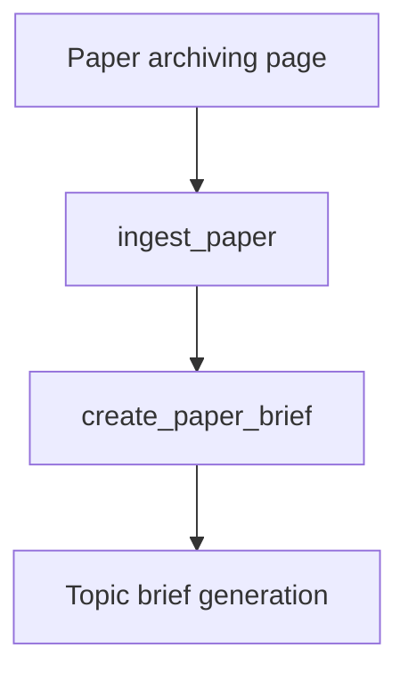

# Generate paper brief

This document is the specification for **phase 2, step 2.2.3** of the Topic scope workflow in [README.md](../../README.md).

**Step vs result:** **Generate paper brief** is the workflow **step**. A **paper brief** (`PaperBrief`) is the **result** that step produces for one archived `Paper`. Do not use “paper briefs” alone to name this step.

In this step, the system builds a **global** **`PaperBrief`** with an LLM for each archived paper that has full text `succeeded` and still needs a brief. An idempotent Prefect job owns that work. Streamlit does **not** have a dedicated page for this step. After [Paper archiving](2.2.1-paper-archiving.md), brief work runs only as `ingest_paper` step 3 (force rewrite). `create_paper_brief` with `force=false` stays served for Prefect console / ops.

**Prerequisite:** [Fulfill papers metadata](2.2.2-fulfill-papers-metadata.md) must have set `full_text_status = succeeded` (PubMed: PMC Cloud `full_text_plain`). Do not call EFetch or PMC Cloud in this step. Papers with full text `failed` or `unavailable` do **not** get a brief.

`PaperAspectStatus` is owned by [Fulfill papers metadata](2.2.2-fulfill-papers-metadata.md). This step reuses it on `PaperBrief.status`.

## Glossary

| Term | Meaning |
| --- | --- |
| **`Paper`** | Durable bibliographic record. Product meaning: [README.md](../../README.md) Terminology. Public id is the uppercase DOI. Created or reused in [Paper archiving](2.2.1-paper-archiving.md). |
| **Source record / full text** | Global aspects on `Paper`. Markers: `source_record_status`, `full_text_status`. Owned by [Fulfill papers metadata](2.2.2-fulfill-papers-metadata.md). |
| **Paper brief** / **`PaperBrief`** | **Result** artifact: structured, **topic-agnostic** LLM summary of one `Paper`. One row per paper. Reused in every later Topic scope workflow. Product meaning: [README.md](../../README.md) Terminology. |
| **`create_paper_brief`** | Prefect job that drafts or (when forced) rewrites a **paper brief**. |
| **Generate paper brief** | Workflow **step** (this document) that owns `PaperBrief` and `create_paper_brief`. Progress UI: [Paper archiving](2.2.1-paper-archiving.md). |

## Topic scope workflow

A **Topic scope workflow** is the four-phase workflow in [README.md](../../README.md), run on one `TopicScope`. This document specifies **Generate paper brief** on the External sources ingestion path for that scope.

Source record and full text are owned by [Fulfill papers metadata](2.2.2-fulfill-papers-metadata.md). PubMed EFetch / Cloud details: [external-sources/pubmed.md](external-sources/pubmed.md).

`PaperBrief` is **not** scoped to a Topic scope. If a later Topic scope archives a paper that already has a succeeded brief, step 2.2.3 skips that paper and Topic brief generation (phase 4) reuses the brief. Topic relevance is **not** stored on the brief; Topic brief generation cites the paper in prose.

For the application runtime stack (including Prefect as a Compose service), see [technology-stack.md](../technology-stack.md) and [local-development.md](../local-development.md). This specification is the orchestration contract; brief work runs in Prefect, not in Streamlit.

## Scope

### In scope (current v1)

- Persist one `PaperBrief` per `paper_id` with `PaperAspectStatus`.
- Run the brief job as an **idempotent** Prefect flow by default (no-op when brief is already `succeeded`).
- Accept a **force rewrite** only when called from `ingest_paper` ([Fulfill papers metadata](2.2.2-fulfill-papers-metadata.md#ingest_paper-orchestrator)).

### Out of scope (v1)

- [Paper archiving](2.2.1-paper-archiving.md) create/reuse rules or its UI (including ingest progress).
- Source-record / full-text flows — owned by [Fulfill papers metadata](2.2.2-fulfill-papers-metadata.md).
- Topic brief generation (phase 4) — [Topic brief generation](4-topic-brief-generation.md).
- `relevance_to_topic` or a topic-relative summary on `PaperBrief`.
- A dedicated Streamlit **page** for this step or for `ingest_paper`.
- Rich author entities, affiliations, ORCID, or author↔paper graphs (future job; see [Future work](#future-work)).
- Fetching full text or PDF URLs (consume stored `full_text_plain` / URLs from step 6).
- Auto-retry of `failed` briefs except via `ingest_paper`.
- Prefect Compose service topology — owned by [local-development.md](../local-development.md) / [technology-stack.md](../technology-stack.md).
- Viewing stored paper-brief prose — owned by [Paper brief](paper-brief.md).
- LLM-as-judge of the stored brief — owned by [Paper brief evaluation](2.2.4-paper-brief-evaluation.md). Do not run the judge inside `create_paper_brief`.

## Position in the workflow



1. **Paper archiving** yields `PaperArchivingResult.papers` (create or reuse) and enqueues `ingest_paper` for selected papers.
2. **Fulfill papers metadata** sets `source_record_status` then `full_text_status` inside that parent — see [Fulfill papers metadata](2.2.2-fulfill-papers-metadata.md).
3. **Generate paper brief** (this specification) creates or rewrites a global `PaperBrief` when `ingest_paper` sees `full_text_status = succeeded`.
4. **Paper brief evaluation** then runs as `ingest_paper` step 4 — [Paper brief evaluation](2.2.4-paper-brief-evaluation.md). This step does not run the judge.
5. **Topic brief generation** ([Topic brief generation](4-topic-brief-generation.md)) consumes succeeded `PaperBrief` rows linked via References and cites those papers in the topic prose.

## Selection rules

| Input | Role |
| --- | --- |
| `paper_archiving_result.papers` | Candidate set for this Topic scope’s brief work (session / UI). |

For each `Paper` in that set (first-seen order):

| Condition | Action |
| --- | --- |
| `full_text_status` is `not_started` | Do not enqueue. Show that Fulfill papers metadata must finish first. |
| `full_text_status` is `failed` or `unavailable` | Do not enqueue. Show blocked (no full text). |
| `full_text_status` is `succeeded` and `PaperBrief.status` is `succeeded` | Skip (idempotent). Show as done. |
| `full_text_status` is `succeeded` and `PaperBrief.status` is `failed` | Do not auto-retry except via `ingest_paper`. |
| `full_text_status` is `succeeded` and no brief row or status is `not_started` | Enqueue `create_paper_brief`. |

Empty `papers` → no jobs; UI shows an empty success caption.

Default skip rules for `PaperBrief.status` match [Fulfill papers metadata](2.2.2-fulfill-papers-metadata.md#paperaspectstatus): skip `succeeded` / `failed` / `unavailable`; run only `not_started`.

## Public API and Prefect entrypoints

Domain package: `paper_reviewer.topic_scope.generate_paper_brief` — see [project-structure.md](../project-structure.md).

Prefect flows (names are the contract): `paper_reviewer.flows`

```text
create_paper_brief(paper_id, doi, force=false) -> CreatePaperBriefResult
enqueue_generate_paper_briefs(paper_ids) -> GeneratePaperBriefsEnqueueResult
```

| Entrypoint | Role |
| --- | --- |
| `create_paper_brief` | Require `full_text_status = succeeded`. If a succeeded brief exists and `force` is false, return no-op success. Else run LLM, upsert `PaperBrief` content, set `succeeded`. `force=true` is allowed only from `ingest_paper`. |
| `enqueue_generate_paper_briefs` | Ops helper: apply selection rules and submit Prefect runs for eligible paper ids. Idempotent with respect to already-succeeded briefs. Does not enqueue source-record or full-text jobs. Does not pass `force`. Not used by the Paper archiving page. |

| Rule | Behavior |
| --- | --- |
| Idempotent by default | Same inputs after success do not re-draft. |
| Fail-soft per paper | One paper failure must not cancel other papers’ runs. |
| Raise | Raise only for unusable infrastructure (DB down, Prefect submit impossible). Per-paper LLM errors become `failed` + error message. |

Pydantic types live under `paper_reviewer.schemas.topic_scope`.

DOI on flow parameters is for UI/search and the flow run name (`flow_run_name="{doi}"` on the `@flow` decorator, including subflows from `ingest_paper`); durable work keys off `paper_id`.

### Result type fields (v1)

```text
PaperBriefContent
  summary: str
  objective: str
  study_type: str | None
  timeline_geography: str | None
  population_sample: str | None
  key_methods: str | None
  key_findings: list[str]
  discussion: str | None
  limitations: str | None
  recommendations: str | None

CreatePaperBriefResult
  paper_id: int
  status: PaperAspectStatus
  error_message: str | None

GeneratePaperBriefsEnqueueResult
  submitted_paper_ids: list[int]
  skipped_already_terminal: list[int]
```

`skipped_already_terminal` is every paper id in the input list that exists and is **not** submitted (full text not `succeeded`, or brief already `succeeded` / `failed` / `unavailable`). Do not store Prefect run ids on these types for UI progress.

Example after enqueue of papers `[10, 11, 12]` where 11 already has a succeeded brief and 12 has full text `unavailable`:

```text
GeneratePaperBriefsEnqueueResult(
  submitted_paper_ids=[10],
  skipped_already_terminal=[11, 12],
)
```

## `PaperBrief` model (v1)

| Field | Required | Description |
| --- | --- | --- |
| `id` | Yes (DB) | Primary key. |
| `created_at` | Yes (DB) | Row creation time. |
| `updated_at` | Yes (DB) | Last status/content update. |
| `paper_id` | Yes | FK to `Paper`. Unique. |
| `status` | Yes | `PaperAspectStatus`. Default `not_started`. |
| `error_message` | No | Set when `status=failed`. Cleared on `succeeded`. Include the exception type name and message (and `__cause__` chain when present). On `PaperBriefContent` parse failure, include the validation or extract error plus the raw assistant text (capped at 8000 characters) after an `Assistant output:` marker. |
| `content` | No until succeeded | Structured brief payload (JSONB / typed sections). |
| `prompt_tokens` | No | Last OpenAI `usage.prompt_tokens`. Null when usage is absent or the key is missing. |
| `completion_tokens` | No | Last OpenAI `usage.completion_tokens`. Null when usage is absent or the key is missing. |
| `total_tokens` | No | Last OpenAI `usage.total_tokens`. Null when usage is absent or the key is missing. |

These three usage columns are **not** LLM content fields. They are not on `PaperBriefContent` and not on `CreatePaperBriefResult`. Do **not** show them on Paper archiving progress or the Paper brief reader. Do **not** overwrite them with judge usage — [Paper brief evaluation](2.2.4-paper-brief-evaluation.md) owns `evaluation_status`, `evaluation`, `evaluation_score`, and `evaluation_error_message` on this same row.

`Paper` navigates to this row (1:1). Do **not** copy brief status onto `Paper`.

There is **no** `topic_scope_id` on `PaperBrief`.

### Uniqueness

| Constraint | Rule |
| --- | --- |
| `paper_id` | Unique. One brief per paper, reused across Topic scopes. |

### Status

Use `PaperAspectStatus` ([Fulfill papers metadata](2.2.2-fulfill-papers-metadata.md#paperaspectstatus)):

| Status | Meaning on `PaperBrief` |
| --- | --- |
| `not_started` | No completed draft. |
| `succeeded` | Brief content stored; safe for Topic brief. Frozen unless `ingest_paper` forces a rewrite. |
| `failed` | Terminal until `ingest_paper`. |
| `unavailable` | Not used on the normal path (brief is not attempted unless full text succeeded). |

There is **no** `informing`, `pending`, `drafting`, or `ready` member. Source-record and full-text progress belong to [Fulfill papers metadata](2.2.2-fulfill-papers-metadata.md). While `create_paper_brief` runs, leave `not_started` until the flow writes `succeeded` or `failed`.

Prefer this durable status so the UI can poll the database without Prefect as the only source of truth. Optional Prefect run ids may be stored for ops, but are not required for the progress UI contract.

### Structured content (LLM output)

`content` is a structured object (not a single free-form blob as the only field). v1 sections are **topic-agnostic**.

**Owner of section list and prompt text:** [`paper_brief_template.md`](../../src/paper_reviewer/topic_scope/generate_paper_brief/paper_brief_template.md) in `paper_reviewer.topic_scope.generate_paper_brief`. YAML front matter lists JSON field ids and required flags. The Markdown body is the LLM system prompt. Do not copy that outline into this spec, AGENTS.md, or a skill.

`create_paper_brief` loads that file as the system prompt. It sends scientific sections from `full_text_plain` plus archived title / journal / year from `Paper` in the user message (bibliographic facts, not a topic). The extract always keeps Abstract, Introduction, Methods, Results, and Discussion (and close aliases such as Conclusions). It drops journal boilerplate, abbreviations, funding, ethics, author contributions, and References. If the article has no section headings, it sends the full text. The job sends OpenAI structured `json_schema` and then validates the assistant text as `PaperBriefContent` (field ids must match the template front matter). After each OpenAI call, the Prefect run log writes the raw request JSON, the raw assistant response-message JSON, and usage details. When the HTTP call fails before a response (timeout, connection error, DNS, TLS), the Prefect run log writes an **error**-level line with the client `base_url` (when known), exception type, message, and `__cause__` chain; the exception is still caught so the flow run completes and does **not** Prefect-retry. The usage log must print each field from the `usage` object under its original API key name (for example `prompt_tokens`, `completion_tokens`, `total_tokens`, `prompt_tokens_details`), then dump the raw `usage` object as JSON. If the response has no `usage`, the job logs that usage is absent and does not fail. When the job writes a **succeeded** brief, it also copies `prompt_tokens`, `completion_tokens`, and `total_tokens` from that `usage` object onto the `PaperBrief` row. Nested usage objects (`prompt_tokens_details`, `completion_tokens_details`) stay in the log only; do **not** persist them. Do **not** map alternate keys (`input_tokens`, `output_tokens`) onto these columns. A missing `usage` object or a missing key stores `null` for that column and does not fail the job. A later `force=true` rewrite **overwrites** the three columns with the new run; do not accumulate. A no-op skip does not change the three columns or the evaluation columns. On `failed` persist, clear the three columns (same as `content`) and clear the evaluation columns ([Paper brief evaluation](2.2.4-paper-brief-evaluation.md)). A `force=true` rewrite also clears the evaluation columns before `ingest_paper` step 4 re-judges. Local compatible gateways may ignore the schema, wrap JSON in Markdown, leak ANSI, or insert line-wrap newlines inside strings; the client strips those, extracts a JSON object, and ignores extra keys. When parse still fails, persist the validation or extract error and the raw assistant text (capped at 8000 characters) on `error_message` so the operator can diagnose illegal JSON. Local gateways may still emit illegal JSON; this change is diagnose, not repair. When `OPENAI_BASE_URL` is set, the job also clips the extracted text to 8000 characters (trims Introduction and Discussion first so Abstract, Methods, and Results remain) and asks for a JSON object with no preamble plus conciseness instructions (short fields, no LaTeX, omit optional fields unless clearly supported), so a small local context window still sees the study and verbose models stay within the token budget. That gateway request also sends `max_tokens` (configurable via `OPENAI_GATEWAY_MAX_TOKENS`, default 8192; see [local-development.md](../local-development.md)) and `reasoning_effort=none` so thinking models write the answer into `content`. If `content` is empty, the client reads a reasoning field on the assistant message and validates that text as `PaperBriefContent`. On parse failure, empty content, or `finish_reason=length`, the client retries once with a system-prompt suffix requesting shorter, valid-JSON output; if the retry also fails, the error from the last attempt is persisted. Do not add partial-JSON salvage (auto-closing truncated braces or strings); retry and conciseness instructions are the fix. Title, journal, and year are **not** LLM content fields.

Do **not** store `relevance_to_topic` or a topic-relative summary. Step 8 reflects relevance as citations in the topic-brief prose.

Grounding: use `Paper.full_text_plain` only. Do not fall back to abstract-only prompting. Do not inject the current `TopicStatement` or facets into the brief prompt. Full EFetch metadata lives on `Paper.source_record` for other tasks; v1 brief prompting does not require MeSH/funding/COI. Do not invent citations that are not supported by the full text. Do not call EFetch or PMC Cloud from this step.

## Prefect job behavior

### `create_paper_brief`

| Case | Expected |
| --- | --- |
| `force` is false and `PaperBrief.status` is `succeeded` | No-op success. Do not change `content`, the three usage columns, or the evaluation columns. |
| `force` is false and status is `failed` | No-op; leave `failed`. Do not change the three usage columns or the evaluation columns. |
| `full_text_status` is not `succeeded` | Do not draft; do not set `succeeded`. |
| `full_text_status` is `succeeded` but `full_text_plain` is not usable (missing, blank, or PMC license-block stub) | Do not call the LLM. Set brief `failed` with `full_text_plain is not usable article body`. Clear `content`, the three usage columns, and the evaluation columns (`evaluation_status=not_started`; `evaluation`, `evaluation_score`, and `evaluation_error_message` null). |
| `full_text_status` is `succeeded`, brief `not_started` (or no row) | Call LLM; write request JSON before the HTTP call, then write response-message JSON and usage details to the Prefect run log; store `content` and the three usage integers from that call; set `succeeded`; clear error. Leave evaluation columns `not_started` / null (the judge is `ingest_paper` step 4). |
| LLM / validation / DB error | Set `failed` + `error_message` (exception type, message, and cause chain when present). Clear `content`, the three usage columns, and the evaluation columns. On `PaperBriefContent` parse failure, `error_message` includes the validation or extract error and the capped assistant text. Other failures (timeout, connection, missing key) do not dump assistant text; connection failures also write an error-level Prefect log line before the catch. |
| `force` is true (from `ingest_paper` only) and full text `succeeded` | Rewrite `content` and overwrite the three usage columns even if brief was `succeeded` or `failed`; clear the evaluation columns; then `succeeded` or `failed` from this attempt. |

### Idempotency policy

The Prefect job is **idempotent by default**. The documented exception is `force=true` from `ingest_paper`.

When full text later changes (new Cloud version) or a brief must be rebuilt after a better source record, **only** `ingest_paper` rewrites the brief.

## Streamlit UI (v1)

There is **no** dedicated Streamlit page for this step. Progress and the **Regenerate** button live on [Paper archiving](2.2.1-paper-archiving.md). After archive, Streamlit submits `ingest_paper` only; it does not auto-enqueue `create_paper_brief` with `force=false`.

Do **not** register `generate_paper_brief` in `build_app_pages()`.

Do **not** run LLM (or EFetch) inside Streamlit callbacks.

## Workflow navigation

- **Entry / exit / session keys:** [Paper archiving](2.2.1-paper-archiving.md).
- **Input to the job:** one `paper_id` (and `doi` for the run name) per Prefect run. Draft only when `full_text_status = succeeded`.

## Orchestration boundary

| Responsibility | Owner |
| --- | --- |
| Create/reuse bibliographic `Paper`; ingest auto-enqueue; progress UI | [Paper archiving](2.2.1-paper-archiving.md) |
| Source record / full text / `PaperAspectStatus` / `ingest_paper` steps 1–2 | [Fulfill papers metadata](2.2.2-fulfill-papers-metadata.md); [external-sources/pubmed.md](external-sources/pubmed.md) for PubMed |
| Domain `create_paper_brief` helper | `paper_reviewer.topic_scope.generate_paper_brief` |
| Prefect flow | `paper_reviewer.flows` (`create_paper_brief`); parent `ingest_paper` calls this flow as a subflow with `force=true` |
| ORM `PaperBrief` | `paper_reviewer.models.paper_brief` |
| Pydantic contracts | `paper_reviewer.schemas.topic_scope` |
| Read UI | [Paper brief](paper-brief.md) |
| Paper brief evaluation | [Paper brief evaluation](2.2.4-paper-brief-evaluation.md) (not this document) |
| Topic brief generation | [Topic brief generation](4-topic-brief-generation.md) (not this document) |

This document is the **behavior contract** for domain logic and the brief Prefect job. Implementation follows [tdd.md](../tdd.md).

## Testability

When implementation starts (TDD per [tdd.md](../tdd.md)):

The LLM is an **external** boundary: inject or stub the content generator. Do not call a live API in tests. Do not name a vendor in this spec; the production client lives in [technology-stack.md](../technology-stack.md). The optional API base URL and model name are owned by [local-development.md](../local-development.md).

**`create_paper_brief`:**

- Succeeded brief exists, `force` false → no LLM; success; usage columns unchanged; evaluation columns unchanged.
- Full text not `succeeded` → does not write succeeded content.
- `full_text_status` succeeded but `full_text_plain` is a PMC license-block stub → no LLM; brief `failed`; usage columns cleared; evaluation columns cleared.
- Happy path with `full_text_plain` → prompt includes the template file and extracted scientific sections; `content` has required template fields; status `succeeded`; `prompt_tokens`, `completion_tokens`, and `total_tokens` stored from that call; evaluation columns stay `not_started` / null.
- `PaperBriefContent` field names match the template YAML front matter (fail if they drift).
- `force` true and full text `succeeded` → rewrites content and overwrites the three usage columns even if a succeeded brief existed; evaluation columns cleared.
- LLM failure → status `failed` with message; usage columns cleared; evaluation columns cleared.
- Successful LLM call → Prefect run log shows raw request JSON, raw response-message JSON, labeled usage fields under original API key names, and the raw `usage` object when present.
- Missing OpenAI `usage` on an otherwise successful call → does not fail; the Prefect run log states that usage is absent; the three usage columns are `null`.
- `PaperBriefContent` parse failure → `error_message` includes the pydantic/JSON error and the raw assistant text (capped). Other LLM failures do not dump assistant text.

**Enqueue / selection:**

- Papers with succeeded briefs skipped.
- Papers with full text not `succeeded` are not enqueued.
- Empty paper list → empty enqueue result.

**UI slice** (no Streamlit widget assertions per [tdd.md](../tdd.md)):

- Progress helpers live with Paper archiving (`tests/ui/test_paper_archiving.py`). `tests/ui/test_navigation.py` must **not** register a Generate paper brief page.
- Pure helpers for status → display label, `split_brief_error_message`, `format_brief_progress_caption`, and `may_submit_ingest_paper` unit-tested without Streamlit when extracted. Caption must not include the raw assistant dump.

## Non-goals (v1)

Do not do this work in the Generate paper brief v1 slice:

- Source-record / full-text fetch ([Fulfill papers metadata](2.2.2-fulfill-papers-metadata.md)).
- Topic-conditioned brief fields.
- A dedicated Streamlit **page** for this step or for `ingest_paper`.
- Rich author entity registration or related-paper author graphs ([Future work](#future-work)).
- Auto-retry of `failed` briefs except via `ingest_paper`.
- Run LLM, EFetch, or PMC Cloud inside Streamlit.
- Draft the topic brief (phase 4 Topic brief generation) — [Topic brief generation](4-topic-brief-generation.md).
- Run an LLM-as-judge on the stored brief — [Paper brief evaluation](2.2.4-paper-brief-evaluation.md).
- Re-define Prefect Compose topology (shared with fulfill; see [local-development.md](../local-development.md)).

## Future work

**Rich authors (separate job after brief creation):** Register authors as full entities (structured names, affiliations, ORCID when present) and link related papers. Keep flat `authors: list[str]` on `Paper` until that spec exists. That job is an additional aspect after this step, not part of v1 `create_paper_brief`.
