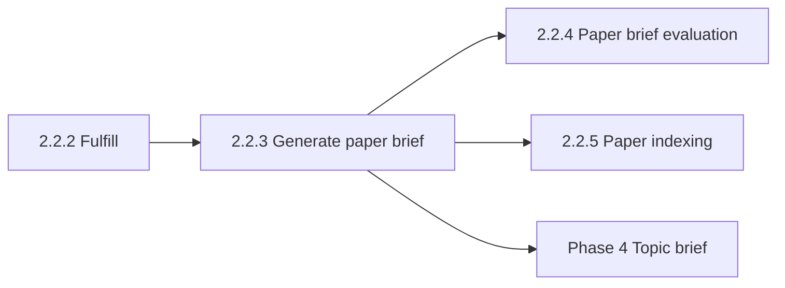

# Paper brief evaluation

This document is the specification for **phase 2, step 2.2.4** of the Topic scope workflow in [README.md](../../README.md).

**Not implemented.** This document locks the **LLM-as-judge approach** only. There is no Prefect job, ORM row, prompt file under `src/`, or Streamlit page.

**Step vs result:** **Paper brief evaluation** is the workflow **step**. The **result** is a global evaluation artifact for one succeeded `PaperBrief`. Do not use this step name for [Generate paper brief](2.2.3-generate-paper-brief.md).

**Parent group:** [Paper Ingestion](2.2-paper-ingestion.md). Phase landing: [External sources ingestion](2-external-sources-ingestion.md).

## Glossary

| Term | Meaning |
| --- | --- |
| **Paper brief evaluation** | Leaf step that scores a succeeded global **paper brief** with an LLM-as-judge against the paper’s full text. |
| **Judge** | A second LLM call, distinct from `create_paper_brief`. It does not draft or rewrite the brief. |
| **Verdict** | Overall `pass` or `fail` stored on the evaluation artifact only. It does not change `PaperBrief.status`. |
| **Paper brief** / **`PaperBrief`** | Global, topic-agnostic structured summary of one `Paper`. Owned by [Generate paper brief](2.2.3-generate-paper-brief.md). |

## Topic scope workflow

A **Topic scope workflow** is the four-phase workflow in [README.md](../../README.md), run on one `TopicScope`. This document specifies **Paper brief evaluation** on the External sources ingestion path.

`PaperBrief` and its evaluation are **not** scoped to a Topic scope. The judge does **not** receive the topic statement or facets.

The LLM client vendor is owned by [technology-stack.md](../technology-stack.md). Do not name a vendor in this spec. Do **not** add DeepEval, RAGAS, or another eval library.

## Scope

### In scope (this document)

- Lock the G-Eval-style pointwise judge: inputs, criteria, scores, and verdict.
- State that evaluation is **advisory**: it does not change `PaperBrief.status` and does not block [Topic brief generation](4-topic-brief-generation.md).
- Point to a future implementation contract (package, template, Prefect job, persistence, UI).

### Out of scope (this document)

- Any application code, tests, Alembic migration, or Streamlit page.
- Drafting or rewriting `PaperBrief` — owned by [Generate paper brief](2.2.3-generate-paper-brief.md).
- Viewing stored paper-brief prose — owned by [Paper brief](paper-brief.md).
- [Paper indexing](2.2.5-paper-indexing.md) (independent of this step).
- The deferred **rule-based** citation quality index on the topic brief — owned by [Topic brief generation](4-topic-brief-generation.md#citation--content-quality-validation-not-in-v1).

## Position in the workflow

1. **Generate paper brief** stores a succeeded global `PaperBrief` when full text is usable.
2. **Paper brief evaluation** (this specification) scores that brief against `full_text_plain`. It does not run inside `create_paper_brief`.
3. **Paper indexing** does not depend on evaluation.
4. **Topic brief generation** consumes succeeded `PaperBrief` rows. It does **not** wait for a verdict.

## Approach (locked)

In-house **G-Eval-style pointwise** judge. One brief per call. No pairwise compare. No gold brief.

| Choice | Rule |
| --- | --- |
| Mode | Pointwise: score one brief. |
| Grounding | Source-conditioned and reference-free. Judge input is `Paper.full_text_plain` plus structured `PaperBriefContent`. No gold brief. No topic statement or facets. |
| Separation | A **second** LLM call with its own system prompt. Do not reuse [`paper_brief_template.md`](../../src/paper_reviewer/topic_scope/generate_paper_brief/paper_brief_template.md). |
| Decoding | Deterministic judge (temperature 0). Chain-of-thought rationale first, then integer scores. Structured JSON output. |
| Policy | **Advisory.** Does not change `PaperBrief.status`. Does not block Topic brief generation. |

### Prerequisite

Run the judge only when **both** are true:

- `PaperBrief.status` is `succeeded`.
- `full_text_plain` is usable (same rule as [Generate paper brief](2.2.3-generate-paper-brief.md): not missing, not blank, not a PMC license-block stub).

Skip papers with no succeeded brief. Do not call the judge for those papers.

### Identity

The evaluation artifact is **global**, 1:1 with the paper/brief. There is **no** `topic_scope_id` on it.

## Criteria

This spec owns the criterion list and rubric until an implementation template exists. Criteria match the generator grounding rules in [`paper_brief_template.md`](../../src/paper_reviewer/topic_scope/generate_paper_brief/paper_brief_template.md). Do not copy that prompt into this document.

| Criterion | What the judge checks |
| --- | --- |
| **Faithfulness** | Every claim in the brief is supported by `full_text_plain`. No invented numbers, citations, sample sizes, or findings. |
| **Completeness** | Required fields (`summary`, `objective`, `key_findings`) reflect the article. Optional fields are filled only when the text supports them. |
| **Conciseness** | `key_findings` is a short list (typically two or three items). No table dump. |
| **Topic-agnostic** | The brief describes the article, not a user research topic. |

Each criterion: integer **1–5** plus a short rationale.

| Score | Meaning |
| --- | --- |
| 1 | Severe violation of the generator contract. |
| 2 | Major gaps or unsupported claims. |
| 3 | Mixed: some parts meet the contract, others do not. |
| 4 | Minor issues only. |
| 5 | Fully meets the generator contract for that criterion. |

### Verdict

`pass` when **faithfulness is ≥ 4** and required fields are not empty or fabricated. Otherwise `fail`.

Store the verdict on the evaluation artifact only. Do not write it onto `PaperBrief.status` or `PaperBrief.content`.

## Implementation sketch (not in this docs slice)

**Do not implement** the items below until a later slice. They are the target contract so that slice has a single owner.

| Piece | Future contract |
| --- | --- |
| Domain package | `paper_reviewer.topic_scope.paper_brief_evaluation` |
| Prompt | `paper_brief_evaluation_template.md` (YAML front matter + judge system prompt), same pattern as the brief template. When that file exists, stop copying the rubric into this spec; this spec then points at that file. |
| Prefect | Idempotent `evaluate_paper_brief`. Re-run after `regenerate_paper` rewrites a brief. Fail-soft per paper. |
| Persistence | Separate 1:1 row (not fields inside `PaperBrief.content`). Reuse `PaperAspectStatus` for the evaluation job. Score payload shape is deferred to that slice; it must include per-criterion scores, rationales, and `verdict`. |
| UI | No stepper entry until a page exists (same as [Paper indexing](2.2.5-paper-indexing.md) today). |

## Related

| Concern | Spec |
| --- | --- |
| Paper brief creation | [2.2.3-generate-paper-brief.md](2.2.3-generate-paper-brief.md) |
| Content fields / generator prompt | [`paper_brief_template.md`](../../src/paper_reviewer/topic_scope/generate_paper_brief/paper_brief_template.md) |
| Paper brief reader | [paper-brief.md](paper-brief.md) |
| Paper indexing (independent) | [2.2.5-paper-indexing.md](2.2.5-paper-indexing.md) |
| Topic brief quality index (rule-based; distinct) | [4-topic-brief-generation.md](4-topic-brief-generation.md#citation--content-quality-validation-not-in-v1) |
| Stack (LLM client) | [technology-stack.md](../technology-stack.md) |
