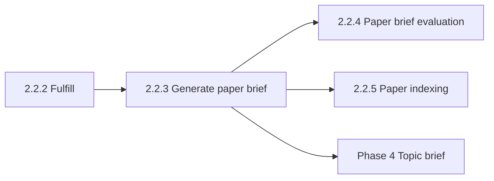

# Paper brief evaluation

This document is the specification for **phase 2, step 2.2.4** of the Topic scope workflow in [README.md](../../README.md).

**Step vs result:** **Paper brief evaluation** is the workflow **step**. The **result** is a global evaluation artifact stored **on** the succeeded `PaperBrief` row (`evaluation` JSONB plus `evaluation_score`). Do not use this step name for [Generate paper brief](2.2.3-generate-paper-brief.md).

In this step, an idempotent Prefect job scores a succeeded global **paper brief** with an LLM-as-judge against the paper’s full text. Streamlit does **not** have a dedicated page. After [Paper archiving](2.2.1-paper-archiving.md), evaluation runs as `ingest_paper` step 4 (`force=true`). `evaluate_paper_brief` with `force=false` stays served for Prefect console / ops.

Judge criteria, evaluation steps, and rubric: [`paper_brief_evaluation_template.md`](../../src/paper_reviewer/topic_scope/paper_brief_evaluation/paper_brief_evaluation_template.md).

**Parent group:** [Paper Ingestion](2.2-paper-ingestion.md). Phase landing: [External sources ingestion](2-external-sources-ingestion.md).

## Glossary

| Term | Meaning |
| --- | --- |
| **Paper brief evaluation** | Leaf step that scores a succeeded global **paper brief** with an LLM-as-judge against the paper’s full text. |
| **Judge** | A second LLM call, distinct from `create_paper_brief`. It does not draft or rewrite the brief. |
| **G-Eval criterion** | One of four whole-brief scores: `faithfulness`, `completeness`, `conciseness`, `topic_agnostic`. Each has `reasoning` plus an integer `score` 1–5. |
| **`evaluation_score`** | Overall numeric mean (1.00–5.00) of the four G-Eval criterion scores. Stored on `PaperBrief`. App-computed. |
| **Paper brief** / **`PaperBrief`** | Global, topic-agnostic structured summary of one `Paper`. Owned by [Generate paper brief](2.2.3-generate-paper-brief.md). This step owns the evaluation columns on that same row. |

## Topic scope workflow

A **Topic scope workflow** is the four-phase workflow in [README.md](../../README.md), run on one `TopicScope`. This document specifies **Paper brief evaluation** on the External sources ingestion path.

`PaperBrief` and its evaluation are **not** scoped to a Topic scope. The judge does **not** receive the topic statement or facets.

The LLM client vendor is owned by [technology-stack.md](../technology-stack.md). Do not name a vendor in this spec. Do **not** add DeepEval, RAGAS, or another eval library.

## Scope

### In scope (current v1)

- In-house G-Eval-style pointwise judge: score the **whole brief** once on four criteria, JSON shape, and overall mean.
- Persist the judge artifact and `evaluation_score` **on** `PaperBrief` (not inside `content`, not a separate table).
- Evaluation is **advisory**: it does not change `PaperBrief.status` or `content` and does not block [Topic brief generation](4-topic-brief-generation.md).
- Idempotent Prefect job `evaluate_paper_brief`. After archive, that call is `ingest_paper` step 4 with `force=true`.
- Show the overall `evaluation_score` on [Paper archiving](2.2.1-paper-archiving.md) progress and on the [Paper brief](paper-brief.md) reader when evaluation succeeded.

### Out of scope (v1)

- A dedicated Streamlit page or stepper entry for this step.
- The four G-Eval criterion scores in either UI (only the overall mean).
- Drafting or rewriting `PaperBrief.content` — owned by [Generate paper brief](2.2.3-generate-paper-brief.md).
- Viewing stored paper-brief prose — owned by [Paper brief](paper-brief.md).
- [Paper indexing](2.2.5-paper-indexing.md) (independent of this step).
- The deferred **rule-based** citation quality index on the topic brief — owned by [Topic brief generation](4-topic-brief-generation.md#citation--content-quality-validation-not-in-v1).
- A pass/fail **verdict**. There is no verdict field.
- Per-field scores, empty-field overrides, or a presence flag (`source_had_information`). Completeness covers required vs optional fields.
- Log-probability weighting or multi-sample scoring. Integer 1–5 plus the app mean is enough (fits structured JSON and local gateways).
- DeepEval, RAGAS, or another eval library.
- Notebook / file-based offline evaluation of generated briefs — owned by [Offline paper-brief evaluation](paper-brief-evaluation-offline.md).

## Position in the workflow



1. **Generate paper brief** stores a succeeded global `PaperBrief` when full text is usable.
2. **Paper brief evaluation** (this specification) scores that brief against `full_text_plain`. It does not run inside `create_paper_brief`. After archive, that call is `ingest_paper` step 4.
3. **Paper indexing** does not depend on evaluation.
4. **Topic brief generation** consumes succeeded `PaperBrief` rows. It does **not** wait for `evaluation_status` or `evaluation_score`.

## Approach (locked)

In-house **G-Eval-style pointwise** judge. One brief per call. No pairwise compare. No gold brief.

| Choice | Rule |
| --- | --- |
| Mode | Pointwise: score one brief. |
| Unit | The **whole** `PaperBriefContent` (not each field). |
| Grounding | Source-conditioned and reference-free. Judge input is `Paper.full_text_plain` plus structured `PaperBriefContent`. No gold brief. No topic statement or facets. |
| Separation | A **second** LLM call with its own system prompt. Do not reuse [`paper_brief_template.md`](../../src/paper_reviewer/topic_scope/generate_paper_brief/paper_brief_template.md) as the judge prompt. Load field ids and `required` flags from that file’s YAML front matter so **completeness** can check the generator contract. Do not keep a second field list. |
| Decoding | Deterministic judge (temperature 0). Structured JSON. Fixed evaluation steps in the prompt, then `reasoning` plus integer scores. |
| Totals | The LLM does **not** own `evaluation_score`. The app computes it as the mean of the four criterion scores. |
| Policy | **Advisory.** Does not change `PaperBrief.status` or `content`. Does not block Topic brief generation. |

Use the same full-text extract (and local-gateway clip) as [Generate paper brief](2.2.3-generate-paper-brief.md). Do not send journal boilerplate or the reference list.

### Prerequisite

Run the judge only when **both** are true:

- `PaperBrief.status` is `succeeded`.
- `full_text_plain` is usable (same rule as [Generate paper brief](2.2.3-generate-paper-brief.md): not missing, not blank, not a PMC license-block stub).

Skip papers with no succeeded brief. Do not call the judge for those papers.

### Identity

The evaluation artifact is **global**, 1:1 with the paper/brief, stored on the `PaperBrief` row. There is **no** `topic_scope_id` on it. There is **no** separate evaluation table.

## Criteria

**Owner of criterion ids, evaluation steps, rubric, and judge prompt:** [`paper_brief_evaluation_template.md`](../../src/paper_reviewer/topic_scope/paper_brief_evaluation/paper_brief_evaluation_template.md) in `paper_reviewer.topic_scope.paper_brief_evaluation`. YAML front matter lists the four criterion ids. The Markdown body is the judge system prompt. Do not copy that prompt into this spec, AGENTS.md, or a skill.

Criteria match the generator grounding rules in [`paper_brief_template.md`](../../src/paper_reviewer/topic_scope/generate_paper_brief/paper_brief_template.md). Do not copy that generator prompt into this document. Completeness uses generator field ids and `required` flags from that file’s YAML front matter. Do not keep a second field list in the judge template.

Apply all four criteria **once to the whole brief**. Schema field names must match these ids:

| Criterion id | What the judge checks |
| --- | --- |
| `faithfulness` | Every claim in the brief is supported by `full_text_plain`. No invented numbers, citations, sample sizes, or findings. |
| `completeness` | The brief matches the generator contract: required fields filled; optional fields filled only when the text supports that aspect. |
| `conciseness` | Shape matches the generator template (short summary, few `key_findings`, short labels). |
| `topic_agnostic` | The brief describes the article, not a user research topic. The judge does not receive the topic; it flags topic-framing language. |

Each criterion object is `{reasoning: str, score: int}` with `score` in 1–5 (1 worst, 5 best). Locked evaluation steps and the 1–5 rubric live in the judge template.

If the generator template front matter adds or removes a field, update the judge prompt (completeness) in the **same** change. Do not add per-field scores.

## Overall `evaluation_score`

Arithmetic mean of the **four** criterion scores, rounded to **two decimal places**, range **1.00–5.00**.

Store the result on `PaperBrief.evaluation_score`. The LLM must not supply this number.

There is **no** pass/fail verdict.

## Judge JSON vs persisted JSON

One judge call per brief. Temperature 0. Structured JSON (same pattern as `create_paper_brief`: `json_schema`, then validate). The judge always sends `max_tokens=8192`. When `OPENAI_BASE_URL` is set, the judge also sends `reasoning_effort=none` (same as [Generate paper brief](2.2.3-generate-paper-brief.md)). If `content` is empty, the client reads a reasoning field on the assistant message and validates that text.

**LLM JSON (validated):** four objects `faithfulness`, `completeness`, `conciseness`, `topic_agnostic`, each `{reasoning: str, score: int}` with `score` in 1–5.

The LLM does **not** return `evaluation_score`, per-field scores, or presence flags.

**Persisted `evaluation` JSONB:** the validated LLM payload (the four criterion objects).

`evaluation_score` lives on the column, not as the source of truth inside the JSON.

## `PaperBrief` columns (this document owns)

These columns live on the global `PaperBrief` row. Do **not** put them inside `content`. Do **not** add a separate evaluation table. [Generate paper brief](2.2.3-generate-paper-brief.md) owns `status`, `content`, `error_message`, and the three generate-brief usage columns.

| Field | Required | Description |
| --- | --- | --- |
| `evaluation_status` | Yes | `PaperAspectStatus`. Default `not_started`. Independent of brief `status`. |
| `evaluation` | No until succeeded | JSONB artifact (four G-Eval criterion objects). Null until evaluation `succeeded`. |
| `evaluation_score` | No until succeeded | Numeric 1.00–5.00, two decimal places. Null until evaluation `succeeded`. |
| `evaluation_error_message` | No | Set when `evaluation_status=failed`. Cleared on evaluation `succeeded`. Include the exception type name and message (and `__cause__` chain when present). On judge JSON parse failure, include the validation or extract error plus the raw assistant text (capped at 8000 characters) after an `Assistant output:` marker (same diagnose pattern as brief `error_message`). |

| `evaluation_status` | Meaning |
| --- | --- |
| `not_started` | No completed judge run (including after a brief rewrite cleared the columns). |
| `succeeded` | `evaluation` and `evaluation_score` stored. Frozen unless `ingest_paper` forces a re-eval. |
| `failed` | Judge / parse / persist failed. Brief `status` stays `succeeded`. Terminal until `ingest_paper` (or `force=true`). |
| `unavailable` | Not used on the normal path. |

Do **not** overwrite the three generate-brief token columns (`prompt_tokens`, `completion_tokens`, `total_tokens`) with judge usage. Judge usage stays in the Prefect run log only.

### Clear on brief rewrite or brief failure

When `create_paper_brief` rewrites `content` (`force=true`) or sets brief `failed`, it must clear the four evaluation columns: `evaluation_status=not_started`, `evaluation=null`, `evaluation_score=null`, `evaluation_error_message=null`. A brief no-op skip does **not** change evaluation columns. Contract pointer: [Generate paper brief](2.2.3-generate-paper-brief.md).

## Public API and Prefect entrypoints

Domain package: `paper_reviewer.topic_scope.paper_brief_evaluation`.

Prefect flow (name is the contract): `paper_reviewer.flows`

```text
evaluate_paper_brief(paper_id, doi, force=false) -> EvaluatePaperBriefResult
```

DOI on flow parameters is for UI/search and the flow run name (`flow_run_name="{doi}"`); durable work keys off `paper_id`.

| Entrypoint | Role |
| --- | --- |
| `evaluate_paper_brief` | Require brief `status = succeeded` and usable `full_text_plain`. If `evaluation_status` is `succeeded` and `force` is false, return no-op success. Else call the judge, persist `evaluation` + `evaluation_score`, set `evaluation_status`. `force=true` is allowed from `ingest_paper`. |

```text
EvaluatePaperBriefResult
  paper_id: int
  status: PaperAspectStatus
  error_message: str | None
```

`status` here is `evaluation_status`, not brief `status`.

| Rule | Behavior |
| --- | --- |
| Idempotent by default | Same inputs after evaluation success do not re-judge. |
| Fail-soft | Evaluation `failed` does not change brief `status` or `content`. One paper failure must not cancel other papers’ runs. |
| Raise | Raise only for unusable infrastructure (DB down, Prefect submit impossible). Per-paper LLM errors become evaluation `failed` + `evaluation_error_message`. |

Pydantic types live under `paper_reviewer.schemas.topic_scope`.

## Prefect job behavior

### `evaluate_paper_brief`

| Case | Expected |
| --- | --- |
| Brief `status` is not `succeeded` | Do not call the judge. Leave evaluation columns unchanged (or still `not_started` if never run). |
| `full_text_plain` is not usable | Do not call the judge. Set `evaluation_status=failed` with the same unusable-body message pattern as brief creation. Clear `evaluation` and `evaluation_score`. |
| `force` is false and `evaluation_status` is `succeeded` | No-op success. Do not change `evaluation` or `evaluation_score`. |
| `force` is false and `evaluation_status` is `failed` | No-op; leave `failed`. |
| Brief `succeeded`, evaluation `not_started` (or no prior run) | Call judge; log request/response/usage like `create_paper_brief` (including error-level call-failure logs); persist artifact + score; set evaluation `succeeded`; clear `evaluation_error_message`. |
| LLM / validation / DB error | Set evaluation `failed` + `evaluation_error_message` (exception type, message, and cause chain when present). Clear `evaluation` and `evaluation_score`. Brief `status`/`content` unchanged. |
| `force` is true (from `ingest_paper`) and brief `succeeded` | Re-judge even if evaluation was `succeeded` or `failed`. |

### `ingest_paper` step 4

After a succeeded `create_paper_brief`, call `evaluate_paper_brief(paper_id, doi, force=true)`. If the brief is not `succeeded`, skip evaluation. Orchestrator pointer: [Fulfill papers metadata](2.2.2-fulfill-papers-metadata.md#ingest_paper-orchestrator).

## Streamlit UI (v1)

There is **no** dedicated Streamlit page for this step. Do **not** register `paper_brief_evaluation` in `build_app_pages()`. Do **not** add a stepper entry (same as [Paper indexing](2.2.5-paper-indexing.md)).

When evaluation **succeeded**, show the overall `evaluation_score` (two decimals, for example `evaluation 4.25`) on:

- [Paper archiving](2.2.1-paper-archiving.md) progress (after the brief fragment, only when a brief succeeded).
- The [Paper brief](paper-brief.md) reader (after the bibliographic caption).

Neither UI lists the four criterion scores. The reader does **not** show failed-evaluation errors (that page is for succeeded brief prose). Paper archiving may show `evaluation Failed` plus a short error (omit any `Assistant output:` dump from the caption).

Do **not** run the judge inside Streamlit callbacks.

## Orchestration boundary

| Responsibility | Owner |
| --- | --- |
| Create/reuse bibliographic `Paper`; ingest auto-enqueue; progress UI (including evaluation mean) | [Paper archiving](2.2.1-paper-archiving.md) |
| Source record / full text / `PaperAspectStatus` / `ingest_paper` steps 1–2 | [Fulfill papers metadata](2.2.2-fulfill-papers-metadata.md); [external-sources/pubmed.md](external-sources/pubmed.md) for PubMed |
| Domain `evaluate_paper_brief` helper | `paper_reviewer.topic_scope.paper_brief_evaluation` |
| Prefect flow | `paper_reviewer.flows` (`evaluate_paper_brief`); parent `ingest_paper` calls this flow as a subflow with `force=true` after a succeeded brief |
| ORM evaluation columns on `PaperBrief` | `paper_reviewer.models.paper_brief` (this document owns the columns) |
| Pydantic contracts | `paper_reviewer.schemas.topic_scope` |
| Read UI (overall score on succeeded evaluation) | [Paper brief](paper-brief.md) |
| Paper brief drafting | [Generate paper brief](2.2.3-generate-paper-brief.md) (not this document) |
| Topic brief generation | [Topic brief generation](4-topic-brief-generation.md) (not this document) |

This document is the **behavior contract** for domain logic and the evaluation Prefect job. Implementation follows [tdd.md](../tdd.md).

## Testability

TDD per [tdd.md](../tdd.md):

The LLM is an **external** boundary: inject or stub the judge. Do not call a live API in tests. Do not name a vendor in this spec.

**Scoring:**

- The validated judge JSON has exactly the four criterion objects; each `score` is an integer 1–5.
- `evaluation_score` is the mean of those four scores (two decimal places), not a value from the LLM.
- Completeness treats a correctly empty optional field as allowed (no separate presence flag or override score).
- Criterion ids match the evaluation template front matter (fail if they drift).
- Completeness uses generator-template field ids and required flags (fail if they drift).

**`evaluate_paper_brief`:**

- Brief not `succeeded` → no judge; evaluation columns unchanged.
- Evaluation already `succeeded`, `force` false → no judge; artifact unchanged.
- Happy path → persist JSON + `evaluation_score`; `evaluation_status=succeeded`.
- Judge parse failure → evaluation `failed`; brief `status`/`content` unchanged; generate-brief token columns unchanged.
- `force` true → re-judge even if evaluation `succeeded`.

**`create_paper_brief` interaction** (tests live with generate-paper-brief; behavior owned here):

- Brief rewrite or brief `failed` → evaluation columns cleared to `not_started` / null.
- Brief no-op skip → evaluation columns unchanged.

**UI slice:** `tests/ui/test_navigation.py` must **not** register a Paper brief evaluation page. Paper archiving caption helpers show the two-decimal mean when evaluation succeeded, and no number when evaluation is fulfilling or failed. Paper brief reader caption helpers show the two-decimal mean when `evaluation_score` is set, and omit the line when it is null.

## Related

| Concern | Spec |
| --- | --- |
| Paper brief creation | [2.2.3-generate-paper-brief.md](2.2.3-generate-paper-brief.md) |
| Content fields / generator prompt | [`paper_brief_template.md`](../../src/paper_reviewer/topic_scope/generate_paper_brief/paper_brief_template.md) |
| Judge criteria / evaluation prompt | [`paper_brief_evaluation_template.md`](../../src/paper_reviewer/topic_scope/paper_brief_evaluation/paper_brief_evaluation_template.md) |
| Paper brief reader | [paper-brief.md](paper-brief.md) |
| Paper archiving progress | [2.2.1-paper-archiving.md](2.2.1-paper-archiving.md) |
| `ingest_paper` steps 1–2 | [2.2.2-fulfill-papers-metadata.md](2.2.2-fulfill-papers-metadata.md) |
| Paper indexing (independent) | [2.2.5-paper-indexing.md](2.2.5-paper-indexing.md) |
| Topic brief quality index (rule-based; distinct) | [4-topic-brief-generation.md](4-topic-brief-generation.md#citation--content-quality-validation-not-in-v1) |
| Offline notebook eval (file corpus; not this job) | [paper-brief-evaluation-offline.md](paper-brief-evaluation-offline.md) |
| Stack (LLM client) | [technology-stack.md](../technology-stack.md) |
