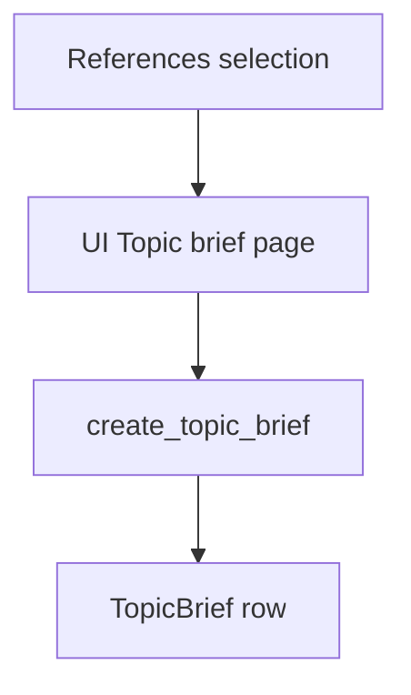

# Topic brief

This document is the specification for the **Topic brief** phase (phase 4) of the Topic scope workflow in [README.md](../../README.md).

**Phase vs result:** **Topic brief** is the workflow **phase**. A **topic brief** (`TopicBrief`) is the **result** that phase produces for one `TopicScope`. Do not use “topic brief” alone to name the Prefect job.

In this phase, the user opens a dedicated Streamlit page and clicks **Generate topic brief** (or **Regenerate topic brief**). An overwrite-on-click Prefect job drafts a cited, topic-conditioned brief from the current References that already have a succeeded paper brief. The page shows progress on the same URL.

**Independent phases:** the user may open this landing without running External sources ingestion or References selection. Do not add cross-phase gates in v1. Generation still requires at least one Reference with a succeeded paper brief (button disabled otherwise).

`PaperAspectStatus` is owned by [Fulfill papers metadata](2.2.2-fulfill-papers-metadata.md). This phase reuses it on `TopicBrief.status`. Do **not** set `unavailable` on `TopicBrief`.

This phase has a single page (no phase header/stepper).

## Glossary

| Term | Meaning |
| --- | --- |
| **Topic brief** / **`TopicBrief`** | **Result** artifact: structured, **topic-conditioned** cited introduction for one `TopicScope`. One row per Topic scope. Product meaning: [README.md](../../README.md) Terminology. Distinct from a **paper brief**. |
| **`create_topic_brief`** | Prefect job that drafts or rewrites the **topic brief** for one Topic scope. |
| **Generate topic brief** | Primary button action on this page that enqueues `create_topic_brief` (creates when missing; overwrites when a row already exists). |
| **Phase landing** | Streamlit page reached from the [Topic scope hub](1.2-topic-analysis.md#topic-scope-hub). |
| **Reference** | Durable link from the Topic scope to an ingested `Paper`. Owned by [Show references](3.1-show-references.md). |
| **Paper brief** / **`PaperBrief`** | Global, topic-agnostic summary of one `Paper`. Owned by [Generate paper brief](2.2.3-generate-paper-brief.md). |
| **Briefed Reference** | A Reference whose global `PaperBrief.status` is `succeeded`. Only these enter the LLM payload. |
| **`citation_description`** | App-built minimal citation string for one briefed paper: `{doi} — {title}` with uppercase DOI. Sent in the user message; the LLM must echo it as `citations[].text`. |

## Topic scope workflow

A **Topic scope workflow** is the four-phase workflow in [README.md](../../README.md), run on one `TopicScope`. This document specifies phase 4: draft and store the cited topic brief.

Inputs come from earlier phases when present: topic statement and facets on the Topic scope; References from [References selection](3-references-selection.md); succeeded global `PaperBrief` rows from [Generate paper brief](2.2.3-generate-paper-brief.md). Phase 4 does not create Papers, paper briefs, or References.

For the application runtime stack (including Prefect as a Compose service), see [technology-stack.md](../technology-stack.md) and [local-development.md](../local-development.md). This specification is the orchestration contract; LLM work runs in Prefect, not in Streamlit.

## Scope

### In scope (current v1)

- Dedicated Streamlit page with title **Topic brief** (same register as today’s shell). No phase header/stepper (this phase has one step).
- Primary button to generate or regenerate the topic brief (overwrite-on-click; not skip-if-succeeded), disabled when there are zero briefed References.
- Enqueue Prefect `create_topic_brief` for the Topic scope in the URL (refuse when zero briefed References).
- Persist one `TopicBrief` per `topic_scope_id` with `PaperAspectStatus` and structured `TopicBriefContent`.
- Progress on the same `topic-brief` URL via `@st.fragment(run_every=2)` and `st.status`, polling durable DB status (not Prefect run ids).
- LLM section list and system prompt: [`topic_brief_template.md`](../../src/paper_reviewer/topic_scope/topic_brief/topic_brief_template.md).
- User message includes every briefed Reference (paper brief + app `citation_description`), ordered by `Paper.pub_date` newest first.

### Out of scope (v1)

- Auto-enqueue on first page visit (button only).
- [Generate paper brief](2.2.3-generate-paper-brief.md) ingest step or changing its skip-if-succeeded policy.
- Creating or mutating References, Papers, or paper briefs.
- Adding an `in_progress` member to `PaperAspectStatus`.
- Citation UX polish beyond rendering stored `TopicBriefContent` (interactive claim↔citation tooling; click-through from `[n]` markers).
- Running [Citation / content quality validation](#citation--content-quality-validation-not-in-v1) or persisting a quality index.
- Durable snapshot of generation-time source DOIs on `TopicBrief` (bibliography is the cited `citations` list only).
- Prefect Compose service topology — owned by [local-development.md](../local-development.md) / [technology-stack.md](../technology-stack.md).

## Position in the workflow



1. **References selection** attaches Papers as References for the Topic scope ([Show references](3.1-show-references.md), [Add reference](3.2-add-reference.md)).
2. **Generate paper brief** (earlier phase) may already have produced global succeeded `PaperBrief` rows for those papers.
3. **Topic brief** (this specification) loads briefed References, calls the LLM with the topic brief template, and upserts `TopicBrief`.

## Selection rules (LLM input set)

| Input | Role |
| --- | --- |
| `TopicScope` | Topic statement; public `key` in the URL. |
| Topic facets | Scope and focus for the draft ([Topic analysis](1.2-topic-analysis.md)). |
| References for the scope | Candidate papers; filter to briefed References only. |
| Succeeded `PaperBrief` | Required filter: only References whose global paper brief `status` is `succeeded` enter the LLM payload. |

| Condition | Action |
| --- | --- |
| Reference has no `PaperBrief` row, or brief is not `succeeded` | Exclude from the LLM payload. Do not invent methods or results for that paper. |
| Reference has `PaperBrief.status = succeeded` | Include paper-brief fields and app-built `citation_description` (`{doi} — {title}`, uppercase DOI). Bibliographic facts may accompany the block for grounding; citation list `text` must come from `citation_description`. |
| Zero briefed References | Do **not** generate. UI disables the button; enqueue does not submit; the job does not call the LLM and sets `failed` with a clear error if invoked anyway. |

Do **not** send References that lack a succeeded paper brief as bibliographic-only stubs. That is stricter than a generic “any Reference” list; the template grounding rules match this filter.

### Prompt order

Include **all** briefed References in the user message (no count cap in v1). Sort by `Paper.pub_date` **descending** (newest first). Papers with null `pub_date` go **last**, then stable tie-break by Reference `created_at` ascending, then Reference `id` ascending.

The bibliography in the result is the **cited subset** only: not every briefed Reference must appear in `citations`. Do not persist a separate generation-time source snapshot on `TopicBrief`.

### Citation markers (v1 contract for prompt + UI)

- In-text markers are literal `[n]` (for example `[1]`).
- Multi-cite only as adjacent markers: `[1][2]` (not `[1,2]` or ranges).
- Number citations in the order they first appear in `introduction`, `sections[].body`, and `concluding_section`.
- Reuse the same `n` when citing the same paper again.
- Do not put citation markers in `abstract` or `key_points`.
- UI renders markers as stored text; no click-through from markers to papers.

## Public API and Prefect entrypoints

Domain package: `paper_reviewer.topic_scope.topic_brief` — see [project-structure.md](../project-structure.md).

Prefect flows (names are the contract): `paper_reviewer.flows`

```text
create_topic_brief(topic_scope_id, force=true) -> CreateTopicBriefResult
enqueue_create_topic_brief(topic_scope_id) -> CreateTopicBriefEnqueueResult
```

| Entrypoint | Role |
| --- | --- |
| `create_topic_brief` | Load Topic scope, facets, and briefed References. If none, do not call the LLM; set `failed` + error. Otherwise call LLM with the topic brief template. On successful `TopicBriefContent` parse, always store `content` and set `succeeded` (v1 does not gate on citation quality). The Streamlit page always submits with overwrite semantics (`force=true`): rewrite even when a succeeded brief already exists. |
| `enqueue_create_topic_brief` | UI helper: if zero briefed References, do **not** submit (`skipped_no_briefed=true`). If a `TopicBrief` row exists and `status` is already `not_started` (job in flight), do **not** submit a second Prefect run. Otherwise create or reset the row to `not_started`, clear `error_message`, keep previous `content` until a new draft succeeds, and submit `create_topic_brief`. |

| Rule | Behavior |
| --- | --- |
| Overwrite-on-click | Same button creates when missing and rewrites when a row exists. Not skip-if-succeeded (unlike [Generate paper brief](2.2.3-generate-paper-brief.md)). |
| In-flight guard | While `status` is `not_started` after a submit, do not enqueue again. |
| Zero-briefed guard | UI, enqueue, and job all refuse generation when there are no briefed References. |
| Fail-soft | LLM / parse / DB errors become `failed` + `error_message`. Raise only for unusable infrastructure (DB down, Prefect submit impossible). Citation quality checks are **not** a v1 failure path — see [Citation / content quality validation](#citation--content-quality-validation-not-in-v1). |

Pydantic types live under `paper_reviewer.schemas.topic_scope`.

### Result type fields (v1)

```text
TopicBriefContent
  title: str
  abstract: str
  introduction: str
  sections: list[{heading: str, body: str}]
  concluding_section: str
  key_points: list[str]
  citations: list[{n: int, doi: str, text: str}]

CreateTopicBriefResult
  topic_scope_id: int
  status: PaperAspectStatus
  error_message: str | None

CreateTopicBriefEnqueueResult
  submitted: bool
  skipped_in_flight: bool
  skipped_no_briefed: bool
```

Field ids on `TopicBriefContent` must match the template YAML front matter. Do not store Prefect run ids on these types for UI progress.

Example after a first Generate click (with briefed References):

```text
CreateTopicBriefEnqueueResult(submitted=True, skipped_in_flight=False, skipped_no_briefed=False)
```

Example when the user clicks again while status is still `not_started`:

```text
CreateTopicBriefEnqueueResult(submitted=False, skipped_in_flight=True, skipped_no_briefed=False)
```

Example when there are zero briefed References:

```text
CreateTopicBriefEnqueueResult(submitted=False, skipped_in_flight=False, skipped_no_briefed=True)
```

## `TopicBrief` model (v1)

| Field | Required | Description |
| --- | --- | --- |
| `id` | Yes (DB) | Primary key. |
| `created_at` | Yes (DB) | Row creation time. |
| `updated_at` | Yes (DB) | Last status/content update. |
| `topic_scope_id` | Yes | FK to `TopicScope`. Unique. |
| `status` | Yes | `PaperAspectStatus`. Default `not_started`. |
| `error_message` | No | Set when `status=failed`. Cleared on enqueue and on `succeeded`. On `TopicBriefContent` parse failure, include the validation or extract error plus the raw assistant text (capped at 8000 characters) after an `Assistant output:` marker. |
| `content` | No until succeeded | Structured brief payload (JSONB / typed sections). On regenerate enqueue, keep previous `content` until the new draft succeeds. On failed rewrite, leave last good `content` for display. After a successful parse, always store the new `content` (v1). |

`TopicScope` navigates to this row (1:1). Do **not** copy brief status onto `TopicScope` columns.

ORM: `paper_reviewer.models.topic_scope.topic_brief`. Follow the stack rule: **no** `ON DELETE CASCADE` ([technology-stack.md](../technology-stack.md)).

### Uniqueness

| Constraint | Rule |
| --- | --- |
| `topic_scope_id` | Unique. One topic brief per Topic scope. |

### Status

Use `PaperAspectStatus` ([Fulfill papers metadata](2.2.2-fulfill-papers-metadata.md#paperaspectstatus)) with the **shared enum semantics**:

| Status | Meaning on `TopicBrief` |
| --- | --- |
| `not_started` | No completed attempt, **or** a draft job is in flight after enqueue. Leave this value while `create_topic_brief` runs until the flow writes a terminal member. |
| `succeeded` | Brief content stored; safe to show as the current topic brief. |
| `failed` | Last attempt failed (zero briefed when job ran, LLM/parse/DB error). Previous `content` may still be present after a failed regenerate. |
| `unavailable` | **Do not use** on `TopicBrief`. |

There is **no** `informing`, `pending`, `drafting`, `ready`, or `in_progress` member. In-flight progress reuses `not_started`, same as other aspects that share this enum.

Prefer this durable status so the UI can poll the database without Prefect as the only source of truth. Optional Prefect run ids may be stored for ops, but are not required for the progress UI contract.

### Structured content (LLM output)

`content` is a structured object (not a single free-form blob as the only field). v1 sections are **topic-conditioned** (topic statement, facets, and briefed References).

**Owner of section list and prompt text:** [`topic_brief_template.md`](../../src/paper_reviewer/topic_scope/topic_brief/topic_brief_template.md) in `paper_reviewer.topic_scope.topic_brief`. YAML front matter lists JSON field ids and required flags. The Markdown body is the LLM system prompt. Do not copy that outline into this spec, AGENTS.md, or a skill.

`create_topic_brief` loads that file as the system prompt. The user message supplies the topic statement, topic facets, and each briefed Reference (succeeded paper-brief content plus app `citation_description`). The job sends OpenAI structured `json_schema` and then validates the assistant text as `TopicBriefContent` (field ids must match the template front matter). Local compatible gateways may ignore the schema, wrap JSON in Markdown, leak ANSI, or insert line-wrap newlines inside strings; the client strips those, extracts a JSON object, and ignores extra keys. When parse still fails, persist the validation or extract error and the raw assistant text (capped at 8000 characters) on `error_message` so the operator can diagnose illegal JSON.

On successful parse, **always store** `content` and set `succeeded`. v1 does **not** run citation-quality checks before that write.

Do **not** store a topic-agnostic paper summary here. Paper briefs stay on `PaperBrief` ([Generate paper brief](2.2.3-generate-paper-brief.md)).

Grounding: use only the Topic scope statement, facets, and briefed References. Do not invent papers or citations. Do not call EFetch, PMC Cloud, or paper-brief jobs from this phase.

## Citation / content quality validation (not in v1)

Documented quality bar for a later slice. **Do not implement in v1.**

When coded, validation must **not** decide job failure and must **not** block storing the topic brief. After a succeeded parse/store, produce a **quality index** over the stored `TopicBriefContent` (and the briefed input set used for that draft). The brief remains `succeeded` with `content` stored. More checks may be added to this list later.

Initial checks for the quality index:

| Check | Quality index finding when violated |
| --- | --- |
| Every `[n]` marker has a `citations` row with that `n` | Record finding |
| Every `citations[].doi` (uppercase) is in the briefed input DOI set | Record finding |
| `n` values are `1..N` with no gaps; order matches first appearance in prose | Record finding |
| No invented DOIs; no orphan markers | Record finding |
| No extra bibliography rows (citation never marked in prose) | Record finding |
| At least one citation when the briefed input set is non-empty | Record finding |
| Every `citations[].text` equals the app `citation_description` for that DOI | Record finding |
| No citation markers in `abstract` or `key_points` | Record finding |
| A `sections[].body` with no citation markers | Allowed (no finding) |

Marker syntax for checks: literal `[n]`; multi-cite only as `[1][2]`.

Quality index shape (artifact fields, storage, and UI) is deferred to the implementation slice that adds this feature. v1 stores no quality index column.

## Prefect job behavior

### `create_topic_brief`

| Case | Expected |
| --- | --- |
| Zero briefed References | Do not call the LLM. Set `failed` + error that generation needs at least one briefed Reference. Keep prior `content` when present. |
| Row missing and ≥1 briefed Reference | Create row; run LLM; on parse success store `content`; set `succeeded`; clear error. |
| `force` is true (page always) and row exists, ≥1 briefed Reference | Rewrite: run LLM even if status was `succeeded` or `failed`; then `succeeded` or `failed` from this attempt. Keep prior `content` until a successful write. |
| LLM / parse / DB error | Set `failed` + `error_message`. On `TopicBriefContent` parse failure, `error_message` includes the validation or extract error and the capped assistant text. Other failures (timeout, missing key) do not dump assistant text. |

### Overwrite policy

The Topic brief page button is **overwrite-on-click**. Each successful click produces a new draft from the **current** briefed Reference set. Safe to click again after a terminal status. No-submit cases: in-flight guard (`status` already `not_started`), and zero briefed References.

This differs from [Generate paper brief](2.2.3-generate-paper-brief.md), which skips when a paper brief is already `succeeded` unless `regenerate_paper` forces a rewrite.

## Streamlit UI (v1)

Module: `paper_reviewer.ui.topic_brief` with `render_topic_brief()`.

Register in `paper_reviewer.ui.navigation` (`build_app_pages()`):

| Property | Value |
| --- | --- |
| `key` | `topic_brief` |
| `title` | Topic brief |
| `url_path` | `topic-brief` |
| `in_sidebar` | false ([ui-style.md](../ui-style.md)) |

Streamlit is presentation only ([technology-stack.md](../technology-stack.md)). Heavy work runs in Prefect; the page enqueues and polls **durable DB status** on `TopicBrief`. Do not use Prefect run ids as progress truth.

The page URL stays `topic-brief` with `topic_scope_key` ([ui-style.md](../ui-style.md#topic-scope-key-in-the-url)). Do **not** encode job id or a generating flag in the query string; in-progress state is shown on that URL from DB status.

Do **not** show a References selection–style phase header/stepper on this page.

### Session keys

| Key | Type | Role |
| --- | --- | --- |
| (none required beyond URL) | — | Topic scope identity comes from `topic_scope_key`. Optional session cache that enqueue was submitted is allowed; durable progress is still `TopicBrief.status`. |

**Invalidate on new intake:** When Topic intake Submit starts a new `TopicScope`, clear the entire UI session, then write the new topic statement and set the Topic scope id in the URL — same cascade as other workflow pages.

### Page behavior

1. Require `topic_scope_key`. Missing key, non-UUID value, or no `TopicScope` row → empty state + page_link to **Topic intake** and **Topic scope**.
2. Show title **Topic brief**. Caption with Reference id (`topic_scope_key`) when present.
3. Load `TopicBrief` for the scope (if any) and count briefed References. When that count is zero, show a caption that generation needs at least one Reference with a succeeded paper brief; keep **Generate topic brief** / **Regenerate topic brief** **disabled**.
4. **In flight** (`status` is `not_started` after a row exists): disable the Generate / Regenerate button. Show `@st.fragment(run_every=2)` with `st.status` (“Generating topic brief…”). Poll durable status until terminal.
5. **Idle, no succeeded content** (no row, or `failed` with no prior content to prefer as primary), and ≥1 briefed Reference: primary button **Generate topic brief**. On click → `enqueue_create_topic_brief`.
6. **Idle, succeeded** (or `failed` with retained previous `content`), and ≥1 briefed Reference: render structured content; primary button **Regenerate topic brief** (same enqueue path). On `failed`, also show the error caption (and Assistant-output expander when the dump marker is present).
7. Page_link to **Topic scope**. Optional page_links to **Show references** / **Generate paper brief** when helpful (especially when the button is disabled for zero briefed References).

Do **not** run the LLM inside Streamlit callbacks. Do **not** auto-enqueue on first visit.

### Content rendering (when `succeeded`, or last good content while failed)

Show stored fields without copying the template outline into UI copy:

- `title` as the article heading
- `abstract`
- `introduction` (may include literal `[n]` markers)
- each `sections[]` as heading + body (bodies may include `[n]` markers)
- `concluding_section` (may include `[n]` markers)
- `key_points` as a list
- `citations` as a numbered list (`n`, `text`; DOI as a content link when useful) — this is the clear list of papers cited in the brief

### Progress display

| Durable signal | Display |
| --- | --- |
| No row, ≥1 briefed | Idle; **Generate topic brief** enabled |
| No row or idle, zero briefed | Caption; Generate/Regenerate **disabled** |
| `not_started` | `st.status` in progress; button disabled |
| `succeeded` | `st.status` complete (or hide); render content; **Regenerate topic brief** (disabled if zero briefed) |
| `failed` | Error caption; optional last good content; **Generate topic brief** or **Regenerate topic brief** as above (disabled if zero briefed) |

## Workflow navigation

- **Entry:** [Topic scope hub](1.2-topic-analysis.md#topic-scope-hub) → **Topic brief** with `topic_scope_key`.
- **Input:** Topic scope (statement + facets) and current References filtered to succeeded paper briefs (≥1 required to generate).

## Orchestration boundary

| Responsibility | Owner |
| --- | --- |
| Topic scope + facets | [Topic intake](1.1-topic-intake.md), [Topic analysis](1.2-topic-analysis.md) |
| References | [Show references](3.1-show-references.md), [Add reference](3.2-add-reference.md) |
| Global `PaperBrief` | [Generate paper brief](2.2.3-generate-paper-brief.md) |
| Domain enqueue + `create_topic_brief` helper | `paper_reviewer.topic_scope.topic_brief` |
| Prefect flow | `paper_reviewer.flows` (`create_topic_brief`) |
| ORM `TopicBrief` | `paper_reviewer.models.topic_scope.topic_brief` |
| Pydantic contracts | `paper_reviewer.schemas.topic_scope` |
| Progress + content UI | `paper_reviewer.ui.topic_brief` |

This document is the **behavior contract** for domain logic, the topic-brief Prefect job, and the Streamlit page. Implementation follows [tdd.md](../tdd.md).

## Testability

When implementation starts (TDD per [tdd.md](../tdd.md)):

The LLM is an **external** boundary: inject or stub the content generator. Do not call a live API in tests. Do not name a vendor in this spec; the production client lives in [technology-stack.md](../technology-stack.md). The optional API base URL and model name are owned by [local-development.md](../local-development.md).

**`create_topic_brief`:**

- No row, ≥1 briefed Reference → LLM called; `content` has required template fields; status `succeeded`.
- Succeeded row exists, page enqueue (force), ≥1 briefed → rewrites content from current briefed References.
- Only briefed References appear in the user message; ordered by `pub_date` desc (nulls last); each includes `citation_description`.
- Zero briefed References → no LLM; status `failed` with message; prior `content` retained when present.
- `TopicBriefContent` field names match the template YAML front matter (fail if they drift).
- LLM failure → status `failed` with message; prior `content` retained when present.
- `TopicBriefContent` parse failure → `error_message` includes the pydantic/JSON error and the raw assistant text (capped). Other LLM failures do not dump assistant text.
- Do **not** require citation-quality index behavior in v1 tests.

**Enqueue:**

- Zero briefed → `submitted=false`, `skipped_no_briefed=true`.
- `status` already `not_started` → `submitted=false`, `skipped_in_flight=true`.
- Terminal or missing row, ≥1 briefed → submit; set `not_started`; clear error; keep prior content.

**UI slice** (no Streamlit widget assertions per [tdd.md](../tdd.md)):

- `tests/ui/test_navigation.py`: page registered with key `topic_brief`, title **Topic brief**, render callable `render_topic_brief`, `url_path` `topic-brief`.
- Pure helpers for status → display mode, zero-briefed → button disabled, and error-message split unit-tested without Streamlit when extracted.

## Non-goals (v1)

Do not do this work in the Topic brief v1 slice:

- Auto-run generation on page load.
- Change PaperBrief skip-if-succeeded policy.
- Add `in_progress` to `PaperAspectStatus`.
- Run LLM inside Streamlit.
- Create Papers, paper briefs, or References from this page.
- Implement citation quality index / validation checks.
- Re-define Prefect Compose topology.

## Related

| Concern | Spec |
| --- | --- |
| Paper brief ingest | [2.2.3-generate-paper-brief.md](2.2.3-generate-paper-brief.md) |
| Show references | [3.1-show-references.md](3.1-show-references.md) |
| Topic scope hub | [1.2-topic-analysis.md](1.2-topic-analysis.md#topic-scope-hub) |
| Template / prompt | [`topic_brief_template.md`](../../src/paper_reviewer/topic_scope/topic_brief/topic_brief_template.md) |
