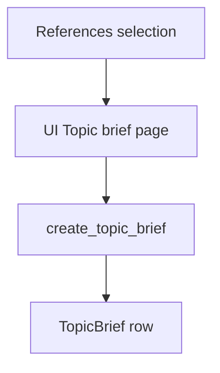

# Topic brief

This document is the specification for the **Topic brief** phase (phase 4) of the Topic brief generation workflow in [README.md](../../README.md).

**Phase vs result:** **Topic brief** is the workflow **phase**. A **topic brief** (`TopicBrief`) is the **result** that phase produces for one `TopicScope`. Do not use “topic brief” alone to name the Prefect job.

In this phase, the user opens a dedicated Streamlit page and clicks **Generate topic brief** (or **Regenerate topic brief**). An overwrite-on-click Prefect job drafts a cited, topic-conditioned brief from the current References that already have a succeeded paper brief. The page shows progress on the same URL.

**Independent phases:** the user may open this landing without running External sources ingestion or References selection. Do not add cross-phase gates in v1. The Generate button stays available even when the Topic scope has no References yet.

`PaperAspectStatus` is owned by [Fulfill papers metadata](2.2.2-fulfill-papers-metadata.md). This phase reuses it on `TopicBrief.status`.

## Glossary

| Term | Meaning |
| --- | --- |
| **Topic brief** / **`TopicBrief`** | **Result** artifact: structured, **topic-conditioned** cited introduction for one `TopicScope`. One row per Topic scope. Product meaning: [README.md](../../README.md) Terminology. Distinct from a **paper brief**. |
| **`create_topic_brief`** | Prefect job that drafts or rewrites the **topic brief** for one Topic scope. |
| **Generate topic brief** | Primary button action on this page that enqueues `create_topic_brief` (creates when missing; overwrites when a row already exists). |
| **Phase landing** | Streamlit page reached from the [Topic scope hub](1.2-topic-analysis.md#topic-scope-hub). |
| **Reference** | Durable link from the Topic scope to an ingested `Paper`. Owned by [Show references](3.1-show-references.md). |
| **Paper brief** / **`PaperBrief`** | Global, topic-agnostic summary of one `Paper`. Owned by [Generate paper brief](2.2.3-generate-paper-brief.md). |

## Topic brief generation

A **Topic brief generation** is the four-phase workflow in [README.md](../../README.md), run on one `TopicScope`. This document specifies phase 4: draft and store the cited topic brief.

Inputs come from earlier phases when present: topic statement and facets on the Topic scope; References from [References selection](3-references-selection.md); succeeded global `PaperBrief` rows from [Generate paper brief](2.2.3-generate-paper-brief.md). Phase 4 does not create Papers, paper briefs, or References.

For the application runtime stack (including Prefect as a Compose service), see [technology-stack.md](../technology-stack.md) and [local-development.md](../local-development.md). This specification is the orchestration contract; LLM work runs in Prefect, not in Streamlit.

## Scope

### In scope (current v1)

- Dedicated Streamlit page with title **Topic brief** (same register as today’s shell).
- Primary button to generate or regenerate the topic brief (overwrite-on-click; not skip-if-succeeded).
- Enqueue Prefect `create_topic_brief` for the Topic scope in the URL.
- Persist one `TopicBrief` per `topic_scope_id` with `PaperAspectStatus` and structured `TopicBriefContent`.
- Progress on the same `topic-brief` URL via `@st.fragment(run_every=2)` and `st.status`, polling durable DB status (not Prefect run ids).
- LLM section list and system prompt: [`topic_brief_template.md`](../../src/paper_reviewer/topic_brief_generation/topic_brief/topic_brief_template.md).

### Out of scope (v1)

- Auto-enqueue on first page visit (button only).
- [Generate paper brief](2.2.3-generate-paper-brief.md) ingest step or changing its skip-if-succeeded policy.
- Creating or mutating References, Papers, or paper briefs.
- Adding an `in_progress` member to `PaperAspectStatus`.
- Citation UX polish beyond rendering stored `TopicBriefContent` (interactive claim↔citation tooling).
- Prefect Compose service topology — owned by [local-development.md](../local-development.md) / [technology-stack.md](../technology-stack.md).

## Position in the workflow



1. **References selection** attaches Papers as References for the Topic scope ([Show references](3.1-show-references.md), [Add reference](3.2-add-reference.md)).
2. **Generate paper brief** (earlier phase) may already have produced global succeeded `PaperBrief` rows for those papers.
3. **Topic brief** (this specification) loads References that have a succeeded paper brief, calls the LLM with the topic brief template, and upserts `TopicBrief`.

## Selection rules (LLM input set)

| Input | Role |
| --- | --- |
| `TopicScope` | Topic statement; public `key` in the URL. |
| Topic facets | Scope and focus for the draft ([Topic analysis](1.2-topic-analysis.md)). |
| References for the scope | Candidate papers for the brief. |
| Succeeded `PaperBrief` | Required filter: only References whose global paper brief `status` is `succeeded` enter the LLM payload (bibliographic facts + paper-brief content). |

| Condition | Action |
| --- | --- |
| Reference has no `PaperBrief` row, or brief is not `succeeded` | Exclude from the LLM payload. Do not invent methods or results for that paper. |
| Reference has `PaperBrief.status = succeeded` | Include bibliographic facts and paper-brief fields. |
| Zero References with a succeeded paper brief | Still allow generate. Caption that no briefed References were included. Follow the template empty-`citations` path (facets + statement only). |

Do **not** send References that lack a succeeded paper brief as bibliographic-only stubs. That is stricter than a generic “any Reference” list; the template grounding rules match this filter.

## Public API and Prefect entrypoints

Domain package: `paper_reviewer.topic_brief_generation.topic_brief` — see [project-structure.md](../project-structure.md).

Prefect flows (names are the contract): `paper_reviewer.flows`

```text
create_topic_brief(topic_scope_id, force=true) -> CreateTopicBriefResult
enqueue_create_topic_brief(topic_scope_id) -> CreateTopicBriefEnqueueResult
```

| Entrypoint | Role |
| --- | --- |
| `create_topic_brief` | Load Topic scope, facets, and briefed References. Call LLM with the topic brief template. Upsert `TopicBrief` content and status. The Streamlit page always submits with overwrite semantics (`force=true`): rewrite even when a succeeded brief already exists. |
| `enqueue_create_topic_brief` | UI helper: if a `TopicBrief` row exists and `status` is already `not_started` (job in flight), do **not** submit a second Prefect run. Otherwise create or reset the row to `not_started`, clear `error_message`, keep previous `content` until a new draft succeeds, and submit `create_topic_brief`. |

| Rule | Behavior |
| --- | --- |
| Overwrite-on-click | Same button creates when missing and rewrites when a row exists. Not skip-if-succeeded (unlike [Generate paper brief](2.2.3-generate-paper-brief.md)). |
| In-flight guard | While `status` is `not_started` after a submit, do not enqueue again. |
| Fail-soft | LLM / validation errors become `failed` + `error_message`. Raise only for unusable infrastructure (DB down, Prefect submit impossible). |

Pydantic types live under `paper_reviewer.schemas.topic_brief_generation`.

### Result type fields (v1)

```text
TopicBriefContent
  title: str
  abstract: str
  introduction: str
  sections: list[{heading: str, body: str}]
  concluding_section: str
  key_points: list[str]
  citations: list[{n: int, doi: str, text: str}]

CreateTopicBriefResult
  topic_scope_id: int
  status: PaperAspectStatus
  error_message: str | None

CreateTopicBriefEnqueueResult
  submitted: bool
  skipped_in_flight: bool
```

Field ids on `TopicBriefContent` must match the template YAML front matter. Do not store Prefect run ids on these types for UI progress.

Example after a first Generate click:

```text
CreateTopicBriefEnqueueResult(submitted=True, skipped_in_flight=False)
```

Example when the user clicks again while status is still `not_started`:

```text
CreateTopicBriefEnqueueResult(submitted=False, skipped_in_flight=True)
```

## `TopicBrief` model (v1)

| Field | Required | Description |
| --- | --- | --- |
| `id` | Yes (DB) | Primary key. |
| `created_at` | Yes (DB) | Row creation time. |
| `updated_at` | Yes (DB) | Last status/content update. |
| `topic_scope_id` | Yes | FK to `TopicScope`. Unique. |
| `status` | Yes | `PaperAspectStatus`. Default `not_started`. |
| `error_message` | No | Set when `status=failed`. Cleared on enqueue and on `succeeded`. On `TopicBriefContent` parse failure, include the validation or extract error plus the raw assistant text (capped at 8000 characters) after an `Assistant output:` marker. |
| `content` | No until succeeded | Structured brief payload (JSONB / typed sections). On regenerate enqueue, keep previous `content` until the new draft succeeds. On failed rewrite, leave last good `content` for display. |

`TopicScope` navigates to this row (1:1). Do **not** copy brief status onto `TopicScope` columns.

ORM: `paper_reviewer.models.topic_brief_generation.topic_brief`. Follow the stack rule: **no** `ON DELETE CASCADE` ([technology-stack.md](../technology-stack.md)).

### Uniqueness

| Constraint | Rule |
| --- | --- |
| `topic_scope_id` | Unique. One topic brief per Topic scope. |

### Status

Use `PaperAspectStatus` ([Fulfill papers metadata](2.2.2-fulfill-papers-metadata.md#paperaspectstatus)):

| Status | Meaning on `TopicBrief` |
| --- | --- |
| `not_started` | No completed draft, or a draft job is in flight after enqueue. |
| `succeeded` | Brief content stored; safe to show as the current topic brief. |
| `failed` | Last attempt failed. Previous `content` may still be present after a failed regenerate. |
| `unavailable` | Not used on the normal path. |

There is **no** `informing`, `pending`, `drafting`, or `ready` member. While `create_topic_brief` runs, leave `not_started` until the flow writes `succeeded` or `failed`.

Prefer this durable status so the UI can poll the database without Prefect as the only source of truth. Optional Prefect run ids may be stored for ops, but are not required for the progress UI contract.

### Structured content (LLM output)

`content` is a structured object (not a single free-form blob as the only field). v1 sections are **topic-conditioned** (topic statement, facets, and briefed References).

**Owner of section list and prompt text:** [`topic_brief_template.md`](../../src/paper_reviewer/topic_brief_generation/topic_brief/topic_brief_template.md) in `paper_reviewer.topic_brief_generation.topic_brief`. YAML front matter lists JSON field ids and required flags. The Markdown body is the LLM system prompt. Do not copy that outline into this spec, AGENTS.md, or a skill.

`create_topic_brief` loads that file as the system prompt. The user message supplies the topic statement, topic facets, and each included Reference (bibliographic facts plus succeeded paper-brief content). The job sends OpenAI structured `json_schema` and then validates the assistant text as `TopicBriefContent` (field ids must match the template front matter). Local compatible gateways may ignore the schema, wrap JSON in Markdown, leak ANSI, or insert line-wrap newlines inside strings; the client strips those, extracts a JSON object, and ignores extra keys. When parse still fails, persist the validation or extract error and the raw assistant text (capped at 8000 characters) on `error_message` so the operator can diagnose illegal JSON.

Do **not** store a topic-agnostic paper summary here. Paper briefs stay on `PaperBrief` ([Generate paper brief](2.2.3-generate-paper-brief.md)).

Grounding: use only the Topic scope statement, facets, and References that have a succeeded paper brief. Do not invent papers or citations. Do not call EFetch, PMC Cloud, or paper-brief jobs from this phase.

## Prefect job behavior

### `create_topic_brief`

| Case | Expected |
| --- | --- |
| Row missing | Create row; run LLM; store `content`; set `succeeded`; clear error. |
| `force` is true (page always) and row exists | Rewrite: run LLM even if status was `succeeded` or `failed`; then `succeeded` or `failed` from this attempt. Keep prior `content` until a successful write. |
| LLM / validation / DB error | Set `failed` + `error_message`. On `TopicBriefContent` parse failure, `error_message` includes the validation or extract error and the capped assistant text. Other failures (timeout, missing key) do not dump assistant text. |
| Zero briefed References | Still call the LLM with statement + facets only; expect empty `citations` per template. |

### Overwrite policy

The Topic brief page button is **overwrite-on-click**. Each successful click produces a new draft from the **current** briefed Reference set. Safe to click again after a terminal status. The only no-submit case is the in-flight guard (`status` already `not_started`).

This differs from [Generate paper brief](2.2.3-generate-paper-brief.md), which skips when a paper brief is already `succeeded` unless `regenerate_paper` forces a rewrite.

## Streamlit UI (v1)

Module: `paper_reviewer.ui.topic_brief` with `render_topic_brief()`.

Register in `paper_reviewer.ui.navigation` (`build_app_pages()`):

| Property | Value |
| --- | --- |
| `key` | `topic_brief` |
| `title` | Topic brief |
| `url_path` | `topic-brief` |
| `in_sidebar` | false ([ui-style.md](../ui-style.md)) |

Streamlit is presentation only ([technology-stack.md](../technology-stack.md)). Heavy work runs in Prefect; the page enqueues and polls **durable DB status** on `TopicBrief`. Do not use Prefect run ids as progress truth.

The page URL stays `topic-brief` with `topic_scope_key` ([ui-style.md](../ui-style.md#topic-scope-key-in-the-url)). Do **not** encode job id or a generating flag in the query string; in-progress state is shown on that URL from DB status.

### Session keys

| Key | Type | Role |
| --- | --- | --- |
| (none required beyond URL) | — | Topic scope identity comes from `topic_scope_key`. Optional session cache that enqueue was submitted is allowed; durable progress is still `TopicBrief.status`. |

**Invalidate on new intake:** When Topic intake Submit starts a new `TopicScope`, clear the entire UI session, then write the new topic statement and set the Topic scope id in the URL — same cascade as other workflow pages.

### Page behavior

1. Require `topic_scope_key`. Missing key, non-UUID value, or no `TopicScope` row → empty state + page_link to **Topic intake** and **Topic scope**.
2. Show title **Topic brief**. Caption with Reference id (`topic_scope_key`) when present.
3. Load `TopicBrief` for the scope (if any) and count References with a succeeded paper brief. When that count is zero, show a caption that generation will use the topic statement and facets only (no briefed References).
4. **In flight** (`status` is `not_started` after a row exists): disable the Generate / Regenerate button. Show `@st.fragment(run_every=2)` with `st.status` (“Generating topic brief…”). Poll durable status until terminal.
5. **Idle, no succeeded content** (no row, or `failed` with no prior content to prefer as primary): primary button **Generate topic brief**. On click → `enqueue_create_topic_brief`.
6. **Idle, succeeded** (or `failed` with retained previous `content`): render structured content; primary button **Regenerate topic brief** (same enqueue path). On `failed`, also show the error caption (and Assistant-output expander when the dump marker is present).
7. Page_link to **Topic scope**. Optional page_links to **Show references** / **Generate paper brief** when helpful; not required to unblock Generate.

Do **not** run the LLM inside Streamlit callbacks. Do **not** auto-enqueue on first visit.

### Content rendering (when `succeeded`, or last good content while failed)

Show stored fields without copying the template outline into UI copy:

- `title` as the article heading
- `abstract`
- `introduction`
- each `sections[]` as heading + body (bodies may include `[n]` markers)
- `concluding_section`
- `key_points` as a list
- `citations` as a numbered list (`n`, `text`; DOI as content link when useful)

### Progress display

| Durable signal | Display |
| --- | --- |
| No row | Idle; **Generate topic brief** |
| `not_started` | `st.status` in progress; button disabled |
| `succeeded` | `st.status` complete (or hide); render content; **Regenerate topic brief** |
| `failed` | Error caption; optional last good content; **Generate topic brief** or **Regenerate topic brief** as above |

## Workflow navigation

- **Entry:** [Topic scope hub](1.2-topic-analysis.md#topic-scope-hub) → **Topic brief** with `topic_scope_key`.
- **Input:** Topic scope (statement + facets) and current References filtered to succeeded paper briefs.

## Orchestration boundary

| Responsibility | Owner |
| --- | --- |
| Topic scope + facets | [Topic intake](1.1-topic-intake.md), [Topic analysis](1.2-topic-analysis.md) |
| References | [Show references](3.1-show-references.md), [Add reference](3.2-add-reference.md) |
| Global `PaperBrief` | [Generate paper brief](2.2.3-generate-paper-brief.md) |
| Domain enqueue + `create_topic_brief` helper | `paper_reviewer.topic_brief_generation.topic_brief` |
| Prefect flow | `paper_reviewer.flows` (`create_topic_brief`) |
| ORM `TopicBrief` | `paper_reviewer.models.topic_brief_generation.topic_brief` |
| Pydantic contracts | `paper_reviewer.schemas.topic_brief_generation` |
| Progress + content UI | `paper_reviewer.ui.topic_brief` |

This document is the **behavior contract** for domain logic, the topic-brief Prefect job, and the Streamlit page. Implementation follows [tdd.md](../tdd.md).

## Testability

When implementation starts (TDD per [tdd.md](../tdd.md)):

The LLM is an **external** boundary: inject or stub the content generator. Do not call a live API in tests. Do not name a vendor in this spec; the production client lives in [technology-stack.md](../technology-stack.md). The optional API base URL and model name are owned by [local-development.md](../local-development.md).

**`create_topic_brief`:**

- No row → LLM called; `content` has required template fields; status `succeeded`.
- Succeeded row exists, page enqueue (force) → rewrites content from current briefed References.
- Only References with succeeded paper briefs appear in the user message; others are excluded.
- Zero briefed References → LLM still called; `citations` may be empty.
- `TopicBriefContent` field names match the template YAML front matter (fail if they drift).
- LLM failure → status `failed` with message; prior `content` retained when present.
- `TopicBriefContent` parse failure → `error_message` includes the pydantic/JSON error and the raw assistant text (capped). Other LLM failures do not dump assistant text.

**Enqueue:**

- `status` already `not_started` → `submitted=false`, `skipped_in_flight=true`.
- Terminal or missing row → submit; set `not_started`; clear error; keep prior content.

**UI slice** (no Streamlit widget assertions per [tdd.md](../tdd.md)):

- `tests/ui/test_navigation.py`: page registered with key `topic_brief`, title **Topic brief**, render callable `render_topic_brief`, `url_path` `topic-brief`.
- Pure helpers for status → display mode and error-message split unit-tested without Streamlit when extracted.

## Non-goals (v1)

Do not do this work in the Topic brief v1 slice:

- Auto-run generation on page load.
- Change PaperBrief skip-if-succeeded policy.
- Add `in_progress` to `PaperAspectStatus`.
- Run LLM inside Streamlit.
- Create Papers, paper briefs, or References from this page.
- Re-define Prefect Compose topology.

## Related

| Concern | Spec |
| --- | --- |
| Paper brief ingest | [2.2.3-generate-paper-brief.md](2.2.3-generate-paper-brief.md) |
| Show references | [3.1-show-references.md](3.1-show-references.md) |
| Topic scope hub | [1.2-topic-analysis.md](1.2-topic-analysis.md#topic-scope-hub) |
| Template / prompt | [`topic_brief_template.md`](../../src/paper_reviewer/topic_brief_generation/topic_brief/topic_brief_template.md) |
