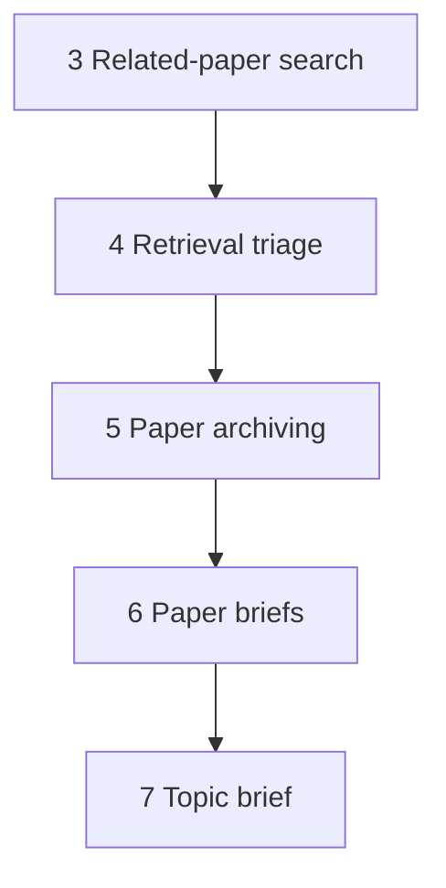

# Paper archiving

This document is the specification for step 5 of the Topic brief generation workflow in [README.md](../../README.md).

In this step, the system maps each **paper candidate** to a reusable **`Paper`** record in the database. If that paper already exists (same source handle), the step reuses the existing record. Later steps (especially [Paper briefs](../../README.md)) use these archived papers.

## Glossary

| Term | Meaning |
| --- | --- |
| **`Paper`** | Durable bibliographic record of a scientific article in this system. Product meaning: [README.md](../../README.md) Terminology. Public id is the uppercase DOI. |
| **`PaperCandidate`** | In-memory search hit from [related-paper search](related-paper-search.md). Not stored as a candidate row in this step. |
| **Paper archiving** | Workflow step that creates or reuses `Paper` records from candidates. |

## Topic brief generation

A **Topic brief generation** (`TopicBriefGeneration`) is one full workflow execution (product steps in [README.md](../../README.md)). This document specifies only step 5 (Paper archiving) for that run.

Paper brief construction (including PubMed EFetch) is out of scope here — see the Paper briefs step in the README and [paper-sources/pubmed.md](paper-sources/pubmed.md).

For the application runtime stack, see [technology-stack.md](../technology-stack.md).

## Scope

### In scope (current v1)

- Accept a `list[PaperCandidate]` from [Retrieval triage](retrieval-triage.md) (`RetrievalTriageResult.retained`). An empty list is a no-op success.
- Map each candidate to `Paper` field values (bibliographic + identity only).
- Require a non-blank DOI; store and compare DOIs in **uppercase** (ISO 26324: DOIs are case-insensitive).
- Look up existence by exact `(source_id, source_uid)` only (not by DOI).
- Create, reuse, or skip per candidate (fail-soft); return a result with successful papers plus skip/error details.
- Optionally update the stored DOI when the same source handle brings a new free DOI (rules below).

### Out of scope

- Retrieval triage UI or confirm gate (step 4; see [retrieval-triage.md](retrieval-triage.md)).
- Full-record fetch (e.g. PubMed EFetch) or abstract payloads.
- Building or storing **paper briefs**.
- Linking a `Paper` to a `TopicBriefGeneration` (no FK / join table in v1).
- Updating non-DOI bibliographic fields (title, authors, journal, year, url, `source_id`, `source_uid`) on reuse.
- Storing triage-only candidate fields (`snippet`, `facet_id`, `raw_payload_ref`) on `Paper`.
- DOI format validation beyond non-blank after strip (any non-blank string is accepted).

## Position in the workflow



1. **Related-paper search** produces a global `PaperCandidate` list (hits without DOI are already dropped; see that spec).
2. **Retrieval triage** presents those candidates and, after user confirm, yields `RetrievalTriageResult.retained` (v1 retains every search candidate; see [retrieval-triage.md](retrieval-triage.md)). If `retained` is empty, the orchestrator **skips** this step (or calls it and receives an empty success result).
3. **Paper archiving** (this specification) creates or reuses `Paper` records from `retained`.
4. **Paper briefs** loads fuller source records (for PubMed: EFetch) and builds paper briefs for archived papers.
5. **Topic brief** uses those briefs.

## Public API

Package path (when implemented): `paper_reviewer.topic_brief_generation.paper_archiving` — see [project-structure.md](../project-structure.md).

```text
archive_papers(session, candidates) -> PaperArchivingResult
```

| Argument | Type | Role |
| --- | --- | --- |
| `session` | SQLAlchemy `Session` | Persistence. **Caller owns commit.** |
| `candidates` | `list[PaperCandidate]` | Retained set from [Retrieval triage](retrieval-triage.md) (may be empty). |

| Rule | Behavior |
| --- | --- |
| Empty `candidates` | Return empty success: `papers=[]`, `skipped=[]`, `errors=[]`. Do not raise. |
| Flush | After each successful insert or DOI update, flush so `id` / `created_at` exist on returned papers. |
| Savepoint | Use a savepoint per candidate so one failure rolls back only that candidate and the step continues. |
| Raise | Do not raise for per-candidate policy skips or recoverable DB conflicts. Raise only if the session is unusable. |

`PaperCandidate` shape is owned by [related-paper-search.md](related-paper-search.md). This step does not redefine it.

### Domain checks (per candidate)

Pydantic already supplies typed fields. This step only adds strip/blank checks (fail-soft for that candidate):

| Check | Behavior |
| --- | --- |
| Blank = `None` or `str(...).strip()` is empty | Treat as blank. |
| Blank or missing `doi` | Skip (`missing_doi`). Related-paper search should already have dropped these. |
| Blank `source_id`, `source_uid`, `title`, or `url` | Skip (`invalid_required_field`). |
| DOI normalize | After strip, store and compare as `.upper()`. No other format validation. |

## `Paper` model properties

Durable `Paper` contract for v1 (Pydantic **read** model and ORM columns when implemented). The read model always includes DB-assigned fields after a successful resolve.

| Field | Required | Description |
| --- | --- | --- |
| `id` | Yes (DB) | Primary key. Assigned on insert. |
| `created_at` | Yes (DB) | Server timestamp when the row was created. |
| `doi` | Yes | Public id. Non-null. Stored uppercase. Unique. |
| `source_id` | Yes | Paper source id (e.g. `pubmed`). Stored independently of DOI. |
| `source_uid` | Yes | That source’s stable record id (e.g. PMID). Stored independently of DOI. |
| `title` | Yes | Title. |
| `authors` | Yes | List of author names (may be empty). Stored as a **JSONB** array of strings. |
| `journal` | No | Journal or venue. |
| `published_year` | No | Publication year when available. |
| `url` | Yes | Canonical link on the source. |

### Not stored on `Paper`

| Candidate field | Reason |
| --- | --- |
| `snippet` | Triage/search summary only. |
| `facet_id` | Search provenance for one generation; not paper identity. |
| `raw_payload_ref` | Optional audit pointer; not part of the bibliographic record. |

### Mapping from `PaperCandidate`

| `Paper` field | From candidate |
| --- | --- |
| `doi` | `doi` after strip + uppercase |
| `source_id` | `source_id` |
| `source_uid` | `source_uid` |
| `title` | `title` |
| `authors` | `authors` |
| `journal` | `journal` |
| `published_year` | `published_year` |
| `url` | `url` |

## Existence check and create-or-reuse

Lookup key: exact `(source_id, source_uid)` only. Do **not** look up by DOI for existence.

For each candidate (after domain checks), with an in-run map keyed by `(source_id, source_uid)` so duplicate input identities resolve once:

1. If this `(source_id, source_uid)` was already resolved successfully in this call → reuse that `Paper` for the in-run map only; do not append again to `papers`.
2. Else look up an existing `Paper` by `(source_id, source_uid)`.
3. **No row** → if another row already owns this uppercase DOI → skip (`doi_conflict`). Else **insert** a new `Paper` from mapped fields; append to `papers`.
4. **Row exists**, candidate DOI equals stored DOI (both uppercase) → **reuse**; do not update any fields; append to `papers` on first resolve in this call.
5. **Row exists**, candidate DOI differs (A→B):
   - If B is already owned by a **different** `(source_id, source_uid)` → **skip** (`doi_conflict`); do **not** change the stored DOI.
   - If B is free → **update** the stored DOI to B; do not update other fields; append to `papers` on first resolve in this call.

### Uniqueness (when implemented)

| Constraint | Rule |
| --- | --- |
| `(source_id, source_uid)` | Unique. |
| `doi` | Unique (always non-null; stored uppercase). |

### Generation association

v1 does **not** attach a `Paper` to the current `TopicBriefGeneration`. The step returns resolved papers (and skip/error metadata) only. A join table (or PaperBrief link) may be added in a later revision.

## Output

```text
PaperArchivingResult
  papers: list[Paper]
  skipped: list[ArchiveSkip]
  errors: list[ArchiveError]
```

| Field | Description |
| --- | --- |
| `papers` | Successfully stored or reused `Paper` read models for this call. |
| `skipped` | Policy skips (expected): identity fields + `reason`. |
| `errors` | Unexpected failures (e.g. DB error after savepoint rollback): identity fields when known + `reason` / message. |

Skip/error item shape (when implemented): include enough identity to debug (`source_id`, `source_uid`, `doi` when known) plus a `reason` (enum or string). Examples: `missing_doi`, `invalid_required_field`, `doi_conflict`.

### Order and cardinality

| Rule | Behavior |
| --- | --- |
| `papers` order | First-seen input order among successes. |
| Duplicate input identities | One entry in `papers` per distinct `(source_id, source_uid)` (in-run map). |
| `skipped` / `errors` order | Encounter order. |
| Duplicate skip/error for same identity | Record **once** (first encounter). |
| Failed or skipped candidates | Not included in `papers`. |

## Behavior

| Case | Expected result |
| --- | --- |
| Empty `candidates` | Empty `PaperArchivingResult`; no raise. |
| New `(source_id, source_uid)`, DOI free | Insert; include in `papers`. |
| New `(source_id, source_uid)`, DOI owned elsewhere | Skip (`doi_conflict`). |
| Existing source pair, same DOI | Reuse; no field updates; include in `papers`. |
| Existing source pair, DOI A→B, B free | Update DOI to B; include in `papers`. |
| Existing source pair, DOI A→B, B owned elsewhere | Skip (`doi_conflict`); leave stored DOI at A. |
| Blank/missing DOI | Skip (`missing_doi`). |
| Blank required bibliographic/identity field | Skip (`invalid_required_field`). |
| Unexpected DB/session error on one candidate | Roll back savepoint; record `errors`; continue. |
| Duplicate identity later in the same input | Do not duplicate in `papers` / `skipped` / `errors`. |

## Orchestration boundary

| Responsibility | Owner |
| --- | --- |
| Map candidates → create-or-reuse / skip `Paper` | Paper archiving step |
| Drop no-DOI hits before triage; candidate shape and search merge | [related-paper-search.md](related-paper-search.md) |
| User review + confirm; produce `retained` | [retrieval-triage.md](retrieval-triage.md) |
| PubMed EFetch / full record for briefs | Paper briefs step; [paper-sources/pubmed.md](paper-sources/pubmed.md) |
| Pydantic `Paper`, `PaperArchivingResult`, skip/error types | `paper_reviewer.schemas.topic_brief_generation` (when implemented) |
| ORM `Paper` + thin create/get | `paper_reviewer.models` (when implemented) |

This document is the **behavior contract**. It does not add the Python package, schema, ORM, or migrations until an implementation task.

## Testability

When implementation starts (TDD per [tdd.md](../tdd.md)):

- Empty list → empty result.
- Insert new identities; assert uppercase DOI storage.
- Reuse by `(source_id, source_uid)`; assert non-DOI fields unchanged.
- DOI A→B when B free → stored DOI becomes B.
- DOI A→B when B owned elsewhere → skip; stored DOI stays A.
- New row whose DOI is already owned → skip.
- Blank DOI / blank required fields → skip once; other candidates still succeed.
- Duplicate input identity → one `papers` entry; first-seen order.
- Savepoint failure on one candidate → that candidate in `errors`; others still in `papers`.

## Non-goals (v1)

Do not do this work in the Paper archiving v1 slice:

- Implement code, ORM, Alembic, or UI wiring (until a later implementation task).
- Call EFetch or any full-record API.
- Create `PaperBrief` rows or content.
- Add a generation↔paper association table.
- Implement Retrieval triage UI or confirm logic (see [retrieval-triage.md](retrieval-triage.md)).
- Update title, authors, journal, year, or url on reuse (DOI update only, per rules above).
