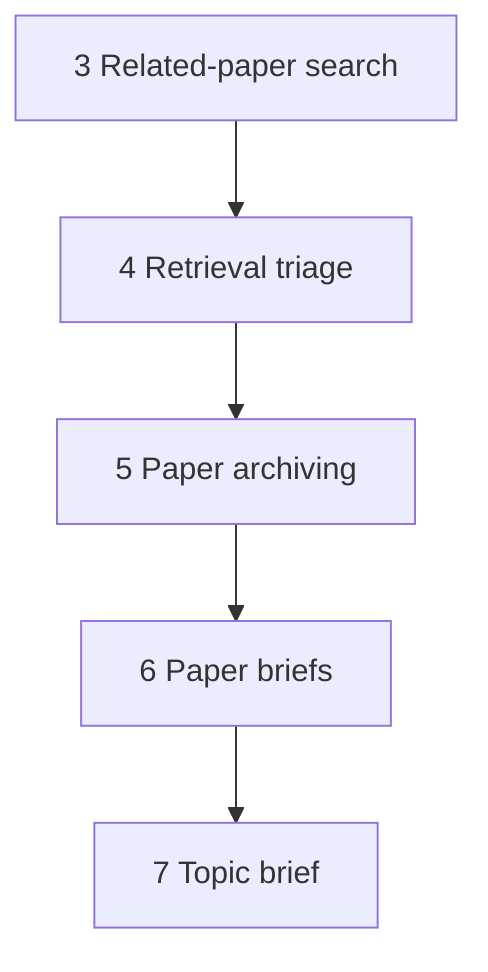

# Paper archiving

This document is the specification for step 5 of the Topic brief generation workflow in [README.md](../../README.md).

In this step, the system maps each **paper candidate** to a reusable **`Paper`** record in the database. If that paper already exists (same source handle), the step reuses the existing record. Later steps (especially [Paper briefs](../../README.md)) use these archived papers.

## Glossary

| Term | Meaning |
| --- | --- |
| **`Paper`** | Durable bibliographic record of a scientific article in this system. Product meaning: [README.md](../../README.md) Terminology. Public id is the uppercase DOI. |
| **`PaperCandidate`** | In-memory search hit from [related-paper search](related-paper-search.md). Not stored as a candidate row in this step. |
| **Paper archiving** | Workflow step that creates or reuses `Paper` records from candidates. |

## Topic brief generation

A **Topic brief generation** (`TopicBriefGeneration`) is one full workflow execution (product steps in [README.md](../../README.md)). This document specifies only step 5 (Paper archiving) for that run.

Paper brief construction (including PubMed EFetch) is out of scope here — see the Paper briefs step in the README and [paper-sources/pubmed.md](paper-sources/pubmed.md).

For the application runtime stack, see [technology-stack.md](../technology-stack.md).

## Scope

### In scope (current v1)

- Accept a `list[PaperCandidate]` from [Retrieval triage](retrieval-triage.md) (`RetrievalTriageResult.retained`). An empty list is a no-op success.
- Map each candidate to `Paper` field values (bibliographic + identity only).
- Require a non-blank DOI; store and compare DOIs in **uppercase** (ISO 26324: DOIs are case-insensitive).
- Look up existence by exact `(source_id, source_uid)` only (not by DOI).
- Create, reuse, or skip per candidate (fail-soft); return a result with successful papers plus skip/error details.
- Optionally update the stored DOI when the same source handle brings a new free DOI (rules below).
- Dedicated Streamlit page for this step that displays `PaperArchivingResult` after a successful run.
- Auto-run archiving on first page visit when prerequisites exist (no manual “Archive papers” button in v1).
- Session-state handoff from the prior step; database commit owned by the UI (caller commits per the public API rule).

### Out of scope

- Retrieval triage UI or confirm gate (step 4; see [retrieval-triage.md](retrieval-triage.md)).
- Full-record fetch (e.g. PubMed EFetch) or abstract payloads.
- Building or storing **paper briefs**.
- Linking a `Paper` to a `TopicBriefGeneration` (no FK / join table in v1).
- Updating non-DOI bibliographic fields (title, authors, journal, year, url, `source_id`, `source_uid`) on reuse.
- Storing triage-only candidate fields (`snippet`, `facet_id`, `raw_payload_ref`) on `Paper`.
- DOI format validation beyond non-blank after strip (any non-blank string is accepted).
- A re-run / “Archive again” control on the archiving page (deferred; v1 caches the first result in session).

## Position in the workflow



1. **Related-paper search** produces a global `PaperCandidate` list (hits without DOI are already dropped; see that spec).
2. **Retrieval triage** presents those candidates and, after user confirm, yields `RetrievalTriageResult.retained` (v1 retains every search candidate; see [retrieval-triage.md](retrieval-triage.md)). If `retained` is empty, the orchestrator **skips** this step (or calls it and receives an empty success result).
3. **Paper archiving** (this specification) creates or reuses `Paper` records from `retained`. A dedicated Streamlit page auto-runs this step when prerequisites exist and displays `PaperArchivingResult`.
4. **Paper briefs** loads fuller source records (for PubMed: EFetch) and builds paper briefs for archived papers.
5. **Topic brief** uses those briefs.

## Public API

Package path (when implemented): `paper_reviewer.topic_brief_generation.paper_archiving` — see [project-structure.md](../project-structure.md).

```text
archive_papers(session, candidates) -> PaperArchivingResult
```

| Argument | Type | Role |
| --- | --- | --- |
| `session` | SQLAlchemy `Session` | Persistence. **Caller owns commit.** |
| `candidates` | `list[PaperCandidate]` | Retained set from [Retrieval triage](retrieval-triage.md) (may be empty). |

| Rule | Behavior |
| --- | --- |
| Empty `candidates` | Return empty success: `papers=[]`, `skipped=[]`, `errors=[]`. Do not raise. |
| Flush | After each successful insert or DOI update, flush so `id` / `created_at` exist on returned papers. |
| Savepoint | Use a savepoint per candidate so one failure rolls back only that candidate and the step continues. |
| Raise | Do not raise for per-candidate policy skips or recoverable DB conflicts. Raise only if the session is unusable. |

`PaperCandidate` shape is owned by [related-paper-search.md](related-paper-search.md). This step does not redefine it.

### Domain checks (per candidate)

Pydantic already supplies typed fields. This step only adds strip/blank checks (fail-soft for that candidate):

| Check | Behavior |
| --- | --- |
| Blank = `None` or `str(...).strip()` is empty | Treat as blank. |
| Blank or missing `doi` | Skip (`missing_doi`). Related-paper search should already have dropped these. |
| Blank `source_id`, `source_uid`, `title`, or `url` | Skip (`invalid_required_field`). |
| DOI normalize | After strip, store and compare as `.upper()`. No other format validation. |

## `Paper` model properties

Durable `Paper` contract for v1 (Pydantic **read** model and ORM columns when implemented). The read model always includes DB-assigned fields after a successful resolve.

| Field | Required | Description |
| --- | --- | --- |
| `id` | Yes (DB) | Primary key. Assigned on insert. |
| `created_at` | Yes (DB) | Server timestamp when the row was created. |
| `doi` | Yes | Public id. Non-null. Stored uppercase. Unique. |
| `source_id` | Yes | Paper source id (e.g. `pubmed`). Stored independently of DOI. |
| `source_uid` | Yes | That source’s stable record id (e.g. PMID). Stored independently of DOI. |
| `title` | Yes | Title. |
| `authors` | Yes | List of author names (may be empty). Stored as a **JSONB** array of strings. |
| `journal` | No | Journal or venue. |
| `published_year` | No | Publication year when available. |
| `url` | Yes | Canonical link on the source. |

### Not stored on `Paper`

| Candidate field | Reason |
| --- | --- |
| `snippet` | Triage/search summary only. |
| `facet_id` | Search provenance for one generation; not paper identity. |
| `raw_payload_ref` | Optional audit pointer; not part of the bibliographic record. |

### Mapping from `PaperCandidate`

| `Paper` field | From candidate |
| --- | --- |
| `doi` | `doi` after strip + uppercase |
| `source_id` | `source_id` |
| `source_uid` | `source_uid` |
| `title` | `title` |
| `authors` | `authors` |
| `journal` | `journal` |
| `published_year` | `published_year` |
| `url` | `url` |

## Existence check and create-or-reuse

Lookup key: exact `(source_id, source_uid)` only. Do **not** look up by DOI for existence.

For each candidate (after domain checks), with an in-run map keyed by `(source_id, source_uid)` so duplicate input identities resolve once:

1. If this `(source_id, source_uid)` was already resolved successfully in this call → reuse that `Paper` for the in-run map only; do not append again to `papers`.
2. Else look up an existing `Paper` by `(source_id, source_uid)`.
3. **No row** → if another row already owns this uppercase DOI → skip (`doi_conflict`). Else **insert** a new `Paper` from mapped fields; append to `papers`.
4. **Row exists**, candidate DOI equals stored DOI (both uppercase) → **reuse**; do not update any fields; append to `papers` on first resolve in this call.
5. **Row exists**, candidate DOI differs (A→B):
   - If B is already owned by a **different** `(source_id, source_uid)` → **skip** (`doi_conflict`); do **not** change the stored DOI.
   - If B is free → **update** the stored DOI to B; do not update other fields; append to `papers` on first resolve in this call.

### Uniqueness (when implemented)

| Constraint | Rule |
| --- | --- |
| `(source_id, source_uid)` | Unique. |
| `doi` | Unique (always non-null; stored uppercase). |

### Generation association

v1 does **not** attach a `Paper` to the current `TopicBriefGeneration`. The step returns resolved papers (and skip/error metadata) only. A join table (or PaperBrief link) may be added in a later revision.

## Output

```text
PaperArchivingResult
  papers: list[Paper]
  skipped: list[ArchiveSkip]
  errors: list[ArchiveError]
```

| Field | Description |
| --- | --- |
| `papers` | Successfully stored or reused `Paper` read models for this call. |
| `skipped` | Policy skips (expected): identity fields + `reason`. |
| `errors` | Unexpected failures (e.g. DB error after savepoint rollback): identity fields when known + `reason` / message. |

Skip/error item shape (when implemented): include enough identity to debug (`source_id`, `source_uid`, `doi` when known) plus a `reason` (enum or string). Examples: `missing_doi`, `invalid_required_field`, `doi_conflict`.

### Order and cardinality

| Rule | Behavior |
| --- | --- |
| `papers` order | First-seen input order among successes. |
| Duplicate input identities | One entry in `papers` per distinct `(source_id, source_uid)` (in-run map). |
| `skipped` / `errors` order | Encounter order. |
| Duplicate skip/error for same identity | Record **once** (first encounter). |
| Failed or skipped candidates | Not included in `papers`. |

## Behavior

| Case | Expected result |
| --- | --- |
| Empty `candidates` | Empty `PaperArchivingResult`; no raise. |
| New `(source_id, source_uid)`, DOI free | Insert; include in `papers`. |
| New `(source_id, source_uid)`, DOI owned elsewhere | Skip (`doi_conflict`). |
| Existing source pair, same DOI | Reuse; no field updates; include in `papers`. |
| Existing source pair, DOI A→B, B free | Update DOI to B; include in `papers`. |
| Existing source pair, DOI A→B, B owned elsewhere | Skip (`doi_conflict`); leave stored DOI at A. |
| Blank/missing DOI | Skip (`missing_doi`). |
| Blank required bibliographic/identity field | Skip (`invalid_required_field`). |
| Unexpected DB/session error on one candidate | Roll back savepoint; record `errors`; continue. |
| Duplicate identity later in the same input | Do not duplicate in `papers` / `skipped` / `errors`. |

### UI behavior

| Case | Expected UI |
| --- | --- |
| No `retrieval_triage_result` in session | Empty state + links to **New Topic brief** and **Retrieval triage**. |
| Prerequisites present, first visit | Auto-run `archive_papers`, commit, store and show result. |
| `paper_archiving_result` already in session | Show cached result only; do not re-run. |
| New topic intake submitted | Clear `paper_archiving_result`; after a new search and triage confirm, the archiving page can run again. |
| Triage confirmed again | Triage clears `paper_archiving_result` so the archiving page re-runs on the latest `retained` set. |
| Empty input list | Empty success result; caption “No candidates to archive”. |
| All candidates skipped | Summary shows 0 archived; skipped section populated. |
| Mix of success / skip / error | Summary counts and all three result sections reflect the lists. |
| Session / commit failure | Error message; do not store a partial result in session. |

## Streamlit UI (v1)

Dedicated page module (when implemented): `paper_reviewer.ui.paper_archiving` with `render_paper_archiving()`.

Register in `paper_reviewer.ui.navigation` (`build_app_pages()`):

| Property | Value |
| --- | --- |
| `key` | `paper_archiving` |
| `title` | Paper archiving |
| `url_path` | `paper-archiving` |

Streamlit is presentation only ([technology-stack.md](../technology-stack.md)). Domain work stays in `archive_papers`; the page owns session keys, the DB commit, and display.

### Session keys

| Key | Type | Role |
| --- | --- | --- |
| `retrieval_triage_result` | `RetrievalTriageResult` | Required prerequisite. Candidates = `retained`. |
| `paper_archiving_result` | `PaperArchivingResult` | Cached outcome for this browser session after a successful auto-run. |
| `topic_statement` | `TopicStatement` | Optional context for header / caption. |
| `topic_brief_generation_public_id` | `uuid.UUID` | Optional generation reference id for summary display. |

**Invalidate on new intake:** When Topic intake starts a new generation, clear `paper_archiving_result` (same pattern as clearing search on resubmit).

**Invalidate on triage re-confirm:** When Retrieval triage confirms again, clear `paper_archiving_result` so this page re-runs on the latest `retained` set (triage owns that clear).

**Candidate source rule:** Use `retrieval_triage_result.retained` only. Do not fall back to `related_paper_search_result.candidates`. Domain input remains a `list[PaperCandidate]`.

### Auto-run behavior (first visit)

1. If `retrieval_triage_result` is missing → show empty state: explain that Retrieval triage must confirm first; `st.page_link` to **New Topic brief** and **Retrieval triage**.
2. If `paper_archiving_result` already exists in session → **do not re-run**; render the cached result (idempotent display). Input count for the summary uses `len(retrieval_triage_result.retained)`.
3. If prerequisites exist and there is no cached result → run inside `session_scope` with a spinner:
   - `archive_papers(session, retrieval_triage_result.retained)`
   - `session.commit()` on success (UI is the caller that owns commit; `session_scope` commits on exit)
   - store the result in `paper_archiving_result`
4. On unexpected failure (session unusable or commit failure) → show an error; do **not** store a partial result.
5. Empty `retained` → still treat as success: store/display empty `PaperArchivingResult` (`papers=[]`, `skipped=[]`, `errors=[]`) with an explanatory caption. Prefer calling `archive_papers` (no-op) rather than inventing a parallel empty path.

Do **not** add a re-run button in v1.

## Results display

When a `PaperArchivingResult` is available (cached or just produced), render sections in this order.

### Summary (always when result exists)

- Input candidate count: `len(retrieval_triage_result.retained)` from session (the same list used for the run).
- Counts: archived (`len(papers)`), skipped (`len(skipped)`), errors (`len(errors)`).
- Generation reference id when `topic_brief_generation_public_id` is present.

### Archived papers (`papers`)

For each `Paper`, reuse the candidate card style from Topic intake:

- Title as a markdown link via `url`.
- Caption: authors · journal · year · DOI · `source_id` / `source_uid` · `created_at` (ISO or locale-neutral).

v1 does **not** require create vs reuse vs DOI-update labels (`PaperArchivingResult` has no per-paper outcome enum).

### Skipped (`skipped`)

List or table with `source_id`, `source_uid`, `doi` (when known), and a human-readable reason:

| `ArchiveSkipReason` | Display label |
| --- | --- |
| `missing_doi` | Missing DOI |
| `invalid_required_field` | Invalid required field |
| `doi_conflict` | DOI conflict |

### Errors (`errors`)

Same identity columns as skips plus the `reason` / message string. Use `st.error` styling per row or one error block for the section.

### Empty success

When all three lists are empty after empty input, show a neutral success caption: “No candidates to archive”.

## Workflow navigation

- **Entry:** After the user confirms on **Retrieval triage**, link to Paper archiving with `retrieval_triage_result` in session. Topic intake links to Retrieval triage only (not directly to Paper archiving).
- **Sidebar order:** Global `st.navigation` order follows the workflow: Home → New Topic brief → Retrieval triage → Paper archiving.
- **Input:** The archiving page consumes `RetrievalTriageResult.retained` only, not the raw search list.

## Orchestration boundary

| Responsibility | Owner |
| --- | --- |
| Map candidates → create-or-reuse / skip `Paper` | `paper_reviewer.topic_brief_generation.paper_archiving` (`archive_papers`) |
| Drop no-DOI hits before triage; candidate shape and search merge | [related-paper-search.md](related-paper-search.md) |
| User review + confirm; produce `retained` | [retrieval-triage.md](retrieval-triage.md) |
| Render page, session keys, auto-run + commit, display result | `paper_reviewer.ui.paper_archiving` |
| PubMed EFetch / full record for briefs | Paper briefs step; [paper-sources/pubmed.md](paper-sources/pubmed.md) |
| Pydantic `Paper`, `PaperArchivingResult`, skip/error types | `paper_reviewer.schemas.topic_brief_generation` |
| ORM `Paper` + thin create/get | `paper_reviewer.models` |

This document is the **behavior contract** for domain logic and for the Streamlit page. Domain package, schemas, ORM, and migrations may already exist; the UI page is a separate implementation task driven by this specification.

## Testability

When implementation starts (TDD per [tdd.md](../tdd.md)):

**Domain (`archive_papers`):**

- Empty list → empty result.
- Insert new identities; assert uppercase DOI storage.
- Reuse by `(source_id, source_uid)`; assert non-DOI fields unchanged.
- DOI A→B when B free → stored DOI becomes B.
- DOI A→B when B owned elsewhere → skip; stored DOI stays A.
- New row whose DOI is already owned → skip.
- Blank DOI / blank required fields → skip once; other candidates still succeed.
- Duplicate input identity → one `papers` entry; first-seen order.
- Savepoint failure on one candidate → that candidate in `errors`; others still in `papers`.

**UI slice** (no Streamlit widget assertions per [tdd.md](../tdd.md)):

- `tests/ui/test_navigation.py`: page registered with key `paper_archiving`, title **Paper archiving**, render callable `render_paper_archiving`, `url_path` `paper-archiving`.
- Optional pure helpers (e.g. skip reason → display label, paper caption lines) unit-tested without Streamlit if extracted from render.

## Non-goals (v1)

Do not do this work in the Paper archiving v1 slice:

- Call EFetch or any full-record API.
- Create `PaperBrief` rows or content.
- Add a generation↔paper association table.
- Implement Retrieval triage UI or confirm logic (see [retrieval-triage.md](retrieval-triage.md)).
- Update title, authors, journal, year, or url on reuse (DOI update only, per rules above).
- Add a re-run / “Archive again” control (first-visit cache only).
- Show create vs reuse vs DOI-update labels per paper (no outcome enum on the result yet).
