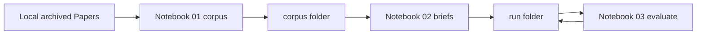

# Offline paper-brief evaluation

This document owns the **offline paper-brief evaluation** procedure: three Jupyter notebooks that freeze a full-text corpus, generate briefs, and score those briefs with the same judge as [Paper brief evaluation](2.2.4-paper-brief-evaluation.md). It is not a workflow phase step number.

**Status:** steps 1–3 (build corpus; generate briefs; offline judge) and the Jupyter runtime (`just notebooks`) are implemented.

**Criteria, JSON shape, and `evaluation_score` stay owned by** [Paper brief evaluation](2.2.4-paper-brief-evaluation.md). This document **points** at that contract. Do not copy the rubric here.

In-app 2.2.4 scores a succeeded `PaperBrief` row and persists the artifact on that row. This procedure scores **the same judge function** against **files**. It does not write `PaperBrief`.

## Glossary

| Term | Meaning |
| --- | --- |
| **Offline paper-brief evaluation** | Local notebook procedure that builds a frozen corpus, generates briefs on disk, and scores those briefs. Distinct from the Prefect job `evaluate_paper_brief`. |
| **Corpus** | Folder of `full_text_plain` files plus `manifest.jsonl`. Built in step 1 from papers already archived in the local database. |
| **Run** | One evaluation attempt. A timestamped folder next to the corpus that holds step 2 and step 3 files. |
| **Judge** | The same LLM-as-judge as [Paper brief evaluation](2.2.4-paper-brief-evaluation.md). Domain function `judge_paper_brief_evaluation`. It does not draft or rewrite a brief. |

## Prerequisite

**Step 1 uses papers already loaded in the local database.** It does **not** work on a newly created empty Postgres.

- The notebook loads **every** `Paper` row from the **local app database** (the same Postgres as `just up`). There is no DOI list.
- Those rows come from the normal product path: [Search external sources](2.1-search-external-sources.md) then [Paper archiving](2.2.1-paper-archiving.md). This procedure does **not** create papers.
- A paper is eligible when `usable_full_text_plain(paper.full_text_plain)` is already set. Step 1 does **not** call `inform_source_record` or `inform_full_text`. `PaperBrief` is not a filter and is not dumped.
- If `corpus/{DOI_FILE}.txt` already exists, skip that paper (do not overwrite) and say so in the notebook output.
- An empty database after migrate only, or no paper with usable full text → no new `.txt` files. The manifest is rewritten only when at least one `.txt` is on disk.
- After `corpus/` exists, steps 2 and 3 do **not** use Postgres. They still run in the **app** workspace so one `just notebooks` session covers all three steps.
- Do **not** run these notebooks in `just sandbox` (no Postgres). Runtime: [Runtime](#runtime).

## Scope

### In scope (this document)

- Three notebooks that call **domain Python**, not Prefect and not Streamlit.
- A frozen **corpus**: `full_text_plain` files plus a bibliographic **manifest** (step 1).
- Step 1 queries local `Paper` rows that already have usable full text. It does **not** fetch full text.
- Always **generate new briefs** with `generate_paper_brief_content` (step 2). Do not dump `PaperBrief` from the database.
- Steps 2–3 read **only files**. Step 2: `corpus/manifest.jsonl` and `corpus/{filename}`. Step 3: `{run_id}/02-briefs.jsonl` and matching `corpus/{DOI_FILE}.txt` (same filename rule as step 1; not the manifest). Postgres is not used.
- One **run folder** next to the corpus for brief + template (step 2) and scores (step 3).
- Fail-soft per DOI (one paper failure does not stop the notebook).

### Out of scope (this document)

- Prefect (`create_paper_brief`, `evaluate_paper_brief`, `ingest_paper`, `inform_*` flows).
- Fetching full text from the notebook (`inform_source_record` / `inform_full_text`). Fulfill papers in the app first.
- Paper archiving / creating a `Paper` row from a DOI that is not already in the local database.
- Writes to `PaperBrief` (`content`, `evaluation`, `evaluation_status`, `evaluation_score`). Offline brief and judge output are **file artifacts only**.
- A Streamlit page, a stepper entry, or production-image paths.
- An eval package under `src/paper_reviewer/` (notebooks import the installed package).
- DeepEval, RAGAS, or another eval library (same rule as [Paper brief evaluation](2.2.4-paper-brief-evaluation.md)).
- Changing the judge criteria or generator template.

The LLM client vendor is owned by [technology-stack.md](../technology-stack.md). Do not name a vendor in this spec.

## Position vs the app



1. Step 1 reads archived `Paper` rows from local Postgres (usable `full_text_plain` only; no fetch) and writes new corpus files. Existing `.txt` files are skipped.
2. Step 2 generates new briefs from corpus files. It does not call `create_paper_brief`.
3. Step 3 runs `judge_paper_brief_evaluation` on those files. It does not call `evaluate_paper_brief`.

## Deploy vs local

Notebooks must **use** app features (load usable full text, generate a brief, run the judge). Corpus files and eval results must **not** ship with the app.

Keep both trees **outside** `src/paper_reviewer/`. [project-structure.md](../project-structure.md) deploys only the installable package, Alembic, `pyproject.toml`, `uv.lock`, and the Streamlit theme.

| Kind | Path | Git | Production image |
| --- | --- | --- | --- |
| Notebooks (procedure) | `notebooks/paper_brief_evaluation/` | Track | No — same class as `tests/` and `docs/` |
| Corpus + run results | `data/paper_brief_evaluation/` | Track | No — experiment artifacts; do not copy into the production image |

How notebooks still call app code: Compose bind-mounts the repo at `/workspace`. The notebooks import the **editable** `paper_reviewer` install. They do **not** need an eval subpackage inside `src/`.

Do **not**:

- Add `paper_reviewer.topic_scope.paper_brief_evaluation_offline` or any other eval package under `src/`.
- Store corpus or JSONL under `src/` or `tests/`.
- Copy `notebooks/` or `data/` into the production image. When the Dockerfile starts copying selected paths, `.dockerignore` (or the copy list) must exclude both.

## Layout and naming

**Notebooks** (tracked):

```text
notebooks/paper_brief_evaluation/
  01-build-corpus.ipynb
  02-generate-briefs.ipynb
  03-evaluate-briefs.ipynb
```

**Data** (tracked in git; not copied into the production image):

```text
data/paper_brief_evaluation/
  corpus/
    manifest.jsonl
    {DOI_FILE}.txt
  {run_id}/
    02-briefs.jsonl
    02-brief-template.md
    03-evaluations.jsonl
    03-judge-model.txt
    03-token-summary.json
```

| Rule | Value |
| --- | --- |
| Corpus vs runs | Sibling folders under `data/paper_brief_evaluation/`. |
| `run_id` | UTC stamp plus model slug: `YYYYMMDDThhmmssZ_{model_slug}` (example `20260818T160000Z_llama3.1-8b`). `model_slug` is notebook 02 `MODEL` (the generator) with `:`, `/`, `\`, and space replaced by `-`. The judge model from notebook 03 is recorded in `03-judge-model.txt`, not in `run_id`. One folder per evaluation. Lexicographic order is time order because the stamp comes first. Prefix `02-` / `03-` groups step artifacts inside that folder. |
| Corpus filename | Uppercase `Paper.doi` with every `/` replaced by `_`, plus `.txt`. If two DOIs collide, step 1 **stops** and reports the pair. Records in JSONL always use the real uppercase DOI. |
| Corpus file body | UTF-8 `full_text_plain` only (no YAML header). |
| Manifest | `corpus/manifest.jsonl`: one object per `.txt` still in `corpus/` `{ "doi", "title", "journal", "published_year", "filename" }`. `journal` / `published_year` may be null. Step 1 rewrites the whole manifest from those files after the run, looking up title / journal / year from the database. A `.txt` with no matching `Paper` is omitted from the manifest and reported. |
| JSONL | One JSON object per line. UTF-8. |

Reuse the same `corpus/` across many `{run_id}/` folders. Do not put step 2/3 files inside `corpus/`.

## Step 1 — build corpus

Notebook: `01-build-corpus.ipynb`.

**Use papers already loaded in the local database.**

- Input: every `Paper` row in local Postgres. There is no DOI list.
- Eligibility: `usable_full_text_plain(paper.full_text_plain)` is set. Do **not** use `PaperBrief` as a filter. Do **not** call `inform_source_record` or `inform_full_text`. If the body is missing or unusable, skip the paper and say so.
- If `corpus/{DOI_FILE}.txt` already exists, skip that paper (do not overwrite) and say so.
- Write one `.txt` per newly accepted paper under `data/paper_brief_evaluation/corpus/`. After the run, rewrite **`manifest.jsonl`** from every `.txt` still in `corpus/` (skipped files plus new writes). Look up `doi`, `title`, `journal`, `published_year` from the `Paper` row. `filename` is the on-disk name.

Usable-body rule: same as [Generate paper brief](2.2.3-generate-paper-brief.md) (`usable_full_text_plain`).

## Step 2 — generate briefs (Python, not Prefect)

Notebook: `02-generate-briefs.ipynb`.

- Set **`MODEL`** in a notebook cell (required chat model id). Empty or whitespace → stop; no run folder.
- Set `OPENAI_MODEL` from that value so `generate_paper_brief_content` uses it.
- Create a new `{run_id}/` folder (`YYYYMMDDThhmmssZ_{model_slug}`).
- Read `corpus/manifest.jsonl`. Do **not** query Postgres. Do **not** read `PaperBrief`.
- For each manifest row:
  - Load **full text** from `corpus/{filename}` (frozen).
  - Pass **title, journal, year** from the manifest into `generate_paper_brief_content`.
  - Always call `generate_paper_brief_content(...)` (new LLM brief). Do **not** import `paper_reviewer.flows` and do **not** call `create_paper_brief`.
- Write **`02-briefs.jsonl`**: success `{ "doi": "...", "brief": { ... PaperBriefContent ... }, "prompt_tokens": 123, "completion_tokens": 45, "total_tokens": 168 }` (`prompt_tokens` / `completion_tokens` / `total_tokens` come from `PaperBriefLlmResult`; same meaning and null rules as [Generate paper brief](2.2.3-generate-paper-brief.md); JSON `null` when usage is absent does not fail the row); failure `{ "doi": "...", "error": "..." }` (no `brief`, no token fields).
- Write **`02-brief-template.md`**: exact bytes from `load_paper_brief_template()` (the generic system prompt). Do **not** include the gateway-only JSON suffix that `generate_paper_brief_content` may append at call time.

Domain functions: `paper_reviewer.topic_scope.generate_paper_brief.llm`.

## Step 3 — offline judge

Notebook: `03-evaluate-briefs.ipynb`.

- Input: one `{run_id}/` that already has `02-briefs.jsonl`, plus sibling `corpus/` (`.txt` files; Postgres is not required). Set `RUN_ID` in a notebook cell (`YYYYMMDDThhmmssZ_{model_slug}`). Leave it empty to use the latest sibling folder that already has `02-briefs.jsonl` (lexicographic order is time order).
- Set **`MODEL`** in a notebook cell (required chat model id). Empty or whitespace → stop; do not write scores.
- Set `OPENAI_MODEL` from that value so `judge_paper_brief_evaluation` uses it. This is the **judge** model; it is not the generator slug in `run_id`.
- For each success line in `02-briefs.jsonl`:
  - Load `full_text_plain` from `corpus/{DOI_FILE}.txt` (uppercase DOI, `/` → `_`; same rule as step 1). Do not read the manifest.
  - Validate `brief` as `PaperBriefContent`.
  - Call `judge_paper_brief_evaluation(full_text_plain, content=...)`.
  - Compute `evaluation_score` with `mean_evaluation_score` (app mean; the LLM must not supply it). Same JSON and rounding as [Paper brief evaluation](2.2.4-paper-brief-evaluation.md).
- Skip JSONL lines that have `error` and no `brief` (no judge call).
- Write **`03-evaluations.jsonl`**: success `{ "doi": "...", "evaluation_score": 4.25, "evaluation": { ... four G-Eval objects ... } }` (`evaluation` is `PaperBriefEvaluation`; `evaluation_score` is the two-decimal mean). Failure `{ "doi": "...", "error": "..." }`.
- Write **`03-judge-model.txt`**: exact bytes of the chosen chat model id.
- After the judge (or later, without a new judge run), read generator `prompt_tokens` / `completion_tokens` / `total_tokens` from `02-briefs.jsonl`. Do **not** call the generator. Do **not** copy those fields into `03-evaluations.jsonl`. Join each DOI to `evaluation_score` and conciseness when a success line exists in `03-evaluations.jsonl`. If that file is missing, `joined_with_score` is 0 and quality means are null.
- Write **`03-token-summary.json`**: one UTF-8 JSON object (indent 2, trailing newline), not JSONL. Shape:

```json
{
  "run_id": "20260818T160000Z_llama3.1-8b",
  "coverage": {
    "brief_rows": 109,
    "with_usage": 108,
    "missing_usage": 1,
    "joined_with_score": 108
  },
  "tokens": {
    "prompt_tokens": {"count": 108, "sum": 1, "min": 1, "max": 1, "median": 1.0, "p90": 1},
    "completion_tokens": {"count": 108, "sum": 1, "min": 1, "max": 1, "median": 1.0, "p90": 1},
    "total_tokens": {"count": 108, "sum": 1, "min": 1, "max": 1, "median": 1.0, "p90": 1}
  },
  "quality": {
    "joined_count": 108,
    "mean_evaluation_score": 4.12,
    "mean_score_per_1k_total_tokens": 1.3704,
    "mean_conciseness": 4.25
  }
}
```

`brief_rows` counts JSONL lines with a `brief`. `with_usage` counts those with all three usage integers. `missing_usage` is `brief_rows - with_usage`. `joined_with_score` counts usage rows that also have a success score. Each `tokens` field is `null` when that integer is absent on every brief. `count` / `sum` / `min` / `max` / `p90` are integers (`p90` is nearest-rank). `median` is a JSON number (may be `.5` when the count is even). Quality means use two-decimal half-up except `mean_score_per_1k_total_tokens` (four decimals). Quality means are `null` when `joined_count` is 0. Token fields are **generate** usage from notebook 02, not judge usage.
- Do **not** call `evaluate_paper_brief` (that function writes `PaperBrief` columns).

Domain functions: `paper_reviewer.topic_scope.paper_brief_evaluation.llm` (`judge_paper_brief_evaluation`) and `paper_reviewer.schemas.topic_scope.paper_brief_evaluation` (`mean_evaluation_score`, `PaperBriefEvaluation`).

## Runtime

There is **no host Python**. Do **not** install Jupyter, `uv`, or the app toolchain on the host. Host tools stay Docker Desktop and `just` ([host-requirements.md](../host-requirements.md)).

Notebooks run in the Compose **`notebooks`** service (`just notebooks`), not on the host and **not** in `just sandbox`. That recipe starts the app stack first (Postgres), then Jupyter Lab. Short how-to next to the files: [notebooks/README.md](../../notebooks/README.md). Full recipe and env: [local-development.md](../local-development.md#offline-paper-brief-evaluation-notebooks).

| Rule | Why |
| --- | --- |
| `just notebooks` (app stack + `notebooks` service) | Step 1 needs the app Postgres (`DATABASE_URL` hostname `db`) and archived `Paper` rows. |
| Not `just sandbox` | The sandbox Compose project starts `workspace` only. It has **no** `db`. Step 1 cannot look up papers. |
| Not host Jupyter | The Linux venv and `uv` exist only in the image ([local-development.md](../local-development.md)). |
| Browser on the host | Jupyter Lab listens in the `notebooks` container. The host opens `http://localhost:${JUPYTER_PORT}` (default 8888). |
| Not on `just up` alone | Profile `notebooks` keeps Jupyter off the default app stack and off the sandbox. |

Do **not** call `docker compose` on the host by hand ([AGENTS.md](../../AGENTS.md) awkward-recipe rule).

The notebook process sees the same secrets as the worker:

- `DATABASE_URL` (step 1)
- `OPENAI_API_KEY`, `OPENAI_BASE_URL`, `OPENAI_MODEL` (on the `notebooks` service; used by steps 2–3)
- `NCBI_API_KEY` is still passed to the notebooks service (same as the worker) but step 1 does not fetch full text

The repo bind-mount at `/workspace` is the notebook cwd. Imports use the editable `paper_reviewer` install. Writes under `data/paper_brief_evaluation/` appear on the host disk and may be committed. `.dockerignore` still excludes `notebooks/` and `data/` from production images.

## Implementation status

Do **not** add a domain package for this procedure.

| Piece | Status |
| --- | --- |
| Notebooks | [`01-build-corpus.ipynb`](../../notebooks/paper_brief_evaluation/01-build-corpus.ipynb), [`02-generate-briefs.ipynb`](../../notebooks/paper_brief_evaluation/02-generate-briefs.ipynb), and [`03-evaluate-briefs.ipynb`](../../notebooks/paper_brief_evaluation/03-evaluate-briefs.ipynb) exist. |
| Data dirs | `data/paper_brief_evaluation/` is tracked (corpus and later run results). Still excluded from production images. |
| Jupyter | Dev dependency (`jupyter` / `ipykernel`). |
| `just notebooks` | App stack, then the `notebooks` service. Publishes `JUPYTER_PORT`. Passes `OPENAI_*` and `NCBI_API_KEY`. |
| Compose | Dedicated `notebooks` service (profile `notebooks`). Do **not** add Jupyter to the sandbox. |
| Docker ignore | Exclude `notebooks/` and `data/` from production images. |

## Related

| Concern | Spec |
| --- | --- |
| In-app judge, JSON, `evaluation_score` | [2.2.4-paper-brief-evaluation.md](2.2.4-paper-brief-evaluation.md) |
| Judge prompt | [`paper_brief_evaluation_template.md`](../../src/paper_reviewer/topic_scope/paper_brief_evaluation/paper_brief_evaluation_template.md) |
| Paper brief creation | [2.2.3-generate-paper-brief.md](2.2.3-generate-paper-brief.md) |
| Generator prompt | [`paper_brief_template.md`](../../src/paper_reviewer/topic_scope/generate_paper_brief/paper_brief_template.md) |
| Source record / full text | [2.2.2-fulfill-papers-metadata.md](2.2.2-fulfill-papers-metadata.md) |
| Paper archiving (creates `Paper` rows) | [2.2.1-paper-archiving.md](2.2.1-paper-archiving.md) |
| Deploy vs local paths | [project-structure.md](../project-structure.md) |
| App vs sandbox, `just` recipes, Jupyter port | [local-development.md](../local-development.md) |
| Stack (LLM client) | [technology-stack.md](../technology-stack.md) |
