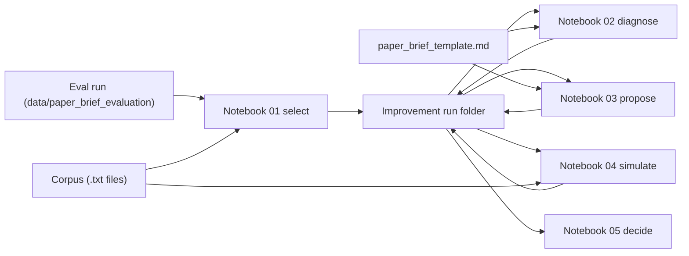

# Paper brief improvement

This document owns the **paper brief improvement** procedure: five Jupyter notebooks that select the worst-scoring briefs from an [offline evaluation](paper-brief-evaluation-offline.md) run, diagnose weaknesses, propose a template change, simulate its effect, and produce an accept/reject recommendation. It is not a workflow phase step number.

**Status:** spec only. Notebooks and data directories are not yet implemented.

The workflow does **not** modify the brief template or the judge prompt. It produces file artifacts that a developer or agent reviews before applying any change.

## Glossary

| Term | Meaning |
| --- | --- |
| **Improvement run** | One end-to-end pass through the five notebooks, targeting a single evaluation run. Produces a folder of file artifacts under `data/paper_brief_improvement/`. |
| **Source evaluation run** | An existing `{run_id}/` under `data/paper_brief_evaluation/` that has `03-evaluations.jsonl`. The improvement workflow reads it; it does not write to it. |
| **Proposed change** | A Markdown file that describes a concrete modification to the brief template (or judge prompt). Written by step 3. Never applied automatically. |

## Prerequisite

The source evaluation run must exist and contain `02-briefs.jsonl` and `03-evaluations.jsonl`. The sibling `corpus/` must contain the `.txt` full-text files referenced by those briefs.

These artifacts come from the [offline paper-brief evaluation](paper-brief-evaluation-offline.md) procedure. This workflow does not create them.

## Scope

### In scope (this document)

- Five notebooks. Steps 1, 3, 5 are deterministic file processing. Steps 2, 4 call LLM functions.
- File artifacts only. No Postgres writes, no `PaperBrief` rows, no template file edits.
- Step 4 reuses `generate_paper_brief_content` and `judge_paper_brief_evaluation` from the installed package.

### Out of scope (this document)

- Applying the proposed change to the template. A developer or agent does that outside this workflow.
- Running a new full evaluation after applying the change. Use [offline paper-brief evaluation](paper-brief-evaluation-offline.md) for that.
- Prefect flows, Streamlit pages, production-image paths.
- Creating an eval or improvement package under `src/paper_reviewer/`.

## Position vs the app



## Layout and naming

**Notebooks** (tracked):

```text
notebooks/paper_brief_improvement/
  01-select-worst-briefs.ipynb
  02-diagnose-weaknesses.ipynb
  03-propose-change.ipynb
  04-simulate-change.ipynb
  05-decide.ipynb
```

**Data** (tracked in git; not copied into the production image):

```text
data/paper_brief_improvement/
  {run_id}/
    01-worst-briefs.jsonl
    02-diagnosis.jsonl
    02-diagnosis-summary.md
    03-proposed-change.md
    04-simulation.jsonl
    05-decision.md
```

| Rule | Value |
| --- | --- |
| `run_id` | Same identifier as the source evaluation run (e.g. `20260818T221210Z_gemma4-e4b`). Links artifacts back to the evaluation that triggered the improvement. |
| Iteration suffix | When a second improvement pass targets the same source run, append `_iter2`, `_iter3`, etc. |
| JSONL | One JSON object per line. UTF-8. Same convention as [offline evaluation](paper-brief-evaluation-offline.md). |
| Prefix numbering | `01-` through `05-` groups artifacts by the step that wrote them. |

## Step 1 — select worst briefs

Notebook: `01-select-worst-briefs.ipynb`.

- Set **`SOURCE_RUN_ID`** in a notebook cell. Leave empty to use the latest judged run under `data/paper_brief_evaluation/` (lexicographic order is time order).
- Set **`WORST_N`** (default 5): how many lowest `evaluation_score` papers to select. `0`, negative, or non-integer stops the notebook.
- Read `03-evaluations.jsonl` from the source evaluation run. Skip lines with `error` (no score).
- Sort success lines by `evaluation_score` ascending, then by DOI ascending (tie-breaker).
- Take the bottom `WORST_N` rows.
- For each selected row, join the matching brief from `02-briefs.jsonl` (by DOI) and resolve the corpus `.txt` path.
- Create `data/paper_brief_improvement/{run_id}/` if it does not exist.
- Write **`01-worst-briefs.jsonl`**: one object per line `{ "doi", "evaluation_score", "evaluation", "brief", "corpus_file" }`. `corpus_file` is the relative path from the data root (e.g. `../paper_brief_evaluation/corpus/10.1234_EXAMPLE.txt`).

## Step 2 — diagnose weaknesses

Notebook: `02-diagnose-weaknesses.ipynb`.

- Input: `01-worst-briefs.jsonl` from the improvement run, plus the current `paper_brief_template.md` via `load_paper_brief_template()`.
- Set **`MODEL`** in a notebook cell (required chat model id). Empty or whitespace stops the notebook.
- For each row in `01-worst-briefs.jsonl`:
  - Identify the lowest-scoring G-Eval criterion (or criteria, on tie).
  - Load the full text from `corpus_file`.
  - Prompt the LLM with the brief, the full text, the evaluation (scores + reasoning), and the current template. Ask it to explain **why** the criterion scored low and which part of the template (or its absence) contributed.
  - Record the structured response.
- Write **`02-diagnosis.jsonl`**: one object per line `{ "doi", "worst_criteria", "diagnosis" }`. `diagnosis` is the LLM explanation (free text).
- After all per-paper diagnoses, prompt the LLM with the full set of diagnoses and the template. Ask it to identify **common failure patterns** across the sample and which template sections are involved.
- Write **`02-diagnosis-summary.md`**: the cross-paper pattern summary (Markdown, free form).

## Step 3 — propose template change

Notebook: `03-propose-change.ipynb`.

- Input: `02-diagnosis-summary.md`, current `paper_brief_template.md`.
- Set **`MODEL`** in a notebook cell (required chat model id). Empty or whitespace stops the notebook.
- Prompt the LLM with the diagnosis summary and the current template. Ask it to propose a **concrete change** to the template that addresses the identified failure patterns.
- The response must include:
  - A rationale (why this change addresses the diagnosed weaknesses).
  - The proposed diff (old text / new text, or a full rewritten template section).
  - Expected effect on each G-Eval criterion.
- Write **`03-proposed-change.md`**: the full proposal (Markdown).
- Do **not** modify `paper_brief_template.md`.

## Step 4 — simulate change

Notebook: `04-simulate-change.ipynb`.

- Input: `03-proposed-change.md`, `01-worst-briefs.jsonl`, corpus `.txt` files.
- Set **`MODEL`** in a notebook cell (required chat model id for the generator). Empty or whitespace stops the notebook. The judge model defaults to the same value unless a separate **`JUDGE_MODEL`** cell overrides it.
- Parse the proposed template from `03-proposed-change.md`.
- For each row in `01-worst-briefs.jsonl`:
  - Load full text from `corpus_file`.
  - Call `generate_paper_brief_content` with the **proposed** template (not the current one).
  - Call `judge_paper_brief_evaluation` on the new brief.
  - Compute `evaluation_score` with `mean_evaluation_score`.
- Write **`04-simulation.jsonl`**: one object per line `{ "doi", "original_score", "new_score", "delta", "new_evaluation", "new_brief" }`. `delta` is `new_score - original_score`.
- Print a summary table at the end of the notebook (mean delta, per-criterion deltas, how many papers improved / degraded / unchanged).

## Step 5 — decide

Notebook: `05-decide.ipynb`.

- Input: `04-simulation.jsonl`, `03-proposed-change.md`.
- No LLM call. Deterministic summary only.
- Compute aggregate statistics: mean delta, median delta, count improved (delta > 0), count degraded (delta < 0), count unchanged (delta == 0), per-criterion mean deltas.
- Write **`05-decision.md`**: a Markdown summary with:
  - The proposed change (copied or linked from `03-proposed-change.md`).
  - The simulation results table.
  - A recommendation: **accept** (mean delta > 0 and no paper degraded), **accept with caveats** (mean delta > 0 but some papers degraded), **reject** (mean delta <= 0), or **refine** (mixed results that suggest a narrower change).
- This recommendation is advisory. A developer or agent decides whether to apply the change.

## Deploy vs local

Same rules as [offline evaluation](paper-brief-evaluation-offline.md). Notebooks and data stay outside `src/paper_reviewer/` and outside the production image.

| Kind | Path | Git | Production image |
| --- | --- | --- | --- |
| Notebooks (procedure) | `notebooks/paper_brief_improvement/` | Track | No |
| Improvement run results | `data/paper_brief_improvement/` | Track | No |

## Runtime

Same as [offline evaluation](paper-brief-evaluation-offline.md): `just notebooks`. The notebooks service has the editable `paper_reviewer` install, `OPENAI_*` env vars, and access to `data/` via the bind-mount.

Steps 1, 3, 5 do not need Postgres. Steps 2, 4 use domain LLM functions that need `OPENAI_*` environment variables.

Do **not** run on the host. Do **not** run in `just sandbox`.

## Implementation status

| Piece | Status |
| --- | --- |
| Notebooks | Not yet created. |
| Data dirs | `data/paper_brief_improvement/` does not exist yet. Created on first run of step 1. |
| Spec | This document. |

## Related

| Concern | Spec |
| --- | --- |
| Source evaluation runs | [paper-brief-evaluation-offline.md](paper-brief-evaluation-offline.md) |
| In-app judge, JSON, `evaluation_score` | [2.2.4-paper-brief-evaluation.md](2.2.4-paper-brief-evaluation.md) |
| Judge prompt | [`paper_brief_evaluation_template.md`](../../src/paper_reviewer/topic_scope/paper_brief_evaluation/paper_brief_evaluation_template.md) |
| Brief generation | [2.2.3-generate-paper-brief.md](2.2.3-generate-paper-brief.md) |
| Generator prompt | [`paper_brief_template.md`](../../src/paper_reviewer/topic_scope/generate_paper_brief/paper_brief_template.md) |
| Deploy vs local paths | [project-structure.md](../project-structure.md) |
| Runtime (`just notebooks`) | [local-development.md](../local-development.md) |
