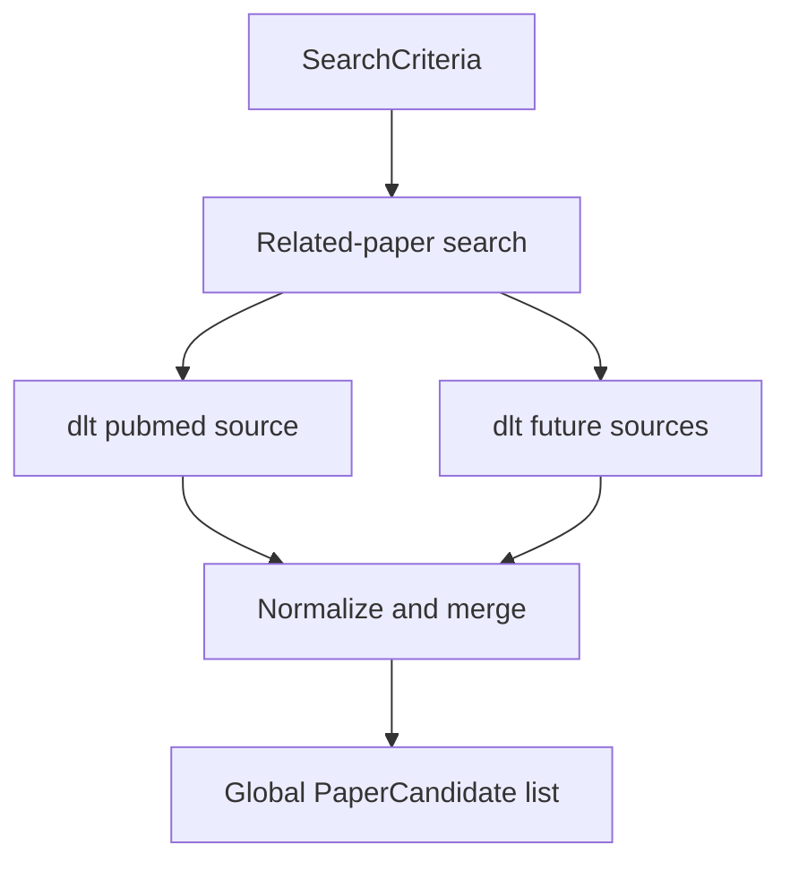

# Related-paper search

Workflow step 3 from [README.md](../../README.md): search registered **paper sources** for related papers and produce a global list of **paper candidates** for Retrieval triage.

Paper-source-specific search criteria and API mapping live under [paper-sources/](paper-sources/). This document owns orchestration only.

Stack context: [technology-stack.md](../technology-stack.md) (dlt + Pydantic, Prefect later).

## Scope


| In scope                                                                           | Out of scope                                                                |
| ---------------------------------------------------------------------------------- | --------------------------------------------------------------------------- |
| Accept generic `SearchCriteria` (`TopicAnalysisResult` from [Topic analysis](topic-analysis.md) wrapped for search, or injected for tests) | Generating facets in Topic analysis (see that spec)          |
| Run extract via **dlt** for each registered paper source                           | Implementing ingest/flows/UI code in this doc                               |
| Map each source hit to `PaperCandidate` and merge into one global list             | Building **paper briefs** or calling full-record fetch (e.g. PubMed EFetch) |
| Fail-soft when one source errors                                                   | Adding new paper sources beyond registering them here                       |


### `PaperCandidate` shape

Every paper source must map its API hit into a shared `PaperCandidate` with two concerns kept distinct.

**Source fetch handle** (required for later steps)


| Field        | Description                                                                |
| ------------ | -------------------------------------------------------------------------- |
| `source_id`  | Paper source id (e.g. `pubmed`)                                            |
| `source_uid` | That source’s stable record id (e.g. PMID)                                                  |
| `doi`        | Nullable; preferred cross-source merge key and paper identity when present |


Each [paper-sources/](paper-sources/) doc must state how `(source_id, source_uid)` (and DOI if needed) are used to fetch fuller records later. This workflow does **not** perform that fetch.

**Summary** (for triage only)


| Field                   | Description                                                                                              |
| ----------------------- | -------------------------------------------------------------------------------------------------------- |
| `title`                 | Title                                                                                                    |
| `authors`               | List of author names                                                                                     |
| `journal`               | Journal or venue                                                                                         |
| `published_year` / date | Publication year or date when available                                                                  |
| `url`                   | Canonical link on the source (e.g. PubMed URL)                                                           |
| `snippet`               | Optional short text only if the search API already returns it — not a substitute for paper-brief content |


**Provenance**


| Field             | Description                                      |
| ----------------- | ------------------------------------------------ |
| `facet_id`        | Which topic facet produced the hit               |
| `raw_payload_ref` | Optional audit pointer to the raw source payload |


## Input: generic `SearchCriteria`

Source-agnostic contract so new providers plug in without changing this workflow’s input shape. [Topic analysis](topic-analysis.md) produces a `TopicAnalysisResult` (facet persistence owned there); this workflow wraps it in `SearchCriteria`. Tests may still inject full criteria manually.

```json
{
  "topic_analysis": {
    "facets": [
      {
        "id": "core-concepts",
        "label": "Core concepts",
        "intent": "Narrow topical match",
        "concepts": ["glioblastoma", "immunotherapy"],
        "synonyms": ["GBM"],
        "date_from": "2018-01-01",
        "date_to": null,
        "filters": {},
        "retmax": 50
      }
    ]
  },
  "source_overrides": {
    "pubmed": {
      "facets": {
        "core-concepts": {
          "raw_term": "glioblastoma[mesh] AND immunotherapy[Title/Abstract] AND 2018:3000[pdat]"
        }
      }
    }
  }
}
```


| Field                                              | Required | Description                                                                             |
| -------------------------------------------------- | -------- | --------------------------------------------------------------------------------------- |
| `topic_analysis`                                   | Yes      | `TopicAnalysisResult` from Topic analysis (or a test fixture)                           |
| `topic_analysis.facets`                            | Yes      | One or more named facets; each may yield candidates tagged with `facet_id`              |
| `topic_analysis.facets[].id`                       | Yes      | Stable id used as `facet_id` on candidates                                              |
| `topic_analysis.facets[].label`                    | Yes      | Human-readable label for UI / logs                                                      |
| `topic_analysis.facets[].intent`                   | No       | Free-text note for humans / later analysis                                              |
| `topic_analysis.facets[].concepts`                 | No       | Primary topic terms                                                                     |
| `topic_analysis.facets[].synonyms`                 | No       | Alternate terms for the same ideas                                                      |
| `topic_analysis.facets[].date_from` / `date_to`    | No       | Inclusive date bounds when set                                                          |
| `topic_analysis.facets[].filters`                  | No       | Generic filter bag; each source interprets what it supports                             |
| `topic_analysis.facets[].retmax`                   | No       | Max hits requested per facet per source                                                 |
| `source_overrides`                                 | No       | Map `source_id` → opaque payload defined by that source’s spec (fixtures / power tests) |


The workflow passes each facet (plus any matching override) into each registered source adapter. Compilation to a concrete API query is defined only in the source’s paper-sources doc.

## Paper source registry


| `source_id` | Spec                                               | Status              |
| ----------- | -------------------------------------------------- | ------------------- |
| `pubmed`    | [paper-sources/pubmed.md](paper-sources/pubmed.md) | First / only source |


To add a source later: add `docs/specs/paper-sources/<source-id>.md`, register a row here, and implement a dlt source that yields `PaperCandidate`-shaped records. Do not put source-API details in this file.

## Extraction with dlt

Per [technology-stack.md](../technology-stack.md):

- Each paper source is a **dlt source/resource** under future `paper_reviewer.ingest`.
- Resources yield records shaped toward `PaperCandidate` (Pydantic models shared via `paper_reviewer.schemas`).
- Prefect (later) runs extracts for enabled sources for the given `SearchCriteria`.
- Application logic then **unifies** results into one global list (see merge rules below).
- dlt owns source → load; this workflow’s contract to Retrieval triage is the global `PaperCandidate` list. Persistence details stay implementation-level.




## Merge and normalize

1. Map every source row to `PaperCandidate` (required fields above).
2. Dedupe within the global list:
  - Prefer **DOI** when present (case-normalized).
  - Else `(source_id, source_uid)`.
3. When merging duplicates, keep one canonical candidate; retain provenance that multiple facets/sources hit the same paper when useful for triage metadata (implementation detail).
4. Tag each candidate with `facet_id` and `source_id`.


## Output


| Output          | Description                                                                                                                    |
| --------------- | ------------------------------------------------------------------------------------------------------------------------------ |
| `candidates`    | Global list of `PaperCandidate`                                                                                                |
| `source_runs[]` | Per source: `source_id`, status (`ok` / `error` / `empty`), hit counts, compiled queries or facet ids, error message if any |


Primary deliverable for Retrieval triage: `candidates`. `source_runs` supports debugging and UI status.

## Behavior


| Case                                       | Expected                                                                                         |
| ------------------------------------------ | ------------------------------------------------------------------------------------------------ |
| Empty `topic_analysis.facets`              | Empty `candidates`; metadata notes no facets                                                     |
| Facet yields zero hits from a source       | That facet contributes nothing; other facets/sources continue                                    |
| Source failure (network, rate limit, auth) | **Fail-soft**: other sources still contribute; `source_runs` records the error                   |
| `retmax` truncates                         | Candidates limited accordingly; `source_runs` may flag truncation / total reported by the source |


## Testability

- Inject a full `SearchCriteria` JSON fixture without running Topic analysis.
- Use `source_overrides.pubmed` (see [paper-sources/pubmed.md](paper-sources/pubmed.md)) to force a known Entrez `term` for deterministic PubMed tests.
- Assert on `PaperCandidate` fields and merge behavior with multi-source fixtures when additional sources exist.


## Example fixture (manual injection)

```json
{
  "topic_analysis": {
    "facets": [
      {
        "id": "fixture-narrow",
        "label": "Fixture narrow",
        "concepts": ["CRISPR", "base editing"],
        "retmax": 20
      }
    ]
  },
  "source_overrides": {}
}
```

With only PubMed registered, this runs the PubMed adapter’s structured compilation for `fixture-narrow` and returns a global candidate list from that source alone.
