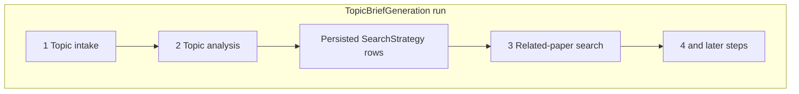

# Topic analysis

This document is the specification for step 2 of the Topic brief generation workflow in [README.md](../../README.md).

In this step, the system extracts key data from a **topic statement**. Later steps use that data to search papers and to write text.

## Topic brief generation

A **Topic brief generation** (`TopicBriefGeneration`) is one full workflow run. The run includes all steps in [README.md](../../README.md):

1. Topic intake
2. Topic analysis
3. Related-paper search
4. Retrieval triage
5. Paper briefs
6. Topic brief

This document specifies only step 2 (Topic analysis) in that run.

Related-paper search uses the strategies as part of `SearchCriteria`. See [related-paper-search.md](related-paper-search.md).

For the technology stack, see [technology-stack.md](../technology-stack.md). That stack includes Pydantic schemas, SQLAlchemy persistence, and scispaCy for biomedical NER.

## Scope

### In scope

- Analyze the `topic_statement` text of an existing `TopicBriefGeneration` run.
- Make one or more generic `SearchStrategy` objects with scispaCy NER.
- Write the strategies in the database. Each strategy must have a foreign key to that `TopicBriefGeneration`.
- If you analyze the same run again, replace the strategies for that run.

### Out of scope

- Validation of Topic intake (step 1 of the same run does that work).
- Build of a full `SearchCriteria` object with `source_overrides`.
- Other workflow steps (related-paper search, triage, paper briefs, topic brief).
- Analysis with an LLM.
- Analysis that uses a custom stopword or token heuristic as the primary method.
- Larger scispaCy models (`md`, `lg`, or specialty NER), unless a later change adopts them.

## Position in the workflow



1. **Topic intake** starts a `TopicBriefGeneration` and stores the `topic_statement`.
2. **Topic analysis** (this specification) operates in that run. It reads the `topic_statement`. It extracts concepts. It makes strategies. It writes the strategies with a foreign key to the same run.
3. **Related-paper search** and the later steps continue on the same `TopicBriefGeneration`. Those steps use the strategies from this step. In tests, you can also inject fixtures.

## Input

| Input | Required | Description |
| --- | --- | --- |
| `TopicBriefGeneration` | Yes | The workflow run that owns this analysis. The run must have a `topic_statement` that is not empty. |
| `topic_statement` | Yes | Free-form text that Topic intake already accepted for that run. |

After you normalize the text, empty text or text that has only whitespace is not valid for analysis. Raise a `ValueError`.

Topic intake must reject empty statements. Topic analysis must also reject empty text after normalize.

## Analyzer: scispaCy

Use [scispaCy](https://allenai.github.io/scispacy/) with the **`en_core_sci_sm`** pipeline. That pipeline is the smallest full biomedical spaCy model.

| Rule | Behavior |
| --- | --- |
| Normalize | Remove leading and trailing whitespace. Collapse adjacent whitespace. Do this before NLP. |
| Model load | Load with `spacy.load("en_core_sci_sm")`. Keep the model in a process-level cache. For tests, you can inject an `nlp` object. |
| Primary concepts | Get unique entity surface forms from `doc.ents` in first-seen order. |
| Dedupe | Remove duplicates. Keep a stable order. Do not change case of display text only to remove duplicates. |
| Fallback | If `doc.ents` is empty, make one or more concepts from noun chunks or from important tokens that are not stopwords. Short statements must still yield a strategy. |
| Validation | Each strategy must validate as a Pydantic `SearchStrategy`. |

Do not use an LLM as the primary method. Do not use a custom stopword tokenizer as the primary method.

## Output: generic `SearchStrategy`

The contract is the Pydantic model `paper_reviewer.schemas.search.SearchStrategy`. Related-paper search uses the same model.

This step makes a **list** of strategies. This step does not make a full `SearchCriteria`.

### v1 emission rules

Always make **one or more** strategies. In v1, make exactly one strategy with these values:

| Field | v1 value |
| --- | --- |
| `id` | `core-concepts` |
| `label` | `Core concepts` |
| `intent` | Narrow topical match from biomedical entities (you can use fixed wording) |
| `concepts` | List that is not empty. Get the list from NER. Use the fallback if NER finds no entities. |
| `synonyms` | `[]` |
| `filters` | `{}` |
| `date_from` / `date_to` | `null` |
| `retmax` | `null` |

Do not add other strategies (for example `broad-concepts`) until a later revision of this specification defines when they occur.

### Example

Topic statement: `glioblastoma immunotherapy outcomes`

This is one possible result. The entity strings can change with the model. When you use the real model in tests, make sure that the concepts include the expected biomedical spans:

```json
[
  {
    "id": "core-concepts",
    "label": "Core concepts",
    "intent": "Narrow topical match from biomedical entities",
    "concepts": ["glioblastoma", "immunotherapy"],
    "synonyms": [],
    "date_from": null,
    "date_to": null,
    "filters": {},
    "retmax": null
  }
]
```

In unit tests with an injected fake `nlp`, you can check for an exact `concepts` list. With the real model, make sure that known entity substrings occur in `concepts`. Make sure that the output validates as `SearchStrategy`.

## Persistence

Write each strategy as one row in a child table. The parent is the `TopicBriefGeneration` run where Topic analysis operated.

| Concern | Rule |
| --- | --- |
| Relationship | Each strategy row has a foreign key to `topic_brief_generations.id` (the parent workflow run). |
| Columns | Map the Pydantic fields. Store the strategy `id` as `strategy_id` so it does not conflict with the primary key. Also store `label`, `intent`, `concepts`, `synonyms`, `date_from`, `date_to`, `filters`, `retmax`, row `id`, and `created_at`. |
| Round-trip | Convert between ORM and Pydantic `SearchStrategy` with no loss of list or object fields. |
| Source of truth | After a successful analysis step, the database is the source of truth. The UI can show the data. The UI must not be the only copy. |

### Re-analysis

If you run Topic analysis again for the same `TopicBriefGeneration`, replace the strategy rows for that run. First remove the old rows. Then write the new rows. Do not add duplicate rows.

## Behavior

| Case | Expected result |
| --- | --- |
| Valid biomedical statement with entities | One or more strategies. `concepts` is not empty. Concepts come from `ents`. |
| Valid statement with no NER hits | One or more strategies. `concepts` come from the fallback rule. |
| Empty text or whitespace-only text | Raise an error. Do not write rows. |
| Second analysis of the same workflow run | Replace the previous strategy rows. The row count must match the new analysis. |

## Orchestration boundary

| Responsibility | Owner |
| --- | --- |
| Change text into a `list[SearchStrategy]` | Analyzer (`analyze_topic_statement` or an equivalent function) |
| Analyze and write for a workflow run | Domain helper (`run_topic_analysis` or an equivalent function). The helper takes a database session and a `TopicBriefGeneration`. |
| When to start analysis | After a successful Topic intake on that run. Use the same session or transaction when it is practical. Keep intake tests and analysis tests separate. |

The build of `SearchCriteria` (strategies plus optional `source_overrides`) for paper-source extract is not part of this step. See [related-paper-search.md](related-paper-search.md).

## Testability

- Inject a fake spaCy `nlp` that returns controlled `ents`. Use this for unit tests that must be deterministic. Those tests do not need a model download.
- You can add an optional integration check with the real `en_core_sci_sm` model. Make sure that expected entity substrings occur in `concepts`.
- Write and reload through the foreign key relationship. Make sure that re-analysis replaces rows.
- Related-paper search must continue to accept injected `SearchCriteria` fixtures. Those tests do not need this step.

## Non-goals (v1)

Do not do this work in v1:

- Make PubMed `source_overrides` or MeSH-specific markup.
- Orchestrate analysis with Prefect.
- Use specialty NER models (for example `en_ner_bc5cdr_md`).
- Use strategy ids other than `core-concepts`.
