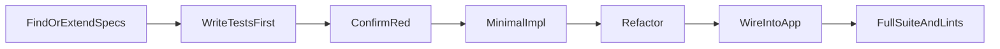

# Test-First Spec Implementation (TDD)

Coding agents follow this workflow for every app behavior change. Test runner and stack boundaries: [technology-stack.md](technology-stack.md). Layout of `tests/`: [project-structure.md](project-structure.md). How to run tests (`just test` / sandbox): [local-development.md](local-development.md#running-tests).

## When this applies

- New spec, feature, or behavior change under `src/paper_reviewer/`
- Bug fixes (“fix a bug”)

## When this does not apply

- Documentation-only edits
- Host tooling, Compose, or `just` recipes with no app behavior change
- Dependency pin bumps with no logic change
- Pure formatting or rename-only edits with no behavior change

## Mandatory order

### 1) Find existing spec tests

- Search `tests/` (mirroring the package under change) for tests that already define the expected behavior.
- If tests exist but are incomplete or unclear, **extend them** to fully specify the behavior before writing production code.

### 2) Write tests before implementation

- If no tests exist, **create them first**.
- Prefer behavior-focused tests; avoid asserting on implementation details.
- Test only our app code (`paper_reviewer`).
- Fake or stub **boundary collaborators** (PubMed HTTP, other remote APIs). Do not make live network calls in unit/spec tests.
- Do not assert on third-party library internals (dlt, SQLAlchemy, Streamlit widgets, etc.).

### 3) Validate tests (expect red)

- Run the **narrowest** relevant pytest selection via project recipes (`just test` / sandbox). Never run `pytest` or `uv` on the host—see [host-requirements.md](host-requirements.md).
- Failure because the feature is not implemented yet is **expected**.
- If tests fail for unrelated reasons (broken setup, wrong imports, flaky fixtures), fix the tests or test setup first.

### 4) Implement to pass

- Write the **minimal** production logic that satisfies the spec defined by the tests.
- Do not hard-code fake paths that only please the tests.
- Iterate until those tests are green.

### 5) Refactor

- Clean structure and naming only while the tests stay green.
- Do not change behavior without updating the tests first (see step 6).

### 6) Use the feature in the application

- Wire the new behavior into Streamlit, Prefect flows, or other entrypoints **only after** the defining tests pass.
- If wiring requires a spec change, update the tests first, re-validate (expect red, then green), then implement.

### 7) Done criteria

- The new or updated tests pass.
- No existing tests are broken (run the full suite via `just test` before finishing).
- Lints for touched files are clean; fix any new lints introduced by the change.

## Bug fixes

Write a **failing regression test** that reproduces the bug first, then fix the production code until that test (and the suite) are green. Follow the same order as above from step 3 onward.
