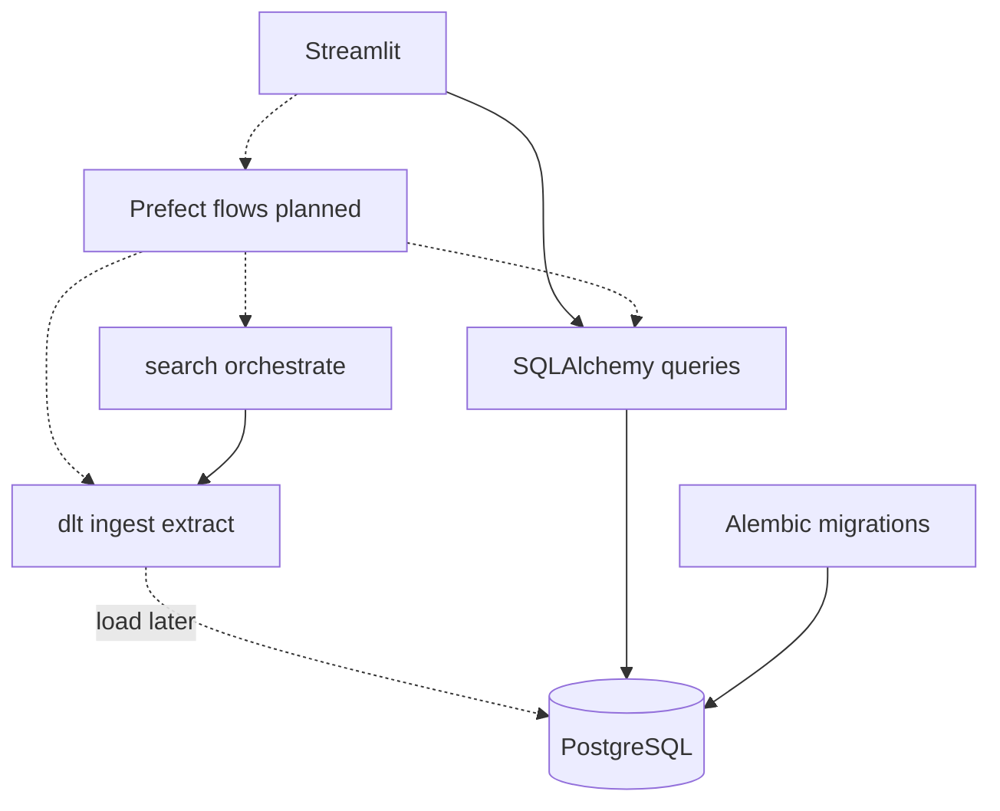

# Technology stack

Agents use this document when choosing libraries or structuring features. It is the single source of truth for the **application** runtime stack.

Host tooling (Docker Desktop, `just`), repo layout, and local workflows live elsewhere:

- [host-requirements.md](host-requirements.md) — what belongs on the host
- [justfile](../justfile) — recipe definitions (`just` to list them)
- [local-development.md](local-development.md) — app vs sandbox lifecycle
- [project-structure.md](project-structure.md) — package layout and what enters production images

All stack components below run **inside Docker images**. Do not install Python, uv, or app frameworks on the host. Bootstrap and package work happens in the Compose `workspace` image via `just shell` / `just sandbox-shell` ([local-development.md](local-development.md)).

## Stack

| Component | Tool | Responsibility |
| --- | --- | --- |
| Language / validation | Python + Pydantic | Runtime and shared schemas (inputs, paper models, dlt resources) |
| Package manager | uv | Dependencies and virtualenvs inside container images |
| Relational database | PostgreSQL | Papers, briefs, citations, job-related app data |
| Data ingestion | dlt (dlthub) + Pydantic | Paper-source **extract** today (yield records for app merge); Postgres **load** for bulk ingest when adopted later. Workspace uses `dlt[hub]` and the Cursor rest-api-pipeline toolkit |
| Topic analysis NER | scispaCy (`en_core_sci_sm`) | Biomedical entity extraction for Topic analysis; behavior in [specs/topic-analysis.md](specs/topic-analysis.md) |
| ORM / DB access | SQLAlchemy | Models and application reads/writes |
| Schema migrations | Alembic | Versioned DDL against SQLAlchemy metadata |
| Web UI | Streamlit | User-facing research workflows |
| Job orchestrator | Prefect (**planned**) | Search, ingest, and brief-generation pipelines when wired; not in Compose yet ([local-development.md](local-development.md)) |
| Tests | pytest | Specs and regression tests for `paper_reviewer` (dev-only; run via `just test` in the sandbox) |

## Layer sketch

Today, related-paper search calls dlt sources for extract and merges in `paper_reviewer.search` without loading candidates into Postgres. Prefect and dlt→Postgres load for that path are planned, not current.

## Boundaries

- **Pydantic** — Validate and define data shapes shared across UI, pipelines, and ingest. Prefer one schema source over ad-hoc dicts.
- **dlt** — Paper-source extract (and future Source → Postgres loads). Define resource schemas with Pydantic; do not use dlt for ordinary app CRUD. Related-paper search does not load candidates into Postgres today — see [specs/related-paper-search.md](specs/related-paper-search.md).
- **scispaCy** — Topic analysis NER only (`en_core_sci_sm`). Do not use it as a general-purpose NLP stack elsewhere without updating [specs/topic-analysis.md](specs/topic-analysis.md).
- **SQLAlchemy** — Application reads and writes (Streamlit, and later Prefect tasks that are not bulk ingest).
- **Alembic** — Owns relational schema versioning. When dlt loads into Postgres, those tables must already match Alembic; do not let dlt freely evolve production DDL against Alembic.
- **Foreign keys — no `ON DELETE CASCADE`** — Never use `ON DELETE CASCADE` in Alembic or SQLAlchemy (`ForeignKey(..., ondelete="CASCADE")`, or relationship cascades that delete children when the parent is deleted). Keep the database default (`NO ACTION` / `RESTRICT`) so the database rejects deleting a parent that still has children. When a parent must be removed, delete or reassign child rows explicitly in application code first, then delete the parent. Do not restate this ban in feature specs; follow it for all schema work.
- **Prefect** — Planned orchestrator for long-running or multi-step jobs (search, ingest, briefs). Not running in Compose yet. When present: trigger from the UI or schedules; keep business steps in flows/tasks, not in Streamlit callbacks alone.
- **Streamlit** — Presentation and user interaction only. Delegate heavy work to domain helpers and (later) Prefect; persist via SQLAlchemy.
- **pytest** — Specs and regressions under `tests/` (mirrors `src/paper_reviewer/`). Prefer pytest style (`assert`, fixtures) over `unittest.TestCase`. Fake boundary I/O (no live paper-source HTTP). Keep Streamlit thin and test schemas/domain/flows rather than widget chrome. Do not unit-test third-party library internals. Agents follow [tdd.md](tdd.md) for the Test-First Spec workflow.

## Out of scope here

Install steps, Compose projects, and `just` recipes are not documented in this file. See [host-requirements.md](host-requirements.md), [justfile](../justfile), and [local-development.md](local-development.md). The TDD process for agents is in [tdd.md](tdd.md).
