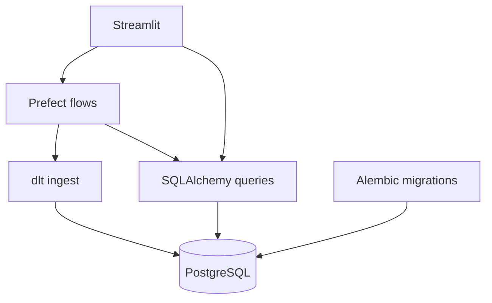

# Technology stack

Agents use this document when choosing libraries or structuring features. It is the single source of truth for the **application** runtime stack.

Host tooling (Docker Desktop, `just`) and local recipes live elsewhere:

- [host-requirements.md](host-requirements.md) — what belongs on the host
- [local-development.md](local-development.md) — `just` recipes and app vs sandbox

All stack components below run **inside Docker images**. Do not install Python, uv, or app frameworks on the host.

## Stack

| Component | Tool | Responsibility |
| --- | --- | --- |
| Language / validation | Python + Pydantic | Runtime and shared schemas (inputs, paper models, dlt resources) |
| Package manager | uv | Dependencies and virtualenvs inside container images |
| Relational database | PostgreSQL | Papers, briefs, citations, job-related app data |
| Data ingestion | dlt (dlthub) + Pydantic | Load from paper sources into Postgres |
| ORM / DB access | SQLAlchemy | Models and application reads/writes |
| Schema migrations | Alembic | Versioned DDL against SQLAlchemy metadata |
| Web UI | Streamlit | User-facing research workflows |
| Job orchestrator | Prefect | Search, ingest, and brief-generation pipelines |

## Layer sketch

## Boundaries

- **Pydantic** — Validate and define data shapes shared across UI, pipelines, and ingest. Prefer one schema source over ad-hoc dicts.
- **dlt** — Source → Postgres loads only. Define resource schemas with Pydantic; do not use dlt for ordinary app CRUD.
- **SQLAlchemy** — Application reads and writes (Streamlit, Prefect tasks that are not bulk ingest).
- **Alembic** — Owns relational schema versioning. dlt loads into tables that already match that schema; do not let dlt freely evolve production DDL against Alembic.
- **Prefect** — Orchestrate long-running or multi-step jobs (search, ingest, briefs). Trigger from the UI or schedules; keep business steps in flows/tasks, not in Streamlit callbacks alone.
- **Streamlit** — Presentation and user interaction only. Delegate heavy work to Prefect; persist via SQLAlchemy (or kick off dlt through Prefect).

## Out of scope here

Install steps, Compose projects, and `just` recipes are not documented in this file. See [host-requirements.md](host-requirements.md) and [local-development.md](local-development.md).
