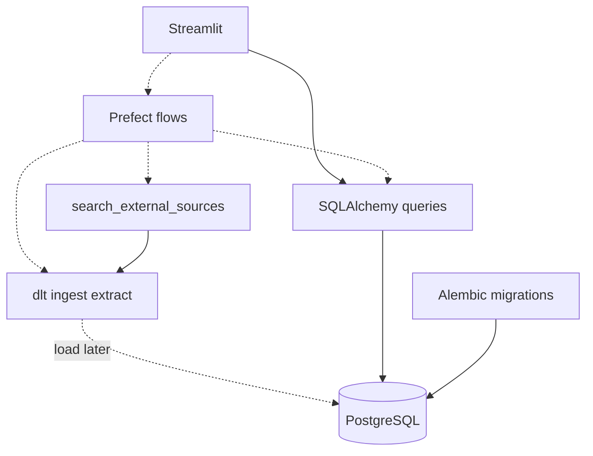

# Technology stack

Agents use this document when choosing libraries or structuring features. It is the single source of truth for the **application** runtime stack.

Host tooling (Docker Desktop, `just`), repo layout, and local workflows live elsewhere:

- [host-requirements.md](host-requirements.md) — what belongs on the host
- [justfile](../justfile) — recipe definitions (`just` to list them)
- [local-development.md](local-development.md) — app vs sandbox lifecycle
- [project-structure.md](project-structure.md) — package layout and what enters production images
- [AGENTS.md](../AGENTS.md) — agent CLI policy (host vs container)

All stack components below run **inside Docker images**. Bootstrap and package work happens in the Compose `workspace` image via `just` ([local-development.md](local-development.md)).

## Stack

| Component | Tool | Responsibility |
| --- | --- | --- |
| Language / validation | Python + Pydantic | Runtime and shared schemas (inputs, paper models, dlt resources) |
| Package manager | uv | Dependencies and virtualenvs inside container images |
| Relational database | PostgreSQL | Papers, briefs, citations, job-related app data |
| Local paper text search | PostgreSQL full-text search (`tsvector` / `tsquery`, GIN, config `simple`) | [Papers search](specs/papers-search.md) against ingested `Paper`s. Search document: [Paper indexing](specs/2.2.5-paper-indexing.md). No extra search service |
| Data ingestion | dlt (dlthub) + Pydantic | External-source **extract** today (yield records for app merge); Postgres **load** for bulk ingest when adopted later. Workspace uses `dlt[hub]` and the Cursor rest-api-pipeline toolkit |
| Topic analysis NER | scispaCy (`en_core_sci_sm`) | Biomedical entity extraction for Topic analysis; behavior in [specs/1.2-topic-analysis.md](specs/1.2-topic-analysis.md) |
| ORM / DB access | SQLAlchemy | Models and application reads/writes |
| Schema migrations | Alembic | Versioned DDL against SQLAlchemy metadata |
| Web UI | Streamlit | User-facing research workflows |
| Job orchestrator | Prefect | Long-running jobs (source record, full text, paper briefs). Compose services: [local-development.md](local-development.md); job contracts: [Fulfill papers metadata](specs/2.2.2-fulfill-papers-metadata.md), [Generate paper brief](specs/2.2.3-generate-paper-brief.md). |
| LLM (paper briefs) | OpenAI | Structured `PaperBriefContent` for `create_paper_brief` only. Optional compatible gateway via `OPENAI_BASE_URL`; model via `OPENAI_MODEL` (empty uses `gpt-4o-mini`; required for a local gateway) ([local-development.md](local-development.md)). The client sends `json_schema` then validates assistant JSON (strips ANSI / Markdown fences for gateways that ignore structured output). A local gateway also gets `reasoning_effort=none`; if `content` is empty the client reads a reasoning field. Prompt: [paper_brief_template.md](../src/paper_reviewer/topic_scope/generate_paper_brief/paper_brief_template.md). Tests stub this boundary; no live API in pytest. |
| Tests | pytest | Specs and regression tests for `paper_reviewer` (dev-only; run via `just test` in the sandbox) |

## Layer sketch

Today, search external sources calls dlt sources for extract and merges in `paper_reviewer.topic_scope.search_external_sources`. Prefect Compose services (`prefect-server`, `prefect-worker`) run with the app profile for source-record, full-text, and brief jobs; dlt→Postgres load for the search path remains planned where noted in step specs. Step-specific rules: [specs/2.1-search-external-sources.md](specs/2.1-search-external-sources.md), [specs/2.2.2-fulfill-papers-metadata.md](specs/2.2.2-fulfill-papers-metadata.md).

## Boundaries

- **Pydantic** — Validate and define data shapes shared across UI, pipelines, and ingest. Prefer one schema source over ad-hoc dicts.
- **dlt** — External-source extract (and future Source → Postgres loads). Define resource schemas with Pydantic; do not use dlt for ordinary app CRUD. Candidate load timing for search external sources: [specs/2.1-search-external-sources.md](specs/2.1-search-external-sources.md).
- **scispaCy** — Topic analysis NER only (`en_core_sci_sm`). Do not use it as a general-purpose NLP stack elsewhere without updating [specs/1.2-topic-analysis.md](specs/1.2-topic-analysis.md). Analyzer and `run_topic_analysis` live in `paper_reviewer.topic_scope.topic_analysis` — see [project-structure.md](project-structure.md).
- **SQLAlchemy** — Application reads and writes (Streamlit and Prefect tasks that are not bulk ingest). Local paper text search uses mapped `Paper` columns; query operators: [Papers search](specs/papers-search.md).
- **PostgreSQL full-text search** — Local [Papers search](specs/papers-search.md) only. Use built-in `tsvector` / `tsquery` / GIN. Do not add Elasticsearch, OpenSearch, Meilisearch, Typesense, ParadeDB, or `sqlalchemy-searchable`. Text-search config is `simple`. Column, generated expression, and GIN: [Paper indexing](specs/2.2.5-paper-indexing.md). Do not emulate `tsvector` on SQLite.
- **Alembic** — Owns relational schema versioning. When dlt loads into Postgres, those tables must already match Alembic; do not let dlt freely evolve production DDL against Alembic.
- **Foreign keys — no `ON DELETE CASCADE`** — Never use `ON DELETE CASCADE` in Alembic or SQLAlchemy (`ForeignKey(..., ondelete="CASCADE")`, or relationship cascades that delete children when the parent is deleted). Keep the database default (`NO ACTION` / `RESTRICT`) so the database rejects deleting a parent that still has children. When a parent must be removed, delete or reassign child rows explicitly in application code first, then delete the parent. Do not restate this ban in feature specs; follow it for all schema work.
- **Prefect** — Orchestrator for long-running or multi-step jobs (source record, full text, briefs). Compose services: [local-development.md](local-development.md). Trigger from the UI via enqueue helpers; keep business steps in flows/tasks, not in Streamlit callbacks. Progress UIs poll durable DB columns, not Prefect run state.
- **OpenAI** — Paper-brief drafting only (`create_paper_brief`). Do not call it from Streamlit or from other workflow steps. The client may target an OpenAI-compatible gateway when `OPENAI_BASE_URL` is set. Empty `OPENAI_MODEL` uses `gpt-4o-mini`; a local gateway requires `OPENAI_MODEL`. Env ownership: [local-development.md](local-development.md). Inject or stub the generator in tests ([tdd.md](tdd.md)). The public API honours structured `json_schema`; local gateways may not — the job still extracts and validates `PaperBriefContent`. The job always extracts scientific sections (not the reference list) before the LLM call. When `OPENAI_BASE_URL` is set, the job also sends `max_tokens` (configurable via `OPENAI_GATEWAY_MAX_TOKENS`, default 8192) and `reasoning_effort=none`, appends conciseness instructions (short fields, no LaTeX, omit optional fields), and clips that extract to 8000 characters so llama.cpp-style servers do not stop at their 512-token default or overflow a small context window. Thinking models may put text in a reasoning field; if `content` is empty the client reads that field. On parse failure, empty content, or `finish_reason=length`, the client retries once with a system-prompt suffix requesting shorter output. Do not add partial-JSON salvage (auto-closing truncated braces); the retry and conciseness instructions are the fix.
- **Streamlit** — Presentation and user interaction only. Delegate heavy work to domain helpers and Prefect; persist via SQLAlchemy. Control semantics (link vs button, intent colours): [ui-style.md](ui-style.md).
- **pytest** — Test runner for specs and regressions under `tests/`. Style and Test-First workflow: [tdd.md](tdd.md). How to run: [local-development.md](local-development.md#running-tests).

## Out of scope here

Install steps, Compose projects, and `just` recipes are not documented in this file. See [host-requirements.md](host-requirements.md), [justfile](../justfile), and [local-development.md](local-development.md). The TDD process for agents is in [tdd.md](tdd.md).
